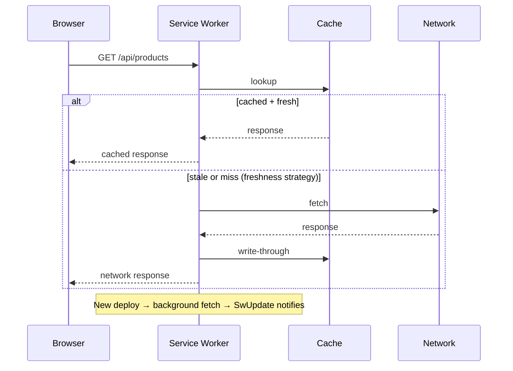

# PWA and Service Worker

> **One-liner**: Angular's `@angular/pwa` schematic generates a **service worker** + manifest that caches your app shell + assets, makes the app installable, and serves cached content offline — configured declaratively via `ngsw-config.json`.

---

## Quick Reference

| Item | Detail |
|------|--------|
| Add PWA | `ng add @angular/pwa` |
| Files generated | `manifest.webmanifest`, `ngsw-config.json`, icons, service worker registration |
| Provider | `provideServiceWorker('ngsw-worker.js', { enabled: !isDevMode() })` |
| Config file | `ngsw-config.json` — declarative, not imperative |
| Asset groups | App shell + lazy bundles (cached on install / on-demand) |
| Data groups | API responses (TTL, max size, freshness/performance strategy) |
| `SwUpdate` service | Notify users of new versions, force activation |
| `SwPush` service | Web Push notifications |
| Install prompt | `beforeinstallprompt` event |
| App shell | `ng generate app-shell` — pre-rendered minimal UI |

---

## Core Concept

A **Progressive Web App** is a website that behaves like an app: installable, offline-capable, push-notification-ready. The technical underpinning is the **service worker** — a background JS thread that intercepts network requests and decides whether to serve from cache, network, or both.

Writing a service worker by hand is tedious (versioning, cache invalidation, asset precaching). Angular's `@angular/service-worker` package generates one for you (`ngsw-worker.js`) driven by **`ngsw-config.json`**. You declare:

- **Asset groups**: which built files (JS, CSS, icons) to precache vs lazy-cache
- **Data groups**: API endpoints with caching strategies (`freshness` = network-first, `performance` = cache-first)

On every deploy, the build hashes asset filenames and updates an internal manifest. The service worker downloads the new manifest in the background, ensures all assets are cached, and atomically switches users to the new version on the next reload.

The service worker is **only enabled in production builds** (`!isDevMode()`). In dev, you get hot reload and no caching headaches; in prod, your users get offline + fast subsequent loads.

For richer offline UX, generate an **app shell**: pre-rendered HTML that renders before JS executes, giving an instant first paint even on a cold cache.

PWAs are not a fit for all apps — backend-heavy apps with no offline use case mostly benefit from the install prompt and faster repeat visits. SPA + PWA is essentially free if you've already got SSR pre-rendering.

---

## Diagram



---

## Syntax & API

### Add PWA

```bash
ng add @angular/pwa
# Generates:
#   src/manifest.webmanifest
#   ngsw-config.json
#   public/icons/*.png
#   updates index.html with <link rel="manifest"> + theme-color
#   updates app.config.ts with provideServiceWorker
```

### `app.config.ts`

```ts
import { provideServiceWorker } from '@angular/service-worker';
import { isDevMode } from '@angular/core';

export const appConfig: ApplicationConfig = {
  providers: [
    provideServiceWorker('ngsw-worker.js', {
      enabled: !isDevMode(),
      registrationStrategy: 'registerWhenStable:30000',  // wait until app is idle
    }),
  ],
};
```

### `ngsw-config.json` — asset groups

```json
{
  "$schema": "./node_modules/@angular/service-worker/config/schema.json",
  "index": "/index.html",
  "assetGroups": [
    {
      "name": "app",
      "installMode": "prefetch",
      "resources": {
        "files": [
          "/favicon.ico",
          "/index.html",
          "/manifest.webmanifest",
          "/*.css",
          "/*.js"
        ]
      }
    },
    {
      "name": "assets",
      "installMode": "lazy",
      "updateMode": "prefetch",
      "resources": {
        "files": ["/assets/**", "/*.(png|svg|webp|jpg|gif|ico)"]
      }
    }
  ],
  "dataGroups": [
    {
      "name": "api-products",
      "urls": ["/api/products", "/api/products/**"],
      "cacheConfig": {
        "maxSize": 100,
        "maxAge": "1h",
        "timeout": "3s",
        "strategy": "freshness"
      }
    },
    {
      "name": "api-static-config",
      "urls": ["/api/config/**"],
      "cacheConfig": {
        "maxSize": 10,
        "maxAge": "1d",
        "strategy": "performance"
      }
    }
  ]
}
```

### `SwUpdate` — notify on new version

```ts
import { SwUpdate } from '@angular/service-worker';
import { filter } from 'rxjs';

@Component({ /* ... */ })
export class AppComponent {
  private updates = inject(SwUpdate);

  constructor() {
    if (this.updates.isEnabled) {
      this.updates.versionUpdates.pipe(
        filter(e => e.type === 'VERSION_READY'),
      ).subscribe(() => {
        if (confirm('New version available. Reload?')) {
          this.updates.activateUpdate().then(() => location.reload());
        }
      });
    }
  }
}
```

### `SwPush` — web push notifications

```ts
import { SwPush } from '@angular/service-worker';

const sub = await this.swPush.requestSubscription({
  serverPublicKey: VAPID_PUBLIC_KEY,
});
await this.http.post('/api/push/subscribe', sub).toPromise();

this.swPush.messages.subscribe(msg => /* handle in-app payload */);
this.swPush.notificationClicks.subscribe(({ notification, action }) => {
  if (action === 'open') this.router.navigate(['/inbox']);
});
```

### Install prompt

```ts
@Component({ /* ... */ })
export class AppComponent {
  private deferredPrompt?: any;

  @HostListener('window:beforeinstallprompt', ['$event'])
  onPrompt(event: Event) {
    event.preventDefault();
    this.deferredPrompt = event;
  }

  async install() {
    if (!this.deferredPrompt) return;
    this.deferredPrompt.prompt();
    const { outcome } = await this.deferredPrompt.userChoice;
    this.deferredPrompt = undefined;
  }
}
```

### `manifest.webmanifest`

```json
{
  "name": "My App",
  "short_name": "MyApp",
  "theme_color": "#1976d2",
  "background_color": "#ffffff",
  "display": "standalone",
  "scope": "./",
  "start_url": "./",
  "icons": [
    { "src": "icons/icon-192.png", "sizes": "192x192", "type": "image/png", "purpose": "maskable any" },
    { "src": "icons/icon-512.png", "sizes": "512x512", "type": "image/png", "purpose": "maskable any" }
  ]
}
```

---

## Common Patterns

```ts
// Pattern: aggressive precache for shell, lazy for media
{ "name": "shell", "installMode": "prefetch",
  "resources": { "files": ["/index.html", "/*.css", "/*.js"] } },
{ "name": "media", "installMode": "lazy",
  "resources": { "files": ["/assets/**/*.{png,jpg,webp}"] } }
```

```json
// Pattern: freshness vs performance strategy
// freshness  → try network first, fall back to cache (best for live data)
// performance → cache-first, refresh in background (best for static config)
"strategy": "freshness", "timeout": "3s"
```

```ts
// Pattern: poll for updates while app is open
this.updates.checkForUpdate();      // imperative trigger
// Or schedule:
interval(60_000).subscribe(() => this.updates.checkForUpdate());
```

---

## Gotchas & Tips

- **Service workers only work over HTTPS** (or `localhost` for dev). Without HTTPS, registration silently fails — most production-only bugs come from this.
- **Dev mode disables the SW.** `ng serve` does *not* register `ngsw-worker.js`. Test PWA behavior with `ng build && http-server -p 8080 dist/<app>/browser`.
- **Cache invalidation is automatic** when filename hashes change. Don't manually pass query strings to bust cache — let the build do it.
- **Stale clients haunt deploys.** Users with the page open get the *old* JS until they reload. Use `SwUpdate` to prompt them, or do a hard reload after critical fixes.
- **API caching is risky** — a `freshness` cache may show a 1-minute-old order to a user who just placed it. Don't cache mutating endpoints (`POST/PUT/DELETE`); whitelist GETs that genuinely tolerate staleness.
- **The manifest must be served with `Content-Type: application/manifest+json`** for some browsers. Most servers default correctly; double-check.
- **Service worker scope** is the directory of `ngsw-worker.js`. Hosting the app under `/sub-path/` means uploading the SW to that path; otherwise it can't intercept requests.
- **Icons need maskable + any purposes** for proper installation on Android. Both 192×192 and 512×512 are required minimum.
- **Push requires a VAPID key pair** generated server-side (e.g., via `web-push` npm). Without it, `requestSubscription` rejects.
- **Don't precache user-specific data.** Caches are device-shared; never put auth-scoped responses in `assetGroups`. Use `dataGroups` with caution and never for sensitive endpoints.
- **Test offline behavior in DevTools** (Application → Service Workers → "Offline" checkbox). Many apps look offline-ready until you actually pull the plug.

---

## See Also

- [[14 - Build and Bundling]]
- [[06 - Performance Optimization]]
- [[04 - Server-Side Rendering]]
- [[18 - Monitoring and Errors]]
