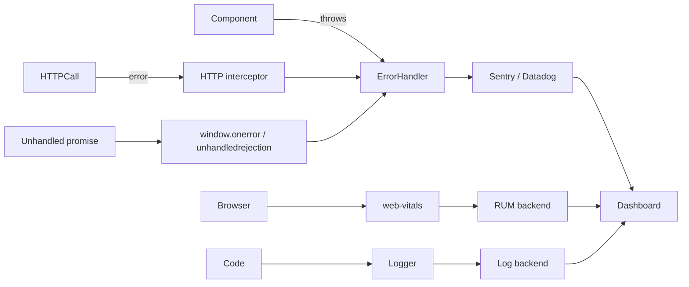

# Monitoring and Errors

> **One-liner**: Observability for Angular apps means **catch every error** (`ErrorHandler`), **measure real-user performance** (Web Vitals + RUM), and **log with structure** so dashboards can slice by user, route, and release.

---

## Quick Reference

| Concern | API / tool |
|---------|-----------|
| Catch unhandled errors | Custom `ErrorHandler` provided in root |
| HTTP error normalization | `HttpInterceptorFn` with `catchError` |
| Crash reporting | Sentry, Datadog RUM, Bugsnag, Rollbar |
| Web Vitals | `web-vitals` npm package |
| Custom timing | `performance.mark` + `performance.measure` |
| Logging | Pino-style structured logger; ship to backend |
| User feedback / replays | Sentry Replay, LogRocket, FullStory |
| Source maps in prod | Upload hidden source maps to error tracker |
| User identification | Set user context after login (`Sentry.setUser`) |
| Release tracking | Tag every error with `release: <git sha>` |
| Session/route context | Tag with current route, user-agent, locale |
| Health endpoint | `/healthz` for uptime monitors |

---

## Core Concept

A production frontend is invisible without instrumentation. Three layers:

**1. Errors.** Exceptions that escape your code reach Angular's `ErrorHandler` (the default just logs to console). Replace it with one that ships to a tracker. HTTP errors flow through interceptors — normalize them and decide which to report (404 on user navigation: probably noise; 500 on save: definitely report).

**2. Performance.** Synthetic benchmarks lie about real users. Measure **Web Vitals** in production: LCP (largest paint), INP (next-paint after interaction), CLS (layout shift), TTFB (server response). Ship these as events to a RUM (Real User Monitoring) backend so you can correlate slow pages with code releases or geographies.

**3. Logging.** Structured logs (JSON, not free-form strings) let dashboards filter by `userId`, `route`, `release`, `level`. Logs explain context that errors alone can't — what feature flag was on, what payload size triggered the issue, which experiment variant the user saw.

The unifying mechanic is **release tagging**. Every error, performance metric, and log carries the deploy SHA. Then "what regressed in v1.2.3?" becomes a one-click query, not a Sherlock investigation.

A modern Angular app typically uses one bundled solution (Sentry / Datadog / DataDog RUM) for errors + replays + Web Vitals, plus a logging service (Datadog logs, Logtail, or self-hosted ELK).

---

## Diagram



---

## Syntax & API

### Custom `ErrorHandler`

```ts
import { ErrorHandler, Injectable, inject, isDevMode } from '@angular/core';

@Injectable()
export class GlobalErrorHandler implements ErrorHandler {
  private logger = inject(LoggerService);

  handleError(error: unknown): void {
    if (isDevMode()) console.error(error);
    this.logger.error('unhandled', { error: this.serialize(error) });
    // Forward to Sentry / Datadog
    // Sentry.captureException(error);
  }

  private serialize(err: unknown) {
    if (err instanceof Error) return { name: err.name, message: err.message, stack: err.stack };
    return { value: String(err) };
  }
}

// app.config.ts
providers: [{ provide: ErrorHandler, useClass: GlobalErrorHandler }]
```

### HTTP error interceptor

```ts
import { HttpInterceptorFn, HttpErrorResponse } from '@angular/common/http';
import { catchError, throwError } from 'rxjs';

export const errorInterceptor: HttpInterceptorFn = (req, next) => {
  return next(req).pipe(
    catchError((err: HttpErrorResponse) => {
      const enriched = {
        url: req.url,
        method: req.method,
        status: err.status,
        message: err.message,
        correlationId: req.headers.get('x-correlation-id'),
      };
      // 401/403: routine auth flow, don't report
      // 404 GET: often noise
      // 5xx: always report
      if (err.status >= 500) {
        Sentry.captureException(err, { extra: enriched });
      }
      return throwError(() => err);
    }),
  );
};
```

### Sentry init

```ts
import * as Sentry from '@sentry/angular';

Sentry.init({
  dsn: environment.sentryDsn,
  release: environment.gitSha,           // baked at build time
  environment: environment.env,
  integrations: [
    Sentry.browserTracingIntegration(),
    Sentry.replayIntegration({ maskAllText: false, blockAllMedia: true }),
  ],
  tracesSampleRate: 0.1,
  replaysSessionSampleRate: 0.05,
  replaysOnErrorSampleRate: 1.0,
});

bootstrapApplication(AppComponent, {
  providers: [
    { provide: ErrorHandler, useValue: Sentry.createErrorHandler() },
    Sentry.provideTrace(),
  ],
});
```

### Web Vitals

```ts
import { onCLS, onINP, onLCP, onTTFB } from 'web-vitals';

function send(metric: any) {
  navigator.sendBeacon('/api/rum', JSON.stringify({
    name: metric.name,
    value: metric.value,
    rating: metric.rating,
    id: metric.id,
    route: location.pathname,
    release: environment.gitSha,
  }));
}

onLCP(send);
onINP(send);
onCLS(send);
onTTFB(send);
```

### Structured logger

```ts
@Injectable({ providedIn: 'root' })
export class LoggerService {
  private session = crypto.randomUUID();
  private user?: { id: string };

  setUser(user: { id: string }) { this.user = user; }

  info(message: string, fields?: Record<string, any>) { this.send('info', message, fields); }
  warn(message: string, fields?: Record<string, any>) { this.send('warn', message, fields); }
  error(message: string, fields?: Record<string, any>) { this.send('error', message, fields); }

  private send(level: string, message: string, fields?: Record<string, any>) {
    const event = {
      ts: new Date().toISOString(),
      level,
      message,
      session: this.session,
      user: this.user?.id,
      route: location.pathname,
      release: environment.gitSha,
      ...fields,
    };
    if (level === 'error' || level === 'warn') console[level](event);
    navigator.sendBeacon('/api/logs', JSON.stringify(event));
  }
}
```

### Identify users post-login

```ts
this.auth.onLogin().subscribe(user => {
  this.logger.setUser({ id: user.id });
  Sentry.setUser({ id: user.id, email: user.email });
});
```

### `performance` API for custom metrics

```ts
performance.mark('checkout-start');
await this.checkout();
performance.mark('checkout-end');
performance.measure('checkout', 'checkout-start', 'checkout-end');
const [entry] = performance.getEntriesByName('checkout');
this.logger.info('checkout-duration', { ms: entry.duration });
```

---

## Common Patterns

```ts
// Pattern: bake git SHA into env file at build time
// scripts/build.sh:
//   GIT_SHA=$(git rev-parse --short HEAD)
//   sed -i "s/__SHA__/$GIT_SHA/" src/environments/environment.prod.ts
// Then environment.gitSha is the deploy ID for tagging events.
```

```ts
// Pattern: silence routine 401s
if (err.status === 401) {
  this.router.navigate(['/login']);
  return EMPTY;            // do not report, do not propagate
}
```

```ts
// Pattern: scrub PII before sending
Sentry.init({
  beforeSend(event) {
    if (event.request?.cookies) delete event.request.cookies;
    if (event.user?.email) event.user.email = sha256(event.user.email);
    return event;
  },
});
```

---

## Gotchas & Tips

- **Source maps must be uploaded to your error tracker** (Sentry CLI, Datadog API, etc.) for production stack traces to be useful. Use `"sourceMap": { "hidden": true }` so they're not served publicly.
- **Don't double-report.** A custom `ErrorHandler` that logs *and* a Sentry-provided handler both subscribed = duplicate events. Use one or wrap one in the other.
- **Sample tracing/replays in production.** 100% sample rate is expensive ($$ + bandwidth). 5–10% for replays, 10–20% for traces is typical.
- **PII matters.** Replays capture form inputs by default — mask password fields and PII fields explicitly. Sentry `maskAllText: true` is the safe default for B2C.
- **Beacons survive page-unload.** `navigator.sendBeacon` is the right API for "log this and let me leave" — `fetch` may be aborted on navigation.
- **Web Vitals fire on different lifecycle moments.** LCP fires once, CLS accumulates, INP updates with each interaction. Send updates, not just initial values, if you want full fidelity.
- **`isDevMode()`** lets your code skip noisy logging in development. Bake `environment.production` into a flag and gate logger output by it.
- **404 noise** — bots scan `/wp-admin`, `/.env`, etc. Don't report 404s on routes you don't own. Filter by `req.url` whitelisting.
- **Console errors aren't free.** Production builds should not log to console for normal errors — it slows the page and leaks info. Reserve `console.error` for debugging.
- **Health endpoint, not just RUM.** A `/healthz` returning `200 OK` lets uptime monitors (Pingdom, BetterStack) tell you when the *site* is unreachable — RUM only fires when users actually load the app.
- **Correlate with backend.** Send a unique `x-request-id` header on every HTTP call; include it in error reports. When a server log says "500 on /api/save with id abc123", you can find the matching frontend session.

---

## See Also

- [[05 - HTTP Interceptors]]
- [[14 - Build and Bundling]]
- [[06 - Performance Optimization]]
- [[17 - PWA and Service Worker]]
