# Senior Angular Developer — Interview Questions & Answers

> **Scope**: 5+ years of front-end experience with at least 3 years of Angular at scale (v14+ ideally v17/18/19). Focus is on **trade-off analysis**, **reactivity model fluency**, **performance under load**, **production migration discipline**, and **architecture decisions** — not template syntax trivia.

Senior Angular interviews probe how you reason about reactivity (Signals **and** RxJS), change detection, large-codebase architecture, and migration strategy. Most questions have no single "correct" answer — the interviewer wants to hear constraints, alternatives, and the reasoning behind your pick.

---

## Table of Contents

1. [Architecture & Project Structure](#architecture--project-structure)
2. [Signals & Reactivity](#signals--reactivity)
3. [Change Detection & Zoneless](#change-detection--zoneless)
4. [RxJS Mastery](#rxjs-mastery)
5. [State Management](#state-management)
6. [Forms at Scale](#forms-at-scale)
7. [Routing & DI Deep Dive](#routing--di-deep-dive)
8. [Performance Optimization](#performance-optimization)
9. [SSR & Hydration](#ssr--hydration)
10. [Testing Strategy](#testing-strategy)
11. [Build, Monorepo & Micro-Frontends](#build-monorepo--micro-frontends)
12. [Security](#security)
13. [Migration & Modernization](#migration--modernization)
14. [Leadership & Trade-offs](#leadership--trade-offs)

---

## Architecture & Project Structure

### 1. Walk through how you'd structure a large Angular app (50+ feature areas).

**What the interviewer is listening for:** module/lib boundaries, lazy loading strategy, dependency direction, scaling pain points.

A defensible layout:

```
src/app/
├── core/              ← singleton services (auth, logging, http config). providedIn:'root'
├── shared/            ← dumb components, pipes, directives (no state)
├── features/
│   ├── orders/
│   │   ├── data-access/   ← state, signals, services, HTTP
│   │   ├── feature/       ← smart routed components
│   │   ├── ui/            ← presentational components
│   │   └── orders.routes.ts
│   ├── billing/
│   └── catalog/
└── app.routes.ts          ← top-level lazy routes
```

Rules:

- **Dependency direction is one-way:** `feature → data-access → shared/core`. Never the reverse. Enforce with Nx tags or ESLint boundaries.
- **Every feature is lazy-loaded** by default — `loadChildren: () => import('./features/orders/orders.routes')`.
- **No barrel `index.ts` at the app root** — those defeat tree-shaking and cause circular deps.
- **State stays close to where it's used** — global NgRx only for cross-feature concerns (auth, current user, feature flags).

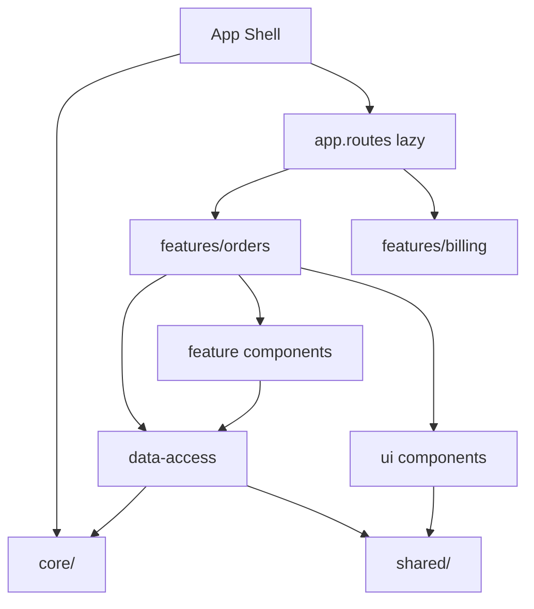

**Senior signal:** "I'd push hard on **library boundaries** — if `billing` ever imports from `orders/feature` directly, that's a code review block. We refactor what they share into `shared/` or a dedicated `domain/` lib."

---

### 2. Smart vs presentational components — does this pattern still matter?

Yes, but the contract is sharper with Signals:

| Smart (container, routed) | Presentational (dumb, UI) |
| ------------------------- | ------------------------- |
| Injects services, reads state | Receives inputs, emits outputs |
| Knows about routing, HTTP | Knows about pixels |
| Usually NOT reused | Reused everywhere |
| Default CD strategy is fine | **Must be `OnPush`** |
| Methods orchestrate state | Methods are pure transforms of inputs |

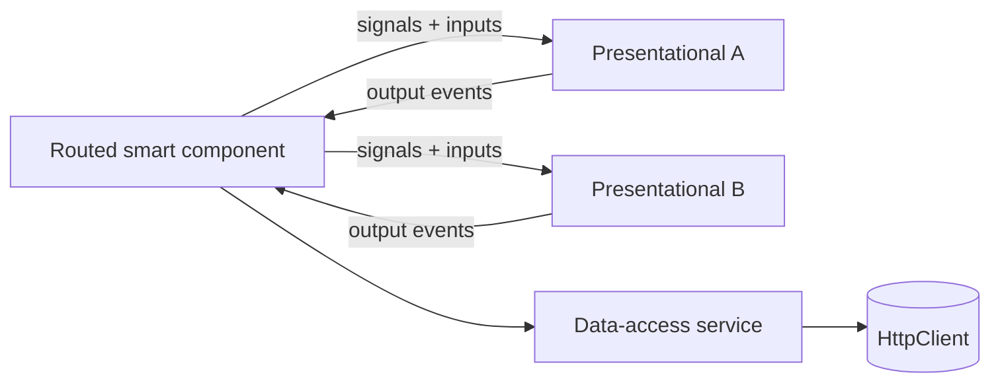

**Senior signal:** "Smart components are where I tolerate complexity. Presentational components are where I refuse it — they shouldn't even know HTTP exists."

---

### 3. When does standalone-only beat a hybrid app? When does it not?

Standalone-only is the default since Angular 19. Reach for it on:

- **New apps** — no reason to start with `NgModule`.
- **Apps under 200k LoC** mid-migration — full migration is days, not weeks.
- **Module federation hosts/remotes** — standalone removes the bootstrap-module dance.

Hybrid (NgModule + standalone) is still right when:

- **You inherit a 500k-LoC app** with deep `NgModule` graphs and shared `forRoot()` providers — migrate incrementally, not all-at-once.
- **Third-party libs** still export `NgModule`s — wrap them at the boundary.

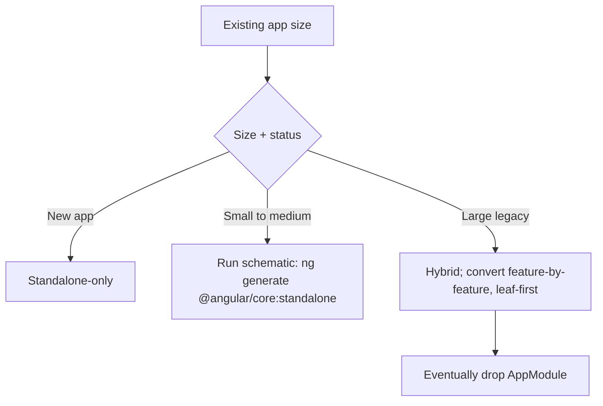

The schematic `ng generate @angular/core:standalone` does the heavy lifting in three steps: convert components/directives/pipes → remove `NgModule` classes → bootstrap from `bootstrapApplication`.

---

### 4. Nx monorepo vs multi-repo for a 5-team org — argue both sides.

| Topic | Nx Monorepo | Multi-repo |
| ----- | ----------- | ---------- |
| Code sharing | Trivial — import from any lib | Versioned packages, slower |
| Atomic refactors | One PR across apps | N PRs coordinated |
| Build/test feedback | Affected graph; cache hits across CI runs | Each repo independent |
| Tooling consistency | Forced (one ESLint, one Prettier, one Angular version) | Independent — for better and worse |
| Onboarding | Steeper (Nx concepts) | Familiar |
| CI duration | Can grow large; needs `nx affected` discipline | Naturally bounded |
| Team autonomy | Lower — shared release schedule | Higher |

```mermaid
graph TD
    subgraph Nx Monorepo
      Apps[apps/ web, admin, mobile] --> Libs[libs/]
      Libs --> Shared[libs/shared]
      Libs --> Domain[libs/domain]
      Libs --> Feat[libs/feature-x]
    end
    subgraph Multi-repo
      RepoA[repo: web-app] -->|npm package| Pkg1[(@org/shared)]
      RepoB[repo: admin-app] --> Pkg1
      RepoC[repo: mobile-app] --> Pkg1
    end
```

**Senior signal:** "Nx wins when teams cross-pollinate frequently. Multi-repo wins when teams need independent release cycles. Don't pick by hype — pick by your collaboration topology."

---

### 5. How do you keep Angular versions current across a portfolio?

```mermaid
flowchart LR
    Release[Angular minor every 6 months] --> Schedule[Quarterly upgrade window]
    Schedule --> Canary[Upgrade 1 app first - small, low risk]
    Canary --> Catalog[Catalog breaking changes from update guide]
    Catalog --> Codemod[Apply ng update + custom codemods]
    Codemod --> Rest[Roll out across apps]
    Rest --> Test[E2E + visual regression suite]
    Test --> Done[Done before LTS expiry]
```

Tooling:

- `ng update @angular/core @angular/cli` does most of it.
- `update.angular.io` is the source of truth for breaking changes.
- Renovate / Dependabot for non-Angular deps.
- **Pin the Angular version per workspace**, not per package — keeps libraries aligned.

**Senior signal:** "Skipping versions is a trap. Two-versions-at-a-time is the absolute max — beyond that, migration codemods stop applying cleanly."

---

## Signals & Reactivity

### 6. Signals vs RxJS — when do you reach for each?

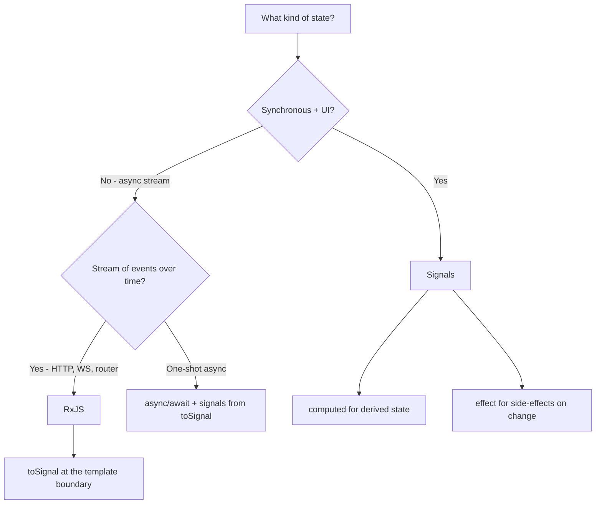

Cheat sheet:

| Use Signals for | Use RxJS for |
| --------------- | ------------ |
| Component local state | HTTP requests |
| Derived/computed values | WebSocket / SSE streams |
| Form state (Angular 19+ signal forms) | Router events, scroll/key streams |
| Inputs / outputs (signal `input()`/`output()`) | Combining multiple async sources |
| Anything the template binds to | Debouncing, throttling, retry-with-backoff |

**Bridge them** with `toSignal(observable$)` and `toObservable(signal)`. The boundary is **at the edge**: keep RxJS in services, Signals in components.

---

### 7. `computed()` deep-dive — glitch-free reads, laziness, memoization.

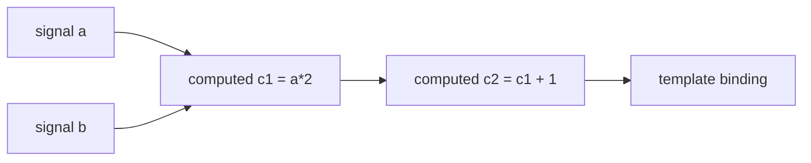

Key properties:

- **Lazy** — `c1` doesn't compute until *read*. Stays dirty otherwise.
- **Memoized** — repeat reads in the same change-cycle return the cached value.
- **Glitch-free** — when `a` and `b` both change, `c2` is read once with both new values, not twice.
- **Pull-based** — readers ask, producers don't push.
- **Equality** — defaults to `===`; pass `{ equal }` to deduplicate object updates.

```ts
const a = signal(1);
const b = signal(2);
const sum = computed(() => a() + b(), { equal: Object.is });
```

Common bug: writing a signal *inside* a `computed()`. Don't — `computed` must be pure. Use `effect()` for side-effects.

---

### 8. `effect()` — what's it for, and what are the pitfalls?

```ts
constructor() {
  effect(() => {
    const userId = this.user().id;
    this.analytics.track('view', { userId });
  });
}
```

Pitfalls:

- **Effects run after CD**, asynchronously by default — don't expect synchronous reactions.
- **Writing a signal inside an effect is forbidden** unless you opt in with `allowSignalWrites: true`. Even then, it's a smell — you're probably better off with `computed`.
- **Effects auto-cleanup with the component** when registered in a constructor / `inject()` context. If registered outside, you must call the returned `EffectRef.destroy()`.
- **Don't put HTTP calls in effects** — they'll fire every time a dependency changes. Use a service method + signal that holds the latest result.

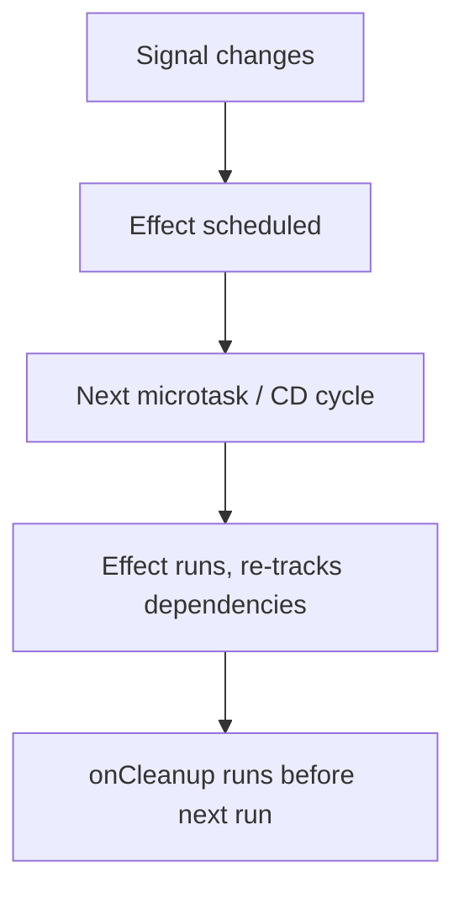

**Senior signal:** "Effects are for **synchronizing the outside world with reactive state** — analytics, focus management, DOM imperative APIs. Not for computing values."

---

### 9. Signal inputs vs `@Input()` — what's actually different?

```ts
// Classic
@Input({ required: true }) userId!: string;
@Input() name = 'default';

// Signal-based (Angular 17.2+)
readonly userId = input.required<string>();
readonly name = input('default');
readonly fullName = computed(() => `${this.name()} #${this.userId()}`);
```

Differences:

| Feature | `@Input` | `input()` signal |
| ------- | -------- | ----------------- |
| Read in class | `this.userId` | `this.userId()` |
| Reactive in `computed`/`effect` | No (need `ngOnChanges`) | Yes |
| Required at compile time | `{ required: true }` | `input.required<T>()` |
| Transform | `transform` option | `{ transform }` option |
| Two-way binding | `[(x)]` via `@Output xChange` | `model<T>()` |

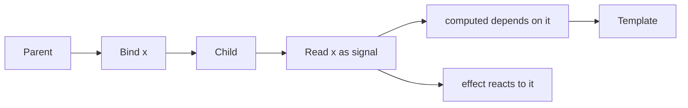

**Senior signal:** "Signal inputs let `computed`/`effect` track them automatically. With classic `@Input`, you had to mirror them into a `BehaviorSubject` or override `ngOnChanges` — that ceremony goes away."

---

### 10. `model()` — what problem does it solve?

`model<T>()` is a two-way bound signal input. The parent gets a `[(value)]` binding without you defining `@Output() valueChange`.

```ts
@Component({ selector: 'app-counter', template: `<button (click)="inc()">{{count()}}</button>` })
export class CounterComponent {
  count = model(0);
  inc() { this.count.update(c => c + 1); }
}
```

```html
<app-counter [(count)]="parentCount" />
<!-- parentCount stays in sync without manual EventEmitter wiring -->
```

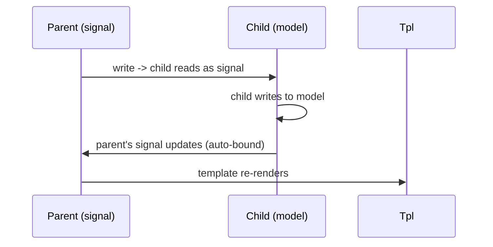

Use for: form controls, toggle switches, color pickers — any control that owns its value but the parent wants to observe/edit it.

---

### 11. `linkedSignal()` and the "derived but writable" pattern.

Angular 19+ introduces `linkedSignal` — a writable signal that resets to a derived value whenever a dependency changes.

```ts
const userId = signal('alice');
const draftName = linkedSignal(() => `Draft for ${userId()}`);
// draftName is writable
draftName.set('Custom edit');
// userId.set('bob') => draftName resets to 'Draft for bob'
```

Use for: editable forms whose defaults depend on a selection, "reset on tab change" patterns.

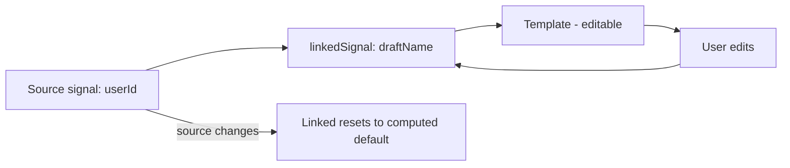

---

### 12. `toSignal` and `toObservable` — at what layer do you bridge?

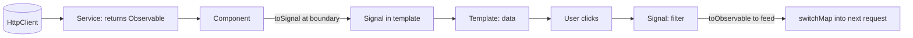

Pattern: services keep returning Observables (cancellation, retry, etc.). Components convert at the binding edge with `toSignal(obs$, { initialValue })`. When you need to feed a signal back into an RxJS pipeline (e.g., a search input that triggers HTTP), `toObservable(signal)` + `switchMap` is the bridge.

`toSignal` runs inside an injection context — call it in a constructor / field initializer, not inside arbitrary methods.

---

## Change Detection & Zoneless

### 13. Default vs OnPush — what *exactly* changes?

| | Default | OnPush |
| - | ------- | ------ |
| When CD runs on this component | Every tick of Zone.js | Input ref change, event from view, `markForCheck`, `AsyncPipe` emission, signal read in template |
| Pure pipe behavior | Re-evaluates on every check | Same — pipes still pure |
| Performance impact | Whole component subtree checked on every async event in the app | Only checked when its inputs/state actually change |

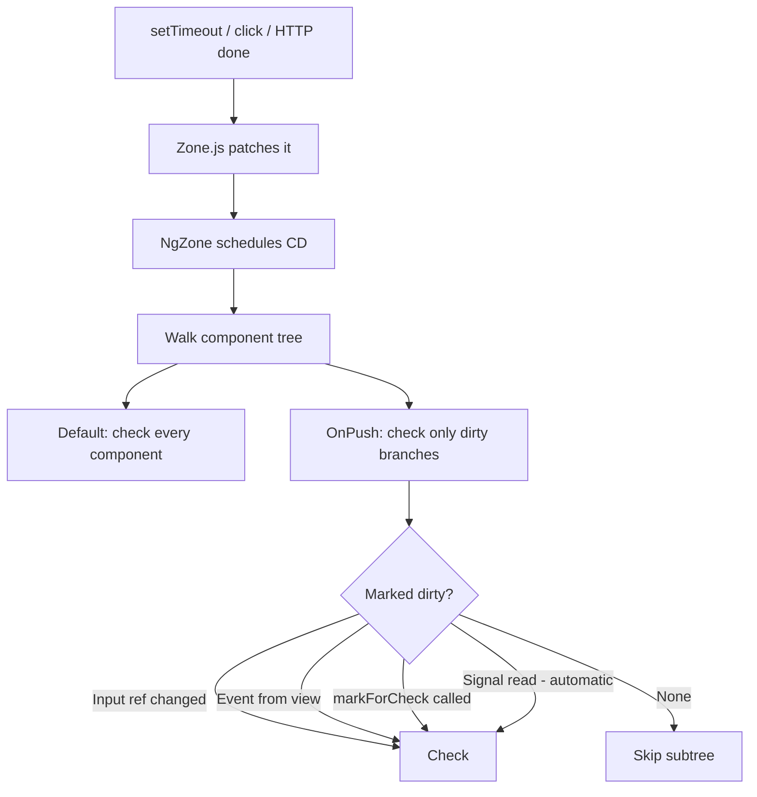

**Senior signal:** "OnPush should be the default everywhere. In a fresh app I set `provideExperimentalZonelessChangeDetection()` + `bootstrapApplication(App, { ... ChangeDetectionStrategy.OnPush }`. Signals make this trivial — no `markForCheck` boilerplate."

---

### 14. Why does mutating an array not trigger OnPush?

```ts
@Input() items!: Item[]; // OnPush
// Bad: parent does this.items.push(...)
// OnPush compares references — same array ref → no CD on child
```

Fix: replace, don't mutate. `this.items = [...this.items, newItem]` — new reference, CD fires.

Or use a signal `input<Item[]>()` — readers can be told via `update`/`set` with new arrays. Signals don't compare by reference; they compare by signal identity.

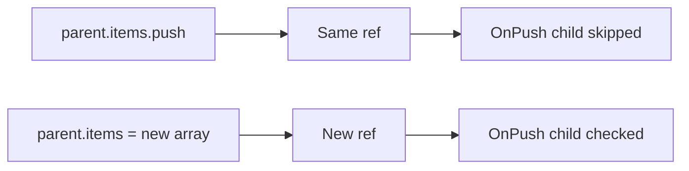

---

### 15. Zone.js — what does it actually do, and what's the cost?

Zone.js **monkey-patches every browser async API** (`setTimeout`, `Promise.then`, event listeners, XHR) so Angular can know when *something*, *anywhere* in the app, might have changed state. After every patched call, Zone tells NgZone to schedule a CD tick.

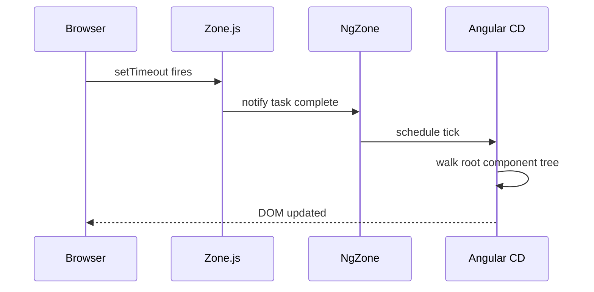

Costs:

- **CD runs even when nothing reactive happened** — every async event triggers a full or OnPush-filtered tick.
- **Heavy third-party JS** that touches the DOM inside Zone triggers CD too.
- **Bundle size** (~30 KB).
- **Debug noise** — stack traces obscured by Zone frames.

`runOutsideAngular` is the classic escape hatch for chatty libraries (charts, animations).

---

### 16. Zoneless change detection — what changes, what breaks?

Opt-in via `provideExperimentalZonelessChangeDetection()`. Now Angular **only** runs CD when:

- A signal read in the template changes.
- An `AsyncPipe` emits.
- An event from a view fires.
- Someone calls `ChangeDetectorRef.markForCheck()`.
- An attached view's input changes.

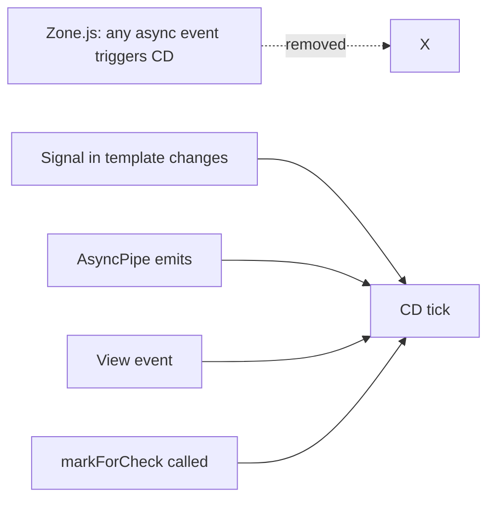

What breaks:

- Code that relied on `setTimeout` magically refreshing the view — set a signal instead.
- Tests using `fakeAsync`/`tick` and assuming Zone integration — most still work but some require `TestBed.inject(ApplicationRef).tick()`.
- Third-party libraries that mutate fields outside any signal — call `markForCheck` or move state into signals.

**Senior signal:** "Zoneless is the future. The migration cost is mostly small — find your `setTimeout(() => this.x = ..., 0)` and `setInterval(() => this.tick++)` calls; convert to signals."

---

### 17. `markForCheck` vs `detectChanges` vs `runOutsideAngular` — when to use which?

| API | What it does | When |
| --- | ------------ | ---- |
| `markForCheck` | Marks this view + ancestors as dirty; CD runs on the next tick | OnPush component updated from a non-Angular event (websocket, third-party) |
| `detectChanges` | Runs CD on this view *now*, synchronously | Tests; or when you must reflect state in the DOM before a sync API reads it (rare) |
| `runOutsideAngular` | Executes a callback without Zone patching | Tight loops, animations, chatty libraries that fire 60 events/sec |
| `runInsideAngular` | Re-enters the zone | Calling back into Angular state after a `runOutsideAngular` block |

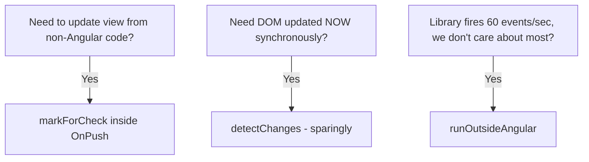

---

## RxJS Mastery

### 18. switchMap vs mergeMap vs concatMap vs exhaustMap.

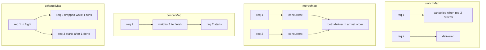

Cheat sheet:

| Operator | Behavior | Use for |
| -------- | -------- | ------- |
| `switchMap` | Cancel previous, start new | **Typeahead search**, route param changes, *user only cares about the latest* |
| `mergeMap` | Run all concurrently | Independent parallel operations, fan-out |
| `concatMap` | Queue and run sequentially | Ordered writes, *order matters and we can't drop any* |
| `exhaustMap` | Ignore new while one is in flight | **Login submit** — prevent double-submit |

Picking the wrong one is the #1 source of subtle bugs. "Use `switchMap` for HTTP" is wrong advice — it's right for *cancellable read*, wrong for *non-idempotent write*.

---

### 19. Hot vs cold Observables — what's the practical difference?

**Cold:** producer is created on subscribe. Each subscriber gets its own producer.

```ts
const cold$ = new Observable(sub => { sub.next(Math.random()); });
cold$.subscribe(v => console.log(v));  // 0.42
cold$.subscribe(v => console.log(v));  // 0.91 — different!
```

**Hot:** producer is created independently; subscribers share it.

```ts
const subject = new Subject<number>();
subject.subscribe(v => console.log(v));
subject.next(42); // both subscribers see 42
```

`HttpClient` requests are **cold** — each subscribe fires a new request. That's why `forkJoin([httpA, httpB])` and `combineLatest([httpA, httpB])` work without surprises.

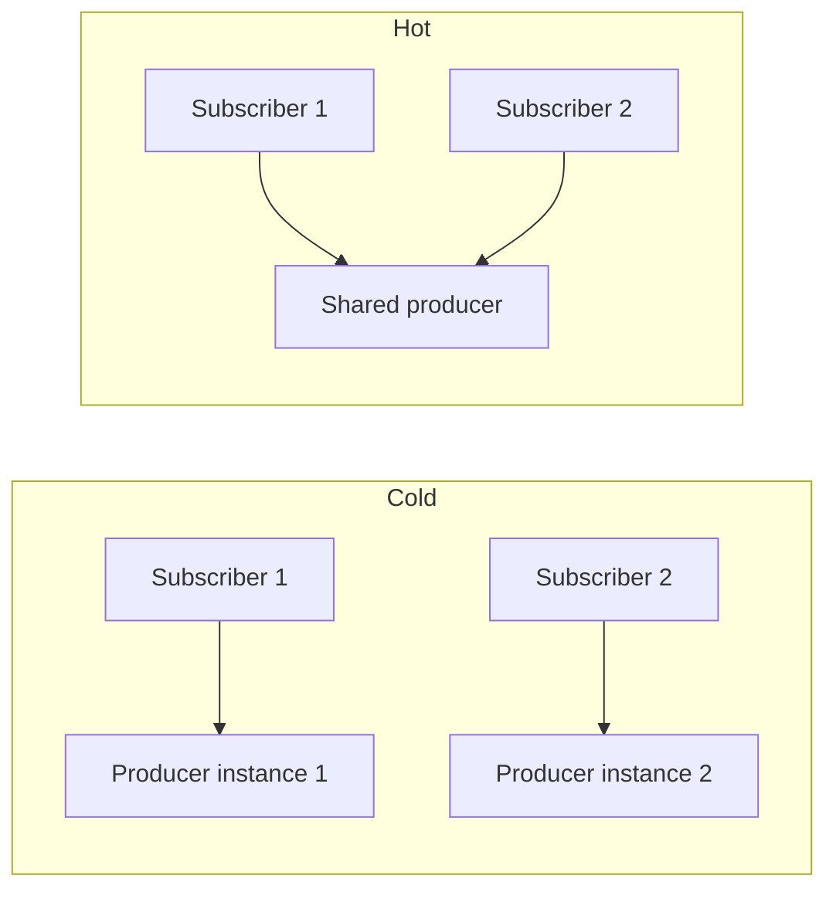

`share()` / `shareReplay()` turn a cold Observable hot. **`shareReplay({ bufferSize: 1, refCount: true })`** is the right shape for cached HTTP responses.

---

### 20. Subscription leaks — what causes them and how do you prevent?

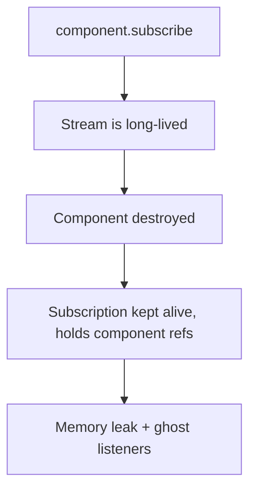

Prevention:

1. **`AsyncPipe`** — best. Subscribes in template, unsubscribes on destroy automatically.
2. **`takeUntilDestroyed()`** (Angular 16+) — drop-in, terse:
   ```ts
   data$ = this.http.get(...).pipe(takeUntilDestroyed());
   ```
3. **`toSignal(obs$)`** — auto-cleans up when the host is destroyed.
4. Legacy: a `destroy$ = new Subject<void>()` + `takeUntil(this.destroy$)` in `ngOnDestroy`.

**Anti-pattern:** `.subscribe(value => this.value = value)` with no cleanup. Found in old code; rewrite to `AsyncPipe` or `toSignal`.

---

### 21. `shareReplay` vs `share` — when does each fit?

| | `share()` | `shareReplay()` |
| - | --------- | --------------- |
| Buffers values | No | Yes (`bufferSize`) |
| New subscribers see history? | No (cold position) | Last N emissions |
| Reference count to teardown | Default yes | Configurable `refCount` |

Use `shareReplay({ bufferSize: 1, refCount: true })` for "cached HTTP — the last response is good enough for late subscribers, and tear down the source when nobody listens."

Common bug: `shareReplay(1)` without `refCount` keeps the source alive *forever* even when no subscribers remain — bad for streams that depend on a component.

```mermaid
sequenceDiagram
    participant S as Source HTTP
    participant SR as shareReplay({1, refCount:true})
    participant A as Subscriber A
    participant B as Subscriber B
    A->>SR: subscribe
    SR->>S: subscribe (first)
    S-->>SR: value v1
    SR-->>A: v1
    B->>SR: subscribe (later)
    SR-->>B: v1 (replayed)
    A->>SR: unsubscribe
    B->>SR: unsubscribe
    SR->>S: unsubscribe (refCount=0)
```

---

### 22. Retry with exponential backoff — implement it.

```ts
import { retry, timer } from 'rxjs';

const data$ = this.http.get('/api/x').pipe(
  retry({
    count: 3,
    delay: (err, retryCount) => {
      if (err.status >= 500 || err.status === 0) {
        const ms = Math.min(1000 * 2 ** retryCount, 10_000) + Math.random() * 500;
        return timer(ms);
      }
      throw err; // don't retry 4xx
    }
  })
);
```

```mermaid
flowchart LR
    Req[HTTP request] --> Fail{Error?}
    Fail -->|2xx| OK[Emit]
    Fail -->|4xx| Throw[Bail - don't retry user errors]
    Fail -->|5xx or network| Back[Wait 2^n * 1000ms + jitter]
    Back --> Count{Retries < N?}
    Count -->|Yes| Req
    Count -->|No| Throw
```

Add **jitter** (the `Math.random()`) to avoid thundering-herd on transient outages — without it, every client retries at the same moment.

---

### 23. Multicasting with `connect` — when and how?

```ts
const source$ = this.http.get<User>('/me');
const shared$ = source$.pipe(shareReplay(1));

// Multiple consumers
shared$.subscribe(u => this.user = u);
shared$.subscribe(u => this.analytics.track(u.id));
```

`shareReplay` is multicasting with replay buffer. For more control (lazy connect, custom subject), use `connect` + `Subject`.

Use case: **expensive computation** consumed by multiple subscribers (e.g., parsed CSV, derived report) that you don't want to recompute per subscriber.

---

### 24. Error recovery strategies — `catchError`, fallback streams, partial failure.

```mermaid
flowchart TD
    HTTP[HTTP request] --> Err{Errored?}
    Err -->|No| OK[next + complete]
    Err -->|Yes| Strat{Strategy}
    Strat -->|Local recovery| Of[catchError -> of fallback]
    Strat -->|Swallow + log| EMPTY[catchError -> EMPTY]
    Strat -->|Retry then fail| Retry[retry then catchError]
    Strat -->|Combine partial| Forkjoin[forkJoin where one stream allowed to fail with catchError -> of null]
```

Patterns:

```ts
// Fallback value
this.api.get().pipe(catchError(() => of(defaultValue)));

// Log and continue (don't break the stream)
this.api.get().pipe(catchError(err => { this.log(err); return EMPTY; }));

// Partial success across parallel requests
forkJoin({
  user: this.user$.pipe(catchError(() => of(null))),
  prefs: this.prefs$.pipe(catchError(() => of(defaultPrefs)))
});
```

**Senior signal:** "I always think about the *stream's afterlife*. `catchError` returning `EMPTY` completes the stream — the subscriber gets `complete`, not next. That's almost never what a UI wants."

---

## State Management

### 25. NgRx vs Signal Store vs ComponentStore vs services — pick.

```mermaid
flowchart TD
    Q[Where does state live?] --> Scope{Scope}
    Scope -->|Component-local| Sig[Signals in component or service]
    Scope -->|Feature-local| CS[ComponentStore or signal store - feature scope]
    Scope -->|Global, cross-feature| Need{Need time-travel, devtools, effects?}
    Need -->|Yes| NgRx[NgRx full]
    Need -->|No| SigStore[NgRx signal-store - global, lighter]
```

| Option | Boilerplate | Devtools | Best for |
| ------ | ----------- | -------- | -------- |
| Plain services + signals | None | None | Most apps under 50 components |
| `@ngrx/component-store` | Light | Limited | Per-feature state with effects |
| `@ngrx/signals` (Signal Store) | Light | Yes (Redux DevTools) | Modern default for cross-feature state |
| NgRx (classic actions/reducers/effects) | Heavy | Best | Large team, complex flows, time-travel needed |

**Senior signal:** "I default to signals + services. Reach for NgRx Signal Store when state crosses features or needs persistence/devtools. Classic NgRx earns its keep on apps where the dev experience benefits from time-travel debugging."

---

### 26. NgRx Signal Store — show me a small one.

```ts
import { signalStore, withState, withMethods, withComputed, patchState } from '@ngrx/signals';
import { computed, inject } from '@angular/core';

interface OrdersState {
  list: Order[];
  loading: boolean;
  filter: 'all' | 'pending' | 'shipped';
}

export const OrdersStore = signalStore(
  { providedIn: 'root' },
  withState<OrdersState>({ list: [], loading: false, filter: 'all' }),
  withComputed(({ list, filter }) => ({
    visible: computed(() =>
      filter() === 'all' ? list() : list().filter(o => o.status === filter())
    )
  })),
  withMethods((store, http = inject(HttpClient)) => ({
    setFilter(filter: OrdersState['filter']) { patchState(store, { filter }); },
    async load() {
      patchState(store, { loading: true });
      const list = await firstValueFrom(http.get<Order[]>('/api/orders'));
      patchState(store, { list, loading: false });
    }
  }))
);
```

```mermaid
graph LR
    Comp[Component] --> Read[reads .visible / .loading signals]
    Comp --> Call[calls .setFilter / .load]
    Call --> Patch[patchState mutates state]
    Patch --> Sigs[All readers re-render via signal graph]
```

Zero actions, zero reducers, full reactivity. Devtools work via the official extension.

---

### 27. Selectors and memoization — what's the trap?

NgRx classic `createSelector` is **memoized by reference equality of inputs**. Two traps:

1. **Inline `.filter`/`.map` in components** breaks memoization — every CD tick creates a new array. Move it into a selector.
2. **Selectors that return new objects** (`{ user, total }`) on every call bust memoization downstream — use `createSelector` for these too.

```mermaid
graph LR
    StateA[state.user] --> SelA[selectUser]
    StateB[state.orders] --> SelB[selectOrderTotal]
    SelA --> SelC[selectSummary]
    SelB --> SelC
    SelC -->|memoized when A and B unchanged| Comp[Component]
```

In Signal Store, `computed()` does the same automatically — no `createSelector` needed.

---

### 28. Effects — when in NgRx, when in plain RxJS service?

NgRx `Effect`s pay off when:

- An action triggers async work that emits *more actions* (request → success/failure).
- You want devtools to record the action chain.
- Multiple components dispatch the same intent; one effect handles it centrally.

Plain RxJS service methods pay off when:

- The flow is local to a feature.
- You don't need action replay.
- You want simpler stack traces and fewer indirections.

```mermaid
flowchart TD
    Comp[Component] --> Disp[dispatch action]
    Disp --> Reducer[Reducer updates state]
    Disp --> Eff[Effect intercepts]
    Eff --> HTTP[HTTP call]
    HTTP --> Success[dispatch successAction]
    HTTP --> Failure[dispatch failureAction]
    Success --> Reducer
    Failure --> Reducer
```

**Senior signal:** "Effects are an answer to a specific question — 'who else needs to know this happened?' If the answer is 'just this component,' don't use them."

---

### 29. Cross-tab state sync — patterns.

```mermaid
graph LR
    Tab1[Tab A] -->|write| LS[(localStorage)]
    LS -->|storage event| Tab2[Tab B]
    Tab1 <-->|postMessage| BC[BroadcastChannel]
    BC <--> Tab2
    Tab1 <-->|SharedWorker| SW[Shared Worker]
    SW <--> Tab2
```

Options:

- **`localStorage` + `storage` event** — fires in other tabs, not the writer. Simplest. Limited to strings, ~5MB.
- **`BroadcastChannel`** — purpose-built API, JSON-able payloads. Modern, well-supported. The right choice for in-app pub-sub across tabs.
- **`SharedWorker`** — one worker shared across tabs. Heavyweight; useful for centralizing websocket connections.
- **`Service Worker` `clients.matchAll()`** — push from server, fan out to all tabs.

In Angular: wrap in an `Injectable` service that exposes a signal — every tab's components stay in sync.

---

## Forms at Scale

### 30. Template-driven vs reactive — and what about signal forms?

| | Template-driven | Reactive | Signal forms (preview) |
| - | --------------- | -------- | ----------------------- |
| Where state lives | DOM via `ngModel` | TS class | Signals |
| Best for | Quick simple forms | Complex/dynamic forms | Future default |
| Async validation | Awkward | First-class | First-class |
| Typed | Weak | `FormGroup<T>` (typed forms, Angular 14+) | Yes, native |
| Test ergonomics | Poor | Good | Great |

**Default for new code: typed reactive forms.** Watch the signal-forms preview — it'll change the recommendation again in v20+.

---

### 31. Reactive forms — typed forms, group composition, FormArray.

```ts
type AddressForm = { street: FormControl<string>; city: FormControl<string> };
type UserForm = {
  name: FormControl<string>;
  email: FormControl<string>;
  addresses: FormArray<FormGroup<AddressForm>>;
};

readonly form = this.fb.group<UserForm>({
  name: this.fb.control('', { nonNullable: true, validators: Validators.required }),
  email: this.fb.control('', { nonNullable: true, validators: [Validators.required, Validators.email] }),
  addresses: this.fb.array<FormGroup<AddressForm>>([])
});

addAddress() {
  this.form.controls.addresses.push(this.fb.group<AddressForm>({
    street: this.fb.control('', { nonNullable: true }),
    city: this.fb.control('', { nonNullable: true })
  }));
}
```

```mermaid
classDiagram
    class FormGroup~UserForm~ {
      +controls: {name, email, addresses}
      +valueChanges: Observable
      +statusChanges: Observable
    }
    class FormControl~string~
    class FormArray~FormGroup~
    FormGroup~UserForm~ --> FormControl~string~ : name
    FormGroup~UserForm~ --> FormControl~string~ : email
    FormGroup~UserForm~ --> FormArray~FormGroup~ : addresses
    FormArray~FormGroup~ --> FormGroup~AddressForm~ : items
```

**Senior signal:** "Always pass the generic. `FormBuilder.group({})` without one returns `FormGroup<{ [key: string]: AbstractControl }>` — the world's worst type. Typed forms catch typos at compile time."

---

### 32. ControlValueAccessor — when do you implement it?

When you build a **custom input component** that should participate in `[(ngModel)]`, `formControlName`, validation, dirty/touched.

```ts
@Component({
  selector: 'app-rating',
  template: `...stars...`,
  providers: [{ provide: NG_VALUE_ACCESSOR, useExisting: forwardRef(() => RatingComponent), multi: true }]
})
export class RatingComponent implements ControlValueAccessor {
  value = signal(0);
  private onChange: (v: number) => void = () => {};
  private onTouched: () => void = () => {};

  writeValue(v: number) { this.value.set(v ?? 0); }
  registerOnChange(fn: any) { this.onChange = fn; }
  registerOnTouched(fn: any) { this.onTouched = fn; }
  setDisabledState(disabled: boolean) { /* ... */ }

  rate(n: number) { this.value.set(n); this.onChange(n); this.onTouched(); }
}
```

```mermaid
sequenceDiagram
    participant FC as FormControl
    participant CVA as Custom Input (CVA)
    participant DOM
    FC->>CVA: writeValue(v)
    CVA->>DOM: render v
    DOM->>CVA: user interacts
    CVA->>FC: onChange(newValue)
    FC->>FC: status/value updates
    FC->>CVA: setDisabledState(true) if needed
```

---

### 33. Performance — a 200-field form is laggy. What do you do?

```mermaid
flowchart TD
    Slow[200-field form janks on keystroke] --> CD{CD strategy default?}
    CD -->|Yes| Push[Switch parent to OnPush]
    Push --> Split[Break form into smaller child components]
    Split --> Local[Each child binds to a FormGroup subset]
    Local --> Update[Use updateOn: 'blur' instead of 'change']
    Update --> Track[Use @for trackBy for repeated controls]
    Track --> Sig[Move to signals where possible]
```

Concrete levers:

- `formGroupName="address"` subforms in OnPush child components — they only re-render when *their* subgroup changes.
- `{ updateOn: 'blur' }` cuts CD frequency for fields that don't need live validation.
- `valueChanges.pipe(debounceTime(150), distinctUntilChanged())` instead of subscribing raw.
- Avoid pipes returning new arrays each call — memoize via `computed()` or a `pure` pipe over signals.

---

## Routing & DI Deep Dive

### 34. Functional guards/resolvers — show the pattern.

```ts
export const authGuard: CanActivateFn = (route, state) => {
  const auth = inject(AuthService);
  const router = inject(Router);
  return auth.isAuthenticated() || router.createUrlTree(['/login'], {
    queryParams: { returnUrl: state.url }
  });
};

export const userResolver: ResolveFn<User> = (route) => {
  const api = inject(UserApi);
  return api.getById(route.paramMap.get('id')!);
};

export const routes: Routes = [
  { path: 'users/:id', component: UserPage,
    canActivate: [authGuard], resolve: { user: userResolver } }
];
```

```mermaid
sequenceDiagram
    participant U as URL change
    participant R as Router
    participant G as Guards
    participant Res as Resolvers
    participant C as Component
    U->>R: navigate
    R->>G: run CanActivate[]
    G-->>R: true / UrlTree (redirect)
    R->>Res: run resolvers (parallel)
    Res-->>R: data map
    R->>C: instantiate with ActivatedRoute snapshot
    C->>C: read route.data.user
```

Class-based guards/resolvers are deprecated. Functional ones compose with `inject()` and are easier to test.

---

### 35. Route-level providers — when do you use them?

```ts
{
  path: 'checkout',
  loadComponent: () => import('./checkout.page'),
  providers: [
    CheckoutStore,           // feature-scoped state
    { provide: PAYMENT_PROVIDER, useClass: StripeProvider }
  ]
}
```

Effect: any service in `providers` is instantiated when the route is matched and destroyed when the user leaves. Solves "feature state shouldn't live forever" without manual cleanup.

```mermaid
graph TD
    Root[Root injector - app-wide singletons] --> Lazy[Lazy route injector]
    Lazy --> Provider[CheckoutStore lives here]
    Provider --> Comp1[CheckoutPage]
    Provider --> Comp2[CheckoutShipping]
    Provider --> Comp3[CheckoutPayment]
    Comp1 --> Inject[All inject the same CheckoutStore]
```

Pair with `loadComponent` for the cleanest lazy-feature unit.

---

### 36. Hierarchical DI — `@Self`, `@SkipSelf`, `@Optional`, multi providers.

```mermaid
graph TD
    Root[Root injector] --> Mod[Lazy route injector]
    Mod --> Host[Host component]
    Host --> Child[Child component]
    Child -->|@Self| LocalOnly[Look only on Child]
    Child -->|default| Bubble[Bubble up: Child -> Host -> Mod -> Root]
    Child -->|@SkipSelf| SkipFirst[Skip Child, start at Host]
    Child -->|@Optional| MaybeNull[Return null instead of throwing]
```

Use cases:

- `@Self` — "I require a *local* provider; throw if none." Used for directives that demand to be on a host with a specific service.
- `@SkipSelf` — "Walk past me when resolving" — needed for *self-referential* DI like recursive tree components.
- `@Optional` — "It's OK if it's missing" — for optional logging adapters, feature-flag services in tests.
- **Multi-providers** — `{ provide: TOKEN, useClass: X, multi: true }` collects into an array. HTTP interceptors are the canonical example.

---

### 37. `inject()` vs constructor injection — when to choose what.

```ts
// Functional context (guards, resolvers, interceptors, effects)
// Must use inject()
export const authGuard: CanActivateFn = () => {
  const auth = inject(AuthService);
  return auth.isLoggedIn();
};

// Component class — both work
@Component({...})
export class HomePage {
  private readonly api = inject(UserApi);  // modern
  // OR
  constructor(private readonly api: UserApi) {} // legacy/explicit
}
```

`inject()` is mandatory in functional contexts and field initializers. Class constructors still accept either. Choose one style and enforce via ESLint — mixing both in the same class is the worst readability.

**Senior signal:** "I default to `inject()` because it lets me move DI into field initializers — `private readonly user = inject(UserStore);` keeps the constructor empty."

---

### 38. Preloading strategies — what are they and when to use which?

| Strategy | When |
| -------- | ---- |
| `NoPreloading` (default) | Cellular networks, huge apps |
| `PreloadAllModules` | Small apps where every route is likely visited |
| Custom (`PreloadingStrategy`) | Preload "likely next" routes based on app state |

Quick4-Click preload via custom strategy:

```ts
@Injectable({providedIn: 'root'})
class HoverPreload implements PreloadingStrategy {
  preload(route: Route, load: () => Observable<any>) {
    return route.data?.['preload'] ? load() : EMPTY;
  }
}
// in routes: { path: 'checkout', loadComponent: ..., data: { preload: true } }
```

```mermaid
flowchart LR
    AppBoot[App boot] --> First[Render first route]
    First --> Idle[Browser idle]
    Idle --> Strat{Strategy}
    Strat -->|None| Wait[Load on demand]
    Strat -->|All| LoadAll[Fetch all lazy chunks]
    Strat -->|Custom| Pick[Pick by heuristic - hover, viewport, business priority]
```

---

## Performance Optimization

### 39. The app is laggy on slow phones — diagnostic playbook.

```mermaid
flowchart TD
    Slow[Lag report] --> Where{Where?}
    Where -->|Initial load| Bundle[Bundle size + LCP]
    Where -->|Navigation| Lazy[Lazy loading working? preload?]
    Where -->|Scrolling list| Vir[Virtual scroll? trackBy?]
    Where -->|Typing in form| CD[CD strategy + form size]
    Where -->|Random jank| Zone[Long tasks - find with Performance tab]
    Bundle --> Lighthouse[Run Lighthouse on prod build]
    Lazy --> Coverage[Chrome Coverage: unused JS]
    Vir --> CDK[CDK virtual scroll]
    CD --> Push[OnPush + signals]
    Zone --> Profile[Angular DevTools profiler]
```

Steps in order:

1. Repro on the actual device class (CPU throttling 4×).
2. **Lighthouse** for first-paint metrics; **Angular DevTools profiler** for CD flame chart.
3. Look for components called 100+ times per second — usually a misconfigured `default` CD strategy at the root.
4. Bundle analysis via `source-map-explorer` or `esbuild-bundle-analyzer`. Drop unused imports.
5. Convert heavy lists to `@defer` blocks or CDK virtual scroll.
6. Move synchronous heavy work off the main thread (Web Worker).

---

### 40. Deferrable views (`@defer`) — when do they shine?

```html
@defer (on viewport) {
  <heavy-chart [data]="data()" />
} @placeholder { <skeleton /> }
@loading (minimum 100ms) { <spinner /> }
@error { <error-card /> }
```

Triggers: `on viewport`, `on idle`, `on hover`, `on interaction`, `on timer(2s)`, `when expr()`.

```mermaid
sequenceDiagram
    participant Tpl as Template
    participant Br as Browser
    participant Bundle as Lazy chunk
    Tpl->>Br: render placeholder
    Br->>Br: viewport reached (or other trigger)
    Br->>Bundle: fetch lazy chunk
    Bundle-->>Br: code arrives
    Br->>Tpl: swap placeholder for real component
```

Use for:

- Below-the-fold widgets (charts, comments, recommendations).
- Heavy components only some users open (modals, advanced editors).
- Anything you'd otherwise hand-roll with `loadComponent` + `*ngIf`.

Watch out: SSR rendering of `@defer` blocks defaults to "render the placeholder," not the real content — set `@defer (when serverPrerendered())` if you want the real content in the HTML.

---

### 41. `trackBy` and `@for` — what does it cost when wrong?

```html
@for (item of items(); track item.id) { <app-row [item]="item"/> }
```

Without `track`, every change to `items` destroys and re-creates all DOM nodes — full re-renders, lost focus, lost animations. With `track item.id`, only changed rows re-render.

```mermaid
flowchart LR
    NoTrack[No track] --> Destroy[All DOM destroyed]
    Destroy --> Rebuild[Rebuild all - paint, layout, scripts]
    WithTrack[track item.id] --> Diff[Diff by key]
    Diff --> OnlyChanged[Re-render only changed rows]
```

In `@for`, `track` is **mandatory** (compile error without it) — Angular 17 forced the discipline by design.

---

### 42. Virtual scroll — when and how.

CDK virtual scroll renders only the viewport-visible items:

```html
<cdk-virtual-scroll-viewport itemSize="48" class="h-96">
  <div *cdkVirtualFor="let item of items; trackBy: byId">{{item.name}}</div>
</cdk-virtual-scroll-viewport>
```

```mermaid
graph TD
    Vp[Viewport 600px] --> Visible[~13 items visible]
    Vp --> Buffer[+ buffer above/below]
    All[10,000 items in source] --> Render[Only ~20 DOM nodes mounted]
    Scroll[User scrolls] --> Swap[Items recycled, content updates]
```

Use when:

- Lists > ~100 rows.
- Item heights are uniform (`itemSize`) or you use `AutoSizeVirtualScrollStrategy`.

Don't use when:

- Heterogeneous heights that change after render.
- Anchor links / find-in-page need to find off-viewport text.

---

### 43. Web Workers in Angular — when worth it?

Worth it for:

- CPU-heavy data transforms (CSV parsing, fuzzy search, fact-tables).
- Crypto / hashing on the client.
- WASM modules wrapped behind a worker.

Not worth it for:

- HTTP calls (already async).
- Anything that needs DOM access (workers can't touch DOM).
- Tiny operations — postMessage overhead is the bottleneck.

```mermaid
graph LR
    Main[Main thread] -->|postMessage| W[Worker]
    W -->|postMessage| Main
    Main -->|transferable: ArrayBuffer| W
    W --> Heavy[Heavy compute]
```

`ng generate web-worker` scaffolds it. Use `Comlink` or RxJS `webWorker` helpers to avoid the raw `postMessage` ceremony.

---

### 44. Bundle analysis — what do you actually look for?

```mermaid
flowchart TD
    Build[ng build --configuration production] --> Map[Source maps emitted]
    Map --> Tool[source-map-explorer or esbuild-bundle-analyzer]
    Tool --> Big[Biggest entries by size]
    Big --> Class{Common offenders}
    Class --> M[moment.js -> date-fns/dayjs]
    Class --> L[lodash -> lodash-es with named imports]
    Class --> RxFull[Whole rxjs imported by mistake]
    Class --> Material[Whole Material imported; switch to component-level]
    Class --> Icons[Whole icon font / SVG sprite shipped]
```

Budgets in `angular.json` catch regressions in CI:

```json
"budgets": [
  { "type": "initial", "maximumWarning": "500kb", "maximumError": "750kb" },
  { "type": "anyComponentStyle", "maximumError": "5kb" }
]
```

**Senior signal:** "Initial bundle <500KB gzipped is my target. Above that, LCP suffers on cellular networks."

---

## SSR & Hydration

### 45. When does SSR earn its keep in Angular?

```mermaid
flowchart TD
    Q[Need SSR?] --> SEO{SEO matters?}
    SEO -->|Yes - public site| Yes[Yes]
    SEO -->|No - internal admin| Maybe[Probably not]
    Yes --> LCP{LCP problem on first paint?}
    LCP -->|Yes| Yes2[Yes - server-render hero]
    LCP -->|No| Social[Need social preview images / OG meta?]
    Social -->|Yes| Yes3[Yes]
    Social -->|No| No[CSR fine - simpler ops]
```

Costs:

- Server you must operate (Node, container, autoscaling).
- Code must work in both browser and Node (no `window`/`document` at boot — use `isPlatformBrowser`).
- Larger initial HTML payload.

Reach for SSR when: SEO matters, social previews matter, or LCP is the binding metric and you've exhausted client-side wins.

---

### 46. Non-destructive hydration — what does it do and what breaks it?

Pre-v16, Angular SSR threw the HTML away on client boot and re-rendered from scratch — a visible flash.

Post-v16 hydration **claims** the existing DOM: matches server output to component tree and just attaches listeners.

```mermaid
sequenceDiagram
    participant S as Server
    participant Br as Browser
    participant Ang as Angular bootstrap
    S-->>Br: HTML with serialized state
    Br->>Br: paint HTML immediately
    Ang->>Br: hydrate - walk DOM, attach handlers
    Ang->>Br: replay queued events that happened pre-hydration
```

**Mismatch causes** (force destructive re-render):

- DOM mutated by third-party scripts before hydration.
- Different server vs client rendering (e.g., `if (isPlatformBrowser) {...}` branches that diverge).
- Conditional `*ngIf` driven by `window.innerWidth` server-side.
- Comments/whitespace differences from manual `innerHTML` interventions.

Fix: stick to `provideClientHydration()` and a single source of truth for branching (`afterNextRender` for browser-only work).

---

### 47. Incremental hydration (v19+) — what's new?

Pair `@defer` with hydration:

```html
@defer (hydrate on viewport) {
  <heavy-chart [data]="data()" />
} @placeholder { ... }
```

The server renders the real content; the client downloads JS *only when needed*. Best of both worlds — fast first paint, no over-hydration of components users never interact with.

```mermaid
graph LR
    SSR[Server renders full HTML] --> Ship[Ship to browser]
    Ship --> Boot[Angular boots, but doesn't hydrate everything]
    Boot --> Idle[Browser idle]
    Idle --> Trig{Trigger met?}
    Trig -->|on viewport| Fetch[Fetch chunk + hydrate this block]
    Trig -->|on interaction| Fetch
    Trig -->|on hover| Fetch
```

Costs: requires SSR setup, and `@defer` blocks change the rendering model — test thoroughly.

---

## Testing Strategy

### 48. Unit vs integration vs E2E — what's the right mix?

```mermaid
graph TD
    E2E[E2E Playwright - few] --> Slow[Slow, brittle, real flows]
    Int[Integration TestBed - many] --> Real[Real components + DI + templates]
    Unit[Unit pure TS - most] --> Fast[Fast pure functions, utilities]
    Pyramid[Pyramid] --> Unit
    Pyramid --> Int
    Pyramid --> E2E
```

For Angular specifically, the **middle layer is the most valuable** — TestBed-mounted components catch template + DI + change-detection issues at near-unit speed. Skipping it leads to E2E suites that take 45 minutes and fail flakily.

Pyramid mix for a typical app:

- 70% pure unit (services, pipes, pure functions).
- 25% component integration (TestBed + harnesses).
- 5% E2E (golden paths only).

---

### 49. TestBed in 2025 — what should you actually do?

```ts
beforeEach(async () => {
  await TestBed.configureTestingModule({
    imports: [MyStandaloneComponent],   // standalone goes in imports
    providers: [
      { provide: UserApi, useValue: createMockApi() },
      provideRouter([])                  // functional providers in tests
    ]
  }).compileComponents();
});

it('renders user name', () => {
  const fixture = TestBed.createComponent(MyStandaloneComponent);
  fixture.componentRef.setInput('userId', 'u123');
  fixture.detectChanges();
  expect(fixture.nativeElement.textContent).toContain('Alice');
});
```

Modern guidance:

- **Standalone components → `imports`**, not `declarations`.
- **Functional providers** (`provideRouter`, `provideHttpClient`) replace `RouterTestingModule`/`HttpClientTestingModule` legacy modules.
- Use **`setInput`** for signal inputs (and works for classic `@Input` too).
- **Component harnesses** (CDK) for Material components — query by role, not by `By.css('mat-button')`.

```mermaid
flowchart LR
    Cfg[TestBed.configureTestingModule] --> Comp[createComponent]
    Comp --> SetIn[componentRef.setInput]
    SetIn --> CD[fixture.detectChanges]
    CD --> Q[Query DOM or harness]
    Q --> Assert[Expect]
```

---

### 50. Marble testing — when worth the ceremony?

```ts
it('debounces', () => {
  testScheduler.run(({ cold, expectObservable }) => {
    const input$ = cold('a-b---c|');
    const output$ = input$.pipe(debounceTime(2));
    expectObservable(output$).toBe('-----b-c|');
  });
});
```

Worth it for:

- Custom RxJS operators.
- Complex orchestration (rate-limiters, queues, retry-with-backoff).
- Verifying timing without `fakeAsync(tick(...))` arithmetic.

Not worth it for:

- One-shot `switchMap` over HTTP — a regular spec with `firstValueFrom` is clearer.
- Most component tests — your stream graph is too simple to deserve marbles.

---

## Build, Monorepo & Micro-Frontends

### 51. esbuild application builder — what changed?

The Angular CLI moved from Webpack to esbuild (via the application builder) in v17 and made it the default in v18. Wins:

- 5–10× faster builds.
- Same source maps and budgets API.
- Hybrid SSR support out of the box (`@angular/ssr`).
- Better tree-shaking through esbuild's metafile.

```mermaid
flowchart LR
    Src[TS + HTML + SCSS] --> Esb[esbuild]
    Esb --> Trans[Transform: SWC for decorators]
    Trans --> Bundle[Bundle: code splitting per lazy route]
    Bundle --> Out[dist/ - hashed JS, CSS, source maps]
```

Caveats:

- Custom Webpack plugins don't work anymore — most have native esbuild equivalents.
- AngularJS interop and very old patterns may need the Webpack-based `browser` builder still.

---

### 52. Nx workspace — library categories and boundaries.

Nx encourages typing libraries with `tags`:

| Type | Tag | Imports from |
| ---- | --- | ------------ |
| `app` | `type:app` | `feature`, `data-access`, `ui`, `util` |
| `feature` | `type:feature` | `data-access`, `ui`, `util` |
| `ui` | `type:ui` | `util` |
| `data-access` | `type:data-access` | `util`, `domain` |
| `util` | `type:util` | nothing |
| `domain` | `type:domain` | nothing |

Enforce via `@nx/enforce-module-boundaries` ESLint rule. A `ui` lib that tries to import from `data-access` is a CI fail, not a code-review fight.

```mermaid
graph TD
    App[App] --> Feat[Feature]
    Feat --> DA[Data-Access]
    Feat --> UI[UI]
    DA --> Dom[Domain]
    UI --> Util[Util]
    DA --> Util
    Dom --> Util
```

`nx affected` is the killer feature in CI: only build/test what's downstream of the changed files. Cuts CI from 30min to 3min.

---

### 53. Micro-frontends with Angular — Native Federation or Module Federation?

Both work. Native Federation (`@angular-architects/native-federation`) is newer, esbuild-friendly, doesn't depend on Webpack.

```mermaid
graph TB
    Host[Host Shell] -->|loads| Remote1[Remote: Orders MFE]
    Host -->|loads| Remote2[Remote: Catalog MFE]
    Host -->|loads| Remote3[Remote: Billing MFE]
    Shared[Shared deps: @angular/core, rxjs] --> Host
    Shared -.singleton.-> Remote1
    Shared -.singleton.-> Remote2
    Shared -.singleton.-> Remote3
```

Hard parts:

- **Version skew** — host and remotes must agree on `@angular/core`. Strict mode causes runtime errors when versions drift.
- **Routing** — top-level routes belong to the host; remotes own sub-trees.
- **Shared state** — pick one: events on `BroadcastChannel`, a shared service in `singleton` mode, or a published library.
- **Auth** — tokens must be retrievable by every remote. Cookie auth wins; localStorage causes scope issues.

**Senior signal:** "I avoid MFEs unless multiple teams *truly* can't ship together. The integration tax is real — most 'micro-frontend' apps would be better as a single Nx monorepo."

---

## Security

### 54. XSS in Angular — what's already protected, and where do you still get it wrong?

Angular's template engine **HTML-escapes by default**. `{{ userInput }}` is always safe.

Footguns:

- **`[innerHTML]`** — Angular sanitizes but loses any markup it considers unsafe. Don't use it to render user-provided content unless you trust it.
- **`bypassSecurityTrustHtml`** — disables sanitization. **Never** call this with user input.
- **Dynamic URL building** — `[href]="userUrl"` will block `javascript:` URLs *if* you go through `[href]`. Concatenating into `outerHTML` won't be checked.
- **`DomSanitizer`** abuse — devs call `bypassSecurityTrustResourceUrl` to embed YouTube and accidentally apply it to all iframes.

```mermaid
flowchart TD
    Input[User input] --> Safe{Path}
    Safe -->|Text via interpolation| OK[Escaped]
    Safe -->|innerHTML| San[Sanitized; some markup stripped]
    Safe -->|bypassSecurityTrustHtml| Risk[Trusted as-is - XSS risk]
    Safe -->|attribute binding [href]| Check[Blocked if javascript:]
    Safe -->|template injection / eval| Bad[Don't]
```

Also worth knowing:

- **CSP header** at the server — `default-src 'self'`, no `unsafe-inline`. With Angular's hashed bundles this is straightforward.
- **HttpClient is not vulnerable to XSRF by default** — Angular auto-reads `XSRF-TOKEN` cookie and adds it as `X-XSRF-TOKEN` header on same-origin mutating requests.

---

## Migration & Modernization

### 55. Plan a migration from NgModule + RxJS-everywhere to Standalone + Signals.

```mermaid
flowchart TD
    Start[Current: NgModule + RxJS state] --> Phase1[Phase 1: Update Angular to current LTS]
    Phase1 --> Phase2[Phase 2: Standalone schematic on leaf components]
    Phase2 --> Phase3[Phase 3: Convert routes to provideRouter + loadComponent]
    Phase3 --> Phase4[Phase 4: Replace *ngIf/*ngFor with @if/@for via schematic]
    Phase4 --> Phase5[Phase 5: Introduce signals in new code; bridge with toSignal at boundary]
    Phase5 --> Phase6[Phase 6: Convert RxJS state to signals service-by-service]
    Phase6 --> Phase7[Phase 7: Enable zoneless on a single route to validate]
    Phase7 --> Phase8[Phase 8: Roll zoneless app-wide]
```

Rules:

- **Never mix old and new in the same component** during conversion — finish one or revert.
- Run schematics, don't hand-edit hundreds of files: `ng generate @angular/core:standalone`, `ng generate @angular/core:control-flow`, `ng generate @angular/core:inject`.
- Keep tests green per phase — if you batch all migrations, you can't tell which one broke a test.
- Have a feature flag if you want a kill switch (rare, but cheap).

---

### 56. From `*ngIf` to `@if` — what's actually different?

| | `*ngIf` | `@if` |
| - | ------- | ----- |
| Type narrowing in template | Limited | Full |
| Async pipe pattern | `*ngIf="user$ | async as user"` | `@if (user(); as user)` |
| Else | `<ng-template #else>` | `@else if` / `@else` blocks |
| Compile errors | Runtime | Compile-time |
| Bundle size | Larger (structural directive infra) | Smaller |

```html
@if (user(); as u) {
  <p>Hi {{ u.name }}</p>
} @else if (loading()) {
  <spinner />
} @else {
  <login-prompt />
}
```

Schematic: `ng generate @angular/core:control-flow` rewrites the whole codebase.

---

## Leadership & Trade-offs

### 57. How do you onboard a junior to a 200k-LoC Angular codebase?

A pragmatic plan:

1. **Week 1 — geography.** Have them read the README + `core` + one feature folder end-to-end. Don't ship any code.
2. **Week 1–2 — pair on a trivial bug** in one feature. They drive, you navigate. Surface conventions in the moment.
3. **Week 2–3 — small isolated task** (a new presentational component). PR review with a checklist: signals/OnPush/track/typed forms.
4. **Week 3–4 — a slice of a feature** that crosses data-access + UI. They draft a small design doc *before* coding.
5. **Ongoing — pair on incidents.** Production triage teaches more architecture than any tutorial.

What to avoid:

- Dropping them into NgRx effects on day one. Effects look simple; the action-flow graph isn't.
- "Just read the code." Without context they'll learn the wrong patterns.
- Premature solo ownership of critical features.

---

### 58. Build-vs-buy for UI primitives — when do you adopt Material vs roll your own?

| Factor | Material | Custom design system |
| ------ | -------- | -------------------- |
| Brand neutrality acceptable | ✓ | |
| Need full visual control | | ✓ |
| Time to first release | ✓ | |
| Long-term theming flexibility | Limited (Material 3 helps) | ✓ |
| A11y baked in | ✓ | Have to do it yourself |
| Bundle size | Medium | Whatever you build |

```mermaid
flowchart TD
    Need[New design system?] --> Brand{Need strong brand expression?}
    Brand -->|Yes| Custom[Build on CDK primitives - Overlay, Portal, a11y]
    Brand -->|No| Mat[Use Material with theming]
    Custom --> CDK[Use Angular CDK as foundation - don't reinvent overlays/a11y]
    Mat --> Wrap[Wrap Material components in your own thin layer - escape hatch for later]
```

**Senior signal:** "Even if I go full custom, I build on the **CDK**, never from scratch. Overlay positioning, focus trapping, and ARIA are too easy to get wrong."

---

## See Also

- Related interview files: [[Senior .NET Developer]], [[Senior Database Engineer]] — overlapping coverage on architecture, perf, distributed systems.
- Vault topics: [[Angular Master Index]] for deeper notes on signals, change detection, RxJS operators, NgRx, hydration.
- External: Angular update guide (<https://update.angular.io>), official RxJS docs, *Angular Architecture* by Manfred Steyer.

---

*Senior Angular interviews reward fluency in **both** the new (signals, standalone, zoneless) and the still-essential (RxJS, OnPush, hierarchical DI). Be ready to explain when each model wins.*
