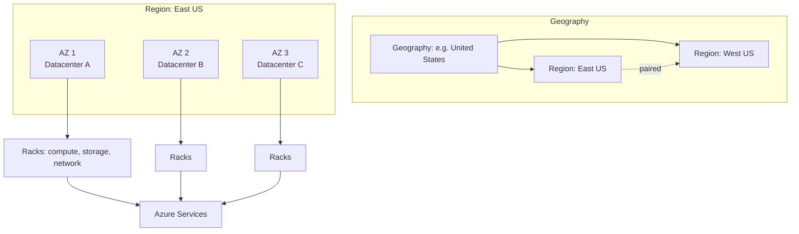

# Azure Overview

> **One-liner**: Azure is Microsoft's public cloud — a global fleet of datacenters offering compute, storage, networking, identity, data, and AI as on-demand services billed by usage.

---

## Quick Reference

| Item | Value |
| ---- | ----- |
| Service categories | Compute, Storage, Networking, Database, Identity, AI/ML, IoT, DevOps, Security, Analytics |
| Service models | IaaS (VMs), PaaS (App Service, SQL DB), SaaS (Microsoft 365), Serverless (Functions, ACA) |
| Regions | 60+ globally; **paired regions** for geo-redundancy |
| Availability Zones | 3 per AZ-enabled region; physically separate datacenters |
| Pricing | Pay-as-you-go, reservations, savings plans, spot, free tier |
| Entry point | <https://portal.azure.com> + `az` CLI + Bicep |
| Support tiers | Basic (free) → Developer → Standard → Professional Direct → Premier |

| Cloud model | Who manages what |
| ----------- | ---------------- |
| **IaaS** (VMs) | You: OS + apps. Azure: hardware, hypervisor, network |
| **PaaS** (App Service, SQL DB) | You: app + data. Azure: runtime, patching, scaling |
| **Serverless** (Functions, ACA Consumption) | You: code + config. Azure: everything else, billed per execution |
| **SaaS** (Microsoft 365) | You: data + users. Vendor: everything |

---

## Core Concept

A **cloud provider** rents you fractions of physical infrastructure on demand. Azure abstracts datacenters into named **services** (Virtual Machines, App Service, Azure SQL Database, etc.) that you provision with an API call and pay for while they exist.

The most important mental model is the **shared responsibility model**: Microsoft is responsible for the physical and platform layers; you are responsible for what you put on top. As you move from IaaS → PaaS → SaaS, your responsibility shrinks. The cost of that shrinking responsibility is a corresponding loss of control — you can't `apt-get install` on App Service.

Azure deploys services into **regions** (e.g., `East US`, `West Europe`, `Southeast Asia`). Many regions have multiple **Availability Zones** — independently powered/cooled datacenters connected by low-latency fiber. Spreading a workload across zones survives a single datacenter failure; spreading across **paired regions** survives a regional disaster.

Every resource lives inside a **subscription** for billing and a **resource group** for lifecycle. Every action is authorized via **Microsoft Entra ID** (the identity provider, formerly Azure AD) and authorized via **RBAC**.

---

## Diagram



---

## Syntax & API

### Check Azure status from CLI

```bash
# Install the CLI (one-time)
# Windows: winget install -e --id Microsoft.AzureCLI
# macOS:   brew install azure-cli
# Linux:   curl -sL https://aka.ms/InstallAzureCLIDeb | sudo bash

az login                              # opens browser
az account show                        # current subscription
az account list --output table         # all subscriptions you can access
az account list-locations --output table   # regions you can deploy to
```

### Deploy your first resource (a storage account)

```bash
az group create --name rg-hello --location eastus
az storage account create \
  --name stmyfirst$RANDOM \
  --resource-group rg-hello \
  --location eastus \
  --sku Standard_LRS
az group delete --name rg-hello --yes
```

That round trip exercises: auth (Entra ID) → subscription scope → region choice → resource group → service provisioning → cleanup.

---

## Common Patterns

- **Hello-world workload**: App Service + Azure SQL Database + Application Insights, all in one resource group.
- **Production minimum**: at least two AZs per tier; Key Vault for secrets; Log Analytics workspace for logs.
- **Multi-region**: a paired region with Azure Front Door routing traffic to the healthy region.

---

## Gotchas & Tips

- **Free tier ≠ free forever.** Many services have 12-month free amounts then bill at standard rates. Set a budget alert before you provision.
- **Region names matter.** `eastus` and `EastUS` are accepted by the CLI but not by every SDK. Be consistent.
- **Not every region has Availability Zones.** Check before designing for AZ redundancy.
- **A region pair is a compliance and replication concept**, not a network shortcut. Cross-region traffic still pays egress.
- **Microsoft Entra ID is per tenant, not per subscription.** Many subscriptions can share one Entra tenant; switching tenants is rare and disruptive.
- **Service availability varies per region.** New services launch in `East US 2` and `West Europe` first; spreading early-adopter workloads to other regions can mean some services aren't there yet.

---

## See Also

- [[02 - Azure Portal and CLI]]
- [[03 - Subscriptions Resource Groups and Tags]]
- [[09 - Cost Management]]
- [[01 - Well-Architected Framework]]
