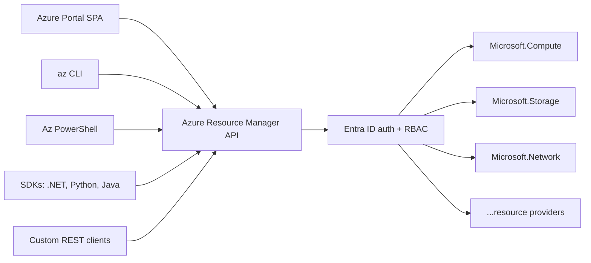

# Azure Portal and CLI

> **One-liner**: Azure exposes the same control plane through the **portal** (clickable), the **`az` CLI** (scriptable), the **`Az` PowerShell** module, the **REST API**, and **Cloud Shell** — pick by task: portal to learn and inspect, CLI to automate.

---

## Quick Reference

| Tool | Where it runs | When to use |
| ---- | ------------- | ----------- |
| **Portal** | <https://portal.azure.com> | Exploration, inspection, one-off changes |
| **Azure CLI (`az`)** | Local or Cloud Shell, bash | Automation, scripts, day-to-day |
| **Az PowerShell** | Windows / pwsh | Windows-heavy shops, `Invoke-` style |
| **Cloud Shell** | Browser-hosted bash/pwsh | No local setup, always-current versions |
| **ARM REST API** | curl/HTTP client | Custom tooling, deep integrations |
| **Bicep / ARM** | `az deployment` | Repeatable IaC (see [[10 - IaC with ARM and Bicep]]) |

| `az` command | What it does |
| ------------ | ------------ |
| `az login` | Authenticate (opens browser) |
| `az account show` | Show current subscription |
| `az account set --subscription <id>` | Switch subscription |
| `az group create -n <name> -l <region>` | Create a resource group |
| `az resource list -g <rg> -o table` | List resources in a group |
| `az <service> create ...` | Provision a service |
| `az <resource> show ...` | Read resource state |
| `az <resource> delete ...` | Delete resource |
| `az --help` | Help on any command (works at any depth) |
| `--output table\|json\|yaml\|tsv` | Choose output format |
| `--query "<JMESPath>"` | Filter JSON output |

---

## Core Concept

Every Azure operation — from clicking "Create" in the portal to a Terraform apply — ultimately calls **Azure Resource Manager (ARM)**, a REST API. ARM authenticates via Entra ID, authorizes via RBAC, and dispatches the request to the appropriate **resource provider** (e.g., `Microsoft.Compute`, `Microsoft.Storage`).

The portal is just a JavaScript SPA over ARM. The CLI is a Python wrapper over ARM. They give you identical capabilities — the choice is ergonomic.

**Cloud Shell** is a free, browser-hosted shell that comes pre-authenticated with your Azure session and has `az`, `bash`/`pwsh`, `git`, `kubectl`, `terraform`, and Python pre-installed. State persists in a small storage account that's created for you. Use it when you can't or don't want to install tools locally.

---

## Diagram



---

## Syntax & API

### Authenticate and pick a subscription

```bash
az login                                         # browser flow
az login --use-device-code                       # for headless boxes
az account list -o table
az account set --subscription "Pay-As-You-Go"    # name or id
az account show                                  # confirms current
```

### Useful patterns

```bash
# 1. JMESPath query — get all storage account names in a sub
az storage account list --query "[].name" -o tsv

# 2. Loop with results
for rg in $(az group list --query "[?starts_with(name,'test-')].name" -o tsv); do
  az group delete --name "$rg" --yes --no-wait
done

# 3. Multiple subs at once
for sub in $(az account list --query "[].id" -o tsv); do
  az account set --subscription "$sub"
  az resource list --query "[].location" -o tsv
done | sort | uniq -c
```

### Cloud Shell quickstart

```bash
# In the portal, click the >_ icon in the top bar.
# First time prompts to create a small storage account (~$0.05/mo).
# Now you have a pre-authenticated bash:
az account show          # already logged in
git clone https://github.com/your/repo
code .                   # built-in VS Code editor in the browser
```

### PowerShell equivalent

```powershell
Connect-AzAccount
Get-AzSubscription | Select-Object Name, Id
Set-AzContext -SubscriptionId "<id>"
New-AzResourceGroup -Name rg-demo -Location eastus
```

---

## Common Patterns

- **Set defaults to shorten commands**: `az configure --defaults group=rg-demo location=eastus` — subsequent commands skip `-g` and `-l`.
- **`--no-wait`** for fire-and-forget provisioning; pair with `az resource wait` to block on the result later.
- **Pipe to `jq`** for richer JSON manipulation; `--query` is good but `jq` is better when nesting deeply.
- **`az interactive`** opens a REPL with autocomplete (great when learning).
- **Devcontainer + Cloud Shell parity** — keep your `az` CLI version pinned in a Dockerfile so scripts behave the same locally and in Cloud Shell.

---

## Gotchas & Tips

- **The CLI auto-updates extensions.** A script that worked yesterday may emit deprecation warnings tomorrow. Pin your CI's CLI version (`mcr.microsoft.com/azure-cli:2.65.0`) for stability.
- **`az login` caches tokens locally** in `~/.azure/`. On shared dev boxes this is a credential leak — use device-code login on shared machines.
- **The portal hides Free Tier vs Paid SKUs.** Always confirm the pricing tier; a deployed VM keeps billing even when stopped (only "Stopped (deallocated)" stops compute charges).
- **JSON output line-wraps in some terminals**, breaking `--query`. Use `-o tsv` or `-o table` for grep-friendly pipelines.
- **PowerShell `Az` and `az` CLI have different command shapes** for the same operation (`New-AzResourceGroup` vs `az group create`). Don't mix in the same script.
- **Cloud Shell sessions die after 20 min of inactivity.** Long-running operations should use `nohup` or background them; check via `az deployment group show`.

---

## See Also

- [[03 - Subscriptions Resource Groups and Tags]]
- [[10 - IaC with ARM and Bicep]]
- [[15 - CI-CD on Azure]]
