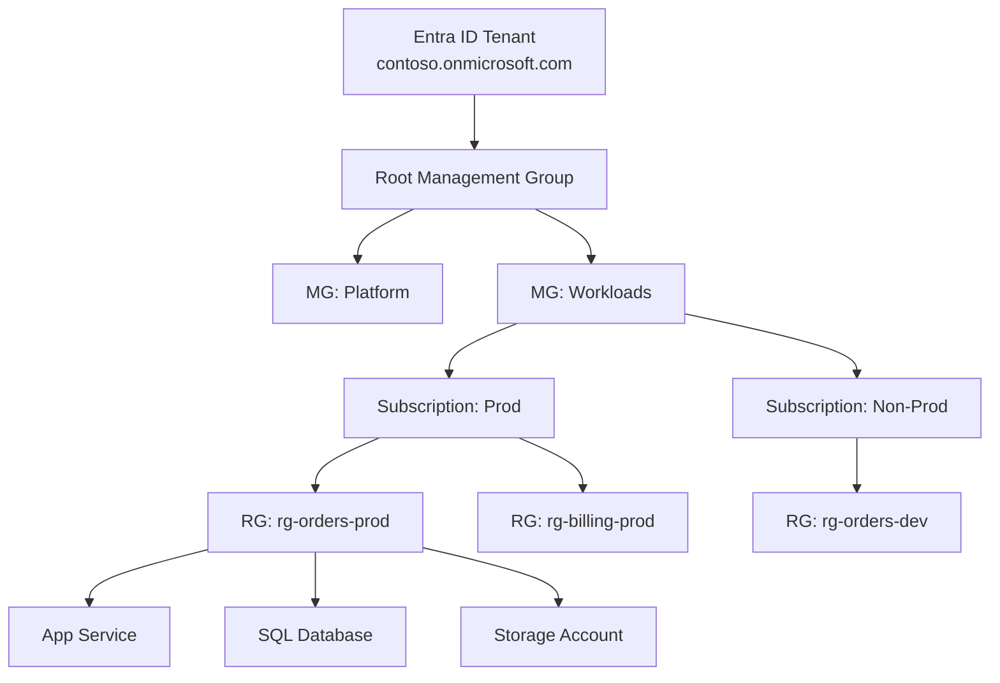

# Subscriptions, Resource Groups and Tags

> **One-liner**: Azure organizes everything in a four-level hierarchy — **Tenant → Management Group → Subscription → Resource Group → Resource** — and **tags** are the cross-cutting labels you put on resources for cost, ownership, and automation.

---

## Quick Reference

| Level | Purpose |
| ----- | ------- |
| **Tenant** | One Microsoft Entra ID directory; an org's identity boundary |
| **Management Group** | Optional grouping of subs for policy and access; nestable |
| **Subscription** | The billing boundary; also the unit of quota |
| **Resource Group** | Lifecycle container; resources born/die together |
| **Resource** | A concrete thing (VM, storage account, web app) |

| Tag | Example value | Use |
| --- | ------------- | --- |
| `env` | `dev` / `test` / `prod` | Cost split, automation gates |
| `owner` | `team-payments` | Who to call when it breaks |
| `costcenter` | `CC-1234` | Finance allocation |
| `app` | `orders-api` | Group by workload across RGs |
| `purpose` | `learning` / `production` | Pruning practice resources |
| `expires` | `2026-06-01` | Reaper script deletes after date |

---

## Core Concept

Every Azure resource lives at a specific **scope** in the hierarchy. Permissions, policies, and billing flow downward — assigning Reader at the subscription scope grants Reader on every RG and resource inside it.

**Subscriptions** are billing boundaries. A subscription gets one invoice. Splitting environments across subscriptions (`sub-dev`, `sub-prod`) is the cleanest way to isolate billing, quotas, and blast-radius.

**Resource groups** are *lifecycle* containers. Resources you create and delete together belong in one RG; deleting the RG deletes everything in it. A typical pattern: one RG per workload per environment (`rg-orders-prod`, `rg-orders-dev`).

**Tags** are flat key-value labels you apply to subscriptions, RGs, and resources. They don't affect Azure's behavior — *you* decide what they mean. The discipline matters: without tags, the monthly invoice for 200 resources looks like one big mystery. With tags, you can split it by `env`, `app`, and `costcenter` in cost analysis.

---

## Diagram



---

## Syntax & API

### Create the hierarchy and tag everything

```bash
# 1. Create a resource group with tags
az group create \
  --name rg-orders-prod \
  --location eastus \
  --tags env=prod owner=team-payments app=orders costcenter=CC-1234

# 2. Tag a single resource
az resource tag \
  --tags env=prod owner=team-payments app=orders \
  --resource-group rg-orders-prod \
  --name stordersprod001 \
  --resource-type Microsoft.Storage/storageAccounts

# 3. List resources by tag (across the subscription)
az resource list --tag env=prod -o table
az resource list --tag app=orders --query "[].{name:name, type:type}" -o table

# 4. Cost analysis by tag
az consumption usage list \
  --start-date 2026-05-01 --end-date 2026-05-31 \
  --query "[?contains(tags, 'env=prod')]" -o table
```

### Apply a tag to every resource in a group

```bash
RG=rg-orders-prod
for id in $(az resource list -g $RG --query "[].id" -o tsv); do
  az tag update --resource-id "$id" --operation merge --tags env=prod
done
```

### Subscription operations

```bash
az account list -o table
az account set --subscription "Pay-As-You-Go"

# Move a resource group to a different subscription
az resource move \
  --destination-subscription-id 11111111-1111-1111-1111-111111111111 \
  --ids "$(az group show --name rg-orders-prod --query id -o tsv)"
```

---

## Common Patterns

- **One RG per workload per environment.** `rg-<app>-<env>` is the universal naming convention. Resources that share an RG should share a lifecycle.
- **Subscription-per-environment** for non-trivial orgs: `sub-prod`, `sub-nonprod`, `sub-sandbox`. Quotas, RBAC, and policies are isolated.
- **Mandatory tags via Azure Policy.** Enforce `env`, `owner`, `costcenter` at deploy time so nothing gets through untagged.
- **Reaper tag**: `expires=2026-06-01` plus a scheduled Logic App or Function that deletes RGs past their date. Stops sandbox sprawl.
- **Tag inheritance**: tags at RG level don't auto-apply to children. Use Azure Policy's `Inherit a tag from the resource group` to fix that.

---

## Gotchas & Tips

- **Tags are not searchable by value alone** in Resource Graph unless you use `tostring(tags['key']) == 'value'`. The CLI `--tag key=value` works, just slowly on huge subscriptions.
- **Some resources don't support tags** (classic resources, a handful of legacy services). Don't rely on 100% coverage.
- **Tag limits**: 50 tags per resource, key ≤ 512 chars, value ≤ 256 chars. Don't try to stuff JSON into a tag.
- **Tags are visible to anyone with Reader.** Don't put secrets, customer names, or sensitive IDs in tags.
- **Moving resources between RGs is fine; moving between subscriptions is heavier** — some resources can't move (classic compute, ExpressRoute, some Cosmos accounts). Check `az resource invoke-action --action validateMoveResources` first.
- **Deleting an RG is irreversible** and cascades to every resource in it, including those with `delete protection`. Use **resource locks** (`CanNotDelete`, `ReadOnly`) on critical resources.
- **Management Groups need explicit access** — being subscription owner doesn't make you Management Group owner. Plan the hierarchy together with the Entra ID admin.

---

## See Also

- [[04 - Identity with Microsoft Entra ID]]
- [[09 - Cost Management]]
- [[09 - RBAC and Azure Policy]]
- [[02 - Landing Zones]]
