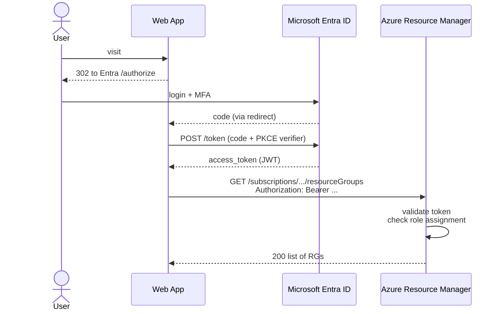

# Identity with Microsoft Entra ID

> **One-liner**: Microsoft Entra ID (formerly Azure AD) is the identity provider behind Azure — every user, group, application, and managed identity authenticates here, and every Azure resource authorizes via RBAC role assignments scoped to that identity.

---

## Quick Reference

| Concept | Meaning |
| ------- | ------- |
| **Tenant** | One Entra ID directory; an org boundary (one tenant per company) |
| **User** | Human identity; member or guest |
| **Group** | Container of users; assign roles to the group, not individuals |
| **Service Principal (SP)** | Identity for an application registered in Entra; has a secret/cert |
| **App Registration** | Definition of an app in your tenant; the SP is its instance |
| **Managed Identity (MI)** | Azure-managed SP attached to a resource; no secrets to handle |
| **Role Assignment** | Binding: identity + role + scope = permissions |
| **Built-in Role** | Microsoft-curated permission set (Reader, Contributor, Owner, ...) |
| **Custom Role** | Your own permission set when built-ins don't fit |

| Auth flow | Use for |
| --------- | ------- |
| **Authorization Code + PKCE** | Web apps and SPAs |
| **Client Credentials** | Service-to-service (backend daemon) |
| **Device Code** | CLIs, IoT, headless devices |
| **On-Behalf-Of** | API calling another API on the user's behalf |
| **Managed Identity** | Azure-hosted code calling other Azure services |

---

## Core Concept

Every API call to Azure Resource Manager carries a **bearer token** issued by Entra ID. The token says *who* the caller is; ARM then checks if that identity has a **role assignment** that grants the required action at the resource's **scope**.

Roles cascade down: a Contributor at the subscription scope is Contributor on every RG and resource inside it. Grants stack — if you're Reader on the subscription and Contributor on one RG, you're Contributor only in that RG.

**Service principals** let applications act as identities. An app registration creates the SP and gives it a client ID + secret (or certificate). The app trades those for tokens.

**Managed identities** are the better choice for code running *inside* Azure. Azure manages the credentials — your app just asks the local metadata service for a token. No secrets to rotate, store, or leak. See [[16 - Managed Identity]] for details.

For a deep treatment of OAuth/OIDC standards and how the protocol works with .NET + Keycloak, see [[OAuth OIDC SSO and Keycloak with .NET]].

---

## Diagram



---

## Syntax & API

### Create a service principal for CI/CD

```bash
# Modern: federated identity (OIDC). No client secret stored anywhere.
az ad sp create-for-rbac \
  --name "sp-github-deploy" \
  --role "Contributor" \
  --scopes "/subscriptions/$SUB_ID/resourceGroups/rg-orders-prod"

# Output includes appId, password (client secret), tenant. Save them in your secret store.
# Better: configure federated credentials for GitHub OIDC instead of a password — see CI-CD note.
```

### Inspect users and roles

```bash
az ad signed-in-user show                            # who am I
az ad user show --id alice@contoso.com               # find a user
az role assignment list --assignee alice@contoso.com -o table
az role assignment create \
  --assignee alice@contoso.com \
  --role "Reader" \
  --scope "/subscriptions/$SUB_ID/resourceGroups/rg-orders-prod"
```

### Built-in roles you'll use most

| Role | What it grants |
| ---- | -------------- |
| **Owner** | Full access including granting access to others |
| **Contributor** | Full access except RBAC management |
| **Reader** | List and read everything |
| **User Access Administrator** | Manage role assignments only |
| **Storage Blob Data Contributor** | Read/write blobs (data plane, not just management) |
| **Key Vault Secrets User** | Read secrets (data plane) |
| **AcrPull** | Pull images from ACR |

### .NET — acquire a token from MI

```csharp
using Azure.Identity;
using Azure.Storage.Blobs;

// In Azure: uses managed identity. Locally: falls back to az/VS/CLI/env.
var credential = new DefaultAzureCredential();
var client = new BlobServiceClient(new Uri("https://stmydata.blob.core.windows.net"), credential);
await foreach (var container in client.GetBlobContainersAsync()) {
    Console.WriteLine(container.Name);
}
```

`DefaultAzureCredential` is the right starting point — same code works in CI, on a dev laptop, and in Azure.

---

## Common Patterns

- **Assign roles to groups, not individuals.** Joining the group grants access; leaving revokes it. Auditing is one line per group, not one per person × resource.
- **Use the least scope that works.** RG > subscription. Resource > RG. Never grant subscription Contributor casually.
- **MI for in-Azure code; SP+secret only when MI isn't available** (cross-cloud, on-prem agents).
- **Federated identity credentials** for GitHub/Azure DevOps CI — no secrets in pipeline variables.
- **Conditional Access** policies (Entra ID P1+) enforce MFA, device compliance, IP ranges. Mandatory for production tenants.

---

## Gotchas & Tips

- **`Owner` includes `User Access Administrator`.** Granting Owner casually is how privilege escalation happens.
- **Role propagation isn't instant.** New assignments take 30–60 seconds to take effect; CI scripts that create + use a role in one second flake until you add a wait/retry.
- **The `--assignee` flag is finicky** — use `--assignee-object-id <oid> --assignee-principal-type ServicePrincipal` for SPs to avoid the planner trying to resolve as a user.
- **Secrets in app registrations expire** (default 2 years). Set up an alert; an expired secret = production outage at 2am.
- **The portal mixes "Azure AD" and "Microsoft Entra ID"** names depending on which blade you're in. They're the same thing.
- **Guest users count toward licensing** — B2B guests can rack up costs in P1/P2 tiers.
- **Don't put service principals in security groups for RBAC.** Use Azure-AD-roles or Entra ID groups specifically marked as "Azure resource role assignable".
- **`DefaultAzureCredential` tries 8+ sources** in order. If something works locally but not in Azure, log which credential succeeded with `AzureIdentityLogger`.

---

## See Also

- [[16 - Managed Identity]]
- [[09 - RBAC and Azure Policy]]
- [[15 - Key Vault]]
- [[OAuth OIDC SSO and Keycloak with .NET]]
