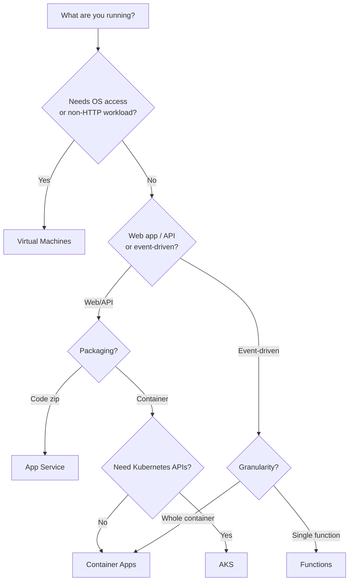

# Compute Options Overview

> **One-liner**: Azure offers five mainstream ways to run code — **VMs** (you manage the OS), **App Service** (managed web apps), **Functions** (serverless functions), **Container Apps** (managed containers + KEDA), and **AKS** (managed Kubernetes) — pick by control needed, packaging, and traffic shape.

---

## Quick Reference

| Service | What it runs | Scale model | Control level | Cold start |
| ------- | ------------ | ----------- | ------------- | ---------- |
| **Virtual Machines** | Anything (OS-level) | Manual + VMSS autoscale | Full | None (always on) |
| **App Service** | Web apps, APIs, containers | Plan-based + autoscale rules | Medium (no OS access) | Seconds (first request after idle) |
| **Azure Functions** | Functions per trigger | Per-request (Consumption) or pre-warmed (Premium) | Low | 100ms–5s on Consumption |
| **Container Apps** | Containerized microservices | KEDA event-driven, scale-to-zero | Medium | Seconds |
| **AKS** | Anything containerized | HPA + cluster autoscaler | High | None (pods always on) |

| Pricing model | Service |
| ------------- | ------- |
| Per-second VM uptime | VMs |
| Plan size × time | App Service, AKS nodes |
| Per execution + GB-s | Functions Consumption, ACA Consumption |
| Per replica × time | Functions Premium, ACA Dedicated |

---

## Core Concept

The decision goes downward through three filters:

1. **Do you need OS-level control or run something that isn't web?** → VMs.
2. **Is it a long-running web app or API?** → App Service is the lowest-friction; Container Apps if you want containers and microservice patterns; AKS if you need Kubernetes APIs.
3. **Is it triggered by events with bursty traffic?** → Functions (single-function granularity) or Container Apps with KEDA (whole-container granularity).

The further right you go on the managed-services spectrum, the less you operate and the more constraints you accept. App Service and Functions impose a runtime; Container Apps gives you a container but no kubectl; AKS gives you everything but you operate it.

**Cold start matters.** Functions on Consumption can wait 1–5s for the first request after idle. App Service "Always On" prevents this for plans ≥ Basic. ACA scale-to-zero has cold starts; min replicas = 1 avoids them.

---

## Diagram



---

## Syntax & API

### Quick smoke test of each

```bash
RG=rg-compute-demo
LOC=eastus
az group create -n $RG -l $LOC

# 1. App Service: managed web app
az appservice plan create -n plan-demo -g $RG --sku F1 --is-linux
az webapp create -n web-$RANDOM -g $RG --plan plan-demo --runtime "DOTNETCORE:8.0"

# 2. Functions: serverless
STORAGE=stfn$RANDOM$RANDOM
az storage account create -n $STORAGE -g $RG -l $LOC --sku Standard_LRS
az functionapp create -n fn-$RANDOM -g $RG \
  --consumption-plan-location $LOC \
  --runtime dotnet-isolated --functions-version 4 \
  --storage-account $STORAGE

# 3. Container Apps: managed containers
az extension add --name containerapp
az containerapp env create -n cae-demo -g $RG -l $LOC
az containerapp create -n app-hello -g $RG --environment cae-demo \
  --image mcr.microsoft.com/azuredocs/containerapps-helloworld:latest \
  --target-port 80 --ingress external --min-replicas 0 --max-replicas 3

# 4. AKS: full Kubernetes
az aks create -n aks-demo -g $RG --node-count 1 --enable-managed-identity --generate-ssh-keys
az aks get-credentials -n aks-demo -g $RG
kubectl get nodes

# Tear it all down
az group delete -n $RG --yes --no-wait
```

---

## Common Patterns

- **App Service for ASP.NET Core APIs** — by far the lowest-friction path. Deployment slots give you blue/green for free.
- **Functions for glue code** — process a queue message, transform a blob upload, run a daily cleanup. Don't build a whole SaaS on Functions; the cold start and 5-min execution cap bite back.
- **Container Apps for microservices** that need scale-to-zero (saves money) and Dapr/ KEDA features without managing Kubernetes.
- **AKS for teams that already speak Kubernetes** or need cluster-level features (sidecars, complex networking, GPU node pools).
- **VMs for ML training, legacy software, anything OS-specific** (Windows GPU drivers, a vendor that demands root).

---

## Gotchas & Tips

- **"Serverless" still has servers.** Consumption Functions get up to 5-minute execution and limited memory. Read the quota table before betting on it.
- **App Service Free (F1) and Shared (D1) are demo-only** — 60 CPU minutes/day, no SLA. Use Basic (B1) or higher for anything you'd show a stakeholder.
- **App Service vs Container Apps for one container**: App Service is simpler if you have *one* web container. ACA wins when you have several or want event-driven scaling.
- **AKS isn't a starter choice.** The operational overhead of running Kubernetes (cluster upgrades, node pool management, ingress controllers, identity wiring) is real.
- **VM costs accumulate even when "stopped"** — only "Stopped (deallocated)" stops compute charges. Use Auto-Shutdown to avoid bill shock on dev VMs.
- **Spot VMs are 70–90% cheaper** but can be evicted with 30s notice. Great for batch jobs, terrible for stateful services.
- **Cold start kills user-facing UX.** If your Functions backs a synchronous web request and traffic is spiky, switch to Premium plan with min instances = 1.
- **Region availability varies.** Container Apps and the newest Functions runtimes land in `East US`, `West Europe`, `Australia East` first.

---

## See Also

- [[01 - App Service Deep Dive]]
- [[02 - Azure Functions]]
- [[03 - Container Apps]]
- [[04 - AKS Basics]]
- [[05 - Microservices on Azure]]
