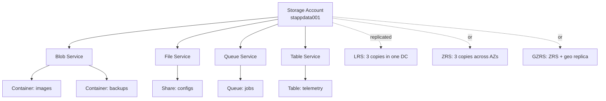

# Storage Basics

> **One-liner**: An **Azure Storage Account** is a container for four data services — **Blob** (objects/files), **File** (SMB/NFS shares), **Queue** (small messages), **Table** (key-value rows) — choose redundancy (LRS/ZRS/GRS) for durability and access tier (Hot/Cool/Cold/Archive) for cost.

---

## Quick Reference

| Service | What it stores | Access |
| ------- | -------------- | ------ |
| **Blob** | Files / objects (images, backups, logs, anything) | HTTPS, SDKs, Azure Storage Explorer |
| **File** | Network share | SMB 3, NFS 4.1, REST |
| **Queue** | Small messages (≤ 64 KB each) | REST, SDKs; cheap and simple |
| **Table** | Schemaless rows (NoSQL key-value) | REST, SDKs; superseded by Cosmos Table API |
| **Disk** (separate resource) | Managed disks for VMs | Attached to VMs |

| Redundancy | Copies | Survives |
| ---------- | ------ | -------- |
| **LRS** | 3 in one datacenter | Disk/rack failure |
| **ZRS** | 3 across AZs in one region | One datacenter loss |
| **GRS** | LRS + async copy to paired region | Regional disaster (read-only failover) |
| **GZRS** | ZRS + async copy to paired region | Best for most production blob workloads |
| **RA-GRS / RA-GZRS** | Same + read access to secondary anytime | Geo-redundant reads |

| Access tier (Blob) | Use for | Storage cost | Read cost |
| ------------------ | ------- | ------------ | --------- |
| **Hot** | Frequently accessed | High | Lowest |
| **Cool** | < monthly access, ≥ 30 days | Medium | Higher |
| **Cold** | < quarterly, ≥ 90 days | Lower | Higher still |
| **Archive** | Rare retrieval, hours of rehydration | Lowest | Highest + rehydration fee |

---

## Core Concept

A **Storage Account** is the unit of management, security, and billing. Inside one account you can mix all four services, but in practice most teams use it for one purpose — `stappdata*` for blobs, `stbackup*` for backups, etc.

Names are **globally unique**, lowercase, 3–24 chars (because they form a DNS name: `<name>.blob.core.windows.net`).

**Blob containers** organize blobs (like S3 buckets); **shares** organize files; **queues** and **tables** are top-level inside the account.

**Durability** is built-in: every write is at least 3 copies before acknowledged. The redundancy SKU controls where those copies go. **Tiers** shift cost between storage and access — pick based on access frequency, not just file age.

Access is via **shared keys**, **SAS tokens**, or — preferably — **Entra ID + Managed Identity**. Shared keys are powerful and hard to rotate; avoid them in modern designs.

---

## Diagram



---

## Syntax & API

### Create an account and a blob container

```bash
RG=rg-storage-demo
LOC=eastus
SA=stdemo$RANDOM$RANDOM
az group create -n $RG -l $LOC

az storage account create \
  --name $SA --resource-group $RG --location $LOC \
  --sku Standard_ZRS \
  --kind StorageV2 \
  --access-tier Hot \
  --allow-blob-public-access false \
  --min-tls-version TLS1_2

# Container under the blob service
az storage container create \
  --account-name $SA --name images --auth-mode login
```

### Upload, list, download a blob

```bash
echo "hello" > hello.txt
az storage blob upload \
  --account-name $SA -c images -f hello.txt -n hello.txt --auth-mode login

az storage blob list --account-name $SA -c images --auth-mode login -o table

az storage blob download \
  --account-name $SA -c images -n hello.txt -f out.txt --auth-mode login
```

### .NET — read with Managed Identity

```csharp
using Azure.Identity;
using Azure.Storage.Blobs;

var client = new BlobServiceClient(
    new Uri($"https://{accountName}.blob.core.windows.net"),
    new DefaultAzureCredential());

var container = client.GetBlobContainerClient("images");
var blob = container.GetBlobClient("hello.txt");
var content = await blob.DownloadContentAsync();
Console.WriteLine(content.Value.Content.ToString());
```

Assign the running identity the **Storage Blob Data Reader** (or Contributor) role at the account or container scope.

---

## Common Patterns

- **App-data pattern**: one account per app per environment with private containers and Entra-ID auth. No public access, no SAS keys.
- **Static website hosting**: enable on a Storage Account (`$web` container) for cheap static-site delivery; front with Azure Front Door for HTTPS + custom domain.
- **Backups**: `Cool` or `Cold` tier + lifecycle rule to archive after 90 days.
- **Diagnostic logs sink**: cheap append-only blob storage for archived telemetry; query with Log Analytics or Azure Data Explorer when needed.
- **Queue Storage** is the cheapest queue you can buy ($0.06/M operations). Use it for simple at-least-once tasks; reach for Service Bus when you need ordering, sessions, or DLQs.

---

## Gotchas & Tips

- **Public access is off by default** (since 2023), and that's correct. Enabling it without thought is how blob URLs leak onto pastebins.
- **Shared keys are the master key** — they bypass every RBAC role on the account. Disable them (`--allow-shared-key-access false`) and use Entra ID auth.
- **`StorageV1` accounts still exist** and lack tiering/hierarchy. Always create `StorageV2`.
- **Account name = DNS name.** Once taken globally, it's gone. Naming convention: `st<purpose><env><nnn>`, e.g., `stappdataprod001`.
- **Archive tier rehydration takes hours** and costs money per GB. Only archive things you're truly unlikely to need.
- **Cool tier has a 30-day early-deletion fee** prorated; toggling tiers nightly can cost more than staying Hot.
- **Lifecycle rules run within ~48 hours**, not instantly. Don't rely on "today this gets cooled" for compliance windows.
- **Soft delete** (containers + blobs) is essential — turn it on at creation time; default retention 7 days is the cheapest insurance against accidental delete.
- **Premium block-blob accounts** are sub-millisecond P99 reads but pricey; use only for chat-app-style workloads.

---

## See Also

- [[06 - Blob Storage Advanced]]
- [[12 - Private Endpoints and Zero Trust]]
- [[15 - Key Vault]]
- [[14 - Disaster Recovery]]
