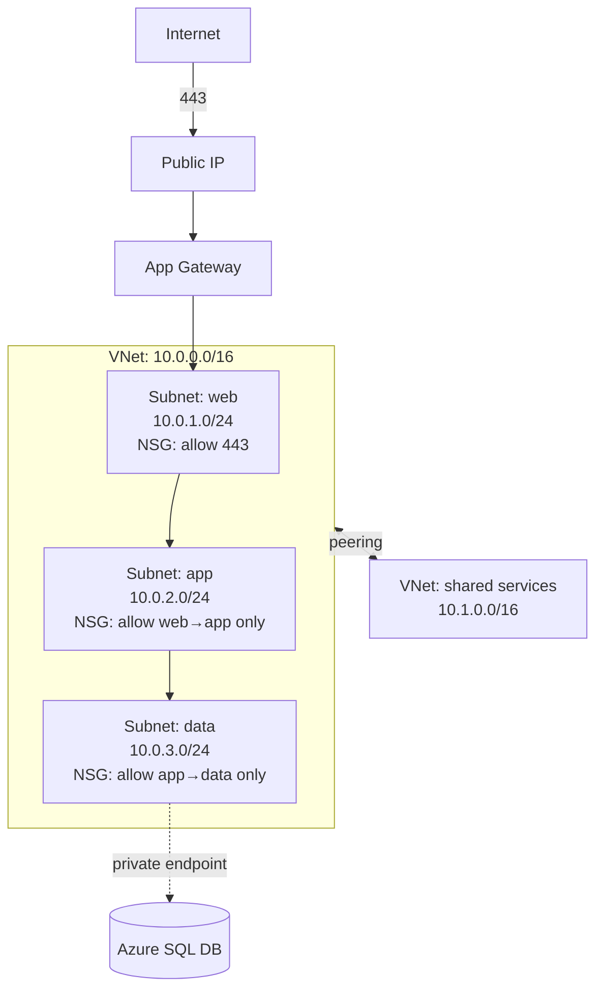

# Networking Basics

> **One-liner**: A **Virtual Network (VNet)** is a private IP space you carve into **subnets**; you control traffic with **Network Security Groups (NSGs)** and expose resources via **Public IPs**, **Application Gateway**, **Load Balancer**, or **Front Door**.

---

## Quick Reference

| Concept | What it is |
| ------- | ---------- |
| **VNet** | Logical isolation network; address space (CIDR) like 10.0.0.0/16 |
| **Subnet** | A slice of the VNet (10.0.1.0/24); resources land here |
| **NSG** | Stateful packet filter; allow/deny rules by source/dest/port/proto |
| **ASG** | Application Security Group — name tag for sets of NICs (use in NSG rules) |
| **Public IP** | Internet-routable IP attached to a VM, LB, AGW, or NAT Gateway |
| **Private IP** | Internal IP within the VNet |
| **Peering** | Direct private link between two VNets (same/different region) |
| **VNet Gateway** | VPN or ExpressRoute connectivity to on-prem |
| **NAT Gateway** | Outbound-only internet for resources without public IPs |
| **Private Endpoint** | NIC inside your VNet that maps to a PaaS service (no public IP) |
| **Service Endpoint** | Optimized route from a subnet to specific PaaS services |

---

## Core Concept

A VNet is the network boundary. Resources placed in the same VNet (across subnets) talk to each other privately over Azure's backbone — no internet, no extra cost. Cross-VNet traffic requires **peering**. Cross-region traffic costs egress (~$0.02/GB intra-continent).

**Subnets** segment the VNet. You typically have one subnet per tier (web, app, data) and apply different NSGs to each. Some Azure services (AKS, App Service VNet integration, Application Gateway) demand their own dedicated subnets.

**NSGs** are layered packet filters. Rules have priority (lower wins), source/dest IP or service tag, port range, protocol, and allow/deny. NSGs apply to **subnets** and/or **NICs**. The implicit final rule denies everything not explicitly allowed.

**Service tags** are Microsoft-maintained labels for service IP ranges (`Storage`, `Sql`, `AzureMonitor`). Use them in NSG rules instead of hardcoding IPs.

**Public IP + DNS**: an Azure Public IP can be static or dynamic, with an optional FQDN like `myapp.eastus.cloudapp.azure.com`. For real domains, point your DNS at the public IP or front-door endpoint.

---

## Diagram



---

## Syntax & API

### Build a small three-tier network

```bash
RG=rg-net-demo
LOC=eastus
az group create -n $RG -l $LOC

# 1. VNet + subnets
az network vnet create -g $RG -n vnet-app \
  --address-prefix 10.0.0.0/16 \
  --subnet-name snet-web --subnet-prefix 10.0.1.0/24

az network vnet subnet create -g $RG --vnet-name vnet-app \
  -n snet-app --address-prefix 10.0.2.0/24

az network vnet subnet create -g $RG --vnet-name vnet-app \
  -n snet-data --address-prefix 10.0.3.0/24

# 2. NSG: web allows HTTPS from internet
az network nsg create -g $RG -n nsg-web
az network nsg rule create -g $RG --nsg-name nsg-web -n allow-https \
  --priority 100 --source-address-prefixes Internet \
  --destination-port-ranges 443 --access Allow --protocol Tcp
az network vnet subnet update -g $RG --vnet-name vnet-app -n snet-web --nsg nsg-web

# 3. NSG: app accepts only from web subnet
az network nsg create -g $RG -n nsg-app
az network nsg rule create -g $RG --nsg-name nsg-app -n allow-from-web \
  --priority 100 --source-address-prefixes 10.0.1.0/24 \
  --destination-port-ranges 8080 --access Allow --protocol Tcp
az network vnet subnet update -g $RG --vnet-name vnet-app -n snet-app --nsg nsg-app
```

### Inspect effective rules on a NIC

```bash
az network nic list-effective-nsg --resource-group $RG --name <nic-name>
```

### Peer two VNets

```bash
az network vnet peering create \
  -g $RG -n vnet-app-to-shared --vnet-name vnet-app \
  --remote-vnet "$(az network vnet show -g $RG -n vnet-shared --query id -o tsv)" \
  --allow-vnet-access
# Then create the mirror peering in the other direction
```

---

## Common Patterns

- **Three-tier app**: separate subnets for `web`, `app`, `data`. NSGs only allow each tier to talk to the next. Public IP only on the web tier (or, better, only on a Front Door / App Gateway in front of it).
- **Hub-spoke topology**: one "hub" VNet with shared services (firewall, DNS, ExpressRoute gateway) peered to many "spoke" VNets per workload. See [[11 - Hub and Spoke Networking]].
- **Private PaaS**: instead of giving Azure SQL or Storage a public endpoint, attach a **private endpoint** in a `snet-pe` subnet — the DB now has a 10.x address in your VNet.
- **Egress through NAT Gateway**: VMs without public IPs go out via NAT Gateway with a stable public IP, satisfying allowlists at third-party APIs.

---

## Gotchas & Tips

- **CIDR planning is irreversible.** You can extend a VNet but not shrink it without recreating. Plan address spaces with a registry so peered VNets don't overlap.
- **Subnet sizing is tricky** — Azure reserves 5 IPs per subnet (first 4 + last 1). A `/29` subnet gives you 3 usable addresses, not 8.
- **NSGs are stateful** for TCP and UDP — you don't need to add a return-traffic rule. ICMP isn't stateful; use `--protocol *` if you need it.
- **Default NSG rules** allow VNet-internal traffic and outbound to internet. You often *want* to delete or override these for true isolation.
- **App Service VNet integration is outbound only** by default — it lets your web app reach into the VNet, not the other way around. Use Private Endpoint for inbound.
- **AKS needs a dedicated subnet** sized for max pods × max nodes (Azure CNI). Plan `/22` or larger.
- **DNS resolution across peerings doesn't follow automatically.** Use Azure Private DNS Zones linked to all involved VNets, or a custom DNS forwarder in the hub.
- **Service tags update independently** of your code — `Storage` may add new IP ranges in a future region; you don't have to update rules.

---

## See Also

- [[17 - VNet and Subnets]]
- [[11 - Hub and Spoke Networking]]
- [[12 - Private Endpoints and Zero Trust]]
- [[18 - Application Gateway and Load Balancer]]
