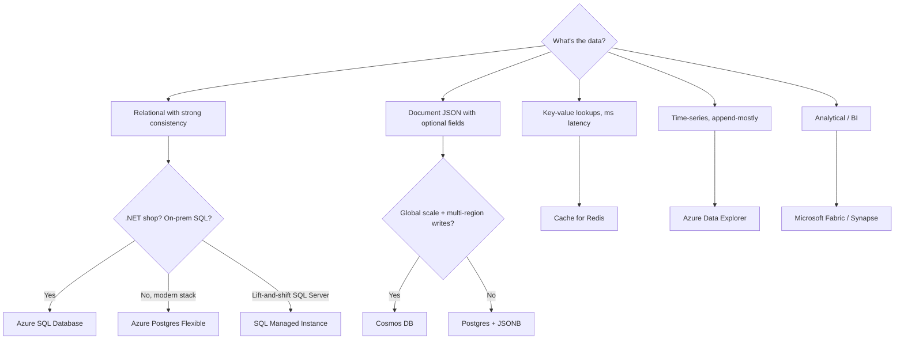

# Database Options

> **One-liner**: Azure's managed databases break into **relational** (Azure SQL DB, Postgres/MySQL Flexible Server), **NoSQL document** (Cosmos DB), **caches** (Redis), **analytics** (Synapse, Fabric), and **specialty** (Storage Tables, Time-series, Vector) — pick by data model, consistency needs, and scale shape.

---

## Quick Reference

| Service | Type | Best for |
| ------- | ---- | -------- |
| **Azure SQL Database** | Relational (T-SQL) | Most line-of-business apps; .NET shops; familiar |
| **Azure Database for PostgreSQL Flexible** | Relational (Postgres) | Greenfield; modern features (JSONB, FTS, extensions) |
| **Azure Database for MySQL Flexible** | Relational (MySQL) | Existing MySQL workloads, WordPress, Magento |
| **Azure Cosmos DB** | Multi-model NoSQL | Global scale, single-digit-ms reads, multi-region writes |
| **Azure Cache for Redis** | Key-value cache | Session store, rate limiter, hot-data cache |
| **Azure Storage Tables** | Wide-column NoSQL | Cheap key-value at scale; legacy |
| **Azure Database for MariaDB** | Relational | Mostly retired; new workloads pick MySQL |
| **Azure SQL Managed Instance** | SQL Server compatible | Lift-and-shift from on-prem SQL Server |
| **SQL Server on VM** | IaaS | Full SQL Server features (SSAS, CLR, custom replication) |
| **Azure Synapse / Fabric** | Data warehouse / lakehouse | OLAP, BI, ML training |
| **Azure Data Explorer (Kusto)** | Time-series / telemetry | Log analytics, IoT, observability |

| Consistency knob | Where it lives |
| ---------------- | -------------- |
| SQL isolation level | Azure SQL: Read Committed Snapshot default |
| Postgres isolation level | Read Committed default |
| Cosmos consistency levels | Strong / Bounded Staleness / Session / Consistent Prefix / Eventual |

---

## Core Concept

The first question is **what's the data shape**: highly relational with strong consistency? Document with flexible schema? Wide rollups over events? Choose the data model first, the SKU second.

The second question is **what's the scale shape**: single-region OLTP? Global low-latency reads? Massive append-only event stream? This determines whether you stay on SQL/Postgres or reach for Cosmos / Event-store-shaped services.

For most .NET LOB apps, the right answer is **Azure SQL Database** — it's a fully managed SQL Server, integrates beautifully with EF Core, has serverless, Hyperscale, geo-replication, and elastic pools.

For greenfield where you don't have a SQL Server allegiance, **Azure Database for PostgreSQL Flexible Server** is often a better technical fit: JSONB, full-text search, vector (pgvector), extensions, lower license cost.

**Cosmos DB** is unique — globally distributed, multi-write, single-digit-ms latencies. It earns its keep on truly global apps, IoT telemetry, or extreme write throughput. Don't pick it because "NoSQL is cool"; the RU-based pricing model bites if you misunderstand it.

---

## Diagram



---

## Syntax & API

### Provision a tiny Azure SQL DB

```bash
RG=rg-db-demo
LOC=eastus
SERVER=sql-demo-$RANDOM
ADMIN=sqladmin
PASS='P@ssw0rd-Demo-Long!'

az group create -n $RG -l $LOC
az sql server create -n $SERVER -g $RG -l $LOC \
  --admin-user $ADMIN --admin-password "$PASS"
az sql db create -n appdb -g $RG --server $SERVER \
  --service-objective S0 --backup-storage-redundancy Local

# Allow your IP for a quick test
MYIP=$(curl -s ifconfig.io)
az sql server firewall-rule create -g $RG --server $SERVER \
  -n MyIP --start-ip-address $MYIP --end-ip-address $MYIP

az sql db show-connection-string -s $SERVER -n appdb -c ado.net
```

### Provision a tiny Postgres Flexible Server

```bash
PG=pg-demo-$RANDOM
az postgres flexible-server create \
  -g $RG -n $PG -l $LOC \
  --tier Burstable --sku-name Standard_B1ms \
  --storage-size 32 --version 16 \
  --admin-user pgadmin --admin-password "$PASS" \
  --public-access $MYIP --yes
```

### .NET — connect with managed identity (passwordless)

```csharp
// Azure SQL DB with Entra auth
using Microsoft.Data.SqlClient;
using Azure.Identity;

var conn = new SqlConnection("Server=tcp:sql-demo.database.windows.net;Database=appdb;Encrypt=true;");
var token = await new DefaultAzureCredential()
    .GetTokenAsync(new(new[] { "https://database.windows.net/.default" }));
conn.AccessToken = token.Token;
await conn.OpenAsync();
```

Assign the identity an **Entra ID** user inside the SQL DB and grant `db_datareader`/`db_datawriter`.

---

## Common Patterns

- **OLTP app**: Azure SQL DB (Standard or vCore) + Application Insights + Azure Cache for Redis for hot data + Storage for blobs.
- **Multi-region read scale**: SQL DB with **geo-replicas** for read-only queries; failover groups for writeable secondary.
- **Global low-latency**: Cosmos DB with multiple write regions, session consistency, partition by tenant.
- **Burst workload**: SQL DB **serverless** tier — auto-pauses when idle, billed per second.
- **Reporting database**: separate read-replica or copy data to **Microsoft Fabric** for analytics.

---

## Gotchas & Tips

- **DTU vs vCore for Azure SQL**: vCore is the modern model — gives Reserved Instance pricing, Hybrid Benefit, scales independently of storage. DTU is fine for tiny apps but you'll outgrow it.
- **Hyperscale for big SQL DBs** (>1 TB): near-instant scale-out reads, fast geo-restore. No down-tier path back to General Purpose.
- **Postgres Flexible Server replaced Single Server** — Single Server is in retirement. Always pick Flexible for new work.
- **Cosmos DB pricing is RU-based.** A `SELECT *` over a partition can cost 100 RUs; the same on millions of partitions can melt your budget. Always profile.
- **Cosmos DB consistency is per request** — strong reads cost ~2× session reads. Default to Session; opt up only where business needs it.
- **Public access by default** for Postgres/SQL Flexible is *off* in the latest portal flows. Always create with `--public-access None` and use private endpoints for production.
- **Backups happen automatically** (7–35 days retention default). For longer retention or cross-region restore, configure Long-Term Retention.
- **Don't run SQL Server on a VM** unless you specifically need features Managed Instance lacks (custom CLR, third-party agents). You're taking on patching, backups, and HA yourself.
- **Reservations on databases save 30–55%** but are committed for 1–3 years. Right-size the SKU first, then reserve.

---

## See Also

- [[07 - Azure SQL Database]]
- [[08 - Cosmos DB]]
- [[09 - Azure Postgres Flexible Server]]
- [[10 - Azure Cache for Redis]]
