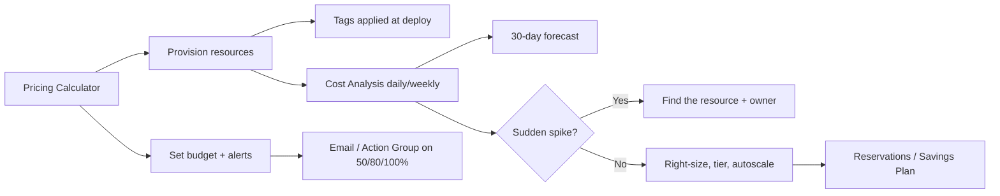

# Cost Management

> **One-liner**: Azure bills per resource per second/hour; **plan with the pricing calculator**, **track with Cost Analysis**, **alert with Budgets**, and **save with Reservations / Savings Plans / Spot / Hybrid Benefit** once you understand baseline usage.

---

## Quick Reference

| Tool | What it does |
| ---- | ------------ |
| **Pricing Calculator** (azure.com/pricing/calculator) | Pre-deployment estimate |
| **Cost Analysis** (portal) | Post-deployment actuals + forecast |
| **Budgets** | Threshold alerts via email/action group |
| **Cost Recommendations** | Azure Advisor surfaces savings |
| **Reservations** | Commit 1 or 3 years for ~30–50% off compute/DB |
| **Savings Plans** | Hourly commitment, flexible across regions/services |
| **Spot VMs** | Up to 90% off, evictable with 30s notice |
| **Hybrid Benefit** | Use on-prem Windows/SQL licenses on Azure |
| **Dev/Test pricing** | 30–50% off for non-prod subs |
| **Free tier** | 12-month services + always-free quotas |

| Cost lever | Typical saving |
| ---------- | -------------- |
| Right-size VMs (B-series, smaller SKUs) | 20–60% |
| Reservation (3-year, all-upfront) | 50–55% |
| Savings Plan (3-year) | 30–40% |
| Spot for batch workloads | 70–90% |
| Hybrid Benefit (SQL + Windows) | ~40% |
| Auto-shutdown of dev VMs | Up to 70% on dev |
| Move logs from premium to Cool blob | 60–90% on storage |

---

## Core Concept

Azure costs are the sum of **compute hours**, **storage GB-months**, **network egress GB**, **per-operation fees** (storage transactions, Cosmos RU/s), and **license** (Windows, SQL).

The cost lifecycle:

1. **Estimate before deploying** — pricing calculator + rough load projection.
2. **Watch actuals** — Cost Analysis daily for the first week of any new workload.
3. **Set budgets and alerts** — never let an unattended sub silently 10× its bill.
4. **Optimize** — right-size, autoscale, tier, reserve. In that order: optimization before commitment.
5. **Govern** — tags, policies, FinOps practices at scale (see [[16 - Cost Optimization at Scale]]).

The single most useful habit: **tag every resource with `costcenter`, `env`, `owner`** so Cost Analysis can break the bill down by anything meaningful.

---

## Diagram



---

## Syntax & API

### Set a monthly budget on a resource group

```bash
RG=rg-orders-prod
SUB_ID=$(az account show --query id -o tsv)

az consumption budget create \
  --budget-name budget-orders-prod \
  --resource-group-name $RG \
  --amount 500 \
  --time-grain Monthly \
  --start-date 2026-05-01 \
  --end-date  2027-05-01 \
  --category cost \
  --notification "{ \"actual_50\": { \"enabled\": true, \"operator\": \"GreaterThan\", \"threshold\": 50, \"contactEmails\": [\"tuanloc2352000@gmail.com\"] } }"
```

### Query last 30 days by service

```bash
az consumption usage list \
  --start-date $(date -d '-30 days' +%F) --end-date $(date +%F) \
  --query "[].{name:meterDetails.meterName, cost:pretaxCost}" \
  -o table
```

### Stop a VM correctly

```bash
# This still bills compute (just stopped):
az vm stop -g $RG -n vm-demo

# This stops billing for compute (deallocated):
az vm deallocate -g $RG -n vm-demo
```

### Auto-shutdown a dev VM at 7pm

```bash
az vm auto-shutdown -g $RG -n vm-dev \
  --time 1900 --email tuanloc2352000@gmail.com
```

---

## Common Patterns

- **Set a budget on day one** of every subscription. Default to a number 2× your honest estimate; you'll be alerted long before disaster.
- **Tag mandatory at deploy.** Use Azure Policy `Require a tag and its value` to refuse untagged resources.
- **Dev/test pricing** — flag the subscription as Dev/Test (requires Visual Studio subscription or EA enrollment) for ~50% off on many services.
- **Schedule dev environments off-hours.** Auto-shutdown VMs, scale App Service plans to F1, pause Azure SQL serverless.
- **Use Spot for batch jobs**, ML training, video transcoding — workloads that tolerate eviction.
- **Reservations for steady-state production** workloads after 30 days of stable usage data. Don't reserve speculatively.

---

## Gotchas & Tips

- **Egress is the silent killer.** Cross-region traffic, Cosmos multi-region writes, AKS-to-PaaS-via-public-IP — all bill per GB. Keep workloads in one region when possible.
- **Storage egress to internet costs more than intra-Azure.** Front Door / CDN can help for static assets.
- **Reserved Instances are use-them-or-lose-them.** A 3-year RI for a VM you turn off in month 4 is dead money. Start with 1-year if you're unsure.
- **App Service Plan billing is per plan, not per app.** Many apps on one Standard plan is *cheaper* than each on Basic — counterintuitive but true.
- **AKS cluster control plane is free; nodes are not.** Stop the cluster (`az aks stop`) on dev clusters overnight.
- **Cosmos RU/s is provisioned by default** — even idle, you pay. Use **autoscale** or **serverless** for spiky workloads.
- **Cost data lags 8–24 hours.** A spike at 9am won't show up in Cost Analysis until next morning. Set alerts; don't rely on the dashboard for real-time.
- **Free tier creates "always-on" expectations** that don't survive scaling. F1 App Service has 60 minutes CPU/day; the first 100 users on Friday afternoon eat it.
- **The bill is per *enrollment*, not per sub** for EA customers. A rogue sub in your tenant is still your problem.

---

## See Also

- [[03 - Subscriptions Resource Groups and Tags]]
- [[16 - Cost Optimization at Scale]]
- [[09 - RBAC and Azure Policy]]
