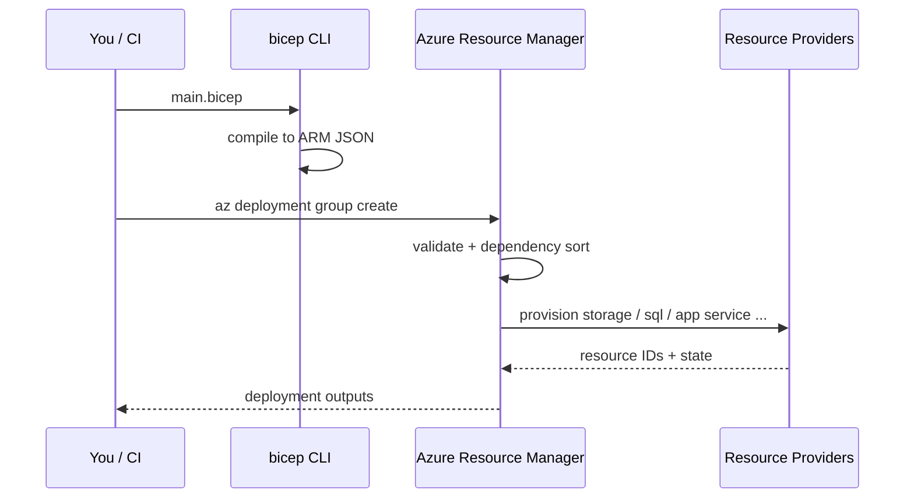

# IaC with ARM and Bicep

> **One-liner**: **Bicep** is a domain-specific language that compiles to **ARM JSON** — the format every Azure deployment ultimately uses. Write Bicep for new code; treat ARM JSON like assembly output you rarely hand-write.

---

## Quick Reference

| Tool | When |
| ---- | ---- |
| **Bicep** | Default for new Azure IaC |
| **ARM JSON** | Generated output; legacy templates |
| **Terraform** | Multi-cloud; well-known to ops teams |
| **Pulumi** | When you want IaC in TypeScript/C#/Python |
| **CLI/Portal** | One-off experiments only — not for production |

| Bicep concept | Purpose |
| ------------- | ------- |
| `resource` | Declares an Azure resource |
| `param` | Input variable |
| `var` | Local variable / expression |
| `output` | Value exposed to caller |
| `module` | Reusable Bicep file with its own params/outputs |
| `existing` | Reference a resource that already exists |
| `targetScope` | `resourceGroup` (default), `subscription`, `managementGroup`, `tenant` |
| `@description` / `@allowed` / `@minLength` | Param decorators |

| Deployment scope | Use |
| ---------------- | --- |
| `resourceGroup` | Most resources |
| `subscription` | RGs, policy, role assignments |
| `managementGroup` | MG-wide policy |
| `tenant` | Top-level org assets |

---

## Core Concept

Infrastructure as Code makes your environments **reproducible**, **reviewable**, and **diffable**. Instead of clicking through the portal (and forgetting what you did), you declare the desired state in a file and apply it.

ARM (Azure Resource Manager) is the single API that provisions everything. Templates are JSON documents ARM consumes. They're verbose, nested, and painful to write by hand.

**Bicep** is the DSL Microsoft built on top: same semantics, dramatically cleaner syntax, with `bicep build` compiling to ARM JSON. The tool is `bicep`; modern `az deployment` accepts `.bicep` directly (it compiles transparently).

Two superpowers of Bicep over hand-written ARM:

1. **Automatic dependencies** — Bicep infers `dependsOn` from references; no more JSON dependency graphs by hand.
2. **What-if analysis** — `az deployment ... --what-if` previews exactly what will change, like `terraform plan`.

---

## Diagram



---

## Syntax & API

### A minimal Bicep file

```bicep
@description('Region for all resources')
param location string = resourceGroup().location

@description('Storage account name prefix')
@minLength(3)
@maxLength(11)
param namePrefix string = 'stdemo'

var storageName = toLower('${namePrefix}${uniqueString(resourceGroup().id)}')

resource storage 'Microsoft.Storage/storageAccounts@2023-05-01' = {
  name: storageName
  location: location
  sku: { name: 'Standard_ZRS' }
  kind: 'StorageV2'
  properties: {
    accessTier: 'Hot'
    allowBlobPublicAccess: false
    minimumTlsVersion: 'TLS1_2'
    supportsHttpsTrafficOnly: true
  }
}

output storageId string = storage.id
output blobEndpoint string = storage.properties.primaryEndpoints.blob
```

### Deploy it

```bash
az group create -n rg-iac-demo -l eastus

# Preview changes (no deploy)
az deployment group what-if \
  -g rg-iac-demo --template-file main.bicep --parameters namePrefix=stdemo

# Apply
az deployment group create \
  -g rg-iac-demo --template-file main.bicep --parameters namePrefix=stdemo
```

### Compile to ARM JSON manually (rarely needed)

```bash
bicep build main.bicep            # writes main.json
bicep decompile main.json         # reverse: ARM → Bicep (best-effort)
```

### Modules — reuse across deployments

```bicep
// main.bicep
module web 'modules/web.bicep' = {
  name: 'web-deploy'
  params: {
    location: location
    appName: 'web-${uniqueString(resourceGroup().id)}'
  }
}

// modules/web.bicep
param location string
param appName string

resource plan 'Microsoft.Web/serverfarms@2023-12-01' = {
  name: 'plan-${appName}'
  location: location
  sku: { name: 'B1', tier: 'Basic' }
  properties: { reserved: true }
}

resource app 'Microsoft.Web/sites@2023-12-01' = {
  name: appName
  location: location
  properties: {
    serverFarmId: plan.id
    siteConfig: {
      linuxFxVersion: 'DOTNETCORE|8.0'
    }
  }
}

output url string = 'https://${app.properties.defaultHostName}'
```

---

## Common Patterns

- **One `main.bicep` per environment**, parameter files per stage (`main.dev.bicepparam`, `main.prod.bicepparam`).
- **Modules in a `modules/` folder** for reusable pieces (app-with-plan, storage-with-private-endpoint, sql-server-with-fw-rules).
- **Use `uniqueString(resourceGroup().id)`** to generate stable but globally-unique names.
- **Output IDs and connection strings** that downstream stages need; consume them in subsequent deployments or pipeline tasks.
- **Bicep Registry** (`br:` schemes) hosts shared modules in an Azure Container Registry — great for org-wide standards.

---

## Gotchas & Tips

- **Bicep is declarative, not imperative.** You can't loop conditionally with side effects; use `for` over arrays or `if` on a single resource.
- **API versions matter.** `@2023-05-01` vs `@2024-01-01` may change schemas. Pin and review when bumping.
- **Tag everywhere** with `tags: { env: 'prod', owner: 'team' }` — also use a single Bicep var so tags are consistent.
- **What-if isn't perfect.** It can over-report on some properties; treat green-as-no-change as "almost certainly no change" but read the diff.
- **Don't mix portal edits with IaC.** Out-of-band changes drift; next `what-if` will want to undo them.
- **Avoid scripts in Bicep for app deploy.** Use Bicep to provision infrastructure; deploy code via App Service deployment slots / Container Apps revisions / GitHub Actions.
- **Module hash names** — Bicep names modules with a deterministic hash; explicit `name:` helps when reading deployment logs.
- **Subscription-scope templates** require `targetScope = 'subscription'` and don't have `resourceGroup()` available.
- **Parameter files** use a different `.bicepparam` syntax than the old ARM JSON `*.parameters.json` — parameter files are typed and validated.

---

## See Also

- [[20 - Bicep Modules]]
- [[15 - CI-CD on Azure]]
- [[02 - Landing Zones]]
