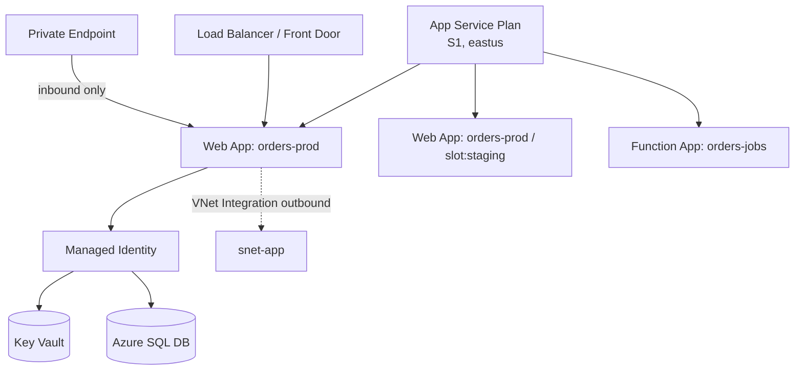

# App Service Deep Dive

> **One-liner**: **Azure App Service** is the lowest-friction way to run ASP.NET Core (and Node, Python, Java, PHP, containers) on Azure — a managed App Service Plan provides compute, you publish code or images, and the platform handles TLS, scaling, slots, and identity.

---

## Quick Reference

| Concept | Meaning |
| ------- | ------- |
| **App Service Plan** | Compute (VMs); has SKU + region; many apps can share one plan |
| **Web App / Function App / Logic App** | Workloads hosted on the plan |
| **Deployment Slot** | Side-by-side environment (staging, canary); swap is near-instant |
| **Custom Domain + TLS** | Bring your domain; App Service Managed Certificate is free |
| **VNet Integration** | Outbound traffic into a VNet via a delegated subnet |
| **Private Endpoint** | Inbound traffic only from a VNet |
| **Hybrid Connections** | TCP relay to on-prem services |
| **Auto Heal** | Self-restart on memory/HTTP-error thresholds |

| SKU tier | Highlights |
| -------- | ---------- |
| **F1 (Free)**, **D1 (Shared)** | Demo only; 60 CPU min/day |
| **B1/B2/B3** Basic | Cheap "always on" for dev/test |
| **S1/S2/S3** Standard | Production; slots, autoscale, custom domains |
| **P1v3/P2v3/P3v3** Premium v3 | Better CPU, more memory, zone redundancy |
| **I1v2/I2v2/I3v2** Isolated v2 | App Service Environment (ASE) — dedicated single-tenant |

---

## Core Concept

An **App Service Plan** is a set of VMs you pay for hourly. **Apps** run on those VMs; multiple apps can share the same plan (cheaper) or get their own (isolated).

When you deploy, App Service builds a container or uses a buildpack to run your code. For .NET, it just looks at `Microsoft.NET.Sdk.Web` projects and chooses a runtime; you can also push your own container with `--deployment-container-image-name`.

**Deployment slots** are full copies of the app on the same plan — including settings (slot-specific or shared). The typical flow: deploy to `staging` slot → warm it up → swap with `production`. The swap exchanges DNS records, so the swap is near-instant for clients.

**Identity** comes from **Managed Identity** turned on per app; secrets from **Key Vault references** in app settings. No connection strings in code, no `.env` files in production.

---

## Diagram



---

## Syntax & API

### Create plan, app, deploy a .NET app

```bash
RG=rg-app-prod
LOC=eastus
PLAN=plan-app-prod
APP=app-orders-$RANDOM

az group create -n $RG -l $LOC
az appservice plan create -n $PLAN -g $RG --sku S1 --is-linux
az webapp create -n $APP -g $RG --plan $PLAN --runtime "DOTNETCORE:8.0"

# Build & deploy from source
az webapp deploy -g $RG -n $APP --src-path ./publish.zip --type zip

# Health check + auto heal
az webapp config set -g $RG -n $APP \
  --health-check-path /health \
  --always-on true \
  --http20-enabled true \
  --min-tls-version 1.2
```

### Slots — staging + swap

```bash
az webapp deployment slot create -g $RG -n $APP --slot staging
az webapp deploy -g $RG -n $APP --slot staging --src-path ./publish.zip --type zip
az webapp deployment slot swap -g $RG -n $APP --slot staging --target-slot production
```

### Settings + Key Vault references

```bash
# Identity + Key Vault access
az webapp identity assign -g $RG -n $APP
PRINCIPAL=$(az webapp identity show -g $RG -n $APP --query principalId -o tsv)
az role assignment create --assignee $PRINCIPAL \
  --role "Key Vault Secrets User" \
  --scope $(az keyvault show -g $RG -n kv-app-prod --query id -o tsv)

# App setting points at Key Vault
az webapp config appsettings set -g $RG -n $APP --settings \
  "ConnectionStrings__Default=@Microsoft.KeyVault(VaultName=kv-app-prod;SecretName=SqlConn)"
```

### Autoscale rule (CPU-based)

```bash
az monitor autoscale create -g $RG --resource $PLAN --resource-type Microsoft.Web/serverfarms \
  --name autoscale-app --min-count 2 --max-count 10 --count 2

az monitor autoscale rule create -g $RG --autoscale-name autoscale-app \
  --condition "Percentage CPU > 70 avg 5m" --scale out 1

az monitor autoscale rule create -g $RG --autoscale-name autoscale-app \
  --condition "Percentage CPU < 30 avg 10m" --scale in 1
```

---

## Common Patterns

- **Single plan, many apps** — cheap if traffic isn't correlated. CPU starvation is the risk; monitor and split when one app gets noisy.
- **Three slots: production, staging, canary** — canary takes ~5% of traffic via Traffic Routing.
- **Slot-specific app settings** for connection strings (`Slot setting` checkbox). After swap, slot keeps its own value.
- **Slot warm-up** with `WEBSITE_SWAP_WARMUP_PING_PATH` so the swap waits until your `/health` returns 200.
- **Diagnostic logs to App Insights** for distributed tracing; raw HTTP logs to Storage for long-term archival.

---

## Gotchas & Tips

- **`Always On` is essential** for non-Consumption apps that must respond to scheduled or external triggers. Default is off on Basic.
- **Linux vs Windows plans can't mix.** A Linux app needs a Linux plan and vice versa; you can't swap an app between them.
- **App Service runs your container with port 8080 (Linux) or 80 (Windows) by default.** Configure `WEBSITES_PORT` if your container exposes a different port.
- **Slot swap exchanges app settings flagged `Slot setting`** but moves the *file contents* (and non-slot settings). Test in staging *before* swapping.
- **Auto-heal at memory thresholds prevents flame-outs** but masks leaks. Monitor for restart frequency in App Insights.
- **VNet Integration is outbound only.** For inbound from VNet, add a Private Endpoint. The two combine for "private only" apps.
- **App Service certificates have a 6-month cap on auto-renewal** for the Managed Certificate. App Service Plan certs renew automatically only for the bound hostname.
- **Free tier doesn't support custom domains or SSL.** Move to Basic at minimum for anything public.
- **Hyperscale traffic? Don't.** App Service P3v3 caps around 14 vCPU per instance. If you need beyond ~30 instances continuously, look at Container Apps or AKS.

---

## See Also

- [[02 - Azure Functions]]
- [[15 - Key Vault]]
- [[16 - Managed Identity]]
- [[15 - CI-CD on Azure]]
