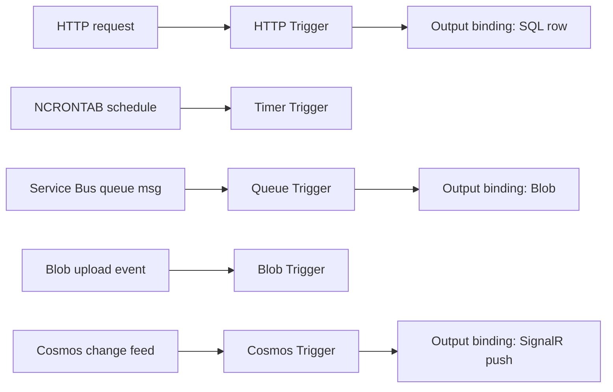

# Azure Functions

> **One-liner**: **Azure Functions** runs your code on demand — a trigger (HTTP, queue, timer, blob, etc.) starts the function, **bindings** wire inputs and outputs declaratively, and you pay per execution (Consumption) or per pre-warmed worker (Premium).

---

## Quick Reference

| Hosting plan | Best for | Cold start | Scale |
| ------------ | -------- | ---------- | ----- |
| **Consumption** | Bursty, cost-sensitive | 100ms – 5s | 0 → 200 instances |
| **Flex Consumption** | Same, with VNet + concurrency control | Reduced | 0 → 1000 |
| **Premium (EP)** | Always warm + VNet + longer runs | None (pre-warmed) | Manual + auto |
| **Dedicated (App Service Plan)** | Reuse existing plan | None | Manual |
| **Container Apps** | Containerized functions, Dapr | Seconds (scale-to-0) | KEDA |

| Trigger | Source |
| ------- | ------ |
| **HTTP** | REST endpoint |
| **Timer** | NCRONTAB schedule |
| **Queue / Service Bus** | Message arrival |
| **Event Grid / Event Hub** | Event arrival |
| **Blob** | Blob upload (polling) or Event Grid-based |
| **Cosmos DB** | Change feed |
| **Durable Orchestration** | Workflow continuations |

| Worker model (.NET) | Notes |
| ------------------- | ----- |
| **Isolated worker** (recommended) | .NET 8+/9 process separate from host; full control of DI/middleware |
| **In-process** | Legacy; ends with .NET 8 in-process support |

---

## Core Concept

A **function** is a method annotated with a **trigger** attribute. The host invokes it when the trigger fires. **Bindings** are declarative inputs (read a blob, query a table) and outputs (write to a queue, return JSON) — you avoid the boilerplate of clients.

Hosting plans differ in *who allocates the workers and when*. **Consumption** spins workers on demand; you pay per execution + GB-seconds. **Premium** keeps workers warm (no cold start), supports VNet integration, and lets functions run longer than 10 minutes.

**Durable Functions** layer reliable workflows on top: orchestrator functions describe sequences and fan-outs in plain code, persisted via the Durable Task Framework. Use for sagas, human-in-the-loop, long-running pipelines.

For .NET, **isolated worker** is the way forward. Host (the Functions runtime) talks to your worker process over gRPC. You get full control over DI, middleware, JSON options, and HTTP handling.

---

## Diagram



---

## Syntax & API

### .NET 8 isolated worker — minimal HTTP function

```csharp
// Program.cs
var builder = FunctionsApplication.CreateBuilder(args);
builder.ConfigureFunctionsWebApplication();
builder.Services.AddApplicationInsightsTelemetryWorkerService();
builder.Services.AddSingleton<IUserService, UserService>();
builder.Build().Run();

// Functions/UsersFunction.cs
public class UsersFunction(IUserService users, ILogger<UsersFunction> log)
{
    [Function("GetUser")]
    public async Task<HttpResponseData> GetUser(
        [HttpTrigger(AuthorizationLevel.Function, "get", Route = "users/{id}")]
        HttpRequestData req, string id, FunctionContext ctx)
    {
        log.LogInformation("GET user {id}", id);
        var user = await users.GetByIdAsync(id);
        var resp = req.CreateResponse(HttpStatusCode.OK);
        await resp.WriteAsJsonAsync(user);
        return resp;
    }
}
```

### Queue trigger + Blob output binding

```csharp
[Function("OnOrder")]
[BlobOutput("receipts/{orderId}.json", Connection = "Storage")]
public string OnOrder(
    [ServiceBusTrigger("orders", Connection = "ServiceBus")] OrderMessage msg)
{
    return JsonSerializer.Serialize(new { msg.OrderId, ProcessedAt = DateTime.UtcNow });
}
```

### Durable orchestration — fan-out / fan-in

```csharp
[Function(nameof(OrderOrchestrator))]
public async Task<string> OrderOrchestrator(
    [OrchestrationTrigger] TaskOrchestrationContext ctx)
{
    var orderId = ctx.GetInput<string>()!;
    var validated = await ctx.CallActivityAsync<bool>(nameof(ValidateOrder), orderId);
    if (!validated) return "rejected";

    var charged = await ctx.CallActivityAsync<bool>(nameof(ChargeCard), orderId);
    if (!charged) {
        await ctx.CallActivityAsync(nameof(NotifyUserOfFailure), orderId);
        return "failed";
    }

    // Fan-out
    var tasks = new[] {
        ctx.CallActivityAsync(nameof(EmailReceipt), orderId),
        ctx.CallActivityAsync(nameof(NotifyShipping), orderId),
        ctx.CallActivityAsync(nameof(UpdateAnalytics), orderId)
    };
    await Task.WhenAll(tasks);
    return "shipped";
}
```

### Deploy

```bash
RG=rg-fn-demo
LOC=eastus
STG=stfn$RANDOM$RANDOM
APP=fn-orders-$RANDOM

az group create -n $RG -l $LOC
az storage account create -n $STG -g $RG -l $LOC --sku Standard_LRS
az functionapp create -n $APP -g $RG -l $LOC \
  --runtime dotnet-isolated --functions-version 4 \
  --consumption-plan-location $LOC \
  --storage-account $STG

func azure functionapp publish $APP   # from project folder
```

---

## Common Patterns

- **HTTP + Queue split**: HTTP function accepts requests, validates, enqueues; a queue-triggered function processes asynchronously. Returns 202 immediately.
- **Durable orchestrator** for multi-step workflows (charge → reserve → ship → notify) with compensations. Far better than raw queue chains.
- **Cosmos change feed** → projection (read model) for CQRS-style apps.
- **Timer-triggered cleanup** at 02:00 daily to purge old records, archive blobs, run reports.
- **Premium plan + min instances=1** for low-latency public APIs; Consumption for everything else.

---

## Gotchas & Tips

- **Cold start hits hardest on Consumption.** Critical synchronous APIs should be on Premium with min instances ≥ 1.
- **5-minute default execution timeout** on Consumption (10 max). Premium + dedicated allow longer; Durable orchestrators effectively *unbounded* because they checkpoint.
- **No durable state in functions.** Function code must be stateless; state lives in storage, queues, or Durable's history table.
- **Functions runtime versions are pinned** at app creation. Upgrading the host (`functions-version 4 → 5`) is a breaking action; test in staging.
- **Don't run heavy parallel work inside one function.** The platform measures GB-seconds per instance; better to fan out to multiple smaller invocations.
- **App settings are encrypted at rest** but visible in plain text to anyone with Contributor on the app. Use Key Vault references for secrets.
- **Local debugging** with `func start` requires `local.settings.json` (gitignored). The same settings live as App Settings in Azure.
- **Concurrency settings matter.** `FUNCTIONS_WORKER_PROCESS_COUNT` (in-process) and `maxConcurrentCalls` (queue binding) control throughput per instance.
- **Storage account is mandatory** even for an HTTP-only app — host uses it for state and triggers. Don't share with non-Functions workloads in production.

---

## See Also

- [[01 - App Service Deep Dive]]
- [[03 - Container Apps]]
- [[11 - Service Bus]]
- [[04 - Serverless Architectures]]
