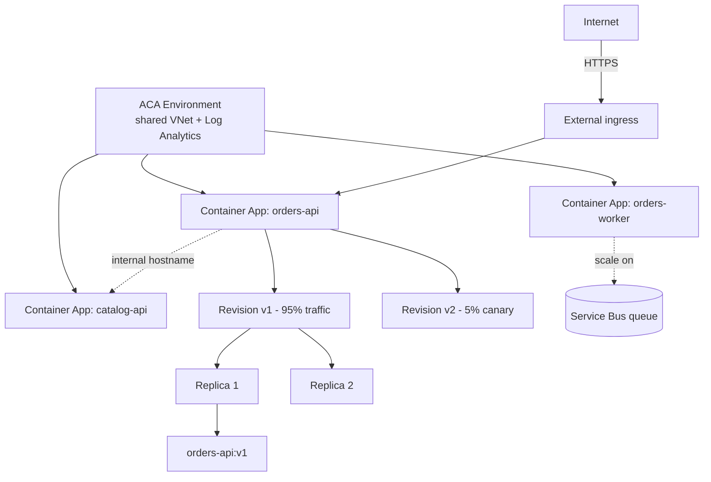

# Container Apps

> **One-liner**: **Azure Container Apps (ACA)** is managed Kubernetes for people who don't want Kubernetes — you push a container, declare scaling rules (HTTP, queue length, CPU), and ACA runs revisions on a shared environment with ingress, secrets, Dapr, and scale-to-zero.

---

## Quick Reference

| Concept | Meaning |
| ------- | ------- |
| **Environment** | The shared boundary (a VNet, Log Analytics workspace); apps in one env can talk privately |
| **Container App** | A single workload; one or more containers per replica |
| **Revision** | An immutable snapshot of config + image; revisions can run in parallel |
| **Replica** | A pod-equivalent: one running instance of a revision |
| **Ingress** | External (internet) or internal (VNet-only); HTTP, TCP, gRPC |
| **Scale rule** | KEDA-based: HTTP RPS, queue length, CPU, custom |
| **Min / Max replicas** | 0–1000; scale-to-zero saves money |
| **Secrets** | Stored in ACA or referenced from Key Vault |
| **Dapr** | Sidecar for service-to-service, state, pub/sub |

| Plan | Notes |
| ---- | ----- |
| **Consumption** (default) | Pay per vCPU-second + GB-second; scale to zero |
| **Dedicated** (workload profile) | Reserved capacity for predictable load |

---

## Core Concept

ACA is built on top of Kubernetes + KEDA + Envoy + Dapr — but you never touch any of them. You define a container app with a YAML or Bicep spec, and the platform handles ingress, scaling, certificate, and routing.

**Revisions** make zero-downtime deploys natural. Each config change creates a new revision; traffic can be split (95% old, 5% new) for canary releases. Activate or deactivate revisions with one CLI call.

**Scaling** is KEDA-style: rules can be HTTP concurrency (`http`), Azure Service Bus queue length, Event Hubs, CPU, custom Prometheus. Min replicas can be 0 — ACA wakes the app on the first request (cold start ~1–3s).

ACA targets the gap between Functions (single function granularity, opinionated runtime) and AKS (full Kubernetes control). Pick ACA for **containerized microservices** that need autoscaling, traffic splitting, and modest networking, without a kubectl operator on the team.

---

## Diagram



---

## Syntax & API

### Stand up an environment and an app

```bash
RG=rg-aca-demo
LOC=eastus
ENV=cae-demo
APP=app-hello

az group create -n $RG -l $LOC
az extension add --name containerapp --upgrade

az containerapp env create -n $ENV -g $RG -l $LOC \
  --logs-workspace-id $(az monitor log-analytics workspace show \
       -g $RG -n law-demo --query customerId -o tsv 2>/dev/null || \
       az monitor log-analytics workspace create -g $RG -n law-demo \
       --query customerId -o tsv)

az containerapp create -n $APP -g $RG --environment $ENV \
  --image mcr.microsoft.com/azuredocs/containerapps-helloworld:latest \
  --target-port 80 --ingress external \
  --min-replicas 0 --max-replicas 3 \
  --cpu 0.25 --memory 0.5Gi

az containerapp show -n $APP -g $RG --query properties.configuration.ingress.fqdn -o tsv
```

### Update with a new revision + 10% canary

```bash
# Switch to multiple-revision mode
az containerapp revision set-mode -n $APP -g $RG --mode multiple

# Deploy v2 image, won't take traffic yet
az containerapp update -n $APP -g $RG \
  --image myacr.azurecr.io/orders:v2 \
  --revision-suffix v2

# Split traffic
az containerapp ingress traffic set -n $APP -g $RG \
  --revision-weight latest=10 $(az containerapp revision list \
       -n $APP -g $RG --query "[?contains(name,'v1')].name | [0]" -o tsv)=90
```

### Scale on Service Bus queue length

```bash
az containerapp create -n app-worker -g $RG --environment $ENV \
  --image myacr.azurecr.io/worker:v1 \
  --min-replicas 0 --max-replicas 30 \
  --scale-rule-name servicebus \
  --scale-rule-type azure-servicebus \
  --scale-rule-metadata "queueName=orders" "messageCount=20" \
       "namespace=sb-orders-prod" \
  --scale-rule-auth "connection=connection-string"
```

### Pull from a private ACR with Managed Identity

```bash
az containerapp identity assign -n $APP -g $RG --system-assigned
PRINCIPAL=$(az containerapp identity show -n $APP -g $RG --query principalId -o tsv)
az role assignment create --assignee $PRINCIPAL --role AcrPull \
  --scope $(az acr show -n myacr --query id -o tsv)
az containerapp registry set -n $APP -g $RG --server myacr.azurecr.io --identity system
```

---

## Common Patterns

- **HTTP API + Worker pair**: external ingress for the API, internal-only for the worker; worker scales on a Service Bus queue.
- **Canary releases**: multiple-revision mode + traffic split. Roll forward by bumping the new revision's weight.
- **Dapr microservices**: enable Dapr per app, use named service invocation, state stores, pub/sub. Great for polyglot teams.
- **Scale-to-zero for spiky internal tools**: nightly admin UI that idles all day costs nothing.
- **Private ingress + private endpoints** for backend services that never face the internet.

---

## Gotchas & Tips

- **Cold start exists when `min-replicas=0`** — first request waits for a replica. For consumer-facing APIs, set min=1.
- **Traffic split is round-robin per request**, not sticky by session. For sticky canaries, use Front Door routing rules instead.
- **Workload profiles vs Consumption** — workload profiles let you run on bigger SKUs (dedicated CPU, GPU) but introduce a base cost. Default to Consumption.
- **Internal-only ingress** is reachable from inside the environment only; cross-environment requires VNet peering and DNS.
- **Logs go to Log Analytics**, not the app file system. `az containerapp logs show` streams; for production analysis, use KQL on `ContainerAppConsoleLogs_CL`.
- **Health probes default to OK**, but you should set `startupProbe`, `livenessProbe`, `readinessProbe` for proper rolling updates and reliable scaling.
- **Secrets are revision-scoped.** Changing a secret value creates a new revision; old revisions keep the old value until deactivated.
- **No SSH or exec into containers** is exposed by default; use `az containerapp exec` for emergency shells.
- **DNS for internal apps** is `<app-name>.internal.<env-domain>.azurecontainerapps.io`. Memorize the pattern.

---

## See Also

- [[01 - App Service Deep Dive]]
- [[04 - AKS Basics]]
- [[05 - Container Registry]]
- [[05 - Microservices on Azure]]
