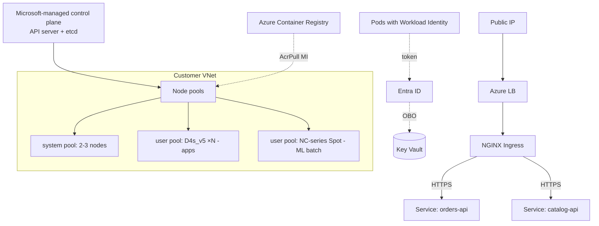

# AKS Basics

> **One-liner**: **Azure Kubernetes Service (AKS)** is a managed Kubernetes — Azure runs the control plane for free, you pay for the worker **node pools** (VMs), and `kubectl` works exactly like vanilla Kubernetes.

---

## Quick Reference

| Concept | Meaning |
| ------- | ------- |
| **Control plane** | API server + etcd + scheduler; Microsoft-managed and free |
| **Node pool** | Group of VMs (a VM Scale Set); pods run here |
| **System node pool** | Hosts kube-system pods; can't be deleted |
| **User node pool** | Your workloads; can be Spot, GPU, etc. |
| **Kubenet vs Azure CNI** | Networking modes; Azure CNI gives pods VNet IPs |
| **Azure CNI Overlay** | Pod IPs from an overlay subnet; saves VNet IPs |
| **Ingress Controller** | NGINX, AGIC, Traefik — terminates HTTP at the edge |
| **Workload Identity** | Federated MI for pods; replaces pod-identity |
| **Cluster Autoscaler** | Adds/removes nodes based on pending pods |
| **HPA / KEDA** | Scales pods within a deployment |

| Tier | Use |
| ---- | --- |
| **Free** | Dev, learning; no SLA on API server |
| **Standard** | Production; 99.95% control plane SLA |
| **Premium** | Long-term support (LTS), Microsoft 24/7 |

---

## Core Concept

AKS gives you a Kubernetes API endpoint, managed control plane, and a set of **node pools** that host your pods. The control plane is free; you pay for compute (nodes), storage (PV disks), and networking.

**System pool** runs DNS, metrics-server, kube-proxy. Keep it small (B-series or D2s_v5). Add **user pools** sized for your workloads — separate pools for stateful (D-series), CPU-burst (B-series), GPU (NC-series), Spot (cheap, evictable).

**Networking** is the biggest design choice. **Kubenet** is the simplest but limited. **Azure CNI** gives every pod a routable VNet IP — great for direct service mesh/peering, but consumes IPs fast. **Azure CNI Overlay** uses an overlay so VNet IPs go to nodes only — best for big clusters.

**Identity**: Workload Identity binds Kubernetes service accounts to Entra ID applications. Pods authenticate to Key Vault, Storage, SQL with no secrets.

**Ingress**: don't expose every Service with a public LoadBalancer. Run one ingress controller (NGINX/AGIC) behind one public IP, route by hostname or path.

---

## Diagram



---

## Syntax & API

### Create a small cluster + connect

```bash
RG=rg-aks-demo
LOC=eastus
ACR=acrdemo$RANDOM
CLUSTER=aks-demo

az group create -n $RG -l $LOC

az acr create -g $RG -n $ACR --sku Basic
az aks create -g $RG -n $CLUSTER \
  --node-count 2 --node-vm-size Standard_D2s_v5 \
  --enable-managed-identity \
  --enable-oidc-issuer --enable-workload-identity \
  --network-plugin azure --network-plugin-mode overlay \
  --pod-cidr 10.244.0.0/16 \
  --attach-acr $ACR \
  --generate-ssh-keys

az aks get-credentials -g $RG -n $CLUSTER
kubectl get nodes
```

### Add a Spot user pool for batch jobs

```bash
az aks nodepool add -g $RG --cluster-name $CLUSTER \
  --name spotpool --priority Spot --eviction-policy Delete \
  --spot-max-price -1 \
  --node-count 0 --min-count 0 --max-count 10 \
  --enable-cluster-autoscaler \
  --node-vm-size Standard_D4s_v5 \
  --node-taints "kubernetes.azure.com/scalesetpriority=spot:NoSchedule"
```

Run jobs that tolerate eviction by adding the matching toleration in your `PodSpec`.

### Workload Identity — pod calling Key Vault

```bash
# 1. Create a UAMI for the workload
az identity create -g $RG -n uami-orders
CLIENT_ID=$(az identity show -g $RG -n uami-orders --query clientId -o tsv)

# 2. Federate it with a Kubernetes service account
OIDC=$(az aks show -g $RG -n $CLUSTER --query oidcIssuerProfile.issuerUrl -o tsv)
az identity federated-credential create -g $RG \
  --identity-name uami-orders --name orders-sa \
  --issuer $OIDC --subject system:serviceaccount:default:orders-sa
```

```yaml
# orders-sa.yaml
apiVersion: v1
kind: ServiceAccount
metadata:
  name: orders-sa
  namespace: default
  annotations:
    azure.workload.identity/client-id: ${CLIENT_ID}
---
apiVersion: apps/v1
kind: Deployment
metadata: { name: orders }
spec:
  selector: { matchLabels: { app: orders } }
  template:
    metadata:
      labels: { app: orders, azure.workload.identity/use: "true" }
    spec:
      serviceAccountName: orders-sa
      containers:
      - name: app
        image: acrdemo.azurecr.io/orders:v1
```

The pod gets a token via `WorkloadIdentityCredential` in the .NET SDK — no secrets in the cluster.

### Install NGINX Ingress + expose a service

```bash
helm repo add ingress-nginx https://kubernetes.github.io/ingress-nginx
helm upgrade --install ingress-nginx ingress-nginx/ingress-nginx \
  --create-namespace -n ingress \
  --set controller.service.annotations."service\.beta\.kubernetes\.io/azure-load-balancer-health-probe-request-path"=/healthz
```

---

## Common Patterns

- **Three pools**: tiny system pool, one user pool for apps, one Spot pool for batch.
- **One ingress controller per cluster** with a single public IP; route by host/path. Cheaper and simpler than LoadBalancer per service.
- **Workload Identity for everything** — no secrets in the cluster, no `imagePullSecrets` games.
- **Pull from ACR via `--attach-acr`** at cluster creation — gives AcrPull on the cluster's kubelet identity.
- **GitOps with Flux or Argo CD** for declarative app deployments tied to a git branch per environment.

---

## Gotchas & Tips

- **AKS versions drop quickly.** Azure supports each minor for ~12 months. Plan upgrades quarterly; let support expire and you'll be force-upgraded.
- **Azure CNI consumes VNet IPs.** Pods × nodes can easily exhaust a `/22` subnet. Use Azure CNI Overlay or kubenet for big clusters.
- **PV disks are zonal.** A pod with an Azure Disk PVC is locked to its AZ. Use Azure Files (multi-AZ) or zonal redundancy with care.
- **System pool** can't be Spot. Don't try.
- **`kubectl get pods` showing `ImagePullBackOff`** is usually missing AcrPull — fix at cluster identity, not the pod.
- **Don't run stateful workloads on AKS** unless you have an operator (Postgres operator, Mongo operator). Managed services exist for a reason.
- **AKS Stop** (`az aks stop`) shuts down the control plane *and* nodes — saves money on dev clusters overnight.
- **The cluster's kubelet identity is separate** from your control-plane identity. RBAC errors on ACR/Storage often trace back to this.
- **etcd is not exposed.** Backups are managed but you can use Velero for namespace-scoped backup/restore.

---

## See Also

- [[03 - Container Apps]]
- [[05 - Container Registry]]
- [[03 - AKS Production Patterns]]
- [[16 - Managed Identity]]
