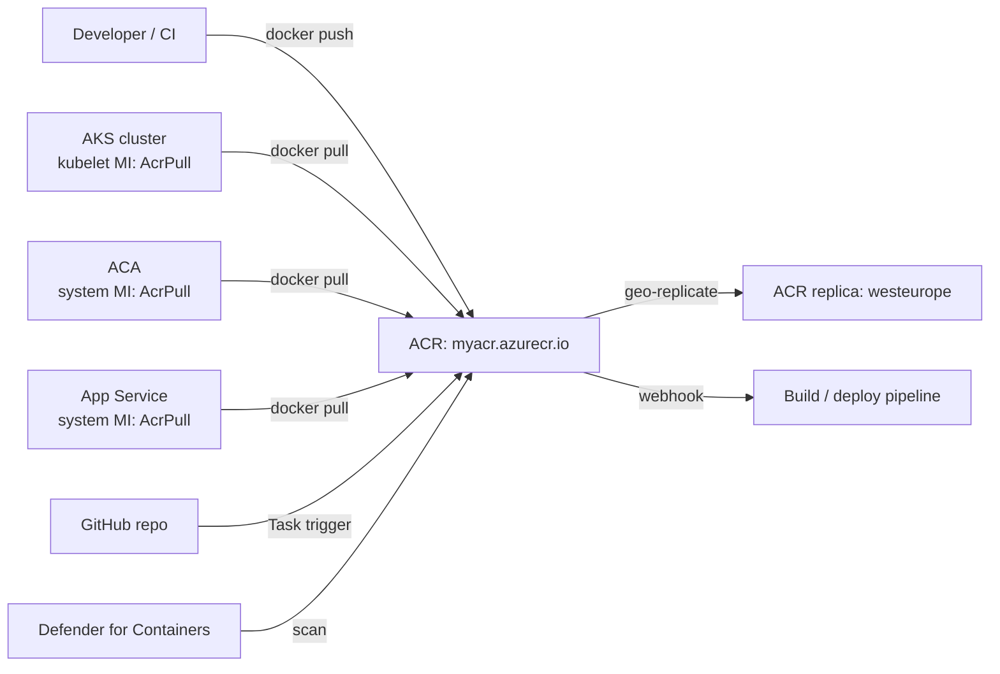

# Container Registry

> **One-liner**: **Azure Container Registry (ACR)** is a private Docker registry — push images with `docker push`, pull from AKS/ACA/App Service via Managed Identity, optionally automate builds with **ACR Tasks** and scan with **Defender for Containers**.

---

## Quick Reference

| Tier | Highlights |
| ---- | ---------- |
| **Basic** | Cheap, lower throughput, no geo-replication |
| **Standard** | Most production workloads |
| **Premium** | Geo-replication, private endpoints, content trust, tokens, scoped repos |

| Capability | Tier needed |
| ---------- | ----------- |
| Push/pull images | All |
| Webhooks | All |
| ACR Tasks (build in cloud) | All |
| Geo-replication | Premium |
| Private endpoint | Premium |
| Content Trust (signed images) | Premium |
| Customer-managed key encryption | Premium |
| Repository-scoped tokens | Premium |

| Auth method | Use for |
| ----------- | ------- |
| **Managed Identity (AcrPull / AcrPush)** | AKS, ACA, App Service, CI |
| **Service Principal** | External CI without MI |
| **Token (scope-map)** | IoT, edge, partner pull |
| **Admin user** | Demo only — disable in production |

---

## Core Concept

ACR stores OCI-compliant images and artifacts. Names are globally unique because they become `<name>.azurecr.io`. The pull path is integrated with Azure identity, so you grant the AKS/ACA identity the `AcrPull` role and there are no secrets to rotate.

**Premium** unlocks the features that matter for serious operations: **geo-replication** (one registry, many regions, automatic replication), **private endpoints** (registry has no public IP), **content trust** (signed image verification), and **customer-managed keys** for encryption at rest.

**ACR Tasks** lets you build images *in Azure*, triggered by source-code push, base-image update, or schedule. Useful when you want to rebuild your app every time the base `mcr.microsoft.com/dotnet/aspnet:8.0` image updates — patches roll through without manual builds.

---

## Diagram



---

## Syntax & API

### Create + push

```bash
RG=rg-acr-demo
LOC=eastus
ACR=acrdemo$RANDOM

az group create -n $RG -l $LOC
az acr create -g $RG -n $ACR --sku Standard --admin-enabled false

# Login from Docker CLI using your Azure session (no password)
az acr login --name $ACR

# Build and push from local Dockerfile
docker build -t $ACR.azurecr.io/orders:v1 .
docker push       $ACR.azurecr.io/orders:v1

# OR: build in the cloud with ACR Tasks
az acr build --registry $ACR --image orders:v1 .
```

### Grant pull access to AKS

```bash
PRINCIPAL=$(az aks show -g rg-aks-demo -n aks-demo \
  --query identityProfile.kubeletidentity.objectId -o tsv)
az role assignment create --assignee $PRINCIPAL --role AcrPull \
  --scope $(az acr show -n $ACR --query id -o tsv)
```

### ACR Task — rebuild on base-image update

```bash
az acr task create \
  --registry $ACR \
  --name orders-rebuild \
  --image orders:{{.Run.ID}} --image orders:latest \
  --context https://github.com/contoso/orders.git#main \
  --file Dockerfile \
  --git-access-token $GH_PAT \
  --base-image-trigger-enabled true \
  --commit-trigger-enabled true
```

The task fires when the upstream `mcr.microsoft.com/dotnet/aspnet` image updates *or* when GitHub `main` gets a commit.

### Vulnerability scan via Defender for Cloud

Turn on **Defender for Containers** at the subscription scope. Every pushed image is scanned; results land in Defender → Recommendations. Set up a policy that blocks `Critical` severity images at deploy time.

---

## Common Patterns

- **Geo-replication + Premium** for global apps: pull from the nearest replica per region, master writes once.
- **ACR Tasks for SDK upgrade pipelines** — keeps your `.NET 8 → 8.0.x` patches flowing automatically.
- **Image promotion across registries** for environments: `acr-dev → acr-staging → acr-prod` with `acr import` and signed tags.
- **Scope-map tokens** for partner pulls — give a specific repo `*:pull` rights with a 90-day token; revoke trivially.
- **Pin digests, not tags** in production manifests (`@sha256:...`) for reproducibility.

---

## Gotchas & Tips

- **Admin user (username/password) is the worst auth.** Disabled by default; only enable for demos where MI isn't possible.
- **`AcrPull` is a data-plane role.** Don't try to use Contributor — it doesn't include `Microsoft.ContainerRegistry/registries/pull/read`.
- **Soft delete of repos is opt-in.** Turn it on; "I deleted the wrong tag" is a recoverable mistake otherwise — but only if you enabled it.
- **Image quarantine** can hold images until they pass a scan. Premium only.
- **Replicas are read-write each.** A push to any replica region propagates; useful for multi-region CI builds.
- **Private endpoints break public Docker pulls.** Make sure your runners are inside the VNet or have access via private DNS.
- **Free tier of Defender for Containers** scans on push for the first 30 days; subscription cost kicks in after.
- **Image size matters.** Multi-stage builds and `dotnet/aspnet:alpine` cut hundreds of MB. Smaller image = faster cold starts on ACA/Functions.
- **Tag immutability** is configurable — enable it on production tags to prevent accidental overwrites.

---

## See Also

- [[03 - Container Apps]]
- [[04 - AKS Basics]]
- [[15 - CI-CD on Azure]]
- [[10 - Defender for Cloud and Sentinel]]
