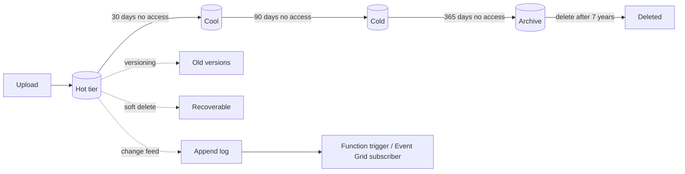

# Blob Storage Advanced

> **One-liner**: Blob Storage is more than dumb file storage — **lifecycle rules** move data through tiers automatically, **SAS tokens** grant scoped access, **immutability** prevents tampering, **versioning** preserves history, and **change feed** records every write for replay.

---

## Quick Reference

| Feature | Purpose |
| ------- | ------- |
| **Lifecycle Management** | Tier or delete blobs by age/last-access |
| **Versioning** | Every write creates a new version; old versions retained |
| **Soft Delete** | Containers and blobs recoverable for N days |
| **Snapshots** | Manual point-in-time copies |
| **Immutability policy** | Time-based or legal-hold WORM |
| **Change Feed** | Append-log of every blob change |
| **SAS** | Time-bounded, permission-scoped URL |
| **Stored Access Policy** | Server-side rules referenced by SAS |
| **Static website** | `$web` container served as HTTPS site |
| **CORS** | Per-account allow lists for browser uploads |
| **Encryption Scope** | Per-container CMK (Premium scenarios) |

| Blob type | Use for |
| --------- | ------- |
| **Block blob** | Most files (uploads, backups, media) |
| **Append blob** | Append-only logs |
| **Page blob** | VM disks (mostly internal) |

---

## Core Concept

A blob lives in a **container** (a flat namespace; "folders" are just `/` in names). You **upload** in blocks (parallel chunks), **download** with range reads, and **list** with prefix filters.

**Lifecycle management** is the cost lever every team eventually needs: keep blobs Hot for 30 days, Cool for 90, Cold for 365, then delete. Rules are JSON; the engine evaluates daily.

**Versioning + soft delete + immutability** give you defense in depth: a buggy app overwrites a blob → versioning preserves the old one → ransomware tries to delete → soft delete keeps it → audit demands WORM → immutability policy refuses any delete.

**SAS tokens** are how you let *external* clients access blobs without giving them a key. User Delegation SAS is signed by Entra ID — better than account SAS because it's tied to a user identity (auditable, revocable).

**Change Feed** is the killer feature for downstream pipelines: a transactional log of every blob change, queryable by timestamp. Hook it to Functions/Event Grid for near-real-time reactions.

---

## Diagram



---

## Syntax & API

### Lifecycle rule via JSON

```bash
cat > lifecycle.json <<'JSON'
{
  "rules": [
    {
      "name": "tier-and-expire",
      "enabled": true,
      "type": "Lifecycle",
      "definition": {
        "filters": { "blobTypes": ["blockBlob"], "prefixMatch": ["backups/"] },
        "actions": {
          "baseBlob": {
            "tierToCool":    { "daysAfterModificationGreaterThan": 30 },
            "tierToCold":    { "daysAfterModificationGreaterThan": 90 },
            "tierToArchive": { "daysAfterModificationGreaterThan": 365 },
            "delete":        { "daysAfterModificationGreaterThan": 2555 }
          },
          "snapshot":     { "delete": { "daysAfterCreationGreaterThan": 30 } },
          "version":      { "delete": { "daysAfterCreationGreaterThan": 60 } }
        }
      }
    }
  ]
}
JSON

az storage account management-policy create \
  --account-name $SA --resource-group $RG --policy @lifecycle.json
```

### User-Delegation SAS in .NET

```csharp
using Azure.Identity;
using Azure.Storage;
using Azure.Storage.Sas;
using Azure.Storage.Blobs;

var blob = new BlobServiceClient(
    new Uri("https://stdata.blob.core.windows.net"),
    new DefaultAzureCredential());

var udk = await blob.GetUserDelegationKeyAsync(
    DateTimeOffset.UtcNow,
    DateTimeOffset.UtcNow.AddHours(1));

var sas = new BlobSasBuilder(BlobSasPermissions.Read,
    DateTimeOffset.UtcNow.AddHours(1))
{
    BlobContainerName = "images",
    BlobName = "logo.png",
    Resource = "b"
};
var sasToken = sas.ToSasQueryParameters(udk, "stdata").ToString();
var url = $"https://stdata.blob.core.windows.net/images/logo.png?{sasToken}";
// hand 'url' to the user
```

### Enable versioning, soft delete, change feed

```bash
az storage account blob-service-properties update -g $RG --account-name $SA \
  --enable-versioning true \
  --enable-delete-retention true --delete-retention-days 7 \
  --enable-container-delete-retention true --container-delete-retention-days 7 \
  --enable-change-feed true
```

### Hook upload events into Functions

```bash
SA_ID=$(az storage account show -n $SA -g $RG --query id -o tsv)
az eventgrid event-subscription create \
  --name on-blob-uploaded \
  --source-resource-id $SA_ID \
  --included-event-types Microsoft.Storage.BlobCreated \
  --endpoint $(az functionapp function show -g $RG -n fn-orders \
       --function-name OnBlobUploaded --query invokeUrlTemplate -o tsv) \
  --endpoint-type azurefunction
```

---

## Common Patterns

- **Lifecycle + Archive for backups** — 99% cheaper than Hot for 7-year retention.
- **Upload from browser via SAS** — backend issues a short SAS to the client; the client uploads directly to blob, saving server bandwidth.
- **Event Grid + Functions** — blob lands in `incoming/`, function processes it and writes to `processed/`.
- **Static site + Front Door** — host SPA in `$web`, front with Front Door for HTTPS + custom domain + WAF.
- **Immutable backups** — legal-hold policy on a `compliance/` container; even subscription owners can't delete.

---

## Gotchas & Tips

- **Lifecycle rules run within 24–48 hours** of meeting a condition — they're not real-time.
- **`Last Access` tracking adds overhead** — must be enabled at account level; rules then use access-based aging.
- **Archive tier blobs must be rehydrated** before reading: hours of wait + cost. Don't archive what users might want at 3am.
- **SAS tokens can't be revoked** unless you use a Stored Access Policy or User-Delegation SAS (rotate the user-delegation key).
- **CORS is per-account, not per-container.** Lock origins down; `*` is a public file-upload bucket waiting to happen.
- **Public anonymous access is off by default** since 2023 — leave it off. Use SAS or RBAC.
- **Hierarchical namespace (ADLS Gen2)** is enabled at account creation only — can't toggle later. Choose ADLS Gen2 if you'll query with Synapse/Databricks.
- **Block size affects throughput.** Default 4 MiB blocks; 100 MiB blocks unlock 200 GB/s+ accounts but consume client RAM.
- **Snapshot vs Version**: snapshots are explicit (point-in-time copy you manage); versions are automatic. Use versions unless you have a specific snapshot-only workflow.

---

## See Also

- [[06 - Storage Basics]]
- [[12 - Event Grid]]
- [[14 - Disaster Recovery]]
- [[12 - Private Endpoints and Zero Trust]]
