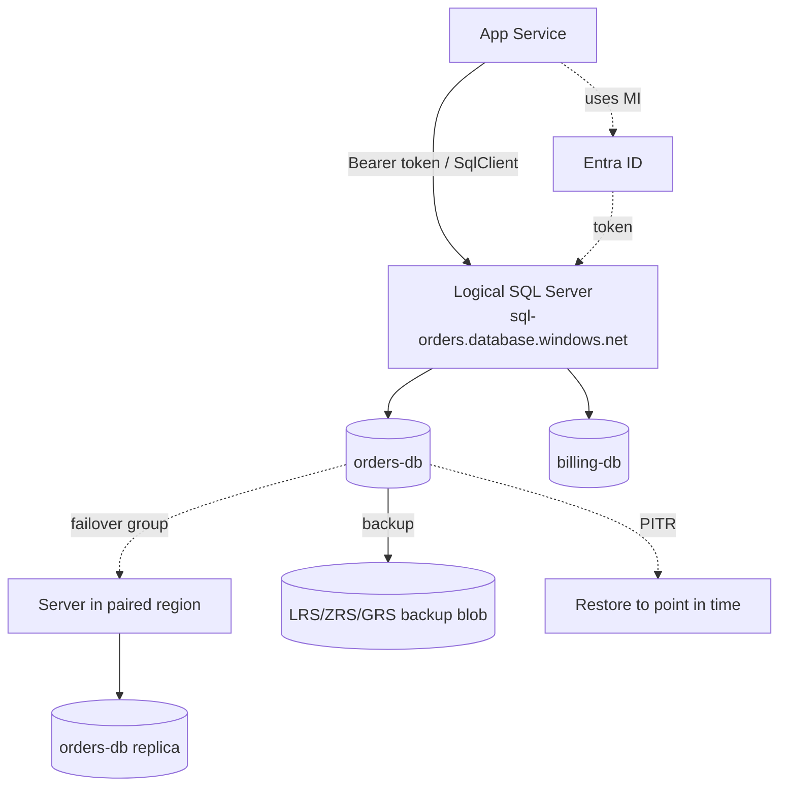

# Azure SQL Database

> **One-liner**: **Azure SQL Database** is a fully managed SQL Server engine — pick a **purchase model** (DTU or vCore), a **service tier** (General Purpose, Business Critical, Hyperscale, serverless), and Azure handles patching, backups, HA, and tuning.

---

## Quick Reference

| Tier | Storage | HA | Best for |
| ---- | ------- | -- | -------- |
| **General Purpose** (vCore) | Remote storage, separated compute | 99.99% via local redundancy | Most OLTP |
| **Business Critical** | Local SSD, AG replicas | 99.995% w/ ZRS | Sub-ms reads, HA-critical |
| **Hyperscale** | Page server tier, near-instant scale | 99.99% | Large DBs (>1 TB), fast restore |
| **Serverless** (GP) | Auto-pause when idle | 99.99% | Spiky / intermittent workloads |

| Concept | Meaning |
| ------- | ------- |
| **Logical SQL Server** | Endpoint + admin + firewall rules; container for DBs |
| **Elastic Pool** | Share DTUs/vCores across many DBs with bursty load |
| **Failover Group** | Read-write listener + readable secondary in paired region |
| **Geo-replica** | Up to 4 readable secondaries, async |
| **Active geo-replication** | Cross-region readable secondaries with manual failover |
| **Always Encrypted** | Client-side encryption with column-level keys |
| **Auditing** | Logged to Storage / Log Analytics / Event Hub |

---

## Core Concept

Azure SQL DB is SQL Server's engine wrapped in Azure operations. You connect with the same drivers (`Microsoft.Data.SqlClient`), write the same T-SQL (mostly), and use the same tooling (SSMS, Azure Data Studio).

The **purchase model** decides how you buy capacity:

- **DTU** bundles CPU + memory + IO into one number. Simple but rigid.
- **vCore** lets you pick cores, memory family, and storage independently. Supports Hybrid Benefit, reservations, more SKUs. **Default for new work.**

The **service tier** decides architecture:

- **General Purpose** separates compute from remote premium storage. Failover restarts compute on healthy hardware.
- **Business Critical** uses local SSDs + AlwaysOn Availability Groups for replicas in the same region — sub-ms reads, HA in seconds.
- **Hyperscale** decouples storage into "page servers" so the DB can scale to 100+ TB; restore is near-instant from log snapshots.
- **Serverless** auto-pauses when idle; first query after pause has cold-start latency.

**Failover Groups** are the modern HA primitive: a read-write DNS endpoint moves to a secondary in the paired region on failure, automatically or manually.

---

## Diagram



---

## Syntax & API

### Provision a GP-S2 (General Purpose) DB

```bash
RG=rg-sql-prod
LOC=eastus
SERVER=sql-orders-$RANDOM
ADMIN_USER=sqladmin
ADMIN_PW='P@ssw0rd-Long-And-Complex-123!'

az group create -n $RG -l $LOC
az sql server create -n $SERVER -g $RG -l $LOC \
  --admin-user $ADMIN_USER --admin-password "$ADMIN_PW"

az sql db create -g $RG --server $SERVER -n orders-db \
  --edition GeneralPurpose \
  --family Gen5 --capacity 2 \
  --backup-storage-redundancy Zone
```

### Entra-ID-only admin + Managed Identity user

```bash
# Disable SQL auth; Entra-only
az sql server ad-admin create -g $RG --server $SERVER \
  --display-name dba-team --object-id $GROUP_OID
az sql server update -g $RG -n $SERVER --enable-ad-only-auth true

# Inside the DB, create a contained user for the App Service MI:
# CREATE USER [app-orders-prod] FROM EXTERNAL PROVIDER;
# ALTER ROLE db_datareader ADD MEMBER [app-orders-prod];
# ALTER ROLE db_datawriter ADD MEMBER [app-orders-prod];
```

### Failover group across regions

```bash
SEC_SERVER=sql-orders-sec-$RANDOM
az sql server create -n $SEC_SERVER -g $RG -l westus \
  --admin-user $ADMIN_USER --admin-password "$ADMIN_PW"

az sql failover-group create -g $RG --server $SERVER \
  -n fg-orders --partner-server $SEC_SERVER \
  --add-db orders-db \
  --failover-policy Automatic --grace-period 1
```

`sql-orders.database.windows.net` resolves to the primary; on failover, DNS flips to the secondary.

### Restore to a point in time

```bash
az sql db restore -g $RG --server $SERVER \
  --name orders-db --dest-name orders-db-restored \
  --time "2026-05-13T08:30:00Z"
```

---

## Common Patterns

- **OLTP app**: GP vCore 2-core to start, scale via `az sql db update --capacity`. Backups + PITR enabled by default.
- **Spiky workloads**: GP serverless with `--auto-pause-delay 60` minutes. Pays only for compute when active.
- **Big DB**: Hyperscale — converts from GP without downtime, but no path back to GP.
- **Multi-region**: Failover group + readable secondary; route reporting workload to the read-only listener.
- **EF Core + retries**: `EnableRetryOnFailure()` is mandatory; transient errors are normal on managed SQL.

---

## Gotchas & Tips

- **DTU vs vCore**: don't start with DTU on new work — you'll regret it. vCore exposes Hybrid Benefit (40% off if you bring SQL licenses) and reservations (~30% off committed).
- **Backups happen automatically**; 7-day retention free. Configure Long-Term Retention for compliance windows beyond that.
- **Firewall is the wall.** Default: deny all. Add per-IP rules and "Allow Azure services" only as last resort — prefer **VNet rules** or **private endpoints**.
- **Public Network Access = Disabled** is the production setting. Use a private endpoint and Entra-ID auth.
- **Transient errors are normal.** Implement retry on `40613`, `40197`, `49918`, `49919`, `40501`, `10928`. EF Core does this automatically.
- **DTU/vCore changes cause brief connection drop.** Schedule scaling outside peak; the actual scale-up is seconds.
- **Hyperscale's named replica feature** lets multiple read-replicas share storage at near-zero cost — perfect for reporting.
- **Always Encrypted** requires client-side certificates and tooling (Azure Data Studio, SSMS). Powerful but heavy.
- **Tempdb size is fixed per SKU.** Big sorts/spills fail on small SKUs; size up if your workload uses heavy `ORDER BY`/joins.
- **MAX_DOP defaults vary** by tier. Set explicitly for predictable plan behavior.

---

## See Also

- [[08 - Database Options]]
- [[09 - Azure Postgres Flexible Server]]
- [[16 - Managed Identity]]
- [[13 - Multi-Region HA]]
- [[14 - Disaster Recovery]]
