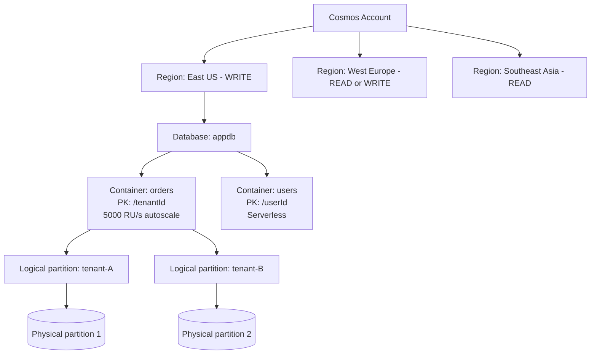

# Cosmos DB

> **One-liner**: **Cosmos DB** is Azure's globally distributed multi-model database — pick an **API** (NoSQL/Mongo/Cassandra/Gremlin/Table/PostgreSQL), pick a **partition key** for scale, pick a **consistency level**, and pay per **Request Unit (RU/s)**.

---

## Quick Reference

| API | Use for |
| --- | ------- |
| **NoSQL (Core)** | Default for new apps; native JSON, best SDK support |
| **MongoDB** (wire protocol) | Migrating Mongo apps |
| **Cassandra** (CQL) | Migrating Cassandra workloads |
| **Gremlin** | Graph traversals |
| **Table** | Drop-in replacement for Storage Tables, globally distributed |
| **PostgreSQL** (Citus-based) | Distributed Postgres, separate service flavor |

| Consistency level | Read guarantees | Cost (RU) |
| ----------------- | --------------- | --------- |
| **Strong** | Linearizable | Highest |
| **Bounded Staleness** | Lag bounded (time or ops) | High |
| **Session** (default) | Read-your-writes per client | Standard |
| **Consistent Prefix** | No out-of-order writes | Low |
| **Eventual** | Any order | Lowest |

| Throughput model | Notes |
| ---------------- | ----- |
| **Provisioned (manual)** | Set RU/s, pay even when idle |
| **Autoscale** | Max RU/s, scales down to 10% |
| **Serverless** | Per-operation pricing (<1M RU/s/month workloads) |

---

## Core Concept

Cosmos DB stores items as **JSON documents** in **containers** that are partitioned by a **partition key**. Each item goes to a logical partition (key hash) and physical partition (a node). Reads/writes within one logical partition are fast and atomic; cross-partition queries are slower and cost more RU.

**RU (Request Unit)** is the unified measure: a 1-KB document point read costs ~1 RU; a write ~5–10 RU; a complex query scales with rows scanned. You provision RU/s per container (or database); throttling kicks in at the limit (HTTP 429 — SDKs retry automatically).

**Consistency** is per-account default, overridable per request. Session is the right default — it gives read-your-writes per client without the RU cost of stronger levels.

**Multi-region writes** is the killer feature: enable it and any region can accept writes; Cosmos resolves conflicts with Last-Writer-Wins or a custom resolution policy. Single-region writes is cheaper and simpler.

**Picking the partition key is the most important decision.** Get it wrong and you'll re-architect later. Good keys: high-cardinality, spread writes evenly, queries usually include the key (`tenantId`, `userId`, `deviceId`).

---

## Diagram



---

## Syntax & API

### Provision an account, DB, container

```bash
RG=rg-cosmos-demo
LOC=eastus
ACCT=cosmos-orders-$RANDOM

az group create -n $RG -l $LOC
az cosmosdb create -n $ACCT -g $RG \
  --kind GlobalDocumentDB \
  --locations regionName=$LOC failoverPriority=0 isZoneRedundant=true \
  --default-consistency-level Session \
  --enable-automatic-failover true

az cosmosdb sql database create -a $ACCT -g $RG -n appdb
az cosmosdb sql container create -a $ACCT -g $RG -d appdb -n orders \
  --partition-key-path /tenantId \
  --throughput 400      # or use --max-throughput 4000 for autoscale
```

### .NET — point read + query with the SDK

```csharp
using Microsoft.Azure.Cosmos;

var client = new CosmosClient(
    "https://cosmos-orders.documents.azure.com:443/",
    new DefaultAzureCredential(),
    new CosmosClientOptions { ConsistencyLevel = ConsistencyLevel.Session });

var container = client.GetContainer("appdb", "orders");

// Point read (cheapest)
var resp = await container.ReadItemAsync<Order>("o123", new PartitionKey("tenant-A"));
Console.WriteLine($"RU charge: {resp.RequestCharge}");

// Query within partition
var q = new QueryDefinition("SELECT * FROM c WHERE c.status = @s")
    .WithParameter("@s", "pending");
var it = container.GetItemQueryIterator<Order>(q,
    requestOptions: new() { PartitionKey = new PartitionKey("tenant-A") });
while (it.HasMoreResults)
    foreach (var o in await it.ReadNextAsync()) Console.WriteLine(o.Id);
```

### Change feed → reactor

```csharp
var processor = container
    .GetChangeFeedProcessorBuilder<Order>("ordersProcessor",
        async (changes, ctx, token) => {
            foreach (var o in changes) await projector.ProjectAsync(o);
        })
    .WithInstanceName("worker-1")
    .WithLeaseContainer(client.GetContainer("appdb", "leases"))
    .Build();

await processor.StartAsync();
```

### Add a read-only region

```bash
az cosmosdb update -n $ACCT -g $RG \
  --locations regionName=eastus failoverPriority=0 isZoneRedundant=true \
              regionName=westeurope failoverPriority=1 isZoneRedundant=false
```

---

## Common Patterns

- **Tenant-isolated multi-tenancy**: `partitionKey = /tenantId`. Queries include it. Cross-tenant analytics use the change feed, not cross-partition queries.
- **Hot-data cache**: Cosmos for primary store + Redis for session/cart hot reads.
- **Event-store**: append-only container with `eventStreamId` as PK; projections via change feed.
- **Global app**: multi-region writes + Session consistency + region-affinity routing at the gateway.
- **Serverless for spiky workloads** under 1M RU/s — pay only per operation, no idle cost.

---

## Gotchas & Tips

- **Don't pick the partition key based on what's convenient** today. Future-proof: high-cardinality, balanced writes, present in every query.
- **Cross-partition queries are slow + expensive.** They fan out to every physical partition. Always filter by PK when possible.
- **RU/s is per second, per container, per region.** A multi-region account with `400 RU/s` on a container costs `400 × regions`.
- **429s are normal under load.** SDKs retry by default; tune `MaxRetryAttemptsOnRateLimitedRequests`. Sustained 429s = you're under-provisioned.
- **Indexing all paths** is the default and expensive. Define an indexing policy that excludes unused paths to halve write RU.
- **Item size limit: 2 MiB.** Larger documents → split. JSON arrays grow silently — watch for breaching docs.
- **Backups are continuous (PITR) on accounts created in continuous mode.** Periodic backups are the older default; PITR is what you want.
- **TTL** at item or container level auto-deletes expired items (no RU charge for deletes via TTL). Useful for ephemeral caches.
- **Don't use the SQL `LIKE 'pattern%'`** without an indexed path; queries fall back to scans. Index the property explicitly.
- **`x-ms-request-charge`** header (or `RequestCharge` on the SDK) is the real RU spent — log it; that's how you find expensive queries.

---

## See Also

- [[08 - Database Options]]
- [[10 - Azure Cache for Redis]]
- [[13 - Multi-Region HA]]
- [[17 - Event-Driven Architecture]]
