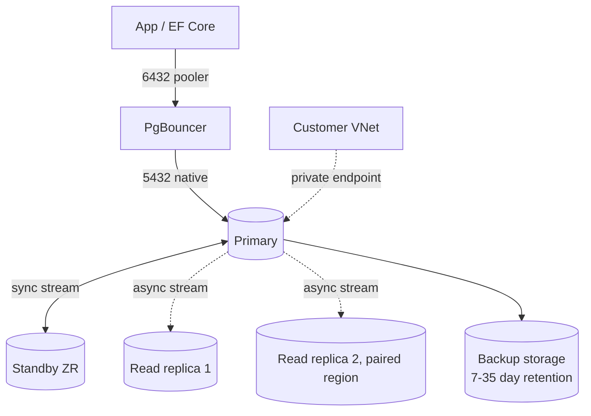

# Azure Postgres Flexible Server

> **One-liner**: **Azure Database for PostgreSQL Flexible Server** is managed Postgres with HA, read replicas, Postgres extensions, and VNet integration — the modern replacement for the older Single Server tier.

---

## Quick Reference

| Concept | Meaning |
| ------- | ------- |
| **Compute tier** | Burstable (B-series), General Purpose (D-series), Memory Optimized (E-series) |
| **HA mode** | Same-zone or Zone-redundant standby |
| **Storage** | Premium SSD or Premium SSD v2; auto-grow |
| **Backup retention** | 7–35 days; geo-redundant optional |
| **Read replicas** | Up to 5 async, intra- or cross-region |
| **Connection pooling** | Built-in PgBouncer (transaction mode) |
| **Extensions** | pgvector, PostGIS, pg_partman, pg_stat_statements, etc. (allowlisted) |
| **Major versions** | 13–17 (newest supported moves quickly) |
| **Authentication** | Postgres native + Microsoft Entra ID |

---

## Core Concept

Flexible Server runs vanilla Postgres on Azure-managed VMs with replication and backups built in. You get root-level Postgres compatibility (most extensions, custom configs via `server-parameter set`), HA with a hot standby (sync replication in zone-redundant mode), and managed PgBouncer.

**HA modes**: same-zone (cheaper, in-AZ failover) vs zone-redundant (across AZs, more expensive, survives a datacenter outage). Failover is automatic; connection-string FQDN flips DNS.

**Read replicas** are async streaming replicas; up to 5. They're writable only after promotion. Cross-region replicas enable geo-DR.

**Networking**: choose **public access** with firewall rules (default), or **private access** with VNet integration (the production choice). Public access can be disabled entirely; private with Private Endpoint is the most locked-down setup.

**PgBouncer** is built into Flexible Server. Enable it, set `pgbouncer.pool_mode=transaction` (default), and connect to port `6432`. Much higher connection density than Postgres native.

---

## Diagram



---

## Syntax & API

### Provision a small Flexible Server with HA

```bash
RG=rg-pg-demo
LOC=eastus
PG=pg-orders-$RANDOM

az group create -n $RG -l $LOC
az postgres flexible-server create \
  -g $RG -n $PG -l $LOC \
  --tier GeneralPurpose --sku-name Standard_D2ds_v5 \
  --storage-size 128 --version 16 \
  --high-availability ZoneRedundant \
  --admin-user pgadmin --admin-password 'Long-And-Complex-123!' \
  --public-access 0.0.0.0   # disable public, will use private endpoint
```

### Configure server parameters + extensions

```bash
# Enable pgvector + pg_stat_statements
az postgres flexible-server parameter set \
  -g $RG --server-name $PG \
  --name azure.extensions --value VECTOR,PG_STAT_STATEMENTS,PG_PARTMAN

# Bump shared_buffers and turn on query logging
az postgres flexible-server parameter set \
  -g $RG --server-name $PG \
  --name shared_preload_libraries --value pg_stat_statements
az postgres flexible-server parameter set \
  -g $RG --server-name $PG \
  --name log_min_duration_statement --value 500
```

After enabling extensions, run inside the DB:

```sql
CREATE EXTENSION IF NOT EXISTS vector;
CREATE EXTENSION IF NOT EXISTS pg_stat_statements;
```

### Enable PgBouncer

```bash
az postgres flexible-server parameter set \
  -g $RG --server-name $PG --name pgbouncer.enabled --value true

# Now connect to port 6432
psql "host=$PG.postgres.database.azure.com port=6432 sslmode=require \
      dbname=postgres user=pgadmin password=...."
```

### Connect with Entra ID (passwordless)

```bash
# Make a user the Entra admin
az postgres flexible-server ad-admin create -g $RG -s $PG \
  --display-name myself --object-id $(az ad signed-in-user show --query id -o tsv)
```

```csharp
using Azure.Identity;
using Npgsql;

var dataSource = new NpgsqlDataSourceBuilder(
    "Host=pg-orders.postgres.database.azure.com;Database=appdb;Username=myself@contoso.com;SslMode=Require")
    .UsePeriodicPasswordProvider(async (_, ct) => {
        var tok = await new DefaultAzureCredential().GetTokenAsync(
            new(new[] { "https://ossrdbms-aad.database.windows.net/.default" }), ct);
        return tok.Token;
    }, TimeSpan.FromMinutes(50), TimeSpan.FromSeconds(10))
    .Build();

await using var conn = await dataSource.OpenConnectionAsync();
```

---

## Common Patterns

- **OLTP + read scale**: primary + 1–2 same-region read replicas for reporting queries. Route in the app or via PgBouncer.
- **Cross-region DR**: cross-region read replica + a runbook to promote on disaster.
- **pgvector for RAG**: enable extension, store embeddings, search with `ORDER BY embedding <=> $1` + HNSW index.
- **Logical replication for ETL**: stream specific tables to a Synapse / data warehouse via Debezium or `pglogical`.
- **PgBouncer transaction mode** for tens of thousands of clients; native port for `LISTEN/NOTIFY` and prepared statements.

---

## Gotchas & Tips

- **Single Server is deprecated.** New work always Flexible.
- **Zone-redundant HA needs zone-aware regions.** Not all regions support it. Check `--query "[?supportsZoneRedundantHa]"`.
- **Burstable (B-series) is dev/test only.** It throttles when credits run out; production goes GP or MO.
- **PgBouncer transaction mode breaks** `LISTEN/NOTIFY`, prepared statements, session-scoped settings. Bypass to native port (5432) for those clients.
- **Some extensions need whitelisting** — `azure.extensions` parameter lists allowed ones. Restart required after changes.
- **Major-version upgrades require a restart and a brief outage** (~minutes). Always test in non-prod first; some extensions require version-specific code.
- **Backups don't capture roles/users automatically** in restore-to-new-server flows. Re-create Entra admins post-restore.
- **`max_connections` is bounded** by SKU. PgBouncer is mandatory for connection-heavy apps (Lambda-style serverless, microservices).
- **Storage auto-grow** is on by default — saves you at 3am, but the bill grows too. Monitor and alert on free space *and* total size.
- **Geo-restore is on a 1-hour RPO**. For tighter RPO, use logical replication or cross-region replicas.

---

## See Also

- [[08 - Database Options]]
- [[07 - Azure SQL Database]]
- [[18 - AI and Azure OpenAI]]
- [[14 - Disaster Recovery]]
