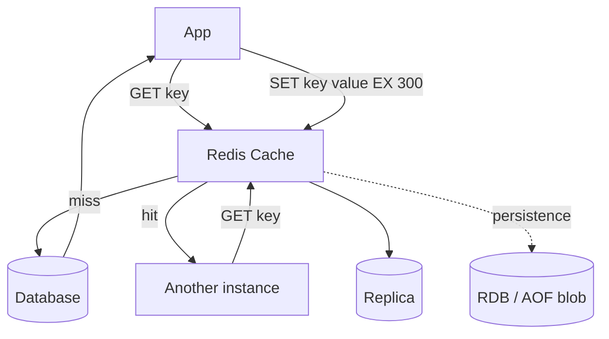

# Azure Cache for Redis

> **One-liner**: **Azure Cache for Redis** is managed Redis — pick a tier (Basic/Standard/Premium/Enterprise), use it as a **cache**, **session store**, **rate limiter**, or **pub/sub bus**, and avoid the operational pain of running Redis yourself.

---

## Quick Reference

| Tier | Highlights |
| ---- | ---------- |
| **Basic** | Single node; dev/test only |
| **Standard** | Primary + replica; 99.9% SLA |
| **Premium** | Clustering, persistence, geo-replication, VNet inject |
| **Enterprise** | Redis Inc. modules (RedisJSON, RedisSearch, RedisTimeSeries), active-active geo-replication |
| **Enterprise Flash** | Extends with NVMe-backed memory; cheap large caches |

| Use case | Pattern |
| -------- | ------- |
| **Cache** | Cache-aside; `GET` first, fall back to DB, `SET` with TTL |
| **Session store** | `HSET` per session id; TTL = session length |
| **Rate limiter** | `INCR` with EX, or token bucket via Lua |
| **Distributed lock** | `SET key value NX EX 30`; release with Lua |
| **Pub/sub** | `PUBLISH` + `SUBSCRIBE` for ephemeral fan-out |
| **Leaderboard** | Sorted set (`ZADD`/`ZRANGE`) |

| Common eviction policy | Behavior |
| ---------------------- | -------- |
| `allkeys-lru` | Evict least-recently-used (default for cache) |
| `allkeys-lfu` | Evict least-frequently-used (often better for caches) |
| `noeviction` | Refuse writes when full (when Redis is primary store) |
| `volatile-ttl` | Evict soonest-to-expire (when many keys have TTLs) |

---

## Core Concept

Redis is an in-memory key-value store. Azure runs it as a managed service with replication, patching, monitoring, and HA. You connect via `StackExchange.Redis` from .NET; Redis tooling (CLI, redis-cli, RedisInsight) works.

**Cache-aside** is the dominant pattern: app reads from Redis, misses fall through to the DB, app populates Redis with TTL. Stale data is a feature, not a bug — TTL bounds how stale.

**Premium tier** unlocks clustering (shard data across nodes by hash slot), persistence (RDB/AOF, optional), geo-replication, and VNet injection. **Enterprise** adds Redis modules — RedisJSON, RedisSearch, vector search.

**Connection management** is the #1 footgun. `ConnectionMultiplexer` is meant to be **a singleton**; create one and share it across the app. Don't `new` it per request.

---

## Diagram



---

## Syntax & API

### Provision a small Standard cache

```bash
RG=rg-redis-demo
LOC=eastus
CACHE=redis-orders-$RANDOM

az group create -n $RG -l $LOC
az redis create -n $CACHE -g $RG -l $LOC \
  --sku Standard --vm-size C1 \
  --redis-configuration "maxmemory-policy=allkeys-lfu"
```

### .NET — singleton ConnectionMultiplexer

```csharp
// Program.cs
builder.Services.AddSingleton<IConnectionMultiplexer>(_ =>
    ConnectionMultiplexer.Connect(new ConfigurationOptions
    {
        EndPoints = { "redis-orders.redis.cache.windows.net:6380" },
        Password = builder.Configuration["Redis:Password"],
        Ssl = true,
        AbortOnConnectFail = false,
        ConnectRetry = 5,
        ConnectTimeout = 5000
    }));
builder.Services.AddSingleton(sp =>
    sp.GetRequiredService<IConnectionMultiplexer>().GetDatabase());
```

### Cache-aside helper

```csharp
public sealed class CachedRepository<T>(IDatabase db, IRepository<T> inner)
{
    public async Task<T?> GetAsync(string id, TimeSpan ttl, CancellationToken ct)
    {
        var key = $"{typeof(T).Name}:{id}";
        var cached = await db.StringGetAsync(key);
        if (cached.HasValue) return JsonSerializer.Deserialize<T>(cached!);

        var fresh = await inner.GetAsync(id, ct);
        if (fresh is not null)
            await db.StringSetAsync(key, JsonSerializer.Serialize(fresh), ttl);
        return fresh;
    }
}
```

### Rate limiter — token bucket via Lua

```csharp
const string Lua = @"
local now = tonumber(ARGV[1])
local cap = tonumber(ARGV[2])
local rate = tonumber(ARGV[3])
local key  = KEYS[1]
local data = redis.call('HMGET', key, 'tokens', 'ts')
local tokens = tonumber(data[1]) or cap
local ts     = tonumber(data[2]) or now
local elapsed = math.max(0, now - ts)
tokens = math.min(cap, tokens + elapsed * rate)
if tokens < 1 then return 0 end
redis.call('HMSET', key, 'tokens', tokens - 1, 'ts', now)
redis.call('EXPIRE', key, math.ceil(cap / rate) * 2)
return 1";

bool allowed = (int)await db.ScriptEvaluateAsync(Lua,
    new RedisKey[] { $"rl:{userId}" },
    new RedisValue[] { DateTimeOffset.UtcNow.ToUnixTimeSeconds(), 100, 5 }) == 1;
```

### Distributed lock

```csharp
var token = Guid.NewGuid().ToString("N");
if (await db.StringSetAsync($"lock:{key}", token, TimeSpan.FromSeconds(30), When.NotExists))
{
    try { /* critical section */ }
    finally
    {
        const string ReleaseLua = "if redis.call('get', KEYS[1]) == ARGV[1] then return redis.call('del', KEYS[1]) else return 0 end";
        await db.ScriptEvaluateAsync(ReleaseLua, new RedisKey[]{ $"lock:{key}" }, new RedisValue[]{ token });
    }
}
```

---

## Common Patterns

- **Per-request cache** with short TTL (60–300s) for read-heavy endpoints. Don't cache writes.
- **HybridCache** (.NET 9) for L1+L2 caching: in-process cache + Redis. Massive throughput wins on hot keys.
- **Session affinity not needed**: with Redis-backed sessions, any instance can serve any user.
- **Pub/sub for cross-instance invalidation**: when one node updates a record, publish "invalidate:user:42"; all nodes drop the cache entry.
- **Sorted set leaderboards** for game/feed scores; `ZRANGEBYSCORE` is O(log N).

---

## Gotchas & Tips

- **One ConnectionMultiplexer per app.** Per-request `Connect()` causes connection storms.
- **TLS port is 6380.** Non-TLS port 6379 is disabled by default; leave it that way.
- **Connection storms after failover**: the multiplexer reconnects; set `AbortOnConnectFail=false` so the app keeps trying.
- **Big keys (>1 MB)** are an antipattern — fragment them or use a hash with smaller fields.
- **`KEYS *`** is O(N) and blocks the server. Use `SCAN` in production code; never `KEYS` outside debugging.
- **`maxmemory-policy=noeviction`** combined with full memory = production outage. Set to `allkeys-lfu` or `allkeys-lru` for caches.
- **Cluster mode changes the API surface.** `KEYS` and multi-key operations require all keys to be in the same hash slot — use `{tag}` in key names.
- **Backups** (RDB) work on Premium only. AOF persistence costs throughput; consider whether you really need durability for a cache.
- **Avoid storing PII unencrypted.** Redis at rest is encrypted by Azure; but logs and snapshots may surface PII. Hash or pseudonymize.
- **Use cluster + multiple shards** for caches >100 GB. A single-node Premium maxes around 120 GB.

---

## See Also

- [[08 - Database Options]]
- [[01 - App Service Deep Dive]]
- [[17 - Event-Driven Architecture]]
