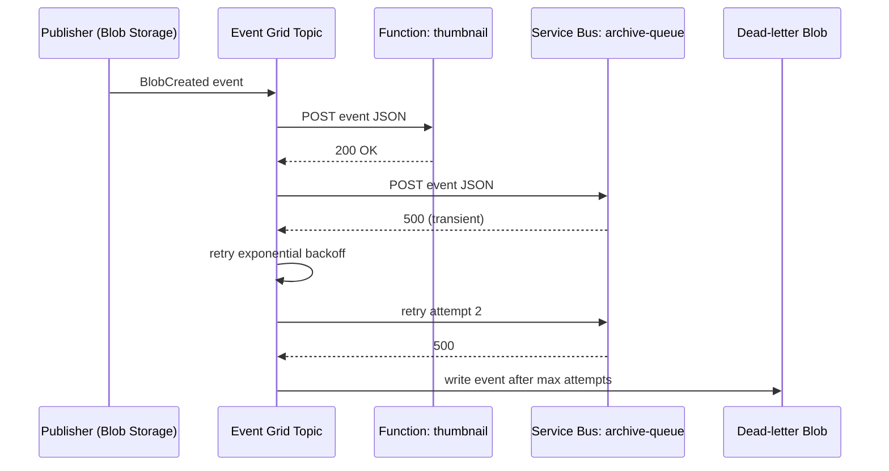

# Event Grid

> **One-liner**: **Event Grid** is a push-based event router — Azure services publish events to a **topic**, you subscribe **handlers** (Functions, webhooks, Service Bus, Event Hub, Logic Apps), and Event Grid delivers with retries and dead-letter.

---

## Quick Reference

| Concept | Meaning |
| ------- | ------- |
| **System Topic** | Built-in publisher for an Azure service (Storage, Resource Group, etc.) |
| **Custom Topic** | You publish to it from your code |
| **Domain** | Multi-tenant fan-in topic; routes to per-tenant subs |
| **Partner Topic** | Third-party events (Auth0, SAP, GitHub) |
| **Event Subscription** | Handler binding + filter + retry policy |
| **Event Schema** | EventGridEvent (legacy) or **CloudEvents 1.0** (preferred) |
| **Dead-letter** | Failed events go to a blob container |
| **Filter** | Subject prefix/suffix, event type, advanced JSON path |
| **MaxDeliveryAttempts / EventTTL** | Retry / give-up policy |

| Handler type | Notes |
| ------------ | ----- |
| **Azure Function** | Push-style trigger; idiomatic for .NET |
| **Webhook** | Any HTTPS endpoint; must validate handshake |
| **Service Bus queue/topic** | Bridge for durable processing |
| **Event Hub** | Bridge for high-volume streaming |
| **Logic App** | Workflow handler |
| **Storage Queue** | Cheap simple sink |

---

## Core Concept

Event Grid is **push** — the source publishes; Event Grid delivers to all matching subscribers. Compare to Event Hubs (pull, ordered, partitioned) and Service Bus (pull, queued, durable).

Use it for **reactive plumbing**: blob uploaded → Function processes; resource created → policy evaluator runs; user sign-up → fan-out to mail/CRM/analytics. Per-event cost is tiny (first 100k/month free), built to scale to millions/sec.

Retries with **exponential backoff** are automatic; events that exhaust retries go to a dead-letter blob if configured.

**CloudEvents 1.0** is the preferred schema — interoperable, with `type`, `source`, `id`, `time`, `data`. Use it for new code; the legacy `EventGridEvent` shape is supported for older integrations.

---

## Diagram



---

## Syntax & API

### Subscribe a Function to blob events

```bash
RG=rg-eg-demo
LOC=eastus
SA=stevents$RANDOM$RANDOM
FN=fn-thumb-$RANDOM

az group create -n $RG -l $LOC
az storage account create -n $SA -g $RG -l $LOC --sku Standard_LRS

az functionapp create -n $FN -g $RG -l $LOC \
  --runtime dotnet-isolated --functions-version 4 \
  --consumption-plan-location $LOC --storage-account $SA

# Subscription: filter to images only, send to function
SA_ID=$(az storage account show -n $SA -g $RG --query id -o tsv)
FN_ID=$(az functionapp function show -g $RG -n $FN \
  --function-name OnBlob --query id -o tsv)

az eventgrid event-subscription create \
  --name on-image-uploaded \
  --source-resource-id $SA_ID \
  --endpoint $FN_ID --endpoint-type azurefunction \
  --included-event-types Microsoft.Storage.BlobCreated \
  --subject-begins-with /blobServices/default/containers/images/ \
  --advanced-filter "data.contentType StringContains 'image'" \
  --deadletter-endpoint $SA_ID/blobServices/default/containers/dlq
```

### .NET — publish custom CloudEvents to a custom topic

```csharp
using Azure.Identity;
using Azure.Messaging;
using Azure.Messaging.EventGrid;

var endpoint = new Uri("https://orders-topic.eastus-1.eventgrid.azure.net/api/events");
var publisher = new EventGridPublisherClient(endpoint, new DefaultAzureCredential());

var ev = new CloudEvent(
    source: "contoso/orders",
    type: "Contoso.Orders.OrderPlaced",
    jsonSerializableData: new { OrderId = "o123", Total = 99.95m, At = DateTime.UtcNow });

await publisher.SendEventAsync(ev);
```

### Function handler

```csharp
[Function("OnOrderPlaced")]
public async Task Run([EventGridTrigger] CloudEvent ev, FunctionContext ctx)
{
    var log = ctx.GetLogger<UsersFunction>();
    log.LogInformation("event id={id} type={type}", ev.Id, ev.Type);
    var data = ev.Data!.ToObjectFromJson<OrderPlaced>();
    await handler.HandleAsync(data);
}
```

### Webhook handshake (raw HTTP handlers)

```csharp
app.MapPost("/eg-webhook", async (HttpContext ctx) =>
{
    using var doc = await JsonDocument.ParseAsync(ctx.Request.Body);
    var first = doc.RootElement.EnumerateArray().First();

    // Handshake: respond with the validation code
    if (first.GetProperty("eventType").GetString() ==
        "Microsoft.EventGrid.SubscriptionValidationEvent")
    {
        var code = first.GetProperty("data").GetProperty("validationCode").GetString();
        return Results.Ok(new { validationResponse = code });
    }
    // Normal events
    // ... handle ...
    return Results.Ok();
});
```

---

## Common Patterns

- **Storage → Function**: blob lands → Function does work. The canonical "serverless ETL" trigger.
- **Resource Group event audit**: subscribe to `Microsoft.Resources.ResourceWriteSuccess` on a sub to log every create/update.
- **Domain-event fan-out**: publish `OrderPlaced` once; downstream services each have their own sub with their own filter.
- **Cross-region replication**: subscribe Event Hub in region B to your custom topic; ship events globally.
- **Webhook fan-out to third parties** with signed payloads — Event Grid signs every request.

---

## Gotchas & Tips

- **At-least-once delivery.** Duplicates happen; consumers must be idempotent.
- **Order is not guaranteed.** Use Event Hubs or Service Bus sessions if you need order.
- **Webhook handshake is mandatory.** Your endpoint must respond with the validation code or echo the `Aeg-Subscription-Validation` header.
- **System topics for some services** require enabling event publishing first (Storage events, ACR push events, etc.).
- **Filters run server-side, not at the source.** You're billed for every published event regardless of filtering.
- **CloudEvents vs EventGridEvent**: pick one per subscription; mixing is a source of subtle bugs.
- **Dead-letter is a blob, not a queue.** You need a process (Function on schedule?) to walk and replay DLQ blobs.
- **Geo-DR is per-region**; Event Grid is regional. For cross-region resilience, replicate publishes or use Event Grid namespaces (newer model with MQTT and pull delivery support).
- **Don't use Event Grid for huge payloads.** Pass a reference (blob URL) and let the consumer fetch.

---

## See Also

- [[11 - Service Bus]]
- [[13 - Event Hubs]]
- [[17 - Event-Driven Architecture]]
- [[02 - Azure Functions]]
