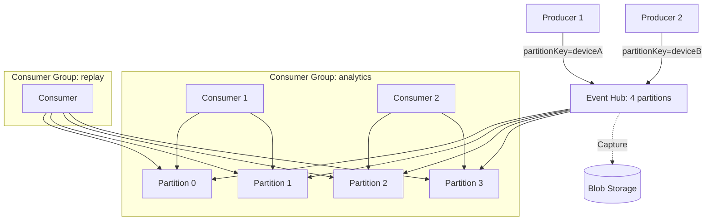

# Event Hubs

> **One-liner**: **Event Hubs** is a big-data streaming ingestion service — millions of events per second per namespace, **partitioned** for parallelism, **pull-based** consumers with **checkpoints**, and a **Kafka-compatible** endpoint so existing Kafka clients work.

---

## Quick Reference

| Concept | Meaning |
| ------- | ------- |
| **Namespace** | Container for hubs; tier-bound |
| **Event Hub** | Stream (≈ Kafka topic); fixed partition count |
| **Partition** | Ordered append-only log; parallelism unit |
| **Producer** | Sends event with optional partition key |
| **Consumer Group** | Independent reader-cursor across partitions |
| **Checkpoint** | Reader's saved offset (in Storage) |
| **Capture** | Auto-archive events to Blob / ADLS |
| **Schema Registry** | Avro/JSON schemas managed in Event Hubs |

| Tier | Highlights |
| ---- | ---------- |
| **Basic** | Single consumer group; small workloads |
| **Standard** | Multiple groups, Capture, geo-DR |
| **Premium** | Predictable performance, larger messages, private link |
| **Dedicated** | Single-tenant clusters for huge throughput |

| vs other messaging | Pick Event Hubs when |
| ------------------ | -------------------- |
| vs Service Bus | High volume, telemetry, ordered streams, replay |
| vs Event Grid | Pull semantics, partitioned ordering, batches |
| vs Kafka self-hosted | You want managed Kafka in Azure with native AAD |

---

## Core Concept

Event Hubs is built for **firehose ingestion** — IoT telemetry, application logs, clickstreams. Producers append events; the hub spreads them across **partitions** (count fixed at create time on Basic/Standard; dynamic on Premium).

A **partition is an ordered, append-only log**. Order is guaranteed within a partition but not across. Producers can pin events to a partition via `partitionKey` (`deviceId`, `userId`) to keep related events together.

**Consumer groups** let multiple downstream systems read the same hub at different cadences. Each group has its own checkpoint per partition; one group can be reading "live", another doing a backfill from yesterday.

**Capture** writes the stream to blob storage (Avro by default) on a time/size window — instant offline archive without ETL code.

**Kafka surface** means Kafka producers/consumers can target Event Hubs by changing only the broker URL — useful for lift-and-shift.

---

## Diagram



---

## Syntax & API

### Provision a namespace + hub

```bash
RG=rg-eh-demo
LOC=eastus
NS=eh-telemetry-$RANDOM
HUB=device-events

az group create -n $RG -l $LOC
az eventhubs namespace create -g $RG -n $NS -l $LOC --sku Standard

az eventhubs eventhub create -g $RG --namespace-name $NS -n $HUB \
  --partition-count 4 --retention-time 24

# Capture to blob
SA=stevcap$RANDOM
az storage account create -n $SA -g $RG --sku Standard_LRS
az storage container create -n captured --account-name $SA --auth-mode login
az eventhubs eventhub update -g $RG --namespace-name $NS -n $HUB \
  --enable-capture true --capture-interval 60 --capture-size-limit 314572800 \
  --destination-name EventHubArchive.AzureBlockBlob \
  --storage-account $SA --blob-container captured \
  --archive-name-format "{Namespace}/{EventHub}/{PartitionId}/{Year}/{Month}/{Day}/{Hour}/{Minute}/{Second}"
```

### .NET — publish

```csharp
await using var producer = new EventHubProducerClient(
    $"{ns}.servicebus.windows.net", "device-events", new DefaultAzureCredential());

using var batch = await producer.CreateBatchAsync(new CreateBatchOptions
{
    PartitionKey = telemetry.DeviceId   // colocate device events
});
batch.TryAdd(new EventData(JsonSerializer.SerializeToUtf8Bytes(telemetry)));
await producer.SendAsync(batch);
```

### .NET — consume with EventProcessorClient

```csharp
var blob = new BlobContainerClient(
    new Uri("https://stcheckpoints.blob.core.windows.net/checkpoints"),
    new DefaultAzureCredential());

var processor = new EventProcessorClient(
    blob, "$Default",
    $"{ns}.servicebus.windows.net", "device-events",
    new DefaultAzureCredential());

processor.ProcessEventAsync += async args =>
{
    var json = args.Data.EventBody.ToString();
    await handler.HandleAsync(json);
    if (args.HasEvent && args.PartitionContext.PartitionId is { } pid)
        await args.UpdateCheckpointAsync();   // checkpoint every event or every N
};
processor.ProcessErrorAsync += a => { log.Error(a.Exception, "EH error"); return Task.CompletedTask; };
await processor.StartProcessingAsync();
```

### Kafka producer pointed at Event Hubs

```properties
bootstrap.servers=eh-telemetry.servicebus.windows.net:9093
security.protocol=SASL_SSL
sasl.mechanism=PLAIN
sasl.jaas.config=org.apache.kafka.common.security.plain.PlainLoginModule required \
   username="$ConnectionString" password="Endpoint=sb://...;SharedAccessKeyName=...;SharedAccessKey=...";
```

---

## Common Patterns

- **IoT telemetry**: device id as partition key; multiple consumer groups for hot path (alerts), warm path (analytics), cold path (archive via Capture).
- **App log ingest**: producer sidecar batches logs every second; analytics consumer + Capture for long-term storage.
- **Event sourcing**: append events; rebuild projections by replaying from start of partitions.
- **Kafka migration**: keep producers and consumers; just swap the broker URL.
- **Capture + Synapse**: events land in blob → Synapse Serverless SQL queries them — cheap warehousing.

---

## Gotchas & Tips

- **Partition count is fixed on Standard.** Plan for max parallelism upfront — you can't add partitions after creation (Premium allows scale).
- **Order is per-partition.** Cross-partition order requires application-side reordering (timestamps, sequence numbers).
- **Checkpoint frequency** is a knob: too often = blob writes dominate; too rarely = big reprocessing window after crash. Typical: every 100–1000 events.
- **Send-side batching dominates throughput.** A single send/event spec drops to a few thousand/sec; batched sends hit millions.
- **Throughput Units (TU) on Standard** are pre-purchased capacity. Auto-inflate raises TU when traffic spikes; you pay for the high-water mark.
- **Premium uses Processing Units (PU)**; higher base cost but predictable performance.
- **Capture's Avro format** is non-trivial to read without Spark/Synapse — confirm your downstream tools handle it.
- **Retention is configurable up to 7 days (Standard) or 90 days (Premium).** Events older than retention are gone — Event Hubs is not a database.
- **Consumer groups beyond 5 require Standard tier.** Plan groups carefully; they're cheap but tied to checkpointing infrastructure.
- **Don't use Event Hubs as a job queue.** It's a stream; for work distribution with locks/DLQ use Service Bus.

---

## See Also

- [[11 - Service Bus]]
- [[12 - Event Grid]]
- [[14 - Storage Queues vs Service Bus]]
- [[17 - Event-Driven Architecture]]
