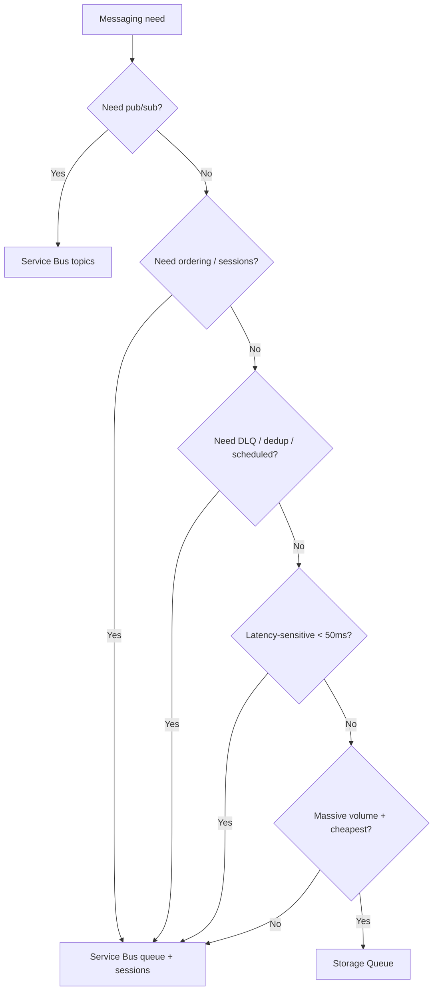

# Storage Queues vs Service Bus

> **One-liner**: Pick **Storage Queue** when you need a cheap, simple, large-volume queue for at-least-once delivery; pick **Service Bus** when you need topics, sessions, dead-letter, duplicate detection, transactions, or sub-200ms latency.

---

## Quick Reference

| Feature | Storage Queue | Service Bus |
| ------- | ------------- | ----------- |
| Message size limit | 64 KB | 256 KB (1 MB on Premium, claim-check for larger) |
| Queue size | 500 TB (storage account) | 80 GB per queue (Standard), unlimited Premium |
| Ordering | Best-effort | FIFO per session |
| Pub/Sub topics | No | Yes |
| Dead-letter queue | No (build with poison-message moves) | Yes, first-class |
| Duplicate detection | No | Yes (time window) |
| Sessions | No | Yes |
| Scheduled delivery | No | Yes |
| Transactions | No | Yes (cross-queue/topic) |
| Auto-forward | No | Yes |
| Latency (typical) | ~10ms but variable | < 10ms (Premium) |
| Throughput | 2k msg/s/queue | High; Premium scales linearly |
| AAD auth | Yes | Yes |
| Cost | Cheapest per million ops | Higher; per-message and per-unit |
| Protocol | HTTPS REST | AMQP 1.0 (+ HTTPS) |

---

## Core Concept

Both are durable, at-least-once queues. **Storage Queue** is the bargain-basement option — a thin layer over Azure Storage. **Service Bus** is the enterprise broker with the features you eventually need for non-trivial messaging.

If your needs are: "submit a job, a worker pulls it, processes, deletes," Storage Queue is fine and costs almost nothing.

If your needs include: "process in order per customer," "fan out to multiple subscribers," "schedule a follow-up in 30 minutes," "detect a duplicate within a window," "send + commit transactionally" — Service Bus is the right tool.

A useful third option is **Service Bus Queues + sessions** when you need ordered processing per partition (`SessionId`), which Storage Queues can't deliver.

---

## Diagram



---

## Syntax & API

### Storage Queue — minimal producer/consumer

```bash
SA=stqueues$RANDOM$RANDOM
az storage account create -n $SA -g $RG -l $LOC --sku Standard_LRS
az storage queue create -n jobs --account-name $SA --auth-mode login
```

```csharp
using Azure.Identity;
using Azure.Storage.Queues;

var client = new QueueClient(
    new Uri($"https://{SA}.queue.core.windows.net/jobs"),
    new DefaultAzureCredential());

// Send
await client.SendMessageAsync("{\"jobId\":\"j1\"}");

// Receive
var resp = await client.ReceiveMessagesAsync(maxMessages: 16,
    visibilityTimeout: TimeSpan.FromMinutes(2));
foreach (var msg in resp.Value)
{
    try { await Process(msg.MessageText); await client.DeleteMessageAsync(msg.MessageId, msg.PopReceipt); }
    catch { /* leave it; it'll reappear after visibility timeout */ }
}
```

### Service Bus equivalent (see [[11 - Service Bus]])

```csharp
await using var sb = new ServiceBusClient(ns, new DefaultAzureCredential());
var sender = sb.CreateSender("jobs");
await sender.SendMessageAsync(new ServiceBusMessage("{\"jobId\":\"j1\"}")
{
    MessageId = "j1",                // dedup
    ScheduledEnqueueTime = DateTimeOffset.UtcNow.AddMinutes(5) // schedule
});
```

---

## Common Patterns

- **Storage Queue** for telemetry/batch ingest where you don't care about order and need throughput cheaply.
- **Storage Queue** as the lightest job queue for Azure Functions; one Function consumes, processes, deletes.
- **Service Bus** for sagas, ordered workflows, cross-service domain events.
- **Bridge pattern**: Storage Queue feeds an intake worker that re-publishes durable workloads onto a Service Bus topic for downstream fan-out.
- **Claim check** for >256 KB payloads: write blob, send the blob URL on the queue.

---

## Gotchas & Tips

- **Storage Queue has no DLQ.** Implement your own — `DequeueCount > N` → move to a `poison` queue.
- **Storage Queue visibility timeout** is the lock duration; default is 30s. Renew via `UpdateMessage` for longer work.
- **Storage Queue ordering is best-effort, not FIFO.** Two consumers can pull two messages and process them out of order.
- **Service Bus Premium has a base cost** even at zero load — Storage Queue is essentially free at low volume.
- **HTTPS-only on Storage Queue** = more overhead per message; Service Bus's AMQP is far more efficient for high-rate.
- **Don't roll your own pub/sub on Storage Queues.** Use Service Bus topics or Event Grid; reinventing is painful.
- **Both support AAD/MI auth**; prefer it over connection strings.
- **`Peek` doesn't change visibility**; `Get` (Storage) and `Receive` (SB peek-lock) do. Pick by intent — observability vs processing.
- **Order matters for billing**: Service Bus charges per operation + per messaging unit (or premium hour). Storage Queue is just per-transaction storage cost.

---

## See Also

- [[11 - Service Bus]]
- [[12 - Event Grid]]
- [[13 - Event Hubs]]
- [[17 - Event-Driven Architecture]]
