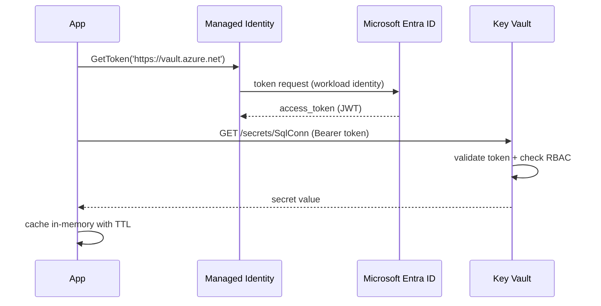

# Key Vault

> **One-liner**: **Azure Key Vault** stores **secrets**, **keys**, and **certificates** behind Entra-ID-authenticated access and **RBAC** — your apps fetch what they need via Managed Identity, no `.env` files, no rotation pain.

---

## Quick Reference

| Object | What it holds |
| ------ | ------------- |
| **Secret** | Arbitrary string (≤ 25 KB); password, connection string, API key |
| **Key** | RSA/EC key pair; can be wrap/unwrap, sign/verify, encrypt/decrypt; never exits the vault |
| **Certificate** | x509 cert + private key; auto-renewal with Public CAs |

| Access model | Notes |
| ------------ | ----- |
| **RBAC** (recommended) | Entra ID roles at vault/key/secret scope |
| **Access Policies** (legacy) | Per-vault ACLs; deprecated in new deployments |

| Tier | Use |
| ---- | --- |
| **Standard** | Software-backed keys; most workloads |
| **Premium** | HSM-backed keys (FIPS 140-2 Level 3) |
| **Managed HSM** | Dedicated HSM cluster (separate resource) |

| Common roles | Permission |
| ------------ | ---------- |
| **Key Vault Administrator** | Full control plane + data |
| **Key Vault Secrets User** | Read secrets only |
| **Key Vault Secrets Officer** | Read/write secrets |
| **Key Vault Crypto User** | Use keys for sign/encrypt operations |

---

## Core Concept

The pattern is simple: **store the secret in KV once**, then the app reads it at startup or per request via its **Managed Identity**. The KV name and secret name are in app config; the value never appears in source or pipelines.

**Soft delete + purge protection** are mandatory in production. Soft delete keeps deleted items recoverable for 7–90 days; purge protection means even a tenant admin can't permanently erase before retention expires.

**Network isolation** for production: disable public access on the vault, attach a private endpoint, and let only your VNet's subnets reach it. Combined with Defender for Key Vault, you get anomaly alerts.

For **certificates**, KV can integrate with public CAs (DigiCert, GlobalSign) for automatic renewal. The cert + private key live in KV; App Service / App Gateway bind to it directly via a secret URI.

---

## Diagram



---

## Syntax & API

### Create a vault + grant access

```bash
RG=rg-app-prod
LOC=eastus
KV=kv-orders-prod-$RANDOM

az group create -n $RG -l $LOC
az keyvault create -g $RG -n $KV -l $LOC \
  --enable-rbac-authorization true \
  --enable-soft-delete true --retention-days 90 \
  --enable-purge-protection true \
  --public-network-access Disabled

# Store a secret
az keyvault secret set --vault-name $KV --name "SqlConn" \
  --value "Server=tcp:sql-orders.database.windows.net;Database=appdb;Encrypt=true;"

# Grant the app's MI read access
APP_PRINCIPAL=$(az webapp identity show -g $RG -n app-orders-prod --query principalId -o tsv)
az role assignment create --assignee $APP_PRINCIPAL --role "Key Vault Secrets User" \
  --scope $(az keyvault show -n $KV --query id -o tsv)
```

### .NET — read with SecretClient

```csharp
using Azure.Identity;
using Azure.Security.KeyVault.Secrets;

var client = new SecretClient(
    vaultUri: new Uri("https://kv-orders-prod.vault.azure.net/"),
    credential: new DefaultAzureCredential());

KeyVaultSecret sqlConn = await client.GetSecretAsync("SqlConn");
var connStr = sqlConn.Value;
```

### App Service — Key Vault references in app settings

```bash
az webapp config appsettings set -g $RG -n app-orders-prod --settings \
  "ConnectionStrings__Default=@Microsoft.KeyVault(SecretUri=https://kv-orders-prod.vault.azure.net/secrets/SqlConn)"
```

App Service automatically resolves the reference at startup; the running app sees a plain string.

### Cert auto-renewal with DigiCert

```bash
# Set up CA issuer (one-time, requires DigiCert account)
az keyvault certificate issuer create -v $KV -n DigiCert \
  --provider DigiCert --account-id <id> --password <key>

# Request a cert
az keyvault certificate create -v $KV -n web-cert \
  --policy "$(az keyvault certificate get-default-policy)"
```

---

## Common Patterns

- **One KV per environment** (`kv-orders-prod`, `kv-orders-dev`). RBAC per environment.
- **Two KVs for separation of duties**: one for app-managed secrets (rotated by code), one for human-managed (DB admin passwords).
- **Use `IConfiguration` integration** in ASP.NET Core — `builder.Configuration.AddAzureKeyVault(...)` makes secrets appear as config keys.
- **Cache aggressively in-app**. KV operations are rate-limited (~2000 ops/10s); don't fetch the same secret on every request.
- **Rotate via a Logic App or Function on a timer** — generate new value, write to KV, update downstream service. KV's "Event Grid on secret near-expiry" event is the trigger.

---

## Gotchas & Tips

- **Purge protection is irreversible.** Once on, you can't disable it. Don't enable on dev/sandbox vaults without forethought.
- **Soft-deleted secrets count toward purge window.** A 90-day retention means deleted secret names are unavailable for 90 days.
- **Rate limits hurt at scale.** Caching for at least 5 minutes is normal; for high-volume reads use Managed HSM or in-memory cache + refresh on miss.
- **Bicep with KV requires `enabledForTemplateDeployment=true`** when you fetch secrets in templates — avoid this pattern; use parameters with `@secure()` instead.
- **`@Microsoft.KeyVault(VaultName=...)` and `(SecretUri=...)` are both valid.** SecretUri is more explicit and recommended for pipelines.
- **Don't grant Contributor on the KV.** Contributor lets the principal grant *itself* data-plane access. Use the data-plane roles (`Secrets User`, `Secrets Officer`).
- **Defender for Key Vault** detects unusual access patterns (unfamiliar IPs, surge in reads). Cheap and worth it.
- **Network ACLs vs Private Endpoint**: ACLs alone leave the public endpoint reachable from listed IPs. Production uses Private Endpoint + Public Disabled.
- **App Service references retry once.** If KV is down at app start, the app fails to start. Plan for cached previous values or graceful degradation.
- **You can store binary data as Base64-encoded secrets**, but keep them small — 25 KB is the hard limit.

---

## See Also

- [[04 - Identity with Microsoft Entra ID]]
- [[16 - Managed Identity]]
- [[12 - Private Endpoints and Zero Trust]]
- [[10 - Defender for Cloud and Sentinel]]
