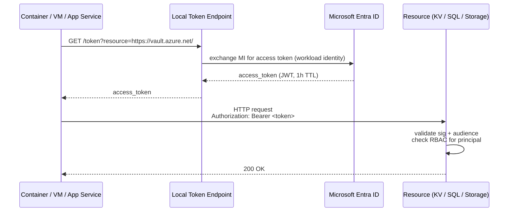

# Managed Identity

> **One-liner**: A **Managed Identity (MI)** is an Entra ID service principal whose secret is managed by Azure — your code asks the local instance metadata service for a token, hands it to any Entra-protected resource, and never sees a password.

---

## Quick Reference

| Type | Lifecycle | When |
| ---- | --------- | ---- |
| **System-assigned** | Tied to the resource; deleted when resource is deleted | Single-resource scope; simplest |
| **User-assigned (UAMI)** | Independent resource; reusable across many compute targets | Shared identity; AKS workload identity; CI federation |

| Where MI is supported | Notes |
| --------------------- | ----- |
| App Service / Functions | First-class; one system-assigned + many user-assigned |
| Container Apps | Same |
| AKS | Via **Workload Identity** (federated UAMI per service account) |
| VMs / VMSS | Yes |
| Logic Apps, Data Factory, etc. | Yes |
| GitHub Actions / Azure DevOps | Yes, via **federated identity credentials** (OIDC) — no MI on the runner, but token federation |

| Resource that accepts MI tokens | Bearer audience |
| ------------------------------- | --------------- |
| Azure Storage | `https://storage.azure.com/` |
| Azure SQL Database | `https://database.windows.net/` |
| Key Vault | `https://vault.azure.net/` |
| Service Bus / Event Hub | `https://servicebus.azure.net/` |
| Azure ARM | `https://management.azure.com/` |
| Cosmos DB (data plane) | `https://cosmos.azure.com/` |

---

## Core Concept

A managed identity is "an Entra ID app whose secret you never see." Azure injects the secret into the resource (or its host) at runtime; your code reads the token from a local metadata endpoint (`http://169.254.169.254/metadata/identity/oauth2/token` on VMs, the IMDS).

In .NET, **`DefaultAzureCredential`** abstracts this — it tries MI first when running in Azure, falls back to `az login` / Visual Studio / env vars when running locally. Same code, every environment.

**System-assigned** is the simplest: enable on the resource, get a principal ID, assign roles. When the resource is deleted, the identity is too.

**User-assigned (UAMI)** is a separate resource you create once and *attach* to one or more compute targets. Better for shared identities (a single MI used by many App Services), AKS workload identity, and federation to external CI systems.

**Federated identity credentials** let an Entra app trust an external OIDC issuer (GitHub Actions, Kubernetes service account, partner IdP) to mint tokens — no client secret needed in the pipeline.

---

## Diagram



---

## Syntax & API

### Enable system-assigned MI on App Service

```bash
RG=rg-app-prod
APP=app-orders-prod

az webapp identity assign -g $RG -n $APP
PRINCIPAL=$(az webapp identity show -g $RG -n $APP --query principalId -o tsv)

# Grant the MI Storage Blob Data Reader on a specific account
az role assignment create --assignee $PRINCIPAL \
  --role "Storage Blob Data Reader" \
  --scope $(az storage account show -n stappdata -g $RG --query id -o tsv)
```

### Create + attach a UAMI

```bash
az identity create -g $RG -n uami-orders -l $LOC
CLIENT_ID=$(az identity show -g $RG -n uami-orders --query clientId -o tsv)
UAMI_ID=$(az identity show -g $RG -n uami-orders --query id -o tsv)

az webapp identity assign -g $RG -n $APP --identities $UAMI_ID

# Tell the app which UAMI to use (when multiple are attached)
az webapp config appsettings set -g $RG -n $APP \
  --settings AZURE_CLIENT_ID=$CLIENT_ID
```

### Federate a UAMI to GitHub Actions

```bash
az identity federated-credential create -g $RG \
  --identity-name uami-orders --name gh-deploy \
  --issuer "https://token.actions.githubusercontent.com" \
  --subject "repo:contoso/orders-app:ref:refs/heads/main" \
  --audiences api://AzureADTokenExchange
```

```yaml
# .github/workflows/deploy.yml
permissions:
  id-token: write
  contents: read

steps:
- uses: azure/login@v2
  with:
    client-id: ${{ vars.AZURE_CLIENT_ID }}
    tenant-id: ${{ vars.AZURE_TENANT_ID }}
    subscription-id: ${{ vars.AZURE_SUBSCRIPTION_ID }}
- run: az webapp deploy -g rg-app-prod -n app-orders-prod --src-path publish.zip --type zip
```

No client secret anywhere. The runner gets an OIDC token; Entra trades it for an MI access token.

### .NET — DefaultAzureCredential

```csharp
using Azure.Identity;
using Azure.Storage.Blobs;

var cred = new DefaultAzureCredential(new DefaultAzureCredentialOptions
{
    // Only needed if multiple UAMIs are attached
    ManagedIdentityClientId = Environment.GetEnvironmentVariable("AZURE_CLIENT_ID")
});
var blob = new BlobServiceClient(new Uri("https://stappdata.blob.core.windows.net"), cred);
await foreach (var c in blob.GetBlobContainersAsync()) { /* ... */ }
```

---

## Common Patterns

- **One UAMI per workload** that's reused across staging and prod App Services — RBAC is assigned at the UAMI level, not per resource.
- **AKS Workload Identity** — federate a UAMI to a Kubernetes service account; pods authenticated as that MI, no secrets in the cluster.
- **CI/CD via federation** — no service principal client secrets in GitHub/Azure DevOps; the OIDC token is short-lived and scoped.
- **Cross-tenant access** with UAMI: a UAMI in tenant A can call resources in tenant B if tenant B's resource grants the principal.
- **Token caching** — `DefaultAzureCredential` caches tokens for ~1h. Don't re-create it per request; keep a singleton.

---

## Gotchas & Tips

- **Role assignment takes 30–60s to propagate.** Don't deploy + run in CI in 5s and expect it to work — add a retry.
- **App with multiple UAMIs** must specify `AZURE_CLIENT_ID` so the SDK picks the right one; otherwise it errors with "multiple identities found."
- **MI tokens have an audience.** Each Azure service expects a specific audience claim. The SDKs handle this; raw `curl` calls need the right `?resource=` parameter.
- **System-assigned ≠ portable.** If you re-create the resource (e.g., recreate the App Service), the MI is gone; all role assignments scoped to it are dead.
- **MI doesn't work over public internet from outside Azure.** Use a service principal or federated identity from outside.
- **`DefaultAzureCredential` order is configurable.** Override `ExcludeXxxCredential` properties to skip slow ones in production (`ExcludeVisualStudioCodeCredential = true`).
- **Federated credentials are powerful but tricky.** The `subject` claim must match exactly — typos = silent auth failure with cryptic errors.
- **Some SDKs require explicit configuration**: SQL needs `Authentication=Active Directory Default` in the connection string; Postgres needs a token provider; Cosmos has a separate code path.
- **Logging**: enable `AzureEventSourceListener.CreateConsoleLogger()` to see which credential succeeded — invaluable when DefaultAzureCredential silently picks the wrong one locally.

---

## See Also

- [[04 - Identity with Microsoft Entra ID]]
- [[15 - Key Vault]]
- [[15 - CI-CD on Azure]]
- [[OAuth OIDC SSO and Keycloak with .NET]]
