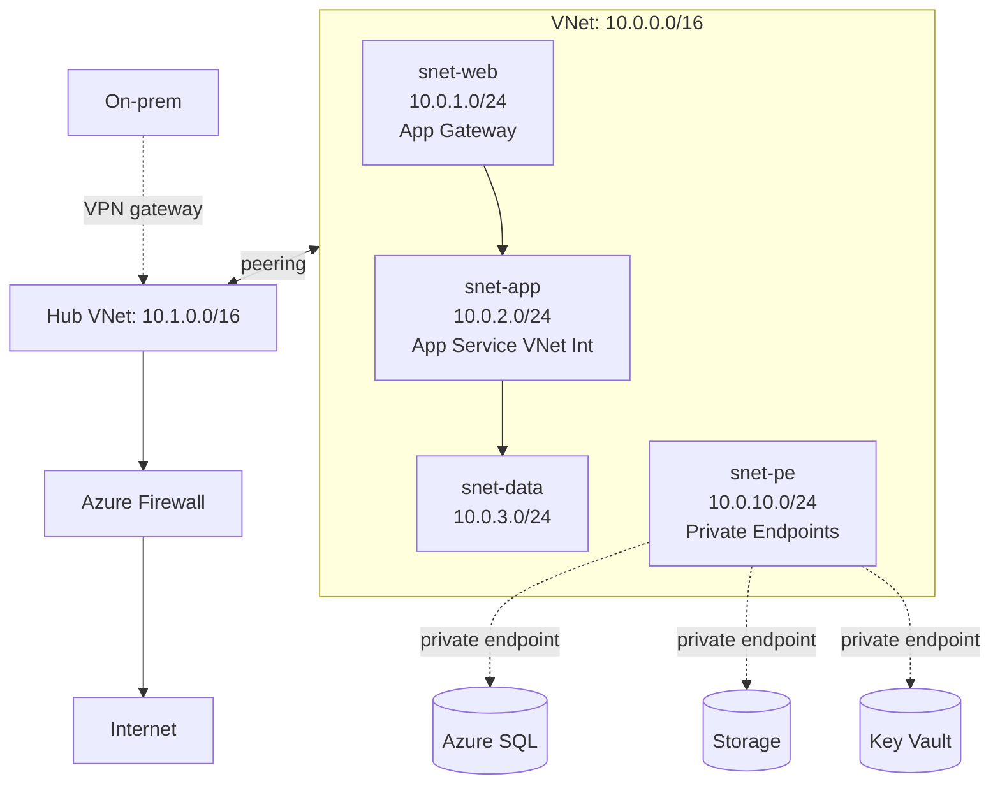

# VNet and Subnets

> **One-liner**: A **Virtual Network** is a private IP space carved into **subnets** with **NSGs** and routing — interconnected by **peering**, locked down with **service endpoints** and **private endpoints**, and accessed from on-prem via **VPN** or **ExpressRoute**.

---

## Quick Reference

| Concept | Meaning |
| ------- | ------- |
| **Address space** | The VNet's CIDR(s); can be extended |
| **Subnet** | CIDR slice; resources land here |
| **Delegated subnet** | A subnet reserved for one service (App Service, AKS, Container Apps) |
| **VNet peering** | Direct private link between VNets; cross-region OK |
| **Service Endpoint** | Optimized route from a subnet to specific PaaS (Storage, SQL, etc.) |
| **Private Endpoint** | NIC in your VNet that maps to a PaaS service privately |
| **Route Table (UDR)** | Custom next-hop rules |
| **Azure Firewall / NVA** | Centralized egress filtering and inspection |
| **NAT Gateway** | Outbound-only static IP for a subnet |
| **VNet integration** (App Service) | Outbound from web app into the VNet |
| **Service Tags** | Microsoft-maintained IP groups used in NSG rules |

---

## Core Concept

A VNet is the network boundary inside which Azure resources speak privately. Cross-VNet, you need **peering** (cheap, fast, point-to-point) or **VNet gateway** (slower, for hybrid).

**Subnets** are how you segment. Some Azure services demand their own subnets:

- **AKS** — dedicated subnet sized for max nodes × pods
- **App Service VNet Integration** — delegated `Microsoft.Web/serverFarms`
- **Container Apps** — `Microsoft.App/environments`
- **Azure Bastion** — `AzureBastionSubnet` (exact name)
- **Application Gateway** — `Microsoft.Web/...` not allowed
- **Azure Firewall** — `AzureFirewallSubnet` (exact name)

**Service Endpoints** vs **Private Endpoints** are commonly confused:

- **Service Endpoint** keeps the public IP of the PaaS service but routes traffic from the subnet over the Azure backbone (no internet hop). Cheaper, simpler, less secure.
- **Private Endpoint** assigns the PaaS service a **private IP in your VNet**. The public endpoint can be disabled. More expensive ($0.01/hour per endpoint + data); the right answer for production.

---

## Diagram



---

## Syntax & API

### Build a multi-subnet VNet

```bash
RG=rg-net
LOC=eastus
az group create -n $RG -l $LOC

az network vnet create -g $RG -n vnet-app \
  --address-prefix 10.0.0.0/16

for sub in "snet-web:10.0.1.0/24" "snet-app:10.0.2.0/24" \
           "snet-data:10.0.3.0/24" "snet-pe:10.0.10.0/24"; do
  NAME=${sub%%:*}; CIDR=${sub##*:}
  az network vnet subnet create -g $RG --vnet-name vnet-app -n $NAME --address-prefix $CIDR
done

# Delegate snet-app to App Service VNet integration
az network vnet subnet update -g $RG --vnet-name vnet-app -n snet-app \
  --delegations Microsoft.Web/serverFarms
```

### App Service VNet integration

```bash
az webapp vnet-integration add -g $RG -n app-orders-prod \
  --vnet vnet-app --subnet snet-app
```

Outbound traffic from the app now flows through `snet-app` — can reach private endpoints, on-prem via the peered hub.

### Private Endpoint for Azure SQL

```bash
SQL_ID=$(az sql server show -g $RG -n sql-orders --query id -o tsv)

az network private-endpoint create -g $RG \
  --name pe-sql-orders \
  --vnet-name vnet-app --subnet snet-pe \
  --private-connection-resource-id $SQL_ID \
  --group-id sqlServer \
  --connection-name conn-sql

# Private DNS zone for *.database.windows.net
az network private-dns zone create -g $RG -n privatelink.database.windows.net
az network private-dns link vnet create -g $RG \
  --zone-name privatelink.database.windows.net \
  -n link-vnet-app --virtual-network vnet-app --registration-enabled false

az network private-endpoint dns-zone-group create -g $RG \
  --endpoint-name pe-sql-orders -n default \
  --private-dns-zone $(az network private-dns zone show -g $RG -n privatelink.database.windows.net --query id -o tsv) \
  --zone-name sqlServer
```

Now `sql-orders.database.windows.net` resolves to a private IP for clients inside `vnet-app`.

### Peering

```bash
az network vnet peering create -g $RG -n app-to-hub \
  --vnet-name vnet-app \
  --remote-vnet $(az network vnet show -g $RG -n vnet-hub --query id -o tsv) \
  --allow-vnet-access --allow-forwarded-traffic
# Create the mirror in the other direction (or in a hub-spoke template).
```

---

## Common Patterns

- **Hub-spoke**: central hub VNet with firewall, DNS, ExpressRoute gateway. Workload "spoke" VNets peer to the hub.
- **Private DNS zones** for every PaaS service used privately (`privatelink.blob.core.windows.net`, `privatelink.vaultcore.azure.net`, etc.). Link to all VNets that need to resolve.
- **Forced tunneling** via the hub firewall — UDR sends all `0.0.0.0/0` traffic through the firewall for inspection.
- **Service endpoints** as a stepping stone before private endpoints — they're free and still keep traffic on the backbone.
- **No public IPs in production.** Compute behind App Gateway/Front Door, PaaS behind private endpoints, egress through NAT Gateway or Firewall.

---

## Gotchas & Tips

- **Plan address spaces in a registry.** Overlapping ranges block peering forever (you'd have to renumber).
- **Subnet sizing reserves 5 IPs.** `/29` gives 3 usable; `/27` gives 27. Don't size delegated subnets for AKS as `/26` — you'll run out of pod IPs.
- **Some subnets need exact names** (`AzureBastionSubnet`, `AzureFirewallSubnet`, `GatewaySubnet`).
- **Delegation is one-way.** A subnet delegated to App Service can't also host another service.
- **Peering doesn't propagate routes transitively** by default. Hub-spoke needs UDRs or Azure Route Server.
- **NSGs don't apply to private endpoints' inbound traffic by default** — recent updates added support. Verify your region.
- **DNS is the silent killer** for private endpoints. Without the private DNS zone link, your app gets the public IP and TLS-fails or fires firewall alerts.
- **VNet peering charges per GB** in both directions. Cross-region peering is more expensive than intra-region.
- **`Allow Azure services` firewall checkboxes** open the door to every other tenant's resources. Use VNet rules or private endpoints, never the global allow.
- **DDoS Protection Standard** is per-VNet — turn on for VNets with public IPs facing untrusted traffic.

---

## See Also

- [[07 - Networking Basics]]
- [[12 - Private Endpoints and Zero Trust]]
- [[11 - Hub and Spoke Networking]]
- [[18 - Application Gateway and Load Balancer]]
