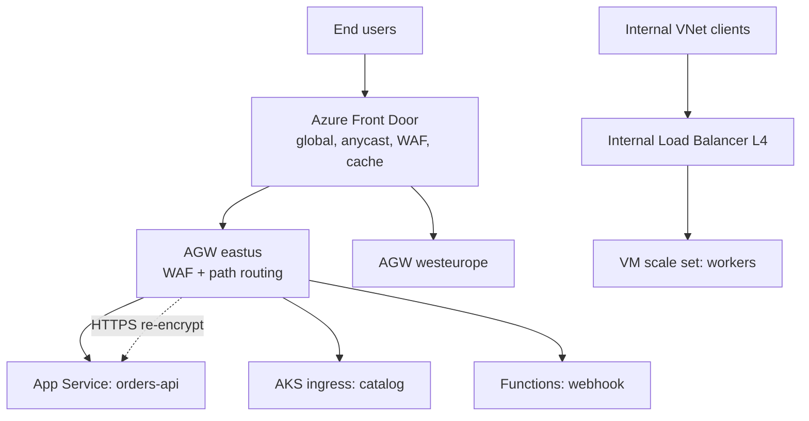

# Application Gateway and Load Balancer

> **One-liner**: **Azure Load Balancer** is layer-4 (TCP/UDP); **Application Gateway** is layer-7 (HTTP/HTTPS) with WAF, path-based routing, TLS termination, and session affinity — pick by what kind of traffic you're routing.

---

## Quick Reference

| Service | Layer | Use for |
| ------- | ----- | ------- |
| **Azure Load Balancer** | L4 (TCP/UDP) | Backend pools of VMs, non-HTTP services, very high throughput |
| **Application Gateway (AGW)** | L7 (HTTP) | Web traffic, path/host routing, TLS, WAF |
| **Azure Front Door** | L7 global | Global entry; CDN; WAF; multi-region |
| **API Management** | L7 | API gateway: policies, throttling, dev portal |
| **Traffic Manager** | DNS-based | Geo/priority routing across endpoints |

| AGW feature | Notes |
| ----------- | ----- |
| **WAF** (Standard_v2 with WAF tier) | OWASP CRS 3.x, bot protection, custom rules |
| **Path-based routing** | `/api/*` → API pool, `/static/*` → static pool |
| **Host-based routing** | Multi-site listeners |
| **TLS termination + re-encryption** | Public TLS to AGW, mTLS to backend |
| **Session affinity** | Cookie-based |
| **URL rewrite / response headers** | Per-rule |
| **Autoscale** | min/max capacity units (CU) |
| **Private deployment** | Internal IP only (Private AGW) |

| LB SKU | Notes |
| ------ | ----- |
| **Basic** | Free, limited, retired soon |
| **Standard** | HA frontends, AZ-redundant, outbound rules, secure-by-default |

---

## Core Concept

**Load Balancer** works on packets — it sees source/dest IPs and ports, doesn't read payloads. Fastest, simplest, used for VM pools, AKS internal LBs, MQ/Kafka brokers.

**Application Gateway** inspects HTTP. It can route based on host (`api.contoso.com` vs `app.contoso.com`), path (`/api/orders/*`), do TLS termination so backends serve plaintext on a private network, and run a **Web Application Firewall** that blocks SQLi/XSS/known bots.

**Front Door** is AGW's global cousin — Microsoft's edge POPs, anycast IP, caching, global WAF. Sits in front of AGW or App Service across regions.

Many production stacks chain them: **Front Door → AGW → AKS / App Service**. Front Door handles global routing and edge caching; AGW handles per-region L7 routing and WAF; the backend pools serve the actual traffic.

---

## Diagram



---

## Syntax & API

### Application Gateway v2 with WAF

```bash
RG=rg-net
LOC=eastus
VNET=vnet-app

# AGW needs its own subnet
az network vnet subnet create -g $RG --vnet-name $VNET \
  -n snet-agw --address-prefix 10.0.20.0/24

az network public-ip create -g $RG -n pip-agw --sku Standard --zone 1 2 3

az network application-gateway create -g $RG -n agw-orders \
  --sku WAF_v2 \
  --capacity 2 \
  --vnet-name $VNET --subnet snet-agw \
  --public-ip-address pip-agw \
  --priority 100 \
  --servers app-orders-prod.azurewebsites.net \
  --http-settings-protocol Https --http-settings-port 443 \
  --frontend-port 443 \
  --cert-file ./certs/web.pfx --cert-password 'pfx-pw'
```

### Path-based routing

```bash
az network application-gateway address-pool create -g $RG \
  --gateway-name agw-orders -n pool-api --servers 10.0.2.10 10.0.2.11

az network application-gateway address-pool create -g $RG \
  --gateway-name agw-orders -n pool-static --servers stappdata.z13.web.core.windows.net

az network application-gateway url-path-map create -g $RG \
  --gateway-name agw-orders -n map-app \
  --paths "/api/*" \
  --address-pool pool-api \
  --default-address-pool pool-static \
  --http-settings http-settings-default --default-http-settings http-settings-default
```

### Enable WAF rules

```bash
az network application-gateway waf-policy create -g $RG -n waf-orders
az network application-gateway waf-policy managed-rule rule-set add \
  -g $RG --policy-name waf-orders \
  --type OWASP --version 3.2
az network application-gateway update -g $RG -n agw-orders \
  --waf-policy waf-orders
```

### Standard internal load balancer for AKS

AKS creates these automatically per `Service type=LoadBalancer`. For internal-only:

```yaml
apiVersion: v1
kind: Service
metadata:
  name: orders-api
  annotations:
    service.beta.kubernetes.io/azure-load-balancer-internal: "true"
spec:
  type: LoadBalancer
  ports: [{port: 443, targetPort: 8080}]
  selector: { app: orders-api }
```

---

## Common Patterns

- **AGW Ingress Controller (AGIC) for AKS** — AGW becomes the Kubernetes ingress; CR maps to AGW listeners/rules.
- **TLS termination + re-encrypt** — public certs at AGW, internal trust at backend; backend can be HTTPS or HTTP if trust boundary allows.
- **WAF with managed CRS 3.2 + custom rules** for app-specific blocks (e.g., IP allowlists per route).
- **Multi-site listeners**: one AGW serves `api.contoso.com`, `admin.contoso.com`, `tenant.contoso.com` from one public IP.
- **Internal AGW + ExpressRoute** for B2B intranets — no public IP at all.

---

## Gotchas & Tips

- **AGW v1 is end-of-life.** Always v2 (`Standard_v2` / `WAF_v2`).
- **AGW needs a dedicated `/26` or larger subnet.** It places multiple instances in there.
- **WAF in Prevention mode blocks suspect requests**; in Detection mode only logs. Start in Detection in staging, watch logs, then switch to Prevention.
- **TLS cert management**: prefer Key Vault integration (`--key-vault-secret-id`) over uploading PFX — auto-rotates with KV.
- **Backend health probes** must succeed for the pool to serve traffic. Default probes hit `/` over the configured protocol; if your app returns 404 on `/`, configure a `/health` probe.
- **Sticky sessions** via affinity cookie. Cookies survive only until backend pool changes; not appropriate for stateless web apps.
- **HTTP/2 requires TLS** and only between client and AGW; AGW→backend is HTTP/1.1.
- **mTLS**: AGW v2 supports mTLS from clients (in preview/GA depending on region) and to backends.
- **Front Door + AGW + AKS** has many layers. Each costs money and adds latency; only stack what you need.
- **Don't mix internal AGW with internet-facing roles.** Use Standard Load Balancer for L4 internal, Internal AGW for L7 internal, Front Door for global L7 public.

---

## See Also

- [[19 - Azure Front Door and CDN]]
- [[17 - VNet and Subnets]]
- [[03 - AKS Production Patterns]]
- [[12 - Private Endpoints and Zero Trust]]
