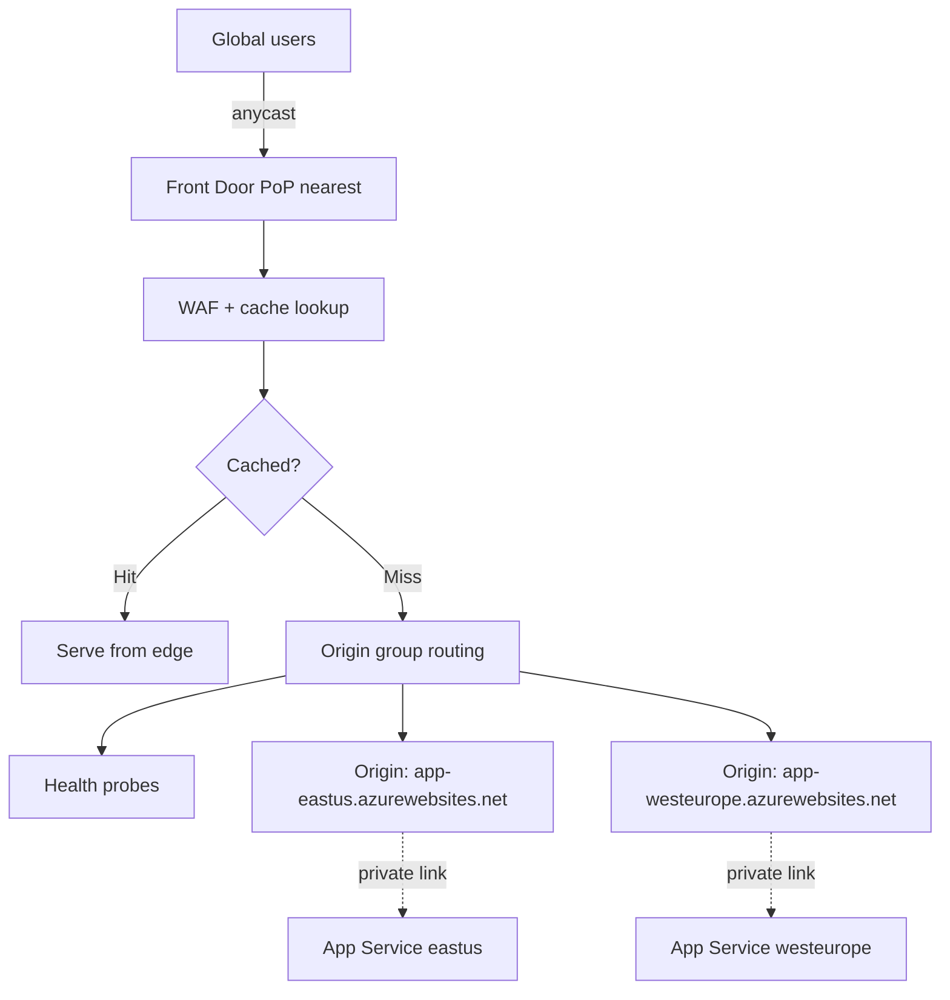

# Azure Front Door and CDN

> **One-liner**: **Azure Front Door** is Microsoft's global edge — anycast IP, TLS at the POP, **WAF**, **caching**, **path-based routing**, and **automatic regional failover** — the modern front-end for any multi-region app.

---

## Quick Reference

| Tier | Highlights |
| ---- | ---------- |
| **Standard** | Routing + CDN + WAF (limited) |
| **Premium** | Full WAF (managed rules + bot protection), private origin via Private Link, custom WAF rules with logging |

| Concept | Meaning |
| ------- | ------- |
| **Profile** | Top-level Front Door resource |
| **Endpoint** | The user-facing hostname (`*.azurefd.net` + custom) |
| **Origin Group** | Set of backends (App Service, Storage, AKS, on-prem) |
| **Origin** | One backend; weighted; health-probed |
| **Route** | URL pattern + origin group + behaviors (cache, compress, redirect) |
| **Rule Set** | Optional Rules Engine for header/URL rewrites |
| **Security Policy** | Attaches a WAF policy to one or more endpoints |

| vs Application Gateway | Front Door = global, AGW = regional |
| ---------------------- | ----------------------------------- |

| vs Classic CDN | Front Door is the new platform; Classic Azure CDN is deprecated |

---

## Core Concept

Front Door has **PoPs in 200+ cities**. Clients hit the nearest PoP via anycast; Front Door terminates TLS, applies WAF, optionally caches static content, then connects to the configured **origin** over Microsoft's backbone.

**Origin groups** can include multiple origins across regions with health probes — Front Door routes to healthy origins and fails over automatically.

**Caching** is the CDN aspect: static assets get cached at the edge with configurable TTLs and cache keys; dynamic responses pass through.

**WAF** runs at the edge — bad requests die thousands of miles from your origin. Managed rule sets are kept current by Microsoft; you add custom rules for IP allowlists, geo-blocks, rate limits.

**Private Link origins** (Premium) mean your backend has no public IP — Front Door connects via a managed private endpoint into your VNet.

---

## Diagram



---

## Syntax & API

### Create profile + endpoint + origin group + route

```bash
RG=rg-fd-demo
LOC=global
PROFILE=fd-orders
EP=ep-$RANDOM

az group create -n $RG -l eastus
az afd profile create -g $RG --profile-name $PROFILE --sku Premium_AzureFrontDoor

az afd endpoint create -g $RG --profile-name $PROFILE \
  --endpoint-name $EP --enabled-state Enabled

# Origin group with health probes
az afd origin-group create -g $RG --profile-name $PROFILE \
  --origin-group-name og-app \
  --probe-protocol Https --probe-path /health \
  --probe-interval-in-seconds 30 \
  --sample-size 4 --successful-samples-required 3 \
  --additional-latency-in-milliseconds 50

# Two origins (multi-region active-active)
az afd origin create -g $RG --profile-name $PROFILE \
  --origin-group-name og-app --origin-name eastus \
  --host-name app-orders-east.azurewebsites.net \
  --origin-host-header app-orders-east.azurewebsites.net \
  --priority 1 --weight 1000 \
  --enabled-state Enabled \
  --https-port 443

az afd origin create -g $RG --profile-name $PROFILE \
  --origin-group-name og-app --origin-name westeurope \
  --host-name app-orders-west.azurewebsites.net \
  --origin-host-header app-orders-west.azurewebsites.net \
  --priority 1 --weight 1000 \
  --enabled-state Enabled

# Route: everything to og-app, cache /static/*
az afd route create -g $RG --profile-name $PROFILE \
  --endpoint-name $EP --route-name r-default \
  --origin-group og-app \
  --supported-protocols Http Https \
  --https-redirect Enabled \
  --forwarding-protocol HttpsOnly \
  --patterns-to-match "/*" \
  --link-to-default-domain Enabled
```

### WAF policy with managed rules

```bash
az afd security-policy create -g $RG --profile-name $PROFILE \
  --security-policy-name sp-default \
  --domains $EP.<region>.azurefd.net \
  --waf-policy $(az network front-door waf-policy create -g $RG \
       -n waf-orders --sku Premium_AzureFrontDoor --query id -o tsv)
```

### Custom domain + free Managed Certificate

```bash
az afd custom-domain create -g $RG --profile-name $PROFILE \
  --custom-domain-name app-contoso \
  --host-name app.contoso.com \
  --certificate-type ManagedCertificate \
  --minimum-tls-version TLS12

# Show DNS records to add (CNAME + validation TXT)
az afd custom-domain show -g $RG --profile-name $PROFILE \
  --custom-domain-name app-contoso \
  --query "{cname:hostName, validationProps:validationProperties}"
```

---

## Common Patterns

- **Multi-region active-active**: two App Service Plans (or AKS clusters) in paired regions; Front Door routes by latency, failover on probe failure.
- **Front Door + Private Link**: origins have no public IP; only Front Door can reach them. Combine with `X-Azure-FDID` header validation to refuse direct-to-origin traffic.
- **Static + dynamic split**: cache `/static/*` at edge with 7-day TTL; pass `/api/*` through with no cache.
- **WAF managed + custom rules**: managed rule set for OWASP; custom rules for IP allowlist on `/admin/*`, geo-block on banned countries, rate-limit on `/api/login`.
- **Rules engine** for URL rewrites, custom redirects, A/B header routing.

---

## Gotchas & Tips

- **Premium tier is required** for WAF custom rules, bot protection, and Private Link origins. Standard's WAF is limited.
- **Custom Managed Certificate auto-renews** but only for the hostname bound to Front Door. Domain validation can take hours after DNS propagates.
- **Origin host header** often must be set explicitly — if your App Service hostname differs from the custom domain, set `--origin-host-header` to the App Service FQDN.
- **`X-Forwarded-*` headers** are added; your app must trust them (and only when behind Front Door). In ASP.NET Core: `services.Configure<ForwardedHeadersOptions>(...)`.
- **Origin lock-down**: validate `X-Azure-FDID` header in the app (`Frontdoor-Id` value) and reject direct hits. Without this, attackers bypass WAF by hitting the App Service URL directly.
- **Caching of authenticated responses** is dangerous. Strip `Authorization`/cookies from cache keys or disable caching for those routes.
- **Health probes contribute to compute load** at origins — they hit every origin every 30s × many PoPs. Use a cheap `/health` endpoint, not `/api/users`.
- **Path normalization** can confuse routing. URL-encoded paths normalize at Front Door before matching patterns.
- **Logging** to Log Analytics is essential — Front Door logs include client IP, WAF rule hits, origin chosen, latency. Set retention up; the data is gold during incidents.

---

## See Also

- [[18 - Application Gateway and Load Balancer]]
- [[13 - Multi-Region HA]]
- [[10 - Defender for Cloud and Sentinel]]
