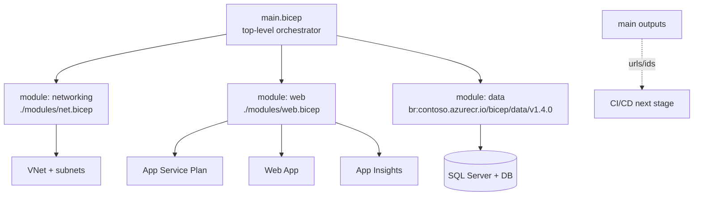

# Bicep Modules

> **One-liner**: A **Bicep module** is just a Bicep file consumed by another — promote repeated resource patterns into modules with typed parameters/outputs, share them via a private **Bicep Registry** (an ACR), and compose them in a top-level `main.bicep`.

---

## Quick Reference

| Concept | Meaning |
| ------- | ------- |
| **Module** | Bicep file referenced with `module x './x.bicep'` |
| **Param** | Typed input; can be `@secure()` for secrets |
| **Output** | Value the caller can read (e.g., resource ID) |
| **`existing`** | Reference a resource that already exists; doesn't deploy it |
| **Scope** | Module deploys to a different scope (sub, MG) than its parent |
| **Loop** (`for`) | Deploy N instances of a module |
| **Conditional** (`if`) | Deploy module only when expression is true |
| **Decorator** (`@allowed`, `@minLength`, `@description`) | Param validation/documentation |

| Sharing strategy | Use |
| ---------------- | --- |
| **Local folder** (`./modules/`) | Single-team, single-repo |
| **Bicep Registry in ACR** (`br:`) | Org-wide sharing with versions |
| **Template Specs** | Static templates published to a subscription/RG |
| **Public Bicep Registry** | Microsoft & community modules |

---

## Core Concept

Modules are reusable building blocks. Instead of pasting the same App Service Plan + Web App + Application Insights block in every Bicep file, you write it once as `modules/web-app.bicep` and call it.

Each module deployment is recorded as a nested ARM deployment, so you can track and roll back independently.

**Bicep Registry** is a private package registry stored in an Azure Container Registry. You publish a module with `bicep publish`, reference it with `br:` URI, pin a version, and consumers get cached lookups.

**Template Specs** are an older mechanism for sharing — a Resource-Manager-managed template artifact. Still supported but less flexible than the registry.

---

## Diagram



---

## Syntax & API

### A reusable web-app module

```bicep
// modules/web-app.bicep
@description('Region for all resources')
param location string

@description('App name (must be globally unique for the FQDN)')
@minLength(2) @maxLength(40)
param appName string

@description('App Service Plan SKU')
@allowed(['B1', 'S1', 'P1v3'])
param sku string = 'S1'

@description('App settings to apply (besides what the module sets)')
param appSettings object = {}

resource plan 'Microsoft.Web/serverfarms@2023-12-01' = {
  name: 'plan-${appName}'
  location: location
  sku: { name: sku, tier: sku == 'B1' ? 'Basic' : (sku == 'S1' ? 'Standard' : 'PremiumV3') }
  properties: { reserved: true }
}

resource app 'Microsoft.Web/sites@2023-12-01' = {
  name: appName
  location: location
  identity: { type: 'SystemAssigned' }
  properties: {
    serverFarmId: plan.id
    httpsOnly: true
    siteConfig: {
      linuxFxVersion: 'DOTNETCORE|8.0'
      alwaysOn: true
      minTlsVersion: '1.2'
      ftpsState: 'Disabled'
      appSettings: [for (key, value) in items(appSettings): {
        name: key
        value: string(value)
      }]
    }
  }
}

output appId string = app.id
output principalId string = app.identity.principalId
output defaultHostName string = app.properties.defaultHostName
```

### `main.bicep` composing modules

```bicep
targetScope = 'resourceGroup'

param env string
param location string = resourceGroup().location

var appName = 'app-orders-${env}-${uniqueString(resourceGroup().id)}'

module web './modules/web-app.bicep' = {
  name: 'web-deploy'
  params: {
    location: location
    appName: appName
    sku: env == 'prod' ? 'P1v3' : 'B1'
    appSettings: {
      Environment__Name: env
      APPLICATIONINSIGHTS_CONNECTION_STRING: ai.outputs.connectionString
    }
  }
}

module ai './modules/app-insights.bicep' = {
  name: 'ai-deploy'
  params: { location: location, name: 'ai-${appName}' }
}

output webUrl string = 'https://${web.outputs.defaultHostName}'
```

### Publish to Bicep Registry (ACR)

```bash
# One-time: create an ACR with anonymous pull disabled
az acr create -g rg-iac -n bicepregistry --sku Basic

# Publish a version
az bicep publish --file modules/web-app.bicep \
  --target br:bicepregistry.azurecr.io/bicep/web-app:v1.0.0
```

Consume from another repo:

```bicep
module web 'br:bicepregistry.azurecr.io/bicep/web-app:v1.0.0' = {
  name: 'web'
  params: { location: location, appName: 'app-x' }
}
```

### Loop deploys (one module per region)

```bicep
param regions array = ['eastus', 'westeurope']

module webs './modules/web-app.bicep' = [for r in regions: {
  name: 'web-${r}'
  params: { location: r, appName: 'app-${r}' }
}]
```

---

## Common Patterns

- **One module per "deployable thing"**: `web-app`, `sql-server`, `storage-with-pe`, `vnet-with-subnets`. Composable and testable.
- **`bicepparam` files per environment** keep secrets and stage-specific values out of source modules.
- **Outputs for everything downstream needs** — App Insights connection strings, resource IDs, hostnames. The consumer should never have to construct an ID manually.
- **Pin module versions** via SemVer tags in the registry. Bump intentionally; never `:latest` in production.
- **`existing` keyword** to reference a resource that lives in another scope/RG (e.g., a shared Key Vault).

---

## Gotchas & Tips

- **Module name uniqueness**: the `name:` of a module is the *deployment* name within ARM. Two modules with the same name in one main.bicep will conflict.
- **Decompile is best-effort.** `bicep decompile` from ARM JSON gives you ugly Bicep; clean it up before committing.
- **Conditional modules still validate** their template — even `if (false)` modules cause type errors if params don't match.
- **Looping over modules** creates a parallel deployment for each iteration; great for speed, painful if you have rate-limit issues.
- **Cross-scope deployments** (subscription, MG) require `targetScope` at the file level. You can't change scope inside a module.
- **`@secure()` strings are hidden** in outputs and logs but still passed in plain over the wire. For real secrets, use Key Vault references.
- **What-if isn't perfect.** It flags some no-op changes (like collection ordering). Treat as a hint, not gospel.
- **Linter warnings matter.** `bicep lint` catches missing parameters, unused vars, hardcoded locations. Add it to CI.
- **API versions matter** — `@2023-12-01` and `@2024-04-01` may differ. Pin and re-test on bump.

---

## See Also

- [[10 - IaC with ARM and Bicep]]
- [[15 - CI-CD on Azure]]
- [[02 - Landing Zones]]
