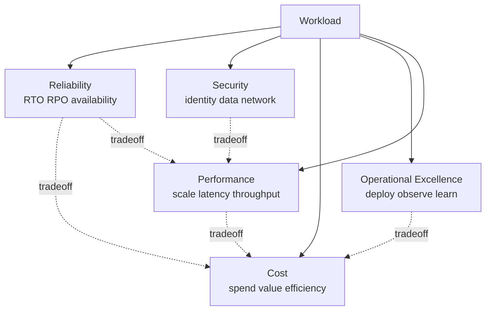

# Well-Architected Framework

> **One-liner**: The **Azure Well-Architected Framework (WAF)** is Microsoft's checklist of five trade-off pillars — **Reliability, Security, Cost Optimization, Operational Excellence, Performance Efficiency** — and a free **Well-Architected Review** tool that scores any workload against them.

---

## Quick Reference

| Pillar | One-line goal |
| ------ | ------------- |
| **Reliability** | Recover from failure within agreed RTO/RPO |
| **Security** | Protect data and identities, assume breach |
| **Cost Optimization** | Pay only for value delivered |
| **Operational Excellence** | Ship safely and learn from production |
| **Performance Efficiency** | Use resources efficiently as load changes |

| Tool | Purpose |
| ---- | ------- |
| **WAF Review** (Azure portal) | Score a workload, get prioritized recommendations |
| **Advisor** | Continuous, resource-level WAF recommendations |
| **Reliability workbook** | Reliability pillar deep-dive in Azure Monitor |
| **Reference architectures** | `learn.microsoft.com/azure/architecture` baked-in WAF |

| Companion frameworks | Purpose |
| -------------------- | ------- |
| **Cloud Adoption Framework (CAF)** | Org-level lifecycle (strategy → adopt → govern) |
| **Landing Zones** | The CAF "Ready" implementation; see [[02 - Landing Zones]] |

---

## Core Concept

WAF is not a certification or a gate — it's a **shared vocabulary** for trade-off conversations. Every architectural choice trades one pillar against others; making that explicit beats surprise post-mortems.

**Reliability** asks "what breaks first, and what does the user experience when it does?" Concretely: zonal vs regional services, retry policies, health probes, RTO/RPO targets.

**Security** assumes breach: every identity is suspect, every network path is hostile until proven safe. The default posture is zero-trust ([[12 - Private Endpoints and Zero Trust]]).

**Cost** is a first-class non-functional requirement. A reliable system you can't afford fails the business.

**Operational Excellence** is about feedback loops: deploy → observe → learn. Without this pillar, the other four decay.

**Performance** isn't peak speed; it's matching capacity to demand without waste. Auto-scaling, caching, picking the right SKU.

The **WAF Review** tool walks a workload owner through ~50 questions per pillar, scores 0–100 per pillar, and produces a prioritized backlog mapped to Microsoft Learn articles. Run it quarterly.

---

## Diagram



---

## Syntax & API

### Run a WAF Review

```bash
# Open in browser; no CLI for the assessment itself
open https://learn.microsoft.com/assessments/azure-architecture-review/
```

The review is form-based. Output is a downloadable JSON + PDF with a prioritized backlog.

### Pull Advisor recommendations (resource-level WAF)

```bash
SUB=$(az account show --query id -o tsv)

# All recommendations across pillars
az advisor recommendation list --query "[].{Category:category, Impact:impact, Resource:impactedField, Problem:shortDescription.problem}" -o table

# Filter to reliability + high impact only
az advisor recommendation list \
  --query "[?category=='HighAvailability' && impact=='High']" -o table
```

### Suppress a recommendation that's intentional

```bash
az advisor recommendation disable \
  --recommendation-name <recommendationGuid> \
  --days 90
```

### Reliability checks via Resource Graph

```bash
# Find all storage accounts not using ZRS/GRS
az graph query -q "
  resources
  | where type =~ 'microsoft.storage/storageaccounts'
  | where sku.name in ('Standard_LRS','Standard_ZRS') == false
  | project name, location, sku=sku.name
" -o table
```

---

## Common Patterns

- **Quarterly WAF Review per workload.** Same template, same owner, scores tracked over time. Improvement velocity matters more than absolute score.
- **Pillar champions per team.** One person tracks each pillar's backlog; they don't *own* the work, they own the *visibility*.
- **Pillar-tagged tickets.** Every prod issue post-mortem labels the failed pillar. Patterns surface across workloads.
- **WAF questions in design reviews.** Before any new service goes live, walk through the relevant pillar checklist as a gate.
- **Map Advisor to WAF.** Advisor's `category` field aligns with WAF pillars; pipe the JSON into a dashboard.

---

## Gotchas & Tips

- **WAF is not a checklist to mechanically pass.** Some recommendations actively conflict (e.g., redundancy increases cost). The framework's value is the *conversation*, not the score.
- **The five pillars share the cost pillar.** Every other pillar costs money; cost is the universal constraint.
- **Reliability ≠ availability.** Reliability includes graceful degradation, not just uptime. A read-only mode during an outage is a reliability win.
- **Don't conflate WAF with CAF.** WAF is per-workload; CAF is org-wide adoption strategy.
- **Performance Efficiency rewards rightsizing**, not premium SKUs. Many "performance" issues are really architecture problems (N+1, missing index).
- **Operational Excellence is the youngest pillar** and the easiest to neglect. If you have no SLO/SLI defined, start there.
- **Advisor's `Cost` recommendations are conservative.** They suggest reservations only after 30 days of usage — not useful for new workloads.
- **Map every WAF gap to either a backlog item or an explicit waiver.** "We accept this risk because…" written down beats silent gaps.
- **Reference architectures aren't always WAF-aligned.** Older quickstarts skip pillars; the architecture-center docs (`learn.microsoft.com/azure/architecture`) are the gold standard.

---

## See Also

- [[02 - Landing Zones]]
- [[09 - RBAC and Azure Policy]]
- [[13 - Multi-Region HA]]
- [[16 - Cost Optimization at Scale]]
