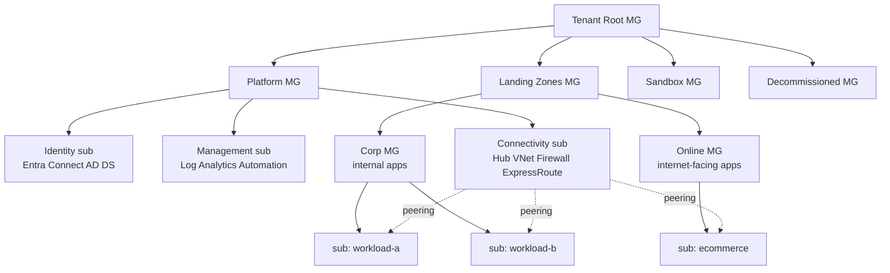

# Landing Zones

> **One-liner**: An **Azure Landing Zone (ALZ)** is a pre-baked, opinionated environment — management groups, policies, networking, identity, and platform services — that you deploy *once* so every new workload has a safe, governed home from day one.

---

## Quick Reference

| Concept | Meaning |
| ------- | ------- |
| **Landing Zone** | An environment ready to host workloads with governance baked in |
| **Platform Landing Zone** | Shared services (identity, network, monitoring, security) |
| **Application Landing Zone** | Per-workload subscription, parented to platform |
| **Enterprise-Scale (ESLZ)** | Microsoft's reference ALZ implementation in Bicep/Terraform |
| **Management Group hierarchy** | Tenant Root → Platform / Landing Zones / Sandbox / Decommissioned |
| **Subscription Vending** | Self-service "request a sub" via PR or service catalog |

| Reference implementations | Repo |
| ------------------------- | ---- |
| **Azure Landing Zones (Bicep)** | `Azure/ALZ-Bicep` |
| **Terraform AVM** | `Azure/terraform-azurerm-avm-ptn-alz` |
| **Azure Verified Modules** | `Azure/Azure-Verified-Modules` |

---

## Core Concept

Without a landing zone, every team builds their own subscription, picks a region, slaps an NSG together, and weeks later security finds open public IPs. ALZ inverts this: **the platform team ships a paved road**, and workload teams stay on it.

The hierarchy is what makes it work. **Management Groups** layer policy: the `Landing Zones` MG forces tag inheritance, region restrictions, NSG flow-log requirements; subscriptions inherit those rules and *cannot* opt out without an exception.

A standard ESLZ ships eight subscription archetypes: **Identity** (Entra Connect, AD DS), **Management** (Log Analytics, automation), **Connectivity** (hub VNet, firewall, ExpressRoute), **Corp** and **Online** for app workloads, plus **Sandbox** and **Decommissioned**.

**Subscription vending** is the workflow that creates new application landing zones: a developer fills a form / opens a PR, a pipeline provisions the subscription, attaches it to the right MG, peers its VNet to the hub, and grants RBAC to the team. Done in minutes, governance enforced.

ALZ is **not a one-time deploy**. It evolves with org needs: new regions opened, new policy initiatives, refactored network. Treat it as a product with its own backlog.

---

## Diagram



---

## Syntax & API

### Bootstrap with the ALZ-Bicep accelerator

```bash
git clone https://github.com/Azure/ALZ-Bicep
cd ALZ-Bicep

# 1. Management Groups
az deployment tenant create \
  --location eastus \
  --template-file infra-as-code/bicep/modules/managementGroups/managementGroups.bicep \
  --parameters @config/custom-parameters/managementGroups.parameters.all.json

# 2. Custom policy definitions
az deployment mg create --management-group-id contoso \
  --location eastus \
  --template-file infra-as-code/bicep/modules/policy/definitions/customPolicyDefinitions.bicep

# 3. Hub network
az deployment sub create --location eastus \
  --template-file infra-as-code/bicep/modules/hubNetworking/hubNetworking.bicep \
  --parameters @config/custom-parameters/hubNetworking.parameters.all.json
```

### Subscription vending (Bicep)

```bicep
targetScope = 'managementGroup'

module sub 'br/public:lz/sub-vending:1.5.0' = {
  name: 'vend-orders-prod'
  params: {
    subscriptionAliasName: 'sub-orders-prod'
    subscriptionDisplayName: 'Orders Prod'
    subscriptionBillingScope: '/providers/Microsoft.Billing/billingAccounts/<id>/billingProfiles/<id>/invoiceSections/<id>'
    subscriptionWorkload: 'Production'
    subscriptionManagementGroupId: 'corp'
    virtualNetworkEnabled: true
    virtualNetworkAddressSpace: ['10.50.0.0/22']
    virtualNetworkPeeringEnabled: true
    hubNetworkResourceId: '/subscriptions/<conn-sub>/resourceGroups/rg-hub/providers/Microsoft.Network/virtualNetworks/vnet-hub'
    roleAssignments: [
      { principalId: '<group-objectId>', definition: 'Contributor', relativeScope: '' }
    ]
  }
}
```

### Apply a baseline policy initiative

```bash
# Assign the "Azure Landing Zones - Corp" initiative to the Corp MG
az policy assignment create \
  --name alz-corp-baseline \
  --scope /providers/Microsoft.Management/managementGroups/corp \
  --policy-set-definition "Enforce-Guardrails-Corp" \
  --location eastus \
  --mi-system-assigned \
  --identity-scope /providers/Microsoft.Management/managementGroups/corp
```

### Audit landing zone drift

```bash
az policy state summarize --management-group-name corp -o table
```

---

## Common Patterns

- **Two-MG split for workloads**: `Corp` (internal, no public IPs allowed) and `Online` (public ingress allowed). Different policy initiatives.
- **Single hub per region** with Azure Firewall, ExpressRoute / VPN gateway, shared private DNS zones for private endpoints.
- **Sandbox MG with aggressive cost guardrails** — auto-shutdown, cheap SKUs only, expiry tags. Devs can experiment without breaking governance.
- **Decommissioned MG** as a holding pattern: subs get moved here, locked, retained 90 days, then deleted.
- **Pipeline-as-product for subscription vending**: PR template + GitHub Actions that runs the Bicep module and posts subscription ID + access details back to the requester.

---

## Gotchas & Tips

- **MGs are slow to propagate.** Policy assignments at MG can take 30+ minutes to evaluate against existing resources.
- **A subscription can only be in one MG.** Moving a sub between MGs immediately changes its inherited policy posture — test in sandbox first.
- **Don't put production workloads at Tenant Root.** Anything at root affects every sub the tenant ever creates, including future ones.
- **The ALZ accelerators evolve fast.** Pin to a release tag, not main, or your next deploy will surprise you.
- **Custom policies live in code.** Never define a policy in the portal for an ALZ — it won't survive the next deploy.
- **Hub VNet IP space is hard to enlarge later.** Start with at least a `/22` per region; growth is painful.
- **Subscription quotas are per-sub, per-region.** New landing zones often hit cores or public-IP quotas immediately. Pre-request increases.
- **Identity sub is special.** AD DS / Entra Connect should not share with anything else. Lock it down hardest.
- **Don't conflate ALZ with CAF.** CAF is the org-wide adoption methodology; ALZ is the "Ready" phase artifact.
- **Tag inheritance ≠ tag enforcement.** Use the `Inherit a tag from the resource group` policy to make tags actually stick on resources.

---

## See Also

- [[01 - Well-Architected Framework]]
- [[09 - RBAC and Azure Policy]]
- [[11 - Hub and Spoke Networking]]
- [[03 - Subscriptions Resource Groups and Tags]]
