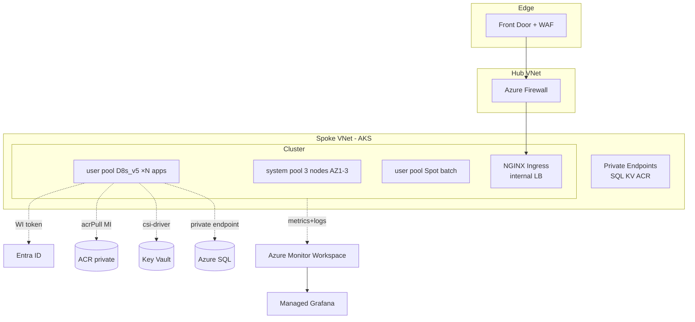

# AKS Production Patterns

> **One-liner**: Production AKS is **not** "AKS Basics with more nodes" — it's a stack of opinionated decisions on **node pools, networking, ingress, identity, autoscaling, observability, and upgrade cadence** that you make once and stop revisiting.

---

## Quick Reference

| Concern | Production default |
| ------- | ------------------ |
| **Tier** | Standard (99.95% control plane SLA) — Free is dev-only |
| **Node pools** | system + N user pools (per workload class) |
| **Network plugin** | **Azure CNI Overlay** (saves VNet IPs at scale) |
| **Network policy** | **Cilium** (eBPF, faster than Calico) |
| **Ingress** | NGINX or AGIC behind a single public IP |
| **Identity** | **Workload Identity** (federated, no secrets) |
| **Image pull** | `--attach-acr` to AKS kubelet identity |
| **Autoscaler** | Cluster Autoscaler + HPA + KEDA |
| **Observability** | Container Insights + Managed Prometheus + Managed Grafana |
| **Secrets** | CSI Secrets Store driver → Key Vault |
| **Upgrades** | `auto-upgrade-channel=stable`, surge upgrade, maint window |
| **Backup** | Azure Backup for AKS (PVs + cluster state) |

| Production add-ons | Why |
| ------------------ | --- |
| **Azure Linux** | Smaller attack surface than Ubuntu, faster boot |
| **Defender for Containers** | Runtime threat detection |
| **Image Cleaner** | Removes unused images from nodes |
| **Service Mesh** (Istio add-on) | mTLS, traffic shaping between services |

---

## Core Concept

The control plane is Microsoft's problem; **everything else is yours**. Production AKS clusters fail in three predictable ways: (1) nodes ran out of IPs, (2) an upgrade went sideways at 3 AM, (3) someone deployed an image without limits and the OOM killer chained.

**Multiple node pools** isolate failure: a Spot pool for batch can lose all nodes without harming the API tier. Taints + tolerations are what enforce this at scheduling time.

**Azure CNI Overlay** is the new default: pods get IPs from an overlay subnet, only nodes consume VNet IPs. Pre-Overlay clusters routinely exhausted /22 subnets at ~250 nodes; Overlay scales past 1000.

**Workload Identity** replaces every prior auth pattern (AAD Pod Identity, secret-mounted SPNs). A Kubernetes service account is federated with an Entra app, and pods get OIDC tokens automatically.

**Upgrades** are unavoidable — Azure supports each minor for ~12 months. Set `auto-upgrade-channel=stable` and a maintenance window; AKS handles the rest with surge.

**Defense in depth**: NetworkPolicy isolates namespaces, Defender flags runtime drift, Pod Security Admission blocks privileged containers, image scanning at ACR + admission with Image Integrity.

---

## Diagram



---

## Syntax & API

### Production-grade cluster create

```bash
RG=rg-aks-prod
LOC=eastus
CLUSTER=aks-orders-prod
ACR=acrordersprod
LAW=law-aks-prod
AMW=amw-aks-prod

az aks create -g $RG -n $CLUSTER \
  --tier standard \
  --kubernetes-version 1.30.5 \
  --auto-upgrade-channel stable \
  --node-os-upgrade-channel NodeImage \
  --enable-cluster-autoscaler \
  --node-count 3 --min-count 3 --max-count 9 \
  --node-vm-size Standard_D4s_v5 \
  --os-sku AzureLinux \
  --zones 1 2 3 \
  --network-plugin azure --network-plugin-mode overlay \
  --network-dataplane cilium --network-policy cilium \
  --pod-cidr 10.244.0.0/16 \
  --enable-managed-identity \
  --enable-oidc-issuer --enable-workload-identity \
  --enable-azure-keyvault-secrets-provider --rotation-poll-interval 5m \
  --enable-azure-monitor-metrics --azure-monitor-workspace-resource-id $(az monitor account show -g $RG -n $AMW --query id -o tsv) \
  --enable-defender --defender-config workspaceResourceId=$(az monitor log-analytics workspace show -g $RG -n $LAW --query id -o tsv) \
  --attach-acr $ACR \
  --api-server-authorized-ip-ranges <your-cidr> \
  --generate-ssh-keys
```

### Add a Spot pool with taints

```bash
az aks nodepool add -g $RG --cluster-name $CLUSTER --name spot \
  --priority Spot --eviction-policy Delete --spot-max-price -1 \
  --node-count 0 --min-count 0 --max-count 20 --enable-cluster-autoscaler \
  --node-vm-size Standard_D8s_v5 --zones 1 2 3 \
  --node-taints "kubernetes.azure.com/scalesetpriority=spot:NoSchedule" \
  --labels workload=batch
```

### Maintenance window (AKS won't upgrade outside this)

```bash
az aks maintenanceconfiguration add -g $RG --cluster-name $CLUSTER --name aksManagedAutoUpgradeSchedule \
  --schedule-type Weekly --interval-weeks 1 --day-of-week Sunday --start-time 02:00 --duration 4 --utc-offset "+00:00"
```

### Pod with Workload Identity + KV CSI

```yaml
apiVersion: secrets-store.csi.x-k8s.io/v1
kind: SecretProviderClass
metadata: { name: kv-orders, namespace: orders }
spec:
  provider: azure
  parameters:
    usePodIdentity: "false"
    useVMManagedIdentity: "false"
    clientID: "${UAMI_CLIENT_ID}"
    keyvaultName: "kv-orders-prod"
    tenantId: "${TENANT_ID}"
    objects: |
      array:
        - |
          objectName: SqlConn
          objectType: secret
---
apiVersion: apps/v1
kind: Deployment
metadata: { name: orders, namespace: orders }
spec:
  template:
    metadata:
      labels: { app: orders, azure.workload.identity/use: "true" }
    spec:
      serviceAccountName: orders-sa
      containers:
      - name: app
        image: acrordersprod.azurecr.io/orders:1.42.0
        resources:
          requests: { cpu: 200m, memory: 256Mi }
          limits:   { cpu: "1",  memory: 512Mi }
        volumeMounts:
        - name: secrets
          mountPath: /mnt/secrets
          readOnly: true
      volumes:
      - name: secrets
        csi:
          driver: secrets-store.csi.k8s.io
          readOnly: true
          volumeAttributes: { secretProviderClass: "kv-orders" }
```

### KEDA — scale on Service Bus depth

```yaml
apiVersion: keda.sh/v1alpha1
kind: ScaledObject
metadata: { name: orders-worker-scaler, namespace: orders }
spec:
  scaleTargetRef: { name: orders-worker }
  minReplicaCount: 0
  maxReplicaCount: 30
  triggers:
  - type: azure-servicebus
    metadata:
      queueName: orders-in
      messageCount: "5"
      namespace: sb-orders-prod
    authenticationRef: { name: workload-id-auth }
```

---

## Common Patterns

- **Three pools per cluster**: system (3 × small, AZ-spread), apps (D-series, autoscaled), batch (Spot, taint-isolated).
- **Internal ingress + external WAF**: NGINX on internal LB; Front Door / App Gateway is the only public surface.
- **One namespace per service** with `NetworkPolicy default-deny` and explicit allow rules.
- **GitOps with Flux v2 or Argo CD** — branch per environment, no `kubectl apply` from laptops.
- **Pod Disruption Budgets on every workload** so cluster autoscaler / upgrades don't take you below quorum.
- **HPA + KEDA together**: HPA on CPU/mem for steady traffic, KEDA on queue depth for bursts.
- **Cluster blue/green for risky upgrades**: stand up a new cluster, shift traffic at Front Door, decommission old.

---

## Gotchas & Tips

- **`api-server-authorized-ip-ranges` saves you from the public-API-of-doom.** Always set it; private cluster only when you really need it (DNS pain).
- **The `aks-ingress` LB is one public IP per service if you forget to share.** One ingress controller, one IP, route by host.
- **Spot pools evict in waves.** Apps must tolerate restarts and have PDBs; otherwise you get cascading 503s.
- **CSI Secrets Store does not auto-rotate the mounted file** unless you set `--rotation-poll-interval` and your app re-reads the file.
- **Workload Identity tokens expire in ~1 hour** — SDKs refresh, but anything that caches a token long-lived will fail mysteriously.
- **`auto-upgrade-channel=stable` upgrades minor versions.** If you have CRDs that break across minors, use `patch` channel and upgrade minors manually.
- **AKS node images get patched separately** via `node-os-upgrade-channel`. Don't forget — that's where CVE fixes land.
- **PVCs with Azure Disks are zonal.** A pod with a disk PVC is pinned to one AZ. Use `topologyAwareScheduling` and zonal redundancy.
- **kubelet identity ≠ control plane identity.** ACR/Storage permission bugs are usually on the *kubelet* identity (`<cluster>-agentpool`).
- **Cluster Autoscaler scales down slowly (10 min default).** Tune `--scale-down-unneeded-time` if you're paying for too many idle nodes.
- **Defender for Containers requires a Log Analytics workspace.** Plan workspace placement before enabling.

---

## See Also

- [[04 - AKS Basics]]
- [[05 - Container Registry]]
- [[16 - Managed Identity]]
- [[15 - Key Vault]]
- [[07 - Azure Monitor and Log Analytics]]
