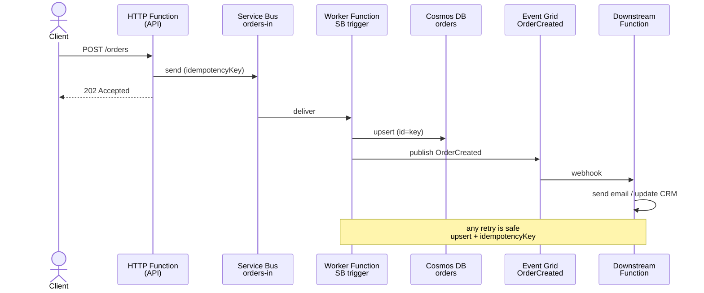

# Serverless Architectures

> **One-liner**: Serverless on Azure = **Functions + Service Bus + Cosmos DB + Event Grid**, glued by triggers and bindings, scaled by events, paid per execution — and the architecture's hardest problems (cold starts, idempotency, ordering, fan-out limits) are *yours*, not the platform's.

---

## Quick Reference

| Component | Role |
| --------- | ---- |
| **Azure Functions (Flex Consumption)** | Event-driven compute; per-second billing |
| **Service Bus** | Reliable commands, queues with FIFO via sessions |
| **Event Grid** | Push notifications (publish/subscribe, low-latency) |
| **Event Hubs** | High-throughput streaming (Kafka-compatible) |
| **Cosmos DB** | Low-latency state, change feed for event sourcing |
| **Durable Functions** | Stateful orchestrations (sagas, fan-out/fan-in) |
| **Logic Apps** | Low-code workflow with 1000+ connectors |

| Hosting plan | When to use |
| ------------ | ----------- |
| **Flex Consumption** (default 2025+) | Most workloads; per-instance memory choice, VNet support |
| **Consumption (Y1)** | Legacy / cost-sensitive; cold starts, no VNet |
| **Premium (EP1+)** | Pre-warmed instances, VNet, unlimited duration |
| **Dedicated (App Service)** | Already paying for an App Service plan |
| **Container Apps Functions** | Functions image on ACA; mix with non-function workloads |

| Common pattern | Trigger → Action |
| -------------- | ---------------- |
| **Async API** | HTTP → Service Bus → Worker Function → Cosmos |
| **Saga / Orchestration** | HTTP → Durable Orchestrator → Activities |
| **Stream processor** | Event Hubs → Function → Cosmos / Synapse |
| **Reactive integration** | Storage event → Event Grid → Function → API |

---

## Core Concept

The serverless mental model: **events arrive, functions run, then the runtime forgets you exist.** Every function is short, idempotent, and stateless. State lives in Cosmos / Storage / Service Bus.

The strength of Azure's flavor is **bindings** — declarative input/output. A function can pull a Service Bus message, write to Cosmos, and publish to Event Grid in 30 lines, no SDK boilerplate.

The architecture you keep ending up with is **HTTP-front, queue-middle, store-back**: an HTTP function validates and enqueues, a queue-triggered function does the work, idempotency keys stop double-processing, the store records final state.

**Cold starts** are the eternal complaint. Mitigations in order: Flex Consumption (faster than Y1), Premium with pre-warmed instances, ReadyToRun-compiled .NET, and avoiding unnecessary dependencies in the function host.

**Durable Functions** turn awkward state machines (multi-step approvals, retries with backoff, fan-out/fan-in) into linear C# code. Behind the scenes it event-sources via Storage / SQL / MSSQL / Netherite.

**Idempotency is mandatory.** Service Bus retries, Event Grid retries, Event Hubs replays — every consumer must safely handle the same message twice.

---

## Diagram



---

## Syntax & API

### Function with multiple bindings (.NET isolated)

```csharp
public class OrderWorker
{
    private readonly CosmosClient _cosmos;
    public OrderWorker(CosmosClient cosmos) => _cosmos = cosmos;

    [Function(nameof(ProcessOrder))]
    [CosmosDBOutput("%CosmosDb%", "orders", Connection = "Cosmos")]
    public async Task<Order> ProcessOrder(
        [ServiceBusTrigger("orders-in", Connection = "ServiceBus")] OrderMessage msg,
        [DurableClient] DurableTaskClient durable,
        FunctionContext ctx)
    {
        var log = ctx.GetLogger<OrderWorker>();
        log.LogInformation("Processing {OrderId}", msg.OrderId);

        // Idempotency: Cosmos upsert with id = idempotencyKey
        var order = new Order(msg.IdempotencyKey, msg.OrderId, msg.Total, "Received");

        // Kick off saga (payment → fulfilment → notification)
        await durable.ScheduleNewOrchestrationInstanceAsync(
            nameof(OrderSaga), msg.OrderId);

        return order; // written to Cosmos via output binding
    }
}
```

### Durable Functions — saga orchestration

```csharp
[Function(nameof(OrderSaga))]
public async Task OrderSaga([OrchestrationTrigger] TaskOrchestrationContext ctx)
{
    var orderId = ctx.GetInput<string>()!;
    try
    {
        var paid = await ctx.CallActivityAsync<bool>(nameof(ChargePayment), orderId);
        if (!paid) throw new InvalidOperationException("payment failed");

        var shipped = await ctx.CallActivityAsync<bool>(nameof(ShipOrder), orderId);

        await ctx.CallActivityAsync(nameof(NotifyCustomer), orderId);
    }
    catch
    {
        // Compensation
        await ctx.CallActivityAsync(nameof(RefundPayment), orderId);
        throw;
    }
}
```

### Flex Consumption deployment

```bash
RG=rg-serverless-prod
LOC=eastus
SA=stordersfn$RANDOM
PLAN=plan-orders-fn
APP=fn-orders-prod

az storage account create -g $RG -n $SA -l $LOC --sku Standard_LRS

az functionapp create -g $RG -n $APP \
  --storage-account $SA \
  --flexconsumption-location $LOC \
  --runtime dotnet-isolated --runtime-version 8.0 \
  --instance-memory 2048 \
  --maximum-instance-count 200
```

### Bind Service Bus + Cosmos via Managed Identity (no connection strings)

```bash
APP_MI=$(az functionapp identity show -g $RG -n $APP --query principalId -o tsv)
SB_SCOPE=$(az servicebus namespace show -g $RG -n sb-orders-prod --query id -o tsv)
COSMOS_SCOPE=$(az cosmosdb show -g $RG -n cosmos-orders-prod --query id -o tsv)

az role assignment create --assignee $APP_MI --role "Azure Service Bus Data Receiver" --scope $SB_SCOPE
az role assignment create --assignee $APP_MI --role "Azure Service Bus Data Sender"   --scope $SB_SCOPE

# Cosmos uses data-plane RBAC
az cosmosdb sql role assignment create -g $RG -a cosmos-orders-prod \
  --role-definition-id 00000000-0000-0000-0000-000000000002 \
  --principal-id $APP_MI \
  --scope "/"

# App settings reference fully-qualified namespace + Identity
az functionapp config appsettings set -g $RG -n $APP --settings \
  "ServiceBus__fullyQualifiedNamespace=sb-orders-prod.servicebus.windows.net" \
  "Cosmos__accountEndpoint=https://cosmos-orders-prod.documents.azure.com:443/"
```

---

## Common Patterns

- **HTTP-front + queue-middle + Cosmos-back**: validate fast at HTTP, do work async at the queue, idempotent upsert to Cosmos. Default API shape.
- **Idempotency via Cosmos `id`**: derive doc id from a stable client key (`Idempotency-Key` header). Re-deliveries upsert the same doc.
- **Fan-out / fan-in with Durable Functions**: `Task.WhenAll(activities)` parallelizes dozens of calls and resumes when all return.
- **Outbox + Event Grid**: write business state and event in one Cosmos transaction, change feed publishes to Event Grid.
- **Cold-start mitigation**: ReadyToRun compile, trim deps, Premium plan + pre-warmed instances for tail-latency-sensitive APIs.
- **Backpressure with Service Bus session lock**: limit per-session concurrency to preserve order without blocking the whole queue.

---

## Gotchas & Tips

- **Functions on Consumption have a 5/10-minute max execution.** For long jobs use Premium / Flex / Durable orchestrations split into activities.
- **Cold starts hit the *first* request after idle.** Front-end timeouts (Front Door, CDN) often retry — design for it.
- **Service Bus auto-complete is a foot-gun.** If the function body throws, you've already acked the message. Keep PeekLock + manual complete for critical paths.
- **Event Grid retries with exponential backoff for 24h.** If your handler stays down, dead-letter to Storage and replay later.
- **Durable Functions orchestrators must be deterministic.** No `DateTime.Now`, no `Guid.NewGuid()` directly — use `ctx.CurrentUtcDateTime`, `ctx.NewGuid()`.
- **Bindings hide failures.** Output bindings that fail throw at the host level — you may not see the inner exception. Wrap with explicit SDK calls if you need clarity.
- **Per-instance concurrency** (`maxConcurrentCalls` for SB, `batchSize` for Event Hub) drastically affects throughput vs memory.
- **Flex Consumption charges instance-seconds, not executions.** It's cheap when busy, pricier than Consumption when idle.
- **Don't share Service Bus connection strings**; per-app Managed Identity scoped to specific queues prevents one app from draining another's.
- **Event Hubs ≠ Service Bus.** Event Hubs is at-least-once stream replay (checkpoints). Service Bus is per-message ack with DLQ. Pick by ordering / replay needs.

---

## See Also

- [[02 - Azure Functions]]
- [[11 - Service Bus]]
- [[12 - Event Grid]]
- [[13 - Event Hubs]]
- [[17 - Event-Driven Architecture]]
