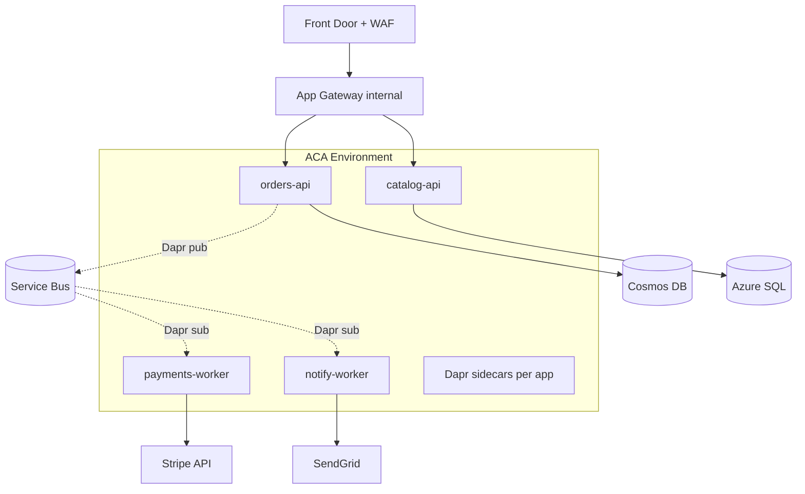

# Microservices on Azure

> **One-liner**: On Azure you have **three credible homes for microservices** — App Service, Container Apps (ACA), and AKS — and the right choice is rarely about Kubernetes; it's about *how much platform you want to own* vs *how much control you need*.

---

## Quick Reference

| Platform | Best for | Tradeoff |
| -------- | -------- | -------- |
| **App Service** | Monolith-of-services, .NET-heavy team, no containers needed | Limited per-service scaling, no native service-mesh |
| **Container Apps (ACA)** | Most microservices in 2025 — built on Kubernetes, you don't see it | Less control than AKS; some K8s primitives missing |
| **AKS** | Heavy customization, custom CRDs, GPU/HPC, regulated workloads | You operate the platform |

| Cross-cutting concern | App Service | ACA | AKS |
| --------------------- | ----------- | --- | --- |
| **Service discovery** | DNS (per slot) | Built-in (Dapr / `<app>.<env>.<region>.azurecontainerapps.io`) | DNS / Consul / mesh |
| **mTLS** | Manual (App GW) | Auto (Dapr) | Istio / Linkerd / mesh |
| **Autoscale** | Plan-level + per-app rules | KEDA built-in | Cluster Autoscaler + KEDA |
| **Per-rev traffic split** | Slots (5 max) | Revisions (any %) | Service Mesh |
| **Sidecar pattern** | No | Yes (Dapr or custom) | Yes |

| Communication style | Use |
| ------------------- | --- |
| **Sync REST/gRPC** | Internal calls, low latency |
| **Async via Service Bus** | Long-running, ordered, durable commands |
| **Async via Event Grid** | Push notifications, fan-out |
| **Async via Event Hubs** | Telemetry, high-throughput streams |
| **Dapr pub/sub** | Pluggable broker; hides SB/Kafka behind a uniform API |

---

## Core Concept

A microservice architecture has **two hard problems**: how services *find* each other and how they *talk* to each other. Azure gives you platform options for the first, integration options for the second.

**Pick ACA unless you can't.** ACA gives you Kubernetes-grade scaling (KEDA), zero-downtime revisions, Dapr sidecars for pub/sub and state, and you never write a YAML deployment. Most teams ship faster on ACA than on AKS.

**Use App Service** when the team is .NET-deep, services live behind a small set of domains, and you want WebJobs / SignalR / managed certs without container ops. It's microservices-by-app, not microservices-by-pod.

**Reach for AKS** when you genuinely need cluster-level extensibility: custom CRDs (KubeFlow, Argo Workflows), node-level customization (NVIDIA, FPGA), service mesh (Istio with custom envoy filters), or you already run Kubernetes elsewhere.

**Communication shape matters more than platform.** Sync calls couple availability; async via a broker decouples it. Most production systems are *both* — sync for read paths, async for state mutations and side effects.

**Dapr is the Azure-recommended sidecar** for ACA and AKS: pub/sub, state, secrets, bindings exposed as HTTP/gRPC. You swap brokers (SB → Kafka) without changing service code.

---

## Diagram



---

## Syntax & API

### Stand up an ACA environment + two services

```bash
RG=rg-ms-prod
LOC=eastus
ENV=cae-orders-prod
ACR=acrordersprod

az containerapp env create -g $RG -n $ENV -l $LOC \
  --enable-workload-profiles \
  --infrastructure-subnet-resource-id <subnet-id> \
  --internal-only false \
  --logs-destination azure-monitor

# orders-api with Dapr enabled
az containerapp create -g $RG -n orders-api \
  --environment $ENV --image $ACR.azurecr.io/orders-api:1.4.2 \
  --registry-server $ACR.azurecr.io --registry-identity system \
  --target-port 8080 --ingress external \
  --enable-dapr --dapr-app-id orders-api --dapr-app-port 8080 \
  --min-replicas 2 --max-replicas 30 \
  --scale-rule-name http --scale-rule-type http --scale-rule-http-concurrency 50

# payments-worker — internal, scaled by SB depth
az containerapp create -g $RG -n payments-worker \
  --environment $ENV --image $ACR.azurecr.io/payments:1.2.0 \
  --ingress disabled \
  --enable-dapr --dapr-app-id payments-worker \
  --min-replicas 0 --max-replicas 50 \
  --scale-rule-name sb-orders --scale-rule-type azure-servicebus \
  --scale-rule-metadata queueName=orders-in messageCount=10 namespace=sb-orders-prod \
  --scale-rule-auth "connection=sb-connection"
```

### Dapr pub/sub component (Service Bus)

```yaml
componentType: pubsub.azure.servicebus.queues
version: v1
metadata:
- name: namespaceName
  value: sb-orders-prod.servicebus.windows.net
- name: useAzureAD
  value: "true"
scopes:
- orders-api
- payments-worker
```

### Publish + subscribe in .NET via Dapr SDK

```csharp
// Publish (orders-api)
var dapr = new DaprClientBuilder().Build();
await dapr.PublishEventAsync("pubsub", "orders-in", new OrderCreated(orderId, total));
```

```csharp
// Subscribe (payments-worker) via Topic attribute
[Topic("pubsub", "orders-in")]
[HttpPost("/orders-in")]
public async Task<IActionResult> OnOrder([FromBody] OrderCreated evt) { ... }
```

### Service-to-service via Dapr (no DNS, no IPs)

```csharp
var resp = await dapr.InvokeMethodAsync<CatalogItem>(
    HttpMethod.Get, appId: "catalog-api", methodName: $"items/{sku}");
```

### Revision traffic split (canary)

```bash
az containerapp revision copy -g $RG -n orders-api --image $ACR.azurecr.io/orders-api:1.5.0
az containerapp ingress traffic set -g $RG -n orders-api \
  --revision-weight orders-api--rev-old=90 orders-api--rev-new=10
```

---

## Common Patterns

- **API gateway in front, services behind**: Front Door for global edge, App Gateway / ACA Ingress for L7 routing, services internal-only.
- **Database-per-service** for autonomy. Shared schemas couple deploys; if you need cross-service joins, push it to a read model.
- **Saga over 2PC**: distributed transactions are an antipattern. Use sagas with compensating actions ([[04 - Serverless Architectures]]).
- **Outbox pattern** for event publishing: write business state + event row in one DB tx; a relay forwards to the broker. Avoids dual-write inconsistency.
- **Circuit breakers + retries with jitter**: every sync call is a failure mode. Polly (.NET) or service-mesh policies for these.
- **One repo per service, one pipeline per service** unless you have very tight coupling. Monorepos work too — but only with proper dependency analysis.
- **Contract testing (Pact)** between consumer and producer prevents the "API team broke us" outage.

---

## Gotchas & Tips

- **Don't pick AKS to "look serious."** Most teams that "needed AKS" were happier on ACA after migrating back.
- **gRPC across ACA needs HTTP/2 ingress** (`--transport http2`). Default HTTP/1 will silently fail on streaming.
- **Dapr sidecar adds ~50 MB and a few ms latency.** Worth it for cross-service auth and pub/sub abstractions.
- **mTLS within ACA is automatic; across environments it isn't.** Use private endpoints + Entra-issued tokens.
- **Service discovery on App Service is per-domain.** No internal DNS — services call each other through public hostnames (or Private Endpoints + Private DNS).
- **Per-revision traffic in ACA caps at 100 revisions.** Prune old revisions or your `kubectl get pods` equivalent (`az containerapp revision list`) gets unwieldy.
- **Async first for state changes**, sync first for reads. Mixing this up makes everything fragile.
- **Distributed tracing is mandatory** ([[06 - Distributed Tracing with OpenTelemetry]]). Without it you can't debug.
- **Versioning**: never break wire format silently. Use additive changes; deprecate fields with a deadline; consumers tolerate unknown fields.
- **Anti-corruption layer at boundaries**: don't leak third-party DTOs into your domain. Translate at the edge.

---

## See Also

- [[03 - Container Apps]]
- [[04 - AKS Basics]]
- [[03 - AKS Production Patterns]]
- [[04 - Serverless Architectures]]
- [[17 - Event-Driven Architecture]]
