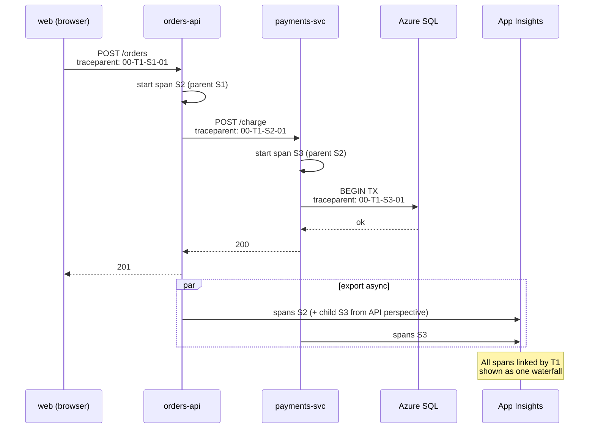

# Distributed Tracing with OpenTelemetry

> **One-liner**: **OpenTelemetry (OTel)** is the vendor-neutral standard for emitting **traces, metrics, and logs** — on Azure you wire the OTel SDK into .NET, point an exporter at **Application Insights** (or any OTLP endpoint), and you can debug a request that crosses five services in one timeline.

---

## Quick Reference

| Pillar | OTel object |
| ------ | ----------- |
| **Traces** | `ActivitySource` → `Activity` (a span); `TraceContext` (W3C) propagates across services |
| **Metrics** | `Meter` → counters, histograms, gauges |
| **Logs** | `ILogger` (.NET) bridged through OTel logging provider |

| Concept | Meaning |
| ------- | ------- |
| **Span** | A single timed operation (`HTTP GET /orders`) with attributes |
| **Trace** | A tree of spans sharing the same `TraceId` |
| **TraceContext** | W3C `traceparent` HTTP header — `00-<traceId>-<spanId>-<flags>` |
| **Sampling** | Decide which traces to keep (head-based or tail-based) |
| **Exporter** | Sends spans to a backend (App Insights, Jaeger, OTLP collector) |
| **Auto-instrumentation** | Built-in SDK packages for HTTP, EF Core, SQL, Redis, gRPC |

| .NET package | Use |
| ------------ | --- |
| `OpenTelemetry.Extensions.Hosting` | Wire-up via `IServiceCollection` |
| `OpenTelemetry.Instrumentation.AspNetCore` | Auto-trace incoming HTTP |
| `OpenTelemetry.Instrumentation.Http` | Auto-trace outgoing HttpClient |
| `OpenTelemetry.Instrumentation.SqlClient` | Auto-trace ADO.NET / EF Core |
| `Azure.Monitor.OpenTelemetry.AspNetCore` | One-line Azure Monitor exporter |

---

## Core Concept

Without distributed tracing, a slow checkout that crosses `web → api → payments → db → notification` is a guessing game from five log files. With OTel, every hop carries the same `TraceId` in a `traceparent` header; spans flow into App Insights, and you see one waterfall.

The .NET implementation is built on **`System.Diagnostics.Activity`** — every framework (ASP.NET Core, HttpClient, EF Core, SqlClient) creates Activities under the hood; OTel just exports them. This means **most of your code needs zero changes** to emit usable traces.

**Sampling** matters at scale. Per-request tracing is too expensive; head-based sampling drops traces uniformly (fast, cheap, may lose interesting outliers); **tail-based sampling** in a collector keeps slow/error traces and drops happy paths.

The Azure Monitor exporter (`Azure.Monitor.OpenTelemetry.AspNetCore`) is one line of setup and writes to App Insights using the OTel schema. For multi-cloud or vendor-neutral, run an **OpenTelemetry Collector** with multiple exporters.

**Span attributes** are how you make traces queryable. Always tag with `enduser.id`, `tenant.id`, `feature.flag`, and any business identifier — they become KQL filters in App Insights.

---

## Diagram



---

## Syntax & API

### One-line Azure Monitor wire-up (.NET 8 isolated / ASP.NET Core)

```csharp
using Azure.Monitor.OpenTelemetry.AspNetCore;

var builder = WebApplication.CreateBuilder(args);
builder.Services.AddOpenTelemetry().UseAzureMonitor(o =>
{
    o.ConnectionString = builder.Configuration["AppInsights:ConnectionString"];
    o.SamplingRatio = 0.1f; // keep 10%
});

var app = builder.Build();
```

### Manual span with attributes

```csharp
private static readonly ActivitySource Activity = new("Orders.API");

[HttpPost("/orders")]
public async Task<IActionResult> Place(OrderDto dto)
{
    using var span = Activity.StartActivity("place-order", ActivityKind.Server);
    span?.SetTag("order.total", dto.Total);
    span?.SetTag("enduser.id", User.FindFirstValue("oid"));
    span?.SetTag("tenant.id", dto.TenantId);

    try
    {
        var id = await _orders.PlaceAsync(dto);
        span?.SetTag("order.id", id);
        return Created($"/orders/{id}", null);
    }
    catch (Exception ex)
    {
        span?.SetStatus(ActivityStatusCode.Error, ex.Message);
        span?.AddException(ex);
        throw;
    }
}
```

### Add custom instrumentation + propagation across HttpClient

```csharp
builder.Services.AddHttpClient("payments", c =>
    c.BaseAddress = new Uri("https://payments-svc"));

builder.Services.AddOpenTelemetry()
    .WithTracing(t => t
        .AddSource("Orders.API")
        .AddHttpClientInstrumentation()
        .AddSqlClientInstrumentation(o => o.SetDbStatementForText = true)
        .AddAspNetCoreInstrumentation())
    .WithMetrics(m => m
        .AddMeter("Orders.API")
        .AddRuntimeInstrumentation()
        .AddAspNetCoreInstrumentation())
    .UseAzureMonitor();
```

### Tail-based sampling via OTel Collector

```yaml
# otel-collector.yaml
receivers:
  otlp: { protocols: { grpc: {}, http: {} } }
processors:
  tail_sampling:
    decision_wait: 10s
    policies:
      - { name: errors,    type: status_code, status_code: { status_codes: [ERROR] } }
      - { name: slow,      type: latency,     latency: { threshold_ms: 1000 } }
      - { name: sample10,  type: probabilistic, probabilistic: { sampling_percentage: 10 } }
exporters:
  azuremonitor:
    instrumentation_key: ${APPINSIGHTS_INSTRUMENTATIONKEY}
service:
  pipelines:
    traces: { receivers: [otlp], processors: [tail_sampling], exporters: [azuremonitor] }
```

### KQL — find slow distributed requests

```kql
requests
| where timestamp > ago(1h)
| where duration > 1000
| join kind=inner (dependencies | project operation_Id, target, duration_dep=duration) on operation_Id
| project timestamp, name, duration, target, duration_dep
| order by duration desc
```

---

## Common Patterns

- **Wire OTel in `Program.cs` once** with `UseAzureMonitor()`; every service does the same — uniform schema across the org.
- **Tag with business IDs** (`tenant.id`, `customer.id`, `order.id`). Without these, traces are unsearchable in production.
- **Sampling at edge, not at app**: use the collector for tail sampling so app processes don't decide on incomplete info.
- **Span links** for fan-in patterns (durable functions, event consumers): keeps the relationship visible without forcing a parent-child tree.
- **Metrics for SLOs, traces for incidents**: dashboards summarize health from metrics; traces explain a specific bad request.
- **Bridge .NET `ILogger` through OTel logging** so logs share the trace context — `traceId` appears in every log line.
- **Never swallow exceptions silently** — `span.RecordException(ex)` plus rethrow keeps the failure visible in the waterfall.

---

## Gotchas & Tips

- **W3C trace context is the only standard.** Don't use B3 / Jaeger headers in new code; older systems may need a propagator override.
- **High-cardinality tags blow up costs.** Don't tag `user.email`; tag `user.id` (hashed if needed). Same for raw URLs with IDs — strip and tag separately.
- **App Insights "operation" ≈ root trace.** A single user click is one operation, even if it spawns 50 spans.
- **Sampling decisions are sticky per trace.** A sampled-out span at the edge means downstream spans are also dropped — they share the trace flag.
- **`AddSqlClientInstrumentation(o => o.SetDbStatementForText = true)` exposes SQL in traces.** Useful for dev, dangerous in prod (PII in queries).
- **`HttpClient` propagation is automatic** *only* if you create it via `IHttpClientFactory`. Naked `new HttpClient()` won't propagate without manual help.
- **Service Bus / Event Grid SDKs propagate via message properties.** They use `Diagnostic-Id` (legacy) plus W3C; consumer SDK reconnects the trace.
- **Cold-start ASP.NET Core can take seconds to register OTel.** First request after warm-up may have partial spans.
- **`AddRuntimeInstrumentation` exports GC / threadpool metrics.** Highly worth the few extra MB.
- **OTel Collector adds an ops surface.** Skip it if a single direct exporter to App Insights is enough — collector pays off only at multi-backend / tail-sampling needs.

---

## See Also

- [[07 - Azure Monitor and Log Analytics]]
- [[08 - Application Insights Deep Dive]]
- [[05 - Microservices on Azure]]
