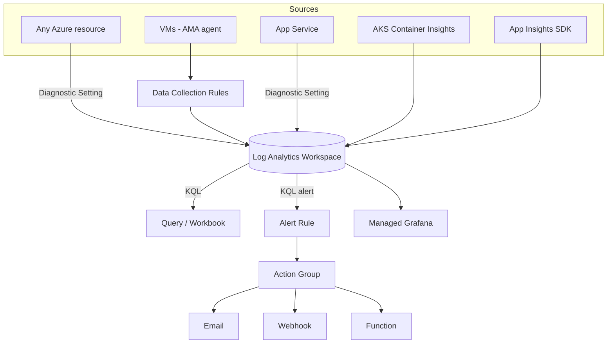

# Azure Monitor and Log Analytics

> **One-liner**: **Azure Monitor** is the umbrella telemetry platform; **Log Analytics Workspace (LAW)** is the queryable store; **KQL (Kusto Query Language)** is the lingua franca — every metric, log, and trace in Azure ends up here, and you query it like SQL with pipes.

---

## Quick Reference

| Component | Purpose |
| --------- | ------- |
| **Log Analytics Workspace (LAW)** | The store; one per region typically |
| **Data Collection Rule (DCR)** | Routes data into a workspace; replaces legacy MMA agent config |
| **Azure Monitor Agent (AMA)** | VM/server agent; replaces MMA / Log Analytics Agent (deprecated 2024) |
| **Diagnostic Settings** | Per-resource config to ship platform logs/metrics to LAW |
| **Application Insights** | App-tier telemetry (workspace-based — same LAW) |
| **Action Group** | Notification target (email, SMS, webhook, Logic App, Function) |
| **Alert Rule** | KQL or metric query + threshold → action group |
| **Workbook** | Interactive report + viz on top of KQL |
| **Managed Grafana** | Grafana SaaS that reads from LAW + Prometheus |

| Common KQL operators | Meaning |
| -------------------- | ------- |
| `where`, `project`, `extend`, `summarize`, `join`, `union` | filter/select/group/join |
| `bin(timestamp, 5m)` | time bucketing |
| `top 10 by count_` | top-N |
| `parse_json()`, `parse()` | structured / regex parsing |
| `series_decompose_anomalies()` | anomaly detection |

---

## Core Concept

Every Azure resource emits two things: **metrics** (numeric, time-series, fast) and **logs** (semi-structured, text, queryable). Metrics are free for the first 90 days at 1-minute resolution; logs cost per-GB ingested + per-GB retained.

A **diagnostic setting** on each resource ships its logs/metrics to a LAW. Set it once via Bicep (or Policy `DeployIfNotExists`); never click it on per-resource.

**KQL** is the query language. `tablename | where ... | summarize count() by bin(timestamp, 5m)` is the daily bread. KQL is fast — billions of rows scan in seconds at LAW scale.

**Workspace strategy** matters: too few workspaces cripples access control; too many fragments queries (cross-workspace `union` is slow + clunky). Common pattern: one workspace per environment (prod / non-prod) per region.

**Alerts** are KQL queries on a schedule + thresholds + an action group. A great alert has a runbook link, a clear title, and fires only when something *actionable* is wrong.

**Workbooks** turn dashboards into shareable docs — parameters, time pickers, multiple charts. They're the answer when "I keep running the same five queries during incidents."

---

## Diagram



---

## Syntax & API

### Create LAW + diagnostic setting on a resource

```bash
RG=rg-monitor-prod
LOC=eastus
LAW=law-platform-prod

az monitor log-analytics workspace create -g $RG -n $LAW -l $LOC --sku PerGB2018 --retention-time 30

# Send App Service logs/metrics to it
APP_ID=$(az webapp show -g $RG -n app-orders-prod --query id -o tsv)
LAW_ID=$(az monitor log-analytics workspace show -g $RG -n $LAW --query id -o tsv)

az monitor diagnostic-settings create --name to-law \
  --resource $APP_ID --workspace $LAW_ID \
  --logs '[{"category":"AppServiceHTTPLogs","enabled":true},{"category":"AppServiceConsoleLogs","enabled":true}]' \
  --metrics '[{"category":"AllMetrics","enabled":true}]'
```

### Bicep — diagnostic setting via Policy DeployIfNotExists (recommended)

```bicep
resource policy 'Microsoft.Authorization/policyAssignments@2024-04-01' = {
  name: 'enforce-diag-appservice'
  scope: subscription()
  properties: {
    policyDefinitionId: '/providers/Microsoft.Authorization/policyDefinitions/<built-in-id>'
    parameters: {
      logAnalytics: { value: lawId }
    }
    identity: { type: 'SystemAssigned' }
    location: 'eastus'
  }
}
```

### KQL — top noisy errors in the last hour

```kql
AppExceptions
| where TimeGenerated > ago(1h)
| summarize Count = count() by ProblemId, AppRoleName
| top 10 by Count desc
```

### KQL — p95 latency per endpoint, per 5-minute bucket

```kql
AppRequests
| where TimeGenerated > ago(6h)
| summarize p95 = percentile(DurationMs, 95)
    by bin(TimeGenerated, 5m), Url, AppRoleName
| render timechart
```

### KQL — correlate failed request with downstream dependencies

```kql
AppRequests
| where Success == false and TimeGenerated > ago(15m)
| project OperationId, Url, ResultCode, RequestTime=TimeGenerated, RequestDuration=DurationMs
| join kind=leftouter (
    AppDependencies
    | project OperationId, Target, DependencyType, DependencyDuration=DurationMs, DependencySuccess=Success
  ) on OperationId
| order by RequestTime desc
```

### KQL alert rule (Bicep)

```bicep
resource alert 'Microsoft.Insights/scheduledQueryRules@2024-01-01-preview' = {
  name: 'orders-api-error-rate'
  location: 'eastus'
  properties: {
    severity: 2
    enabled: true
    evaluationFrequency: 'PT5M'
    windowSize: 'PT15M'
    scopes: [ lawId ]
    criteria: {
      allOf: [
        {
          query: '''
            AppRequests
            | where AppRoleName == "orders-api" and Success == false
            | summarize ErrorCount = count()
          '''
          timeAggregation: 'Total'
          metricMeasureColumn: 'ErrorCount'
          operator: 'GreaterThan'
          threshold: 50
          failingPeriods: { numberOfEvaluationPeriods: 2, minFailingPeriodsToAlert: 2 }
        }
      ]
    }
    actions: { actionGroups: [ actionGroupId ] }
  }
}
```

---

## Common Patterns

- **One LAW per (env, region)**: `law-prod-eastus`, `law-prod-westus`, `law-nonprod-eastus`. Workspace replication crosses environments.
- **Policy-enforced diagnostic settings**: `DeployIfNotExists` on every resource type your org uses. New resources auto-ship logs.
- **Save common KQL as queries**: workspace queries pinned to `Saved searches`; the team builds a shared library.
- **Workbooks per workload**: a single dashboard with latency/error/saturation/traffic — RED + USE methods.
- **Alerts → Action Group → Webhook → ChatOps**: page on real outages; route warnings to a Slack/Teams channel.
- **Hot vs Archive tiers**: keep 30 days hot for queries, archive to cheap storage for compliance retention.
- **Cross-workspace queries** with `workspace("law-other").Table` for global views — but minimize; cost grows.

---

## Gotchas & Tips

- **Ingestion cost is the line item that bites.** Verbose app logs at scale → thousands per month per GB. Set sampling, drop noisy categories.
- **Retention vs Archive**: retention costs ~10×. Move to archive after 30 days unless you query it weekly.
- **The legacy "Log Analytics Agent" / "MMA"** is retired (Aug 2024). All new VM telemetry goes via Azure Monitor Agent + DCRs.
- **Workspace-based App Insights is the only choice for new resources.** Classic AI is read-only legacy.
- **`AzureDiagnostics` table is generic / messy.** Resource-specific tables (`AppRequests`, `AppExceptions`, `AKSAudit`) are cleaner.
- **KQL is case-sensitive on column names**, case-insensitive on operators. `WHERE` won't work; `where` will.
- **Joins are expensive** at LAW scale. Filter both sides before joining; prefer `lookup` over `join` when one side is small.
- **Alert rule `evaluationFrequency` and `windowSize`** must align — a 15-min window evaluated every 5 min counts data 3×. Use `failingPeriods` to require sustained signal.
- **Action Groups can call a Function** — useful for auto-remediation, but the Function itself must be highly available, otherwise alerts dead-letter.
- **Don't store secrets in alert payloads.** Webhook bodies are sometimes logged downstream.

---

## See Also

- [[08 - Application Insights Deep Dive]]
- [[06 - Distributed Tracing with OpenTelemetry]]
- [[09 - RBAC and Azure Policy]]
- [[15 - CI-CD on Azure]]
