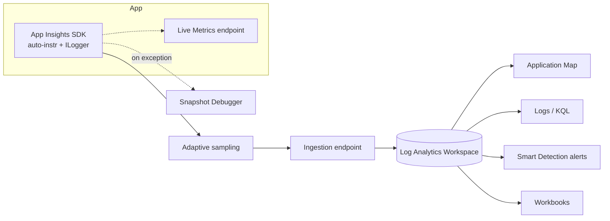

# Application Insights Deep Dive

> **One-liner**: **Application Insights** is the App-tier slice of Azure Monitor — auto-instruments .NET / Java / Node / Python apps, captures **requests / dependencies / exceptions / traces / metrics**, and lets you debug a single failed request from the user click down to the SQL query.

---

## Quick Reference

| Telemetry type | Table in LAW |
| -------------- | ------------ |
| **Request** (incoming HTTP) | `AppRequests` |
| **Dependency** (outgoing call) | `AppDependencies` |
| **Exception** | `AppExceptions` |
| **Trace** (`ILogger`) | `AppTraces` |
| **Custom event** | `AppEvents` |
| **Custom metric** | `AppMetrics` |
| **Performance counter** | `AppPerformanceCounters` |
| **Browser page view** | `AppPageViews` |

| Feature | What it does |
| ------- | ------------ |
| **Live Metrics** | Real-time pulse, no ingestion cost |
| **Application Map** | Auto-generated topology from dependencies |
| **Smart Detection** | ML-based anomaly alerts (failures, perf) |
| **Snapshot Debugger** | Capture managed-memory snapshot on exception |
| **Profiler** | CPU/wall-time profiling on demand |
| **Adaptive Sampling** | Auto-adjust sampling to fit ingestion budget |
| **Continuous Export** | Stream raw telemetry to Storage / Event Hubs |
| **Workspace-based AI** | Stores in LAW; required for new resources |

---

## Core Concept

Application Insights is two things glued together: an **SDK that auto-instruments your app** and a **set of features in the portal** for visualizing what the SDK captures. Under the hood it writes to a Log Analytics Workspace using the same KQL.

The single most valuable view is the **Application Map** — it walks dependency telemetry and draws boxes for each service, with arrows colored by error rate and latency. You spot a degrading dependency in seconds.

**Sampling** keeps cost sane. Default **adaptive sampling** in the SDK keeps ~5 traces/sec per node and scales as load grows. For high-fidelity systems, use ingestion sampling at the exporter or **fixed-rate sampling** with stable ratios for capacity planning.

**Dependency tracking** is automatic for HTTP, SQL, EF Core, Azure SDK clients, Service Bus, Storage. Custom dependencies (third-party gRPC) need a one-line `TelemetryClient.TrackDependency` call.

**Snapshot Debugger** is the killer feature for "this throws in prod and I can't repro." Configure it once, set a per-exception threshold, and when the exception fires it captures the managed heap and locals. View in Visual Studio or the portal.

**Live Metrics** is *not* sampled and *not* ingested — it's a free, low-latency stream you can watch during a deploy. The first thing to open during a release.

---

## Diagram



---

## Syntax & API

### Wire up — modern OTel-based SDK (.NET 8)

```csharp
using Azure.Monitor.OpenTelemetry.AspNetCore;

builder.Services.AddOpenTelemetry()
    .UseAzureMonitor(o =>
    {
        o.ConnectionString = builder.Configuration["AppInsights:ConnectionString"];
        o.SamplingRatio = 1f;
    });
```

### Custom event + metric

```csharp
public class CheckoutController(TelemetryClient telemetry, IOrderService svc) : Controller
{
    [HttpPost]
    public async Task<IActionResult> Checkout(CheckoutDto dto)
    {
        var sw = Stopwatch.StartNew();
        var orderId = await svc.PlaceAsync(dto);
        sw.Stop();

        telemetry.TrackEvent("OrderPlaced", new Dictionary<string, string>
        {
            ["tenantId"] = dto.TenantId,
            ["paymentMethod"] = dto.PaymentMethod
        }, new Dictionary<string, double>
        {
            ["orderTotal"] = (double)dto.Total,
            ["latencyMs"] = sw.Elapsed.TotalMilliseconds
        });

        return Ok(new { orderId });
    }
}
```

### Track a custom dependency (third-party API)

```csharp
using var op = telemetry.StartOperation<DependencyTelemetry>("Stripe");
op.Telemetry.Type = "HTTP";
op.Telemetry.Target = "api.stripe.com";
try
{
    var resp = await _http.PostAsJsonAsync("https://api.stripe.com/v1/charges", body);
    op.Telemetry.ResultCode = ((int)resp.StatusCode).ToString();
    op.Telemetry.Success = resp.IsSuccessStatusCode;
}
catch
{
    op.Telemetry.Success = false;
    throw;
}
```

### Adaptive sampling tuning

```csharp
builder.Services.Configure<TelemetryConfiguration>(c =>
{
    var procBuilder = c.DefaultTelemetrySink.TelemetryProcessorChainBuilder;
    procBuilder.UseAdaptiveSampling(
        maxTelemetryItemsPerSecond: 20,
        excludedTypes: "Exception"); // never sample exceptions
    procBuilder.Build();
});
```

### Snapshot Debugger (function app or App Service)

```bash
az resource update -g $RG -n $APP --resource-type Microsoft.Web/sites \
  --set properties.siteConfig.appSettings='[
    {"name":"APPINSIGHTS_SNAPSHOTFEATURE_VERSION","value":"1.0.0"},
    {"name":"DiagnosticServices_EXTENSION_VERSION","value":"~3"}
  ]'
```

### KQL — full request waterfall by operation_Id

```kql
let opId = "8abe72d4-...";
union AppRequests, AppDependencies, AppExceptions, AppTraces
| where OperationId == opId
| project TimeGenerated, ItemType=Type, Name=coalesce(Name, Target, Type),
          DurationMs, Success, AppRoleName
| order by TimeGenerated asc
```

### KQL — Smart Detection-style anomaly query

```kql
AppRequests
| where TimeGenerated > ago(1d)
| make-series Failures = countif(Success == false) default = 0
    on TimeGenerated step 5m
| extend anomaly = series_decompose_anomalies(Failures, 1.5)
| mv-expand TimeGenerated, Failures, anomaly
| where toint(anomaly) != 0
```

---

## Common Patterns

- **One AI resource per workload, not per service.** Cross-service correlation requires a shared instrumentation key.
- **Tag every telemetry with `tenantId` / `customerId`** via a `TelemetryInitializer`. Makes per-tenant dashboards trivial.
- **Live Metrics open during every deploy.** Watch failures % spike in real time; rollback before 5-min alert evaluation fires.
- **Smart Detection on by default; tune sensitivity later.** It's free and catches regressions you'd miss.
- **Profiler triggered by CPU spike rule** — runs on demand, not always-on. ~5% overhead during capture.
- **Workbook per service** with RED metrics (Rate, Errors, Duration) + dependency map + recent deployments annotation.
- **Continuous Export to Event Hubs** when you need raw telemetry in Snowflake / Databricks for long-term analysis.

---

## Gotchas & Tips

- **The classic (non-workspace) AI is read-only deprecated.** Migrate; new resources are workspace-based by default.
- **Connection string > InstrumentationKey.** Connection string includes endpoint URL — required for sovereign clouds and private link.
- **Adaptive sampling doesn't sample exceptions** by default. If you have a noisy exception, *that* will dominate ingestion — fix the bug, don't sample it away.
- **Telemetry initializers run synchronously** on every send. Keep them allocation-free; they affect every request hot path.
- **`ILogger` traces below `Information` are dropped by default.** Set `Logging:ApplicationInsights:LogLevel:Default = Debug` to capture more.
- **Sensitive data leaks in dependencies.** SQL parameter values and HTTP request bodies can land in App Insights — sanitize via a `ITelemetryProcessor`.
- **Snapshot Debugger costs nothing extra in storage** (snapshots upload to Microsoft); it does add ~5% memory per snapshot capture.
- **Application Map only knows what the SDK reports.** Services that don't run the SDK appear as anonymous boxes.
- **Daily cap is a circuit breaker, not a budget**. When hit, ingestion stops and your visibility goes dark — alert on cap nearing, not after.
- **Per-resource Logs blade vs LAW**: queries can run from either; KQL is identical, but RBAC differs (resource-level vs workspace-level).

---

## See Also

- [[07 - Azure Monitor and Log Analytics]]
- [[06 - Distributed Tracing with OpenTelemetry]]
- [[01 - App Service Deep Dive]]
- [[02 - Azure Functions]]
