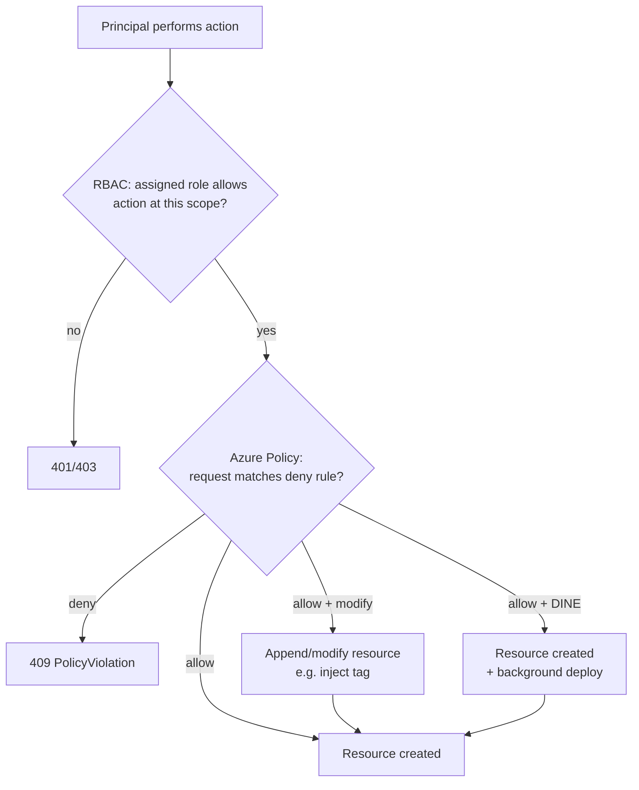

# RBAC and Azure Policy

> **One-liner**: **RBAC** decides *who* can do *what* on *which* resource; **Azure Policy** decides *what shape* resources are allowed to take — together they form Azure's governance backbone, and both inherit down the management-group → subscription → RG → resource scope chain.

---

## Quick Reference

| RBAC concept | Meaning |
| ------------ | ------- |
| **Role definition** | Set of `Actions` / `NotActions` / `DataActions` |
| **Role assignment** | Principal × Role × Scope |
| **Built-in role** | Microsoft-curated (Owner, Contributor, Reader, Storage Blob Data Owner, …) |
| **Custom role** | JSON definition; published at MG/sub scope |
| **Deny assignment** | Cannot be created by users — applied by Blueprints / Managed Apps |
| **Conditions** | ABAC predicates on assignments (e.g., only blobs with tag X) |

| Policy concept | Meaning |
| -------------- | ------- |
| **Policy definition** | Single rule (`if` condition → `then` effect) |
| **Initiative (Set)** | Bundle of definitions — what you usually assign |
| **Assignment** | Initiative × scope × parameters |
| **Effect** | `audit`, `deny`, `append`, `modify`, `deployIfNotExists` (DINE), `auditIfNotExists` (AINE) |
| **Compliance** | Per-resource pass/fail score |
| **Remediation** | Backfill non-compliant resources via DINE/modify |
| **Exemption** | Time-bound waiver with required justification |

| Common built-in roles | Use |
| --------------------- | --- |
| **Owner** | Full + assign roles — sparing |
| **Contributor** | Full minus role assignment |
| **Reader** | Read-only |
| **User Access Administrator** | Manage role assignments only |
| **Reservations Administrator** | Reservations management |
| **Storage Blob Data Owner** | Data plane on blobs |

---

## Core Concept

Most outages caused by humans on Azure trace back to **too much access** (an `Owner` who deleted a resource group) or **missing guardrails** (a region nobody approved became an attack surface). RBAC stops the first; Azure Policy stops the second.

**Scope is everything** in RBAC. A role assignment at the sub level applies to every RG and resource within. Prefer the smallest scope that works — usually the RG, sometimes the resource.

**Built-in roles cover 90% of real cases.** Only build a custom role when you can list specific actions a built-in role omits or includes that you need to avoid.

**Azure Policy operates on resource shape, not behavior.** It evaluates at resource creation/update and on a periodic re-scan. It can `deny` (block create), `audit` (record non-compliance), or `deployIfNotExists` (auto-remediate by deploying a side-effect template).

**Initiatives are the unit of practical use.** A landing zone ships ~15 baseline initiatives — "Enforce Azure Security Benchmark," "Tag inheritance," "Allowed regions." You assign initiatives, not bare definitions.

**RBAC + Policy together** form the governance loop: Policy defines what's allowed; RBAC controls who can do allowed things; Defender + Sentinel ([[10 - Defender for Cloud and Sentinel]]) flag drift.

---

## Diagram



---

## Syntax & API

### Assign a built-in role at RG scope

```bash
RG=rg-orders-prod
PRINCIPAL=$(az ad group show --group "Team-Orders-Devs" --query id -o tsv)
SCOPE=$(az group show -n $RG --query id -o tsv)

az role assignment create --assignee-object-id $PRINCIPAL --assignee-principal-type Group \
  --role "Contributor" --scope $SCOPE
```

### Custom role — read + restart App Service only

```json
{
  "Name": "App Service Restart Operator",
  "Description": "Read App Service config and restart sites",
  "Actions": [
    "Microsoft.Web/sites/read",
    "Microsoft.Web/sites/restart/action",
    "Microsoft.Web/sites/config/list/action"
  ],
  "NotActions": [],
  "DataActions": [],
  "AssignableScopes": [ "/subscriptions/<sub-id>" ]
}
```

```bash
az role definition create --role-definition role.json
```

### ABAC condition — limit a Storage Blob Data Reader to a tag

```bash
az role assignment create \
  --assignee-object-id $PRINCIPAL --assignee-principal-type ServicePrincipal \
  --role "Storage Blob Data Reader" --scope $STG_SCOPE \
  --condition "@Resource[Microsoft.Storage/storageAccounts/blobServices/containers:Name] StringEquals 'reports'" \
  --condition-version "2.0"
```

### Built-in policy — allow only specific regions

```bash
az policy assignment create \
  --name allowed-locations \
  --display-name "Allowed regions: eastus, westus2" \
  --scope /providers/Microsoft.Management/managementGroups/corp \
  --policy "e56962a6-4747-49cd-b67b-bf8b01975c4c" \
  --params '{"listOfAllowedLocations":{"value":["eastus","westus2"]}}'
```

### Custom Bicep policy — require `costcenter` tag, modify in-place

```bicep
targetScope = 'managementGroup'

resource def 'Microsoft.Authorization/policyDefinitions@2023-04-01' = {
  name: 'require-costcenter-tag'
  properties: {
    policyType: 'Custom'
    mode: 'Indexed'
    parameters: {
      tagName: { type: 'String', defaultValue: 'costcenter' }
    }
    policyRule: {
      if: {
        field: '[concat(\'tags[\', parameters(\'tagName\'), \']\')]'
        exists: 'false'
      }
      then: {
        effect: 'modify'
        details: {
          roleDefinitionIds: [
            '/providers/Microsoft.Authorization/roleDefinitions/4a9ae827-6dc8-4573-8ac7-8239d42aa03f' // Tag Contributor
          ]
          operations: [
            { operation: 'add', field: '[concat(\'tags[\', parameters(\'tagName\'), \']\')]', value: 'unassigned' }
          ]
        }
      }
    }
  }
}
```

### Audit + remediate

```bash
# Trigger a fresh evaluation
az policy state trigger-scan --resource-group $RG

# Compliance summary
az policy state summarize --resource-group $RG -o table

# Remediation task for a DINE policy
az policy remediation create -n remediate-diag -g $RG \
  --policy-assignment <assignment-id>
```

---

## Common Patterns

- **Prefer groups over users** in role assignments. People come and go; groups are stable.
- **PIM (Privileged Identity Management) for Owner / User Access Admin**. Just-in-time, time-bound elevation, MFA gate, audit logged.
- **Initiative per pillar**: `cost-baseline`, `security-baseline`, `network-baseline`. Each MG gets the bundle, exemptions are per-resource.
- **DINE for diagnostic settings**: every resource auto-shipped to LAW; no per-resource clicking.
- **Policy at MG, not at sub**: cuts assignment count and inherited rules survive sub moves.
- **Custom roles versioned**: store JSON in git; CI deploys with `az role definition update`.
- **`Modify` to enforce tags**: stronger than `audit`, less brittle than `deny`. New resources get tags injected automatically.
- **Three break-glass accounts** (cloud-only, no MFA, password vaulted offline) for the Owner role at root — never used unless everything else is broken.

---

## Gotchas & Tips

- **Role assignments don't propagate to data plane automatically.** "Contributor" on a Storage Account doesn't grant blob read — you also need `Storage Blob Data Reader`.
- **`*` in Actions is dangerous** in custom roles. Always list explicitly; use `NotActions` rather than wildcards.
- **Policy effects are not retroactive for `deny`.** Existing non-compliant resources stay; only new operations are blocked. Use DINE/modify + remediation to clean up.
- **DINE and modify policies need an MI with right roles.** The assignment auto-creates one — don't strip its role assignments.
- **Custom policy aliases are unstable**. Some properties have no alias and can't be evaluated. Check `az provider show --expand resourceTypes/aliases`.
- **Conditions on assignments (ABAC)** only work for a subset of role actions (mostly Storage). Outside that, conditions are silently ignored.
- **Policy compliance has a delay** — up to 30 minutes after a change. Don't expect realtime drift detection; use Defender for that.
- **Exemptions are time-bound.** Auto-expire forces re-justification, which is the point.
- **Don't grant `User Access Administrator` broadly** — it's the path to Owner via self-assignment.
- **`AzureRoleAssignmentPolicy` quota**: ~4000 assignments per subscription. Consolidate via groups before you hit it.
- **Deny assignments cannot be created by users.** They appear from Blueprints / Managed Apps and you can only remove them by deleting the upstream construct.

---

## See Also

- [[04 - Identity with Microsoft Entra ID]]
- [[02 - Landing Zones]]
- [[10 - Defender for Cloud and Sentinel]]
- [[16 - Managed Identity]]
