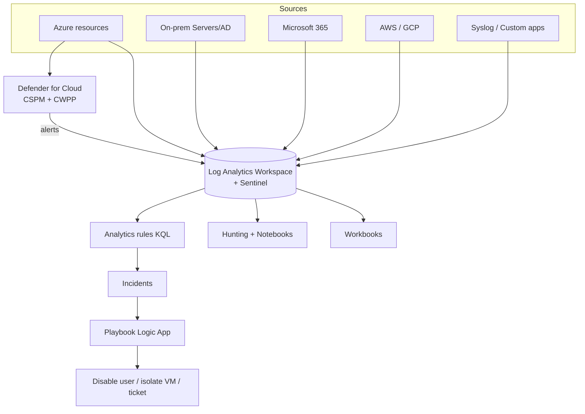

# Defender for Cloud and Sentinel

> **One-liner**: **Microsoft Defender for Cloud (MDC)** is your **CSPM + CWPP** — it scores how exposed your Azure footprint is and watches workloads for runtime threats; **Microsoft Sentinel** is the **SIEM/SOAR** sitting on top of Log Analytics, where you investigate, correlate, and orchestrate response.

---

## Quick Reference

| Capability | What it covers |
| ---------- | -------------- |
| **CSPM** (Cloud Security Posture Management) | Misconfigurations, missing controls, attack-path analysis |
| **CWPP** (Cloud Workload Protection Platform) | Runtime threat detection per workload type |
| **Defender for Servers** | VMs (Windows/Linux), file integrity, vulnerability scanning |
| **Defender for Containers** | AKS runtime, image scanning at ACR + admission |
| **Defender for SQL** | Anomalous queries, SQL injection, vulnerability assessment |
| **Defender for Storage** | Malware scan on upload, suspicious access |
| **Defender for Key Vault** | Unusual access patterns |
| **Defender for App Service** | Runtime web attacks |
| **Defender for Resource Manager** | Suspicious control-plane activity |
| **Defender for APIs** | API discovery + threat detection at APIM |

| Sentinel concept | Meaning |
| ---------------- | ------- |
| **Workspace** | A LAW with the SecurityInsights solution enabled |
| **Data connector** | Pre-built ingestion (Entra audit, Defender XDR, Office, Syslog, AWS, GCP) |
| **Analytics rule** | KQL query → incident; scheduled, near-real-time, fusion |
| **Incident** | Grouped alerts with entities, timeline, severity |
| **Workbook** | Dashboard (same engine as Azure Monitor) |
| **Hunting query** | KQL searches saved for proactive hunts |
| **Notebook** | Jupyter via Microsoft Sentinel ML |
| **Playbook** | Logic App invoked on alert (SOAR) |
| **UEBA** | User & Entity Behavioral Analytics |

| MDC plan tier | Cost shape |
| ------------- | ---------- |
| **Free** (Foundational CSPM) | Posture only, no workload protection |
| **Defender CSPM** | Adds attack paths, agentless scanning, EASM |
| **Workload plans** | Per-resource ($/server, $/vCore, $/M txns) |

---

## Core Concept

The clean separation: **MDC tells you what's wrong with your *configuration* and what's happening on your *workloads*; Sentinel collects the *events* across everything (Azure + non-Azure) and helps you investigate*.* Most orgs run both — MDC alerts feed into Sentinel as a data connector.

**Secure Score** is MDC's headline metric — a percentage of recommended controls applied. It's a useful directional KPI for posture *improvement*; the absolute number means less than the trend.

**Attack-path analysis** is the killer CSPM feature: MDC walks the graph of permissions + network paths and shows "this internet-exposed VM has a path to your prod SQL via this stale RBAC." Find blast-radius issues before an attacker does.

**Workload plans cost money and you opt-in per type.** Defender for Servers Plan 2 is ~$15/server/month; Defender for SQL is per-vCore. Turn them on per environment based on risk.

**Sentinel is built on KQL and LAW.** Same workspace as Azure Monitor (or a separate one if you want to firewall security data). Pricing: per-GB ingest plus Sentinel surcharge above 100 GB/day.

**SOAR (playbooks)** automates the boring response: enrich an incident with VirusTotal, comment on a ticket, disable a user, isolate a VM. Most teams start with notification playbooks and grow into auto-remediation.

---

## Diagram



---

## Syntax & API

### Enable MDC + workload plans

```bash
SUB=$(az account show --query id -o tsv)

# Foundational CSPM is free and on by default; turn on advanced
az security pricing create -n CloudPosture     --tier Standard
az security pricing create -n VirtualMachines  --tier Standard --subplan P2
az security pricing create -n SqlServers       --tier Standard
az security pricing create -n StorageAccounts  --tier Standard --subplan DefenderForStorageV2
az security pricing create -n Containers       --tier Standard
az security pricing create -n KeyVaults        --tier Standard
az security pricing create -n AppServices      --tier Standard
az security pricing create -n Arm              --tier Standard
```

### Auto-provision MDC agents on VMs

```bash
az security auto-provisioning-setting update -n default --auto-provision On
```

### Pull Secure Score

```bash
az security secure-scores list -o table
```

### Onboard Sentinel to a LAW

```bash
LAW=law-platform-prod
RG=rg-monitor-prod

az sentinel onboarding-state create --resource-group $RG --workspace-name $LAW \
  --customer-managed-key false
```

### Connect Entra audit logs to Sentinel

```bash
az sentinel data-connector create --resource-group $RG --workspace-name $LAW \
  --data-connector-id azure-active-directory \
  --kind AzureActiveDirectory \
  --tenant-id $(az account show --query tenantId -o tsv) \
  --data-types '{"signInLogs":{"state":"Enabled"}, "auditLogs":{"state":"Enabled"}}'
```

### Sentinel analytics rule (Bicep) — impossible-travel sign-in

```bicep
resource rule 'Microsoft.SecurityInsights/alertRules@2024-09-01' = {
  scope: workspace
  name: 'impossible-travel'
  kind: 'Scheduled'
  properties: {
    displayName: 'Sign-in from two countries within 1 hour'
    severity: 'High'
    enabled: true
    queryFrequency: 'PT15M'
    queryPeriod: 'PT1H'
    triggerOperator: 'GreaterThan'
    triggerThreshold: 0
    query: '''
      SigninLogs
      | where ResultType == 0
      | summarize Countries = make_set(LocationDetails.countryOrRegion), Count = count() by UserPrincipalName, bin(TimeGenerated, 1h)
      | where array_length(Countries) > 1
    '''
    suppressionDuration: 'PT5H'
    suppressionEnabled: true
    incidentConfiguration: {
      createIncident: true
      groupingConfiguration: {
        enabled: true
        lookbackDuration: 'PT5H'
        matchingMethod: 'AllEntities'
      }
    }
  }
}
```

### Playbook trigger (Logic App)

```json
{
  "type": "When_Azure_Sentinel_incident_creation_rule_was_triggered",
  "kind": "ApiConnectionWebhook",
  "inputs": { "body": { "callback_url": "@{listCallbackUrl()}" } }
}
```

### Hunting query — recent ARM role-assignment changes by service principal

```kql
AzureActivity
| where OperationNameValue =~ "Microsoft.Authorization/roleAssignments/write"
| where Caller endswith "@app" or Caller startswith "spn:"
| project TimeGenerated, Caller, ResourceGroup, Properties
| order by TimeGenerated desc
```

---

## Common Patterns

- **Secure Score as a quarterly OKR** for the platform team. Trend > absolute.
- **Attack-path remediation tickets**: MDC's high-severity attack paths fed into Jira via Logic App. Closes the loop.
- **Defender for Containers + Image Integrity admission** — block unsigned/unscanned images at the cluster.
- **Sentinel + Defender XDR**: Defender XDR for endpoints/email; Sentinel for cross-cloud + custom apps. Both feed each other.
- **Tier 1 playbooks: enrich + notify**. Tier 2: contain (disable user, block IP). Tier 3: full auto-remediation. Walk up the ladder.
- **Workbooks per investigation type**: "auth anomalies", "data exfiltration", "lateral movement". Re-used across incidents.
- **Hunt-then-detect**: write hunting queries first; promote ones that find real things to analytics rules.

---

## Gotchas & Tips

- **MDC alerts vs Sentinel incidents**: MDC raises alerts on resources; Sentinel groups alerts into incidents. Connect MDC to Sentinel so analysts work in one tool.
- **Secure Score doesn't credit compensating controls.** A fix outside MDC's view (custom firewall) won't move the needle — annotate via exemptions.
- **Defender for Storage charges per transaction**, not per GB. Bursty workloads can be expensive; estimate before enabling.
- **CSPM agentless scanning** snapshots disks for vulnerability assessment. Check disk size — large disks add scanning cost.
- **Sentinel ingestion has free buckets** for some Microsoft data sources (Entra sign-ins to a limit). Plan capacity by source.
- **Analytics rules can DDOS your team** if poorly tuned. Always set `suppressionDuration` and grouping; otherwise one alert pattern produces hundreds of incidents.
- **Playbook Logic Apps need `Microsoft Sentinel Contributor` role** at workspace scope to set incident state.
- **UEBA needs sign-in + audit logs ingested for ~7 days** before its baselines are useful.
- **Tagging strategy doubles as Sentinel filter** — `env=prod` lets analytics rules score severity differently per environment.
- **Don't enable every workload plan in dev.** Use management-group based assignments and skip non-prod by default.
- **Sentinel tables are sometimes named differently** from Azure Monitor (`SecurityIncident` vs `Alert`). Check the schema explorer when authoring rules.

---

## See Also

- [[09 - RBAC and Azure Policy]]
- [[07 - Azure Monitor and Log Analytics]]
- [[15 - Key Vault]]
- [[12 - Private Endpoints and Zero Trust]]
