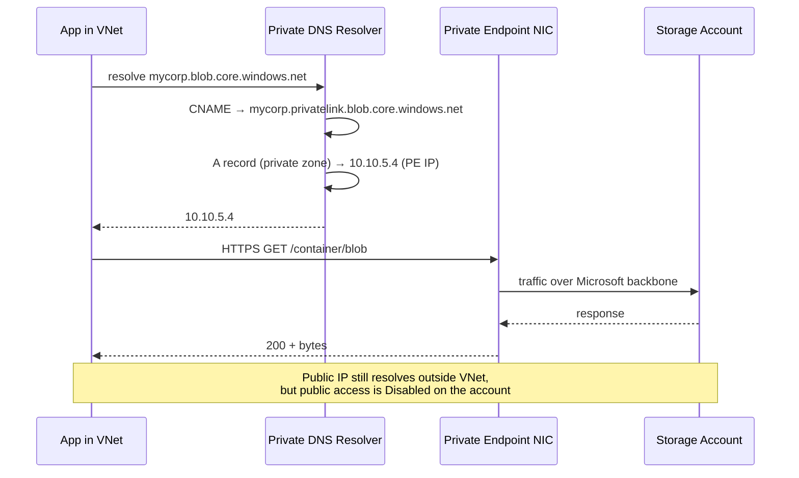

# Private Endpoints and Zero Trust

> **One-liner**: A **Private Endpoint** gives an Azure PaaS service a **private IP inside your VNet**, and **Private Link** + **Private DNS Zones** keep traffic off the public internet — the foundation of a Zero-Trust posture where no PaaS resource is reachable from a public IP.

---

## Quick Reference

| Concept | Meaning |
| ------- | ------- |
| **Private Endpoint (PE)** | NIC in your VNet bound to a sub-resource of a PaaS service |
| **Private Link Service** | The PaaS-side endpoint exposed through PE (you don't manage it) |
| **Private DNS Zone** | Maps `<resource>.<service>.<region>.privatelink.<zone>` → PE IP |
| **`privatelink.<service>.core.windows.net`** | Standard private DNS zone name per service |
| **Service Endpoint (legacy)** | Cheaper but less powerful predecessor of PE — VNet-scoped allow list |
| **Zero Trust** | Verify explicitly, least privilege, assume breach |

| Common service → DNS zone | Sub-resource |
| ------------------------- | ------------ |
| Storage Blob | `privatelink.blob.core.windows.net` (`blob`) |
| Storage File | `privatelink.file.core.windows.net` (`file`) |
| Azure SQL DB | `privatelink.database.windows.net` (`sqlServer`) |
| Cosmos DB | `privatelink.documents.azure.com` (`Sql`) |
| Key Vault | `privatelink.vaultcore.azure.net` (`vault`) |
| App Service | `privatelink.azurewebsites.net` (`sites`) |
| ACR | `privatelink.azurecr.io` (`registry`) |
| Service Bus | `privatelink.servicebus.windows.net` (`namespace`) |
| Event Grid | `privatelink.eventgrid.azure.net` (`topic`) |

---

## Core Concept

The default state of an Azure PaaS resource is **public**: a Storage Account answers on `mycorp.blob.core.windows.net` from the internet, secured by Entra tokens and SAS. That's not Zero Trust — a leaked SAS or token is enough to exfiltrate.

A **Private Endpoint** moves the resource onto your VNet. The public DNS name resolves to a **CNAME** that ends in the `privatelink.*` zone, and your private DNS zone resolves *that* to a private IP inside your VNet. Public traffic still works (unless you disable it), but apps inside the VNet now go private.

**Disable public access** on every PaaS resource that has a private endpoint. Otherwise an attacker bypasses the private path entirely.

**Private DNS Zone wiring** is the part that goes wrong. Each PaaS service has a *specific* zone name; the zone must be linked to every VNet that needs to resolve, and `auto-registration` must be **off** on those links.

**Zero Trust on Azure** is the union of: PE everywhere, public access disabled, Entra tokens with conditional access, MI for app-to-PaaS auth, NSG/firewall to enforce east-west isolation, Defender for runtime detection.

**Service Endpoints are not the same.** They restrict the service's public endpoint to specific subnets — cheaper, but the public IP still exists, and they don't extend cross-region or to on-prem.

---

## Diagram



---

## Syntax & API

### Storage account with private endpoint, public disabled

```bash
RG=rg-zt-prod
LOC=eastus
SA=stordersprod$RANDOM
VNET=vnet-spoke-a
SUBNET=app

az storage account create -g $RG -n $SA -l $LOC --sku Standard_LRS \
  --kind StorageV2 \
  --public-network-access Disabled \
  --allow-blob-public-access false \
  --min-tls-version TLS1_2

# Subnet must allow PEs (private-endpoint-network-policies removed = allow)
az network vnet subnet update -g $RG --vnet-name $VNET -n $SUBNET \
  --disable-private-endpoint-network-policies true

# Create the PE
SA_ID=$(az storage account show -g $RG -n $SA --query id -o tsv)

az network private-endpoint create -g $RG -n pe-$SA-blob -l $LOC \
  --vnet-name $VNET --subnet $SUBNET \
  --private-connection-resource-id $SA_ID --group-ids blob \
  --connection-name conn-$SA
```

### Wire up Private DNS Zone

```bash
az network private-dns zone create -g $RG -n privatelink.blob.core.windows.net

az network private-dns link vnet create -g $RG -n link-spoke-a \
  --zone-name privatelink.blob.core.windows.net \
  --virtual-network $VNET --registration-enabled false

az network private-endpoint dns-zone-group create -g $RG \
  --endpoint-name pe-$SA-blob --name dnsgrp \
  --private-dns-zone privatelink.blob.core.windows.net --zone-name blob
```

### Bicep — full pattern (one resource, one PE, one DNS group)

```bicep
param location string
param vnetId string
param subnetName string
param privateDnsZoneId string

resource sa 'Microsoft.Storage/storageAccounts@2024-01-01' = {
  name: 'storders${uniqueString(resourceGroup().id)}'
  location: location
  sku: { name: 'Standard_LRS' }
  kind: 'StorageV2'
  properties: {
    publicNetworkAccess: 'Disabled'
    minimumTlsVersion: 'TLS1_2'
    allowBlobPublicAccess: false
  }
}

resource pe 'Microsoft.Network/privateEndpoints@2024-03-01' = {
  name: 'pe-${sa.name}-blob'
  location: location
  properties: {
    subnet: { id: '${vnetId}/subnets/${subnetName}' }
    privateLinkServiceConnections: [{
      name: 'conn'
      properties: { privateLinkServiceId: sa.id, groupIds: [ 'blob' ] }
    }]
  }
}

resource peDns 'Microsoft.Network/privateEndpoints/privateDnsZoneGroups@2024-03-01' = {
  parent: pe
  name: 'default'
  properties: {
    privateDnsZoneConfigs: [{ name: 'blob', properties: { privateDnsZoneId: privateDnsZoneId } }]
  }
}
```

### Verify resolution from a VM in the VNet

```bash
nslookup mycorp.blob.core.windows.net
# Should return CNAME to privatelink.blob.core.windows.net → private IP
```

### Disable public access on existing resources, audit via Policy

```bash
# One-shot: deny creation of public storage
az policy assignment create -n storage-deny-public \
  --scope /subscriptions/$SUB \
  --policy "34c877ad-507e-4c82-993e-3452a6e0ad3c"
```

---

## Common Patterns

- **One private DNS zone per service per hub** — linked to every spoke VNet via `link-vnet`. Resolution survives VNet peering.
- **PE in the same RG/sub as the resource**, even if the VNet is elsewhere — simplifies RBAC and lifecycle.
- **Disable public access on day 1** for SQL, Storage, Key Vault, Cosmos, ACR. Make the PE the only path.
- **Cross-region apps**: PE in app's VNet, resource in another region. Traffic stays on Microsoft backbone.
- **Hybrid resolution**: on-prem DNS forwards `*.privatelink.<svc>.core.windows.net` to an Azure Private DNS Resolver inbound endpoint in the hub.
- **Use `auto-approval` for app teams** at the resource owner; or require manual approval for sensitive ones (KV, SQL).
- **Service-Endpoints + Storage Firewall** for low-cost staging environments where PE + DNS infra would be overkill.

---

## Gotchas & Tips

- **The PE IP is from the subnet's pool.** Plan IP space — at scale you can run out fast.
- **`privatelink.<service>.core.windows.net` zone names are exact.** Typos silently break resolution; PEs return public IP.
- **DNS resolution from outside the VNet still returns the public IP.** This is correct — internal apps get private, external still see public (or 403 if disabled).
- **`auto-registration=true` on a private DNS link breaks PE resolution.** Always `false`.
- **Some services need multiple sub-resources.** A storage account with blob+file+queue needs three PEs (or one PE per group).
- **Removing a PE doesn't remove its DNS records.** Clean up the dns-zone-group first.
- **Private Link cost**: ~$0.01/hour per PE plus per-GB egress. Cheap individually, can add up at scale.
- **Conditional access can't see source IP from a PE** beyond "trusted IP" — use named locations carefully.
- **App Service PE requires `vnetRouteAllEnabled=true`** plus regional VNet integration for outbound to also be private.
- **PE doesn't change RBAC.** Tokens are still required. PE just controls the *network* path.
- **Private DNS Resolver is the modern way** to bridge on-prem DNS into Azure private zones — replaces the old "DNS proxy VM" pattern.
- **Cosmos DB private endpoints have separate sub-resources for SQL/Mongo/Cassandra**. Pick the right one for your API.

---

## See Also

- [[17 - VNet and Subnets]]
- [[11 - Hub and Spoke Networking]]
- [[15 - Key Vault]]
- [[16 - Managed Identity]]
- [[10 - Defender for Cloud and Sentinel]]
