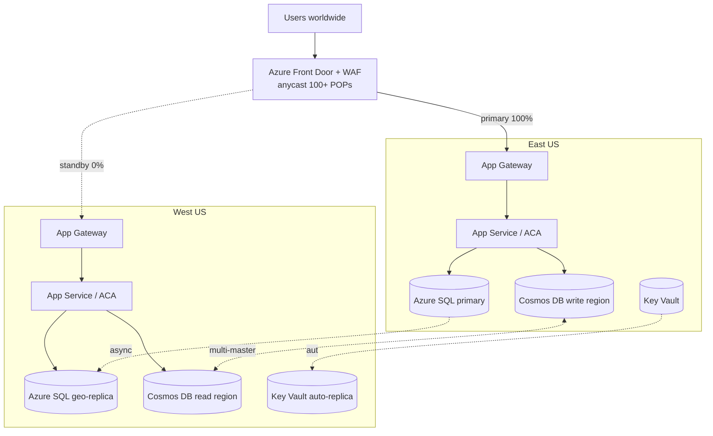

# Multi-Region HA

> **One-liner**: **Multi-region high availability** is choosing between **active-active** (both regions serve traffic, complex data sync) and **active-passive** (one serves, the other warm-stands), then picking the **traffic director** (Front Door / Traffic Manager) and **data replication** strategy that match your **RTO/RPO** budget.

---

## Quick Reference

| Posture | RTO / RPO | Cost | Complexity |
| ------- | --------- | ---- | ---------- |
| **Active-active** | seconds / seconds | ~2× compute | High (multi-master data) |
| **Active-passive (hot)** | minutes / seconds | ~2× | Medium |
| **Active-passive (warm)** | 30 min / minutes | ~1.3× | Low-Medium |
| **Pilot light** | hours / minutes | ~1.1× | Low |
| **Backup-restore** | hours / hours | ~1.05× | Lowest |

| Traffic director | Use |
| ---------------- | --- |
| **Azure Front Door** | L7 global anycast, WAF, caching, fastest failover |
| **Traffic Manager** | DNS-based; client TTL determines failover speed |
| **Cross-region Load Balancer** | L4 global anycast for non-HTTP |
| **DNS-based weighted/priority** | Cheap, predictable; DNS TTL caveat |

| Data replication by service | Mode |
| --------------------------- | ---- |
| **Azure SQL DB** | Active geo-replication / Failover groups (async) |
| **Cosmos DB** | Multi-region writes (sync within region, async across) |
| **Postgres Flex** | Read replicas (async) or geo-redundant backup |
| **Storage GRS / RA-GZRS** | Async cross-region; read-access optional |
| **Service Bus Geo-DR** | Pairing primary + secondary namespaces |
| **Key Vault** | Auto-replicated within paired region (read failover) |
| **AKS** | No native multi-region; deploy independent clusters |

| Region terminology | Meaning |
| ------------------ | ------- |
| **Region pair** | Microsoft-defined paired regions (eastus ↔ westus, etc.) |
| **Availability Zone (AZ)** | Datacenter within a region; 3 per AZ-enabled region |
| **Zone-redundant service** | Single regional resource that survives AZ loss |
| **Geo-redundant service** | Replica in the paired region |

---

## Core Concept

The cheapest "HA" is **AZ-redundancy**: one region, services configured zone-redundant, survives one datacenter going down. Sufficient for most workloads. **Multi-region** is for surviving a *region* outage — rare, but high-impact for regulated/SLA-bound workloads.

The hard part is **data**, not compute. Stateless apps replicate trivially; databases force a choice: accept async lag (RPO > 0) or take a write-latency penalty for sync (RPO = 0, but slower).

**Active-active** with a single global write region (with geo-replicas serving reads) is the sweet spot for most teams. Cosmos DB's multi-master is the rare service that does true active-active writes well, with conflict resolution policies you tune.

**Front Door** is usually the right traffic director: L7, WAF, anycast, sub-second failover via health probes. Traffic Manager is DNS-only; client DNS caching means failover takes minutes.

**Failover testing is non-negotiable.** A DR plan that's never been exercised is a fiction. Run a regional failover quarterly in a non-prod environment, document RTO/RPO actuals, fix the gaps.

**Region pairs** matter for paired-region replication services (storage GRS, KV). Microsoft's pair list ensures the paired region stays up during paired-region outages and is patched on a different schedule.

---

## Diagram



---

## Syntax & API

### Front Door with two backends + health probe

```bash
RG=rg-ha-prod
PROFILE=fd-orders-prod

az afd profile create -g $RG -n $PROFILE --sku Premium_AzureFrontDoor

az afd endpoint create -g $RG --profile-name $PROFILE -n orders --enabled-state Enabled

az afd origin-group create -g $RG --profile-name $PROFILE -n orders-og \
  --probe-request-type GET --probe-protocol Https --probe-interval-in-seconds 30 --probe-path /healthz \
  --sample-size 4 --successful-samples-required 3 --additional-latency-in-milliseconds 50

az afd origin create -g $RG --profile-name $PROFILE --origin-group-name orders-og \
  -n east --host-name app-orders-east.azurewebsites.net --priority 1 --weight 1000 --http-port 80 --https-port 443
az afd origin create -g $RG --profile-name $PROFILE --origin-group-name orders-og \
  -n west --host-name app-orders-west.azurewebsites.net --priority 2 --weight 1000 --http-port 80 --https-port 443

az afd route create -g $RG --profile-name $PROFILE --endpoint-name orders -n default \
  --origin-group orders-og --supported-protocols Https --forwarding-protocol HttpsOnly \
  --link-to-default-domain Enabled --https-redirect Enabled
```

### Azure SQL Failover Group

```bash
RG=rg-data-prod
SRV1=sql-orders-east
SRV2=sql-orders-west
DB=orders

az sql server create -g $RG -n $SRV1 -l eastus --admin-user sqladmin --admin-password "$PWD"
az sql server create -g $RG -n $SRV2 -l westus2 --admin-user sqladmin --admin-password "$PWD"

az sql db create -g $RG -s $SRV1 -n $DB --service-objective S1 --backup-storage-redundancy Geo

az sql failover-group create -g $RG -n fg-orders \
  --server $SRV1 --partner-server $SRV2 \
  --add-db $DB --failover-policy Automatic --grace-period 1
```

App connects to `fg-orders.database.windows.net`; on failover the listener flips to the secondary in <60s.

### Cosmos DB multi-region writes

```bash
az cosmosdb create -g $RG -n cosmos-orders-prod \
  --locations regionName=eastus failoverPriority=0 isZoneRedundant=true \
  --locations regionName=westus2 failoverPriority=1 isZoneRedundant=true \
  --enable-multiple-write-locations true \
  --default-consistency-level Session
```

### RA-GZRS storage

```bash
az storage account create -g $RG -n storders$RANDOM \
  --sku Standard_RAGZRS \
  --kind StorageV2
```

Apps in the secondary read from `<account>-secondary.blob.core.windows.net`.

### Test failover (Cosmos DB)

```bash
az cosmosdb failover-priority-change -g $RG -n cosmos-orders-prod \
  --failover-policies "westus2=0" "eastus=1"
# Reverse it after the drill
```

---

## Common Patterns

- **Active-passive with Front Door priority** — east primary, west priority 2; failover automatic on health probe failure.
- **Region-pinned tenants for active-active**: tenant A always writes east, tenant B always writes west. Avoids multi-master conflicts.
- **Read-local, write-remote**: reads hit nearest replica (Cosmos session consistency), writes go to a single global region.
- **Stateful services in one region only** — Service Bus Geo-DR for messaging, Azure SQL Failover Group for SQL, Cosmos multi-master for low-latency global writes.
- **Health endpoints answer about *real* dependencies** — `/healthz` checks DB, KV, downstream APIs. Not just "process alive."
- **Quarterly game-days** that flip the region for an hour and measure RTO/RPO. Findings → tickets.
- **Region-aware DNS for static assets** via Front Door's caching + per-region origins.

---

## Gotchas & Tips

- **Region failover takes longer than the SLA suggests.** SQL Failover Group: minutes; KV read failover: minutes; Cosmos manual failover: ~5 min. Plan for it.
- **DNS TTL is the floor for failover speed** with Traffic Manager. 60s TTL means clients can take 1+ min to switch.
- **Async replication has lag.** RPO ≠ 0. A failover can lose the last few seconds of writes. Document this with the business.
- **Failover Group only switches the *connection endpoint*** — your app must use the listener hostname, not the server hostname.
- **AZ-redundancy ≠ multi-region.** A region outage takes down all AZs. Don't sell AZ as DR.
- **Paired-region maintenance** is staggered. Microsoft won't patch both regions simultaneously — but check your service for exceptions.
- **Cosmos multi-master conflict resolution** defaults to last-write-wins on `_ts`. Custom resolution needs a stored procedure.
- **Storage RA-GZRS read endpoint may be stale.** Reads are eventually consistent against the primary.
- **Compute parity matters** — both regions need the same image, config, secrets. Drift breaks failover. Use IaC + GitOps.
- **Cost doubles for compute, less than doubles for storage** (replication is cheaper than mirror compute). Right-size the secondary.
- **App Service slots don't replicate cross-region.** You stand up two App Services and front them with FD.
- **Avoid global DBs you don't need.** Cosmos at single-region is half the bill of multi-region.

---

## See Also

- [[14 - Disaster Recovery]]
- [[19 - Azure Front Door and CDN]]
- [[07 - Azure SQL Database]]
- [[08 - Cosmos DB]]
- [[01 - Well-Architected Framework]]
