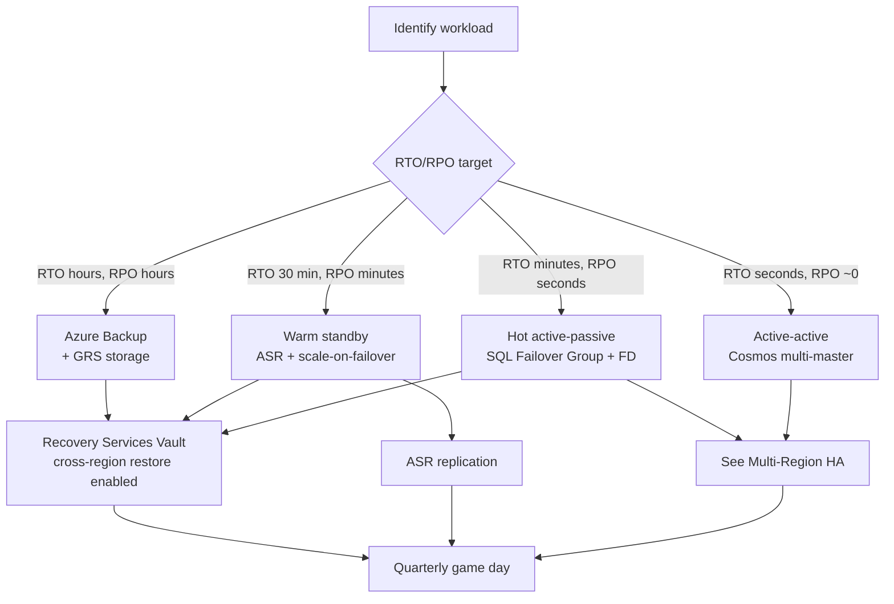

# Disaster Recovery

> **One-liner**: **DR** is the combination of **RTO** (how long until we're back), **RPO** (how much data we can lose), and the *concrete plan* — geo-redundant storage, **Azure Backup** for restore, **Azure Site Recovery (ASR)** for failover — *plus the drill that proves it works*.

---

## Quick Reference

| Term | Meaning |
| ---- | ------- |
| **RTO** | Recovery Time Objective — max acceptable downtime |
| **RPO** | Recovery Point Objective — max acceptable data loss |
| **MTD** | Maximum Tolerable Downtime — total business pain ceiling |
| **DRP** | Documented Disaster Recovery Plan |
| **Runbook** | Step-by-step DR execution doc |
| **Game day** | Scheduled DR test under realistic conditions |

| Strategy | RTO | RPO | Use |
| -------- | --- | --- | --- |
| **Backup-restore** | hours-days | hours | Cheap, slow — small / non-critical |
| **Pilot light** | hours | minutes | Minimal infra in DR region, scale on demand |
| **Warm standby** | 10s of minutes | minutes | Reduced-capacity DR; scale to full on failover |
| **Hot active-passive** | minutes | seconds | Full DR, idle until failover |
| **Active-active** | seconds | seconds | Multi-region serving; see [[13 - Multi-Region HA]] |

| Tool | Use |
| ---- | --- |
| **Azure Backup** | Files / VMs / SQL / files-on-VM / blobs — point-in-time restore |
| **Azure Site Recovery (ASR)** | Replicate VMs (Azure→Azure, on-prem→Azure) for region failover |
| **Storage GRS / RA-GZRS** | Async cross-region storage replication |
| **SQL Failover Group** | Auto SQL failover at app endpoint |
| **Cosmos multi-region** | Built-in DR + failover |
| **Service Bus Geo-DR** | Namespace pairing |
| **Recovery Services Vault** | The container for Backup + ASR |

| Backup retention defaults | Period |
| ------------------------- | ------ |
| **Daily** | 30 days |
| **Weekly** | 12 weeks |
| **Monthly** | 12 months |
| **Yearly** | 10 years |

---

## Core Concept

A DR plan is *not* "we have geo-redundant storage." It's a **set of explicit choices**: per workload, what is the RTO/RPO, what's the runbook, who runs it, when did we last test it.

**RTO and RPO drive everything else.** A 4-hour RTO with 1-hour RPO = warm standby + GRS storage. A 30-second RTO with 0 RPO = active-active + Cosmos multi-master + heavy spend. Pick the cheapest tier that meets the business need.

**Backup ≠ DR.** Backup recovers from data corruption (ransomware, accidental delete, bad migration). DR recovers from infrastructure loss (region outage, datacenter fire). You need both.

**Azure Backup** does point-in-time restore for VMs, files, SQL on VM, blobs (operational backup with versioning), and managed disks. It writes to a **Recovery Services Vault** with optional **immutable + soft-delete + cross-region restore**.

**ASR** is the answer for "lift this VM workload to another region." It replicates disk changes async (RPO 30s typical), and on failover it spins the VM up in the target region from the last replicated point.

**The drill is the deliverable.** A runbook nobody has executed will fail under stress. Calendar quarterly game days, log RTO/RPO actuals, file gaps as backlog items.

---

## Diagram



---

## Syntax & API

### Recovery Services Vault + cross-region restore

```bash
RG=rg-dr-prod
LOC=eastus
VAULT=rsv-orders-prod

az backup vault create -g $RG -n $VAULT -l $LOC

# Set storage to GRS + enable cross-region restore
az backup vault backup-properties set -g $RG -n $VAULT \
  --backup-storage-redundancy GeoRedundant
az backup vault backup-properties set -g $RG -n $VAULT \
  --cross-region-restore-flag true
```

### Back up a VM with default policy

```bash
VM=vm-orders-app
az backup protection enable-for-vm -g $RG -v $VAULT \
  --vm $(az vm show -g $RG -n $VM --query id -o tsv) --policy-name DefaultPolicy

# Trigger an on-demand backup
az backup protection backup-now -g $RG -v $VAULT \
  --container-name $VM --item-name $VM --backup-management-type AzureIaasVM
```

### Restore a file from a recovery point

```bash
RP=$(az backup recoverypoint list -g $RG -v $VAULT \
  --container-name $VM --item-name $VM --backup-management-type AzureIaasVM \
  --query '[0].name' -o tsv)

az backup restore files mount-rp -g $RG -v $VAULT \
  --container-name $VM --item-name $VM --rp-name $RP
# Mounts the recovery point as a script that maps drives — copy needed files
```

### ASR — Azure-to-Azure VM replication

```bash
RG_DR=rg-dr-secondary
VAULT_DR=rsv-orders-dr-westus2

# Vault in target region
az group create -n $RG_DR -l westus2
az backup vault create -g $RG_DR -n $VAULT_DR -l westus2

# Enable replication via portal/Bicep is the practical path; CLI is verbose.
# Bicep ASR resources: Microsoft.RecoveryServices/vaults/replicationPolicies +
# replicationProtectedItems + replicationFabrics
```

### Storage account with operational + vaulted backup

```bash
SA=stordersprod$RANDOM
az storage account create -g $RG -n $SA --sku Standard_RAGZRS --kind StorageV2 \
  --enable-versioning true --enable-change-feed true \
  --enable-delete-retention true --delete-retention-days 14 \
  --enable-container-delete-retention true --container-delete-retention-days 14
```

### SQL DB long-term retention (LTR)

```bash
az sql db ltr-policy set -g $RG -s sql-orders-east -n orders \
  --weekly-retention P12W --monthly-retention P12M --yearly-retention P5Y --week-of-year 1
```

### Run a DR drill (Failover Group test failover)

```bash
# Test failover (creates a copy in the secondary, doesn't break the primary)
az sql failover-group set-primary -g $RG -n fg-orders --server sql-orders-east  # ensure primary
# Production planned failover:
az sql failover-group set-primary -g $RG -n fg-orders --server sql-orders-west
```

---

## Common Patterns

- **Tiered DR**: critical workloads hot active-passive; tier-2 warm standby; tier-3 backup-restore. Each tier has documented RTO/RPO.
- **Immutability for backups**: enable Vault immutability + soft delete + MUA (Multi-User Authorization) to defeat ransomware that targets backups.
- **Cross-region restore turned on by default** for vaults — costs nothing until you use it; saves you when the region is down.
- **Backups ship to a different subscription/tenant** for the most critical data — defends against tenant-level compromise.
- **Runbooks in the same repo as IaC** so they evolve together. Each step lists CLI command + expected output + rollback.
- **Game day cadence**: quarterly tabletop, twice-yearly partial failover, annual full failover with paying customers (carefully).
- **Synthetic transactions during DR drills** prove the failover *worked from a user perspective*, not just "the VM is up."

---

## Gotchas & Tips

- **GRS without read access (RA-GRS turned off)** means you can't read the secondary at all until failover; pick RA-GZRS if reads matter.
- **Azure Backup retention is forever-charged.** Long retention (10 years monthly) costs real money — don't blanket-apply.
- **ASR replication consumes IOPS and bandwidth.** Heavy-write VMs may need premium disks or you'll lag the RPO.
- **Failover is one direction at a time.** After you fail over to West, "fail back" is its own re-protect operation — plan downtime for it.
- **VM backup is crash-consistent by default.** App-consistent needs VSS (Windows) or pre-/post-scripts (Linux).
- **Cross-region restore is async**, can take hours for a large VM. Don't set RTO < the tested cross-region restore time.
- **Recovery Services Vaults are regional.** Losing the region = losing the local vault data unless cross-region restore was enabled and the secondary is healthy.
- **Test restores, not just backups.** A backup that's never restored has unknown integrity.
- **DR for AKS is not ASR.** Treat clusters as cattle: redeploy to secondary region from IaC + restore PVs from Velero/Azure Backup.
- **Don't DR to the paired region only.** Some regional outages take down both — check Microsoft's pair list and consider a non-paired DR region for the highest-tier workloads.
- **Document who has the runbook authority.** During an outage, "who pulls the trigger?" is the slowest decision unless pre-authorized.

---

## See Also

- [[13 - Multi-Region HA]]
- [[06 - Storage Basics]]
- [[06 - Blob Storage Advanced]]
- [[07 - Azure SQL Database]]
- [[01 - Well-Architected Framework]]
