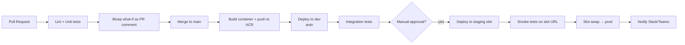

# CI-CD on Azure

> **One-liner**: Modern Azure CI/CD = **GitHub Actions** (or Azure Pipelines) authenticating to Azure via **OIDC federated identity** (no secrets), deploying via **Bicep** with `what-if`, gated by **Environments + Approvals**, releasing via **slots** or **revisions** for blue/green.

---

## Quick Reference

| Pipeline tool | Strengths |
| ------------- | --------- |
| **GitHub Actions** | First-class for OSS / GitHub-hosted code; OIDC to Azure |
| **Azure Pipelines** | Tighter Azure DevOps Boards/Artifacts integration |
| **Both** | Identical capability; pick the one your org standardized on |

| Auth method | Recommendation |
| ----------- | -------------- |
| **OIDC (workload identity federation)** | Preferred — no secrets in repo |
| **Service Principal + secret** | Legacy — rotate quarterly, store in GH/ADO secrets |
| **Service Principal + cert** | Legacy — slightly better than secret |

| Release pattern | Service support |
| --------------- | --------------- |
| **Blue/green via slots** | App Service (5 slots), Function App |
| **Revisions traffic-split** | Container Apps (any %) |
| **Canary** | AKS (Argo Rollouts, Flagger), Front Door weighted routing |
| **Rolling** | AKS Deployments, App Service multi-instance |
| **Recreate** | Acceptable only with downtime windows |

| Gate type | Use |
| --------- | --- |
| **Required reviewers** | Manual approval before deploy |
| **Wait timer** | Cool-off between stages |
| **Branch protection** | Source-side: who can merge to main |
| **Deployment protection rules** | GH Environments — require checks/reviewers |
| **CODEOWNERS** | File-level required reviewers |

---

## Core Concept

The shape of a good Azure pipeline: **lint → unit test → build → bicep what-if → deploy to non-prod → integration test → manual approval → deploy to prod (blue/green) → smoke test → notify**.

**OIDC kills the rotating secret problem.** GitHub Actions or Azure DevOps issues a short-lived JWT signed by their OIDC provider; Entra trusts it via a federated credential on a User-Assigned MI or App Registration; the workflow gets an Entra access token without a single secret in the repo.

**`bicep what-if`** previews exactly what will change before deploy. Run it in PR, post the diff as a comment, fail the PR if it includes deletes of stateful resources.

**Environments** in GH/ADO are the gate model: per-environment secrets, required reviewers, branch restrictions, wait timers. A `prod` environment has 2-reviewer approval; `dev` deploys on every merge.

**Blue/green via App Service slots** is the cleanest deploy: deploy to `staging` slot, warm up, swap with prod. The swap is metadata-only — instant, reversible.

**Drift detection** matters once IaC is in place. A weekly `bicep what-if` against prod catches the manual change someone made in the portal during an incident.

---

## Diagram



---

## Syntax & API

### Federated identity setup (one-time)

```bash
RG=rg-cicd
LOC=eastus
APP_NAME=gh-orders-deployer

# Create an Entra app + service principal
APP_ID=$(az ad app create --display-name $APP_NAME --query appId -o tsv)
az ad sp create --id $APP_ID
SP_OBJECT_ID=$(az ad sp show --id $APP_ID --query id -o tsv)

# Federated credential trusting GitHub Actions for the prod env on main branch
az ad app federated-credential create --id $APP_ID --parameters '{
  "name": "github-prod",
  "issuer": "https://token.actions.githubusercontent.com",
  "subject": "repo:contoso/orders:environment:prod",
  "audiences": ["api://AzureADTokenExchange"]
}'

# RBAC at sub or RG scope
SUB=$(az account show --query id -o tsv)
az role assignment create --assignee $APP_ID --role "Contributor" --scope /subscriptions/$SUB/resourceGroups/rg-orders-prod
az role assignment create --assignee $APP_ID --role "User Access Administrator" \
  --scope /subscriptions/$SUB/resourceGroups/rg-orders-prod \
  --condition "@Resource[Microsoft.Authorization/roleAssignments:RoleDefinitionId] ForAnyOfAnyValues:GuidEquals {b24988ac-6180-42a0-ab88-20f7382dd24c}" \
  --condition-version "2.0"

# Add to repo: TENANT_ID, SUB_ID, APP_ID as GitHub Variables (not secrets)
```

### GitHub Actions — full pipeline with OIDC + slot swap

```yaml
name: deploy-orders
on:
  push: { branches: [ main ] }
  workflow_dispatch:

permissions:
  id-token: write
  contents: read

env:
  AZURE_CLIENT_ID:    ${{ vars.AZURE_CLIENT_ID }}
  AZURE_TENANT_ID:    ${{ vars.AZURE_TENANT_ID }}
  AZURE_SUBSCRIPTION: ${{ vars.AZURE_SUBSCRIPTION }}
  RG: rg-orders-prod
  APP: app-orders-prod
  ACR: acrordersprod

jobs:
  build:
    runs-on: ubuntu-latest
    outputs: { sha: ${{ steps.tag.outputs.sha }} }
    steps:
    - uses: actions/checkout@v4
    - id: tag
      run: echo "sha=${GITHUB_SHA::8}" >> $GITHUB_OUTPUT
    - uses: azure/login@v2
      with:
        client-id: ${{ env.AZURE_CLIENT_ID }}
        tenant-id: ${{ env.AZURE_TENANT_ID }}
        subscription-id: ${{ env.AZURE_SUBSCRIPTION }}
    - run: az acr login -n $ACR
    - run: docker build -t $ACR.azurecr.io/orders:${{ steps.tag.outputs.sha }} .
    - run: docker push   $ACR.azurecr.io/orders:${{ steps.tag.outputs.sha }}

  deploy-staging:
    needs: build
    environment: staging
    runs-on: ubuntu-latest
    steps:
    - uses: azure/login@v2
      with: { client-id: ${{ env.AZURE_CLIENT_ID }}, tenant-id: ${{ env.AZURE_TENANT_ID }}, subscription-id: ${{ env.AZURE_SUBSCRIPTION }} }
    - run: |
        az webapp config container set -g $RG -n $APP --slot staging \
          --container-image-name $ACR.azurecr.io/orders:${{ needs.build.outputs.sha }}
        az webapp deployment slot wait -g $RG -n $APP --slot staging --custom "publishingState=Running"
    - name: smoke
      run: |
        STAGING_URL=https://$APP-staging.azurewebsites.net
        for i in {1..30}; do
          code=$(curl -s -o /dev/null -w "%{http_code}" $STAGING_URL/healthz) && [ "$code" = "200" ] && exit 0
          sleep 5
        done
        exit 1

  deploy-prod:
    needs: deploy-staging
    environment: prod   # has required reviewers
    runs-on: ubuntu-latest
    steps:
    - uses: azure/login@v2
      with: { client-id: ${{ env.AZURE_CLIENT_ID }}, tenant-id: ${{ env.AZURE_TENANT_ID }}, subscription-id: ${{ env.AZURE_SUBSCRIPTION }} }
    - name: slot swap
      run: az webapp deployment slot swap -g $RG -n $APP --slot staging --target-slot production
```

### Bicep what-if as PR comment

```yaml
- uses: azure/cli@v2
  with:
    inlineScript: |
      az deployment group what-if -g $RG --template-file ./infra/main.bicep \
        --parameters @./infra/main.parameters.json --result-format ResourceIdOnly > whatif.txt
- uses: actions/github-script@v7
  with:
    script: |
      const fs = require('fs');
      const body = '```\n' + fs.readFileSync('whatif.txt', 'utf8') + '\n```';
      github.rest.issues.createComment({
        issue_number: context.issue.number, owner: context.repo.owner, repo: context.repo.repo, body });
```

### Azure DevOps equivalent (YAML)

```yaml
trigger: { branches: { include: [ main ] } }
pool: { vmImage: 'ubuntu-latest' }

stages:
- stage: Deploy_Prod
  jobs:
  - deployment: prod
    environment: prod-approvers
    strategy:
      runOnce:
        deploy:
          steps:
          - task: AzureCLI@2
            inputs:
              azureSubscription: 'svc-conn-orders-prod'   # ADO service connection w/ workload identity federation
              scriptType: bash
              scriptLocation: inlineScript
              inlineScript: |
                az deployment group create -g $(rg) --template-file infra/main.bicep
```

---

## Common Patterns

- **One pipeline per service**, calling shared reusable workflows for build/test/deploy steps.
- **Environment per stage** (`dev`, `staging`, `prod`) with environment-scoped secrets/vars. Reviewers + branch policy on `prod`.
- **What-if in PR, deploy on merge.** Diff visible before approval; surprise-free release.
- **Container image tag = git SHA** (or semver + SHA). Immutable, traceable, easy rollback.
- **Slot swap with `Auto Swap` off** — explicit step, easy to halt mid-deploy.
- **Smoke tests against the slot URL before swap**, against the prod URL after swap.
- **Drift detection job** weekly: `az deployment group what-if` against prod with main's IaC. Alert on any diff.
- **Rollback button**: a `workflow_dispatch` that swaps slots back. Practice it.

---

## Gotchas & Tips

- **OIDC subject string is exact-match.** Federated credential `repo:org/repo:environment:prod` won't match `:ref:refs/heads/main`. Add separate creds for each pattern.
- **GitHub Environments are repo-scoped, not org-scoped.** Approvals don't propagate; configure per repo.
- **`az webapp deployment slot swap` doesn't wait for warmup** unless you set `Application Initialization` settings — first request after swap can 503.
- **Don't use `Owner` for the deployer SP.** Contributor + scoped User Access Administrator (with role-condition) is enough for RBAC management.
- **Self-hosted runners on Azure** save egress and hit private endpoints, but you own patching/scaling. ACR Tasks or ACA Jobs are cheaper for build-only.
- **Secrets in `env:` block leak to logs** if echoed. Use `${{ secrets.X }}` directly in steps.
- **`bicep what-if` doesn't catch every change** — module outputs, RBAC at sub scope, MI dependencies. Always test in non-prod first.
- **Branch protection + required status checks** must include the workflow name as it appears in GH UI; mismatched names silently allow merges.
- **Concurrency control**: `concurrency: { group: deploy-prod, cancel-in-progress: false }` prevents two prod deploys at once.
- **Artifact retention defaults are short**. Bump container image retention in ACR if you need historical rollback past 30 days.
- **Pipelines should not provision SPs.** Bootstrap identities/roles outside the pipeline (Bicep at MG scope from a privileged operator).

---

## See Also

- [[10 - IaC with ARM and Bicep]]
- [[20 - Bicep Modules]]
- [[16 - Managed Identity]]
- [[09 - RBAC and Azure Policy]]
