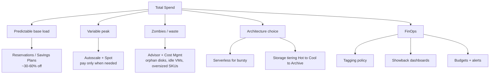

# Cost Optimization at Scale

> **One-liner**: Cost discipline at scale = **commitment-based discounts** (Reservations / Savings Plans / EA), **autoscaling + rightsizing** (don't pay for idle), **architecture choices** (serverless vs always-on, hot vs cool storage), and a **FinOps practice** that makes cost a shared engineering KPI.

---

## Quick Reference

| Lever | Typical savings |
| ----- | --------------- |
| **Reserved Instances (RI), 1-yr** | ~30% |
| **Reserved Instances, 3-yr** | ~50–60% |
| **Azure Savings Plan for Compute** | ~28% (1-yr), ~52% (3-yr); flexible across SKU/region |
| **Spot VMs / Spot pools** | up to 90% |
| **Hybrid Benefit (AHB)** | ~40% on Windows / SQL |
| **Dev/Test pricing** (Visual Studio sub) | ~50% on most SKUs |
| **Autoscale + rightsize** | 20–60% workload-dependent |
| **Hot → Cool → Archive blob** | 50→90% per tier drop |
| **Auto-shutdown of dev VMs** | up to 70% on dev fleets |

| Tool | Purpose |
| ---- | ------- |
| **Cost Management + Billing** | Cost analysis, budgets, alerts, exports |
| **Cost Management Power BI app** | BI-grade analysis |
| **Advisor (Cost recommendations)** | Idle/underused resources, RI suggestions |
| **Azure Pricing Calculator** | Pre-deployment estimates |
| **Microsoft Cost Optimization workbook** | LAW-based cross-resource view |
| **EA / MCA portals** | Enterprise / Microsoft Customer Agreement billing |

| Commitment compared | Flex | Savings |
| ------------------- | ---- | ------- |
| **RI** | Locked SKU + region | Highest |
| **Savings Plan** | Compute-wide hourly $ commit | Medium-high |
| **Spot** | Best-effort, evictable | Highest, but variable |

---

## Core Concept

The 80/20 of Azure cost: **commitment discounts on the predictable base + autoscale on the variable peak + ruthless cleanup of zombies**. Most enterprise overspend is two things: VMs that never scale down, and storage that never moves to cool tiers.

**Reservations vs Savings Plans**: RIs lock SKU/region (best discount); Savings Plans commit a $/hour spend across compute (more flexible). Use RIs for boring base load (SQL DBs, App Service plans you'll keep for years), Savings Plans for fleet heterogeneity.

**FinOps is a practice, not a tool.** It means engineering teams own their cost; cost is shown alongside latency on dashboards; product roadmaps consider cost; chargeback (or showback) makes spend visible per team.

**Tagging is the cost foundation.** Without `costcenter`, `env`, `service`, `owner` tags applied via policy ([[09 - RBAC and Azure Policy]]), allocation is impossible. Untagged resources go in a "platform overhead" bucket the platform team owns.

**Architecture decisions dominate**: a Functions Consumption plan for a 5-rps endpoint costs cents; an idle App Service P1v3 costs hundreds. Picking serverless when bursty, dedicated when steady, ACA when in between — each shifts the cost shape.

**Budgets + alerts** make overspend visible. Per-RG budgets at 80% / 100% / 120% with action groups stop surprise invoices.

---

## Diagram



---

## Syntax & API

### Cost Management — query top spenders this month

```bash
SUB=$(az account show --query id -o tsv)

az costmanagement query \
  --type ActualCost \
  --scope "/subscriptions/$SUB" \
  --timeframe MonthToDate \
  --dataset-aggregation '{"totalCost":{"name":"PreTaxCost","function":"Sum"}}' \
  --dataset-grouping name=ResourceGroupName type=Dimension \
  -o table | head -20
```

### Set a budget with action group alerts

```bash
RG=rg-orders-prod
AG_ID=$(az monitor action-group show -g rg-monitor -n ag-finops --query id -o tsv)

az consumption budget create \
  --budget-name budget-orders-prod \
  --amount 5000 --time-grain Monthly \
  --start-date 2026-05-01 --end-date 2027-04-30 \
  --resource-group $RG \
  --notifications '{
     "0080":{"enabled":true,"operator":"GreaterThan","threshold":80,"contactGroups":["'$AG_ID'"]},
     "0100":{"enabled":true,"operator":"GreaterThan","threshold":100,"contactGroups":["'$AG_ID'"]}
   }'
```

### Pull Advisor cost recommendations

```bash
az advisor recommendation list --category Cost --query "[].{Resource:impactedField, Savings:extendedProperties.savingsAmount, Action:shortDescription.solution}" -o table
```

### Reservation purchase (3-yr Standard_D4s_v5 in eastus)

```bash
az reservations catalog show --subscription-id $SUB \
  --reserved-resource-type VirtualMachines --location eastus

# Purchase via portal is most common; CLI exists but is verbose
az reservations reservation-order purchase \
  --reservation-order-id $(uuidgen) \
  --sku Standard_D4s_v5 --location eastus --quantity 5 \
  --term P3Y --billing-scope-id /subscriptions/$SUB \
  --display-name "RI orders D4 prod" --applied-scope-type Shared --billing-plan Upfront
```

### Auto-shutdown a dev VM at 7pm

```bash
az vm auto-shutdown -g rg-dev -n vm-devbox-01 --time 1900 --email "dev@contoso.com"
```

### Storage lifecycle — move to Cool after 30d, Archive after 180d

```bash
SA=storders$RANDOM

az storage account management-policy create -g $RG --account-name $SA \
  --policy '{
    "rules":[{
      "name":"ageOff","enabled":true,
      "type":"Lifecycle",
      "definition":{
        "filters":{"blobTypes":["blockBlob"]},
        "actions":{"baseBlob":{
           "tierToCool":   {"daysAfterModificationGreaterThan":30},
           "tierToArchive":{"daysAfterModificationGreaterThan":180},
           "delete":       {"daysAfterModificationGreaterThan":2555}
        }}
      }
    }]
  }'
```

### Find orphan disks (cheap quick win)

```bash
az disk list --query "[?managedBy==null].{name:name, rg:resourceGroup, sizeGb:diskSizeGb, sku:sku.name}" -o table
```

---

## Common Patterns

- **Tag-or-deny policy**: missing required tags → resource creation blocked. Force allocation discipline.
- **Per-team showback dashboard**: Power BI + Cost Management export to Storage; refresh daily; team-scoped views.
- **80/20 commitments**: RI/SP cover ~80% of typical compute hours; the variable 20% absorbs spot/scale.
- **Auto-shutdown for dev/test** + Azure Dev Box for ephemeral developer envs.
- **One quarterly RI/SP review** to redeem unused commitments (SP is reassignable; RIs can be exchanged within rules).
- **Architecture pattern shift**: idle App Service Plans → Functions Premium; rarely-accessed blobs → Cool/Archive; nightly batches → Spot ACA jobs.
- **Egress is the silent killer.** Cross-region peering and CDN cache miss bandwidth dominate at scale — measure before optimizing.
- **Right-size monthly with Advisor's recommendations** — pull SKU recommendations, validate against load, downsize.

---

## Gotchas & Tips

- **Reservations are non-refundable in cloud-direct buys**. Buy in increments; don't commit 100% on day one.
- **Savings Plan applies hourly $ commit greedily** — uncovered spend always pays full price. Forecast carefully; over-commit wastes money.
- **Spot pricing fluctuates wildly**. Pin a `maxPrice` only if you actually want eviction at that price; otherwise `-1` (pay current spot).
- **Cost Management data lags ~24 hours**. Don't react to "spike at 3 AM" without confirming the next day.
- **Hybrid Benefit must be claimed** — it's not automatic on existing SQL/Win VMs. Free money you might be leaving.
- **Egress out of region is often pricier than out to internet**. Cross-region replication design has cost implications.
- **Cool tier has retrieval fees + minimum 30-day commit**. Frequent reads = expensive. Archive has 180-day commit + hours-to-restore.
- **Functions Consumption can become more expensive than Premium** at high RPS. Re-check at ~10 M executions / month.
- **Cost Management API has a 30-call/min throttle**. Build your dashboards with this in mind.
- **Don't budget per resource** — too noisy. Budget per RG (= per workload) or per service tag.
- **Avoid "cost optimization sprints" once a year**. FinOps is continuous; small daily decisions beat heroic cleanups.
- **Free tier resources count toward limits per subscription**, not per RG. Multiple "free" Cosmos accounts in one sub will surprise you.

---

## See Also

- [[09 - Cost Management]]
- [[01 - Well-Architected Framework]]
- [[09 - RBAC and Azure Policy]]
- [[03 - AKS Production Patterns]]
