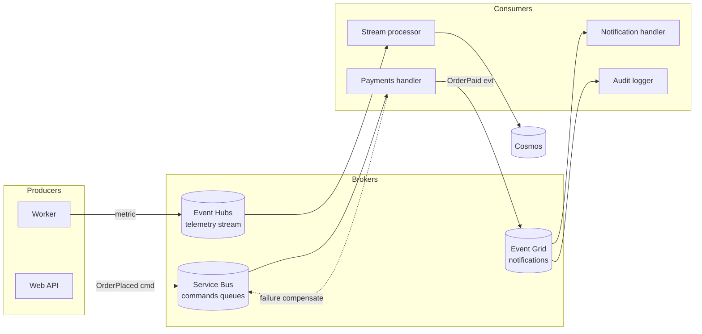

# Event-Driven Architecture

> **One-liner**: An **event-driven architecture (EDA)** on Azure composes producers, brokers (**Service Bus / Event Grid / Event Hubs**), and consumers around **events as facts**, gaining loose coupling and elastic scale — at the cost of solving **idempotency, ordering, replays, and observability** yourself.

---

## Quick Reference

| Broker | Shape | Use |
| ------ | ----- | --- |
| **Service Bus** | Queue / topic-sub, ack-based | Reliable commands, ordered via sessions, DLQ |
| **Event Grid** | Push, pub/sub, low-latency | Notifications, ≤24h retry, fan-out |
| **Event Hubs** | Pull, partitioned stream | Telemetry, log streaming, Kafka API |
| **Storage Queue** | Cheap polling queue | Simple work distribution, low cost |
| **Cosmos Change Feed** | Pull, per-partition stream | DB-as-event-source pattern |

| Concept | Meaning |
| ------- | ------- |
| **Command** | "Do this" — single recipient, ack |
| **Event** | "This happened" — multiple subscribers, immutable fact |
| **Idempotency** | Same event twice = same outcome |
| **Outbox pattern** | Atomic state + event write, separate publisher |
| **CQRS** | Split read model from write model |
| **Event sourcing** | State derived from event log; events are source of truth |
| **Saga** | Long-running workflow via events with compensation |
| **Dead-letter** | Bucket for messages that can't be processed |

| Delivery guarantee | Brokers |
| ------------------ | ------- |
| **At-least-once** | Service Bus, Event Grid, Event Hubs (most common) |
| **At-most-once** | Rare; not a default on Azure brokers |
| **Exactly-once** | App-level via idempotency keys (no broker provides this end-to-end) |

---

## Core Concept

EDA inverts request/response: instead of "service A calls service B," producers **publish events** and consumers **react** independently. Three benefits flow from this: services scale independently, new consumers join without changing producers, and bursts get absorbed in the broker.

The trade-off: **distributed-systems hard problems become yours**. Idempotency, ordering, replay, observability, dead-letter handling — none are free, all are important.

**Pick the broker by traffic shape**: Service Bus for transactional commands with order needs, Event Grid for low-latency push notifications with retries, Event Hubs for high-throughput telemetry that consumers replay through partitions.

**The Outbox pattern** solves dual-write inconsistency: in one DB transaction write business state and an `outbox` row; a separate process tails the outbox (or Cosmos change feed) and publishes to the broker. Avoids "saved order, didn't publish event" failures.

**Idempotency keys are mandatory.** Every event carries a stable id; consumers store seen ids (Cosmos doc per id, Redis set, dedupe table); seeing the same id twice is a no-op. Without this, retries corrupt state.

**Sagas replace distributed transactions** for cross-service workflows. Each step emits an event; a saga coordinator (Durable Function, Camunda) listens and emits compensating events on failure.

---

## Diagram



---

## Syntax & API

### Outbox + change feed publisher (.NET / Cosmos)

```csharp
// 1. Write business + outbox in one transactional batch (same partition key)
public async Task PlaceOrderAsync(Order order)
{
    var batch = _container.CreateTransactionalBatch(new PartitionKey(order.TenantId));
    batch.CreateItem(order);
    batch.CreateItem(new OutboxRow(
        Id: Guid.NewGuid().ToString(),
        TenantId: order.TenantId,
        Type: "OrderPlaced",
        Payload: JsonSerializer.Serialize(order),
        OccurredAt: DateTimeOffset.UtcNow));
    await batch.ExecuteAsync();
}

// 2. Change-feed processor publishes outbox rows to Event Grid
public class OutboxRelay : IChangeFeedProcessorChangesHandler<OutboxRow>
{
    private readonly EventGridPublisherClient _eg;
    public async Task HandleChangesAsync(IReadOnlyCollection<OutboxRow> rows, CancellationToken ct)
    {
        var events = rows.Select(r => new EventGridEvent(
            subject: $"orders/{r.TenantId}",
            eventType: r.Type,
            dataVersion: "1.0",
            data: BinaryData.FromString(r.Payload))
            { Id = r.Id }).ToList();
        await _eg.SendEventsAsync(events, ct);
    }
}
```

### Idempotent consumer with Cosmos as dedupe store

```csharp
[Function(nameof(OnOrderPlaced))]
public async Task OnOrderPlaced(
    [EventGridTrigger] EventGridEvent evt,
    [CosmosDBInput("app","seen", Id="{data.id}", PartitionKey="{data.tenantId}", Connection="Cosmos")] SeenMarker? seen,
    [CosmosDBOutput("app","seen", Connection="Cosmos")] IAsyncCollector<SeenMarker> mark)
{
    if (seen is not null) return; // already processed

    var order = evt.Data.ToObjectFromJson<OrderPlaced>();
    await _payments.ChargeAsync(order);
    await mark.AddAsync(new SeenMarker(order.Id, order.TenantId, DateTimeOffset.UtcNow));
}
```

### Service Bus session — guarantee FIFO per session

```bash
az servicebus queue create -g $RG --namespace-name $SB -n orders \
  --enable-session true --max-size 5120
```

```csharp
var processor = client.CreateSessionProcessor("orders", new ServiceBusSessionProcessorOptions
{
    MaxConcurrentSessions = 16,        // 16 parallel sessions
    MaxConcurrentCallsPerSession = 1   // strict in-order per session
});
```

### Saga via Durable Functions

```csharp
[Function(nameof(OrderSaga))]
public async Task OrderSaga([OrchestrationTrigger] TaskOrchestrationContext ctx)
{
    var order = ctx.GetInput<Order>()!;
    try
    {
        await ctx.CallActivityAsync(nameof(ChargePayment), order);
        await ctx.CallActivityAsync(nameof(ReserveInventory), order);
        await ctx.CallActivityAsync(nameof(ShipOrder), order);
    }
    catch (Exception)
    {
        await ctx.CallActivityAsync(nameof(RefundPayment), order);
        await ctx.CallActivityAsync(nameof(ReleaseInventory), order);
        throw;
    }
}
```

### Event Hubs partition key for ordered streams

```csharp
// All events for a single user go to the same partition (preserves order)
await producer.SendAsync(new[] { eventData },
    new SendEventOptions { PartitionKey = userId });
```

### Replay an Event Hub stream from start

```csharp
var consumer = new EventHubConsumerClient(EventHubConsumerClient.DefaultConsumerGroupName, connection);
await foreach (var partition in consumer.ReadEventsAsync(EventPosition.Earliest))
{
    // Re-process from t=0 — used for backfilling new consumers
}
```

---

## Common Patterns

- **Outbox + change feed** for atomic state-and-event writes (the only sane way to prevent dual-write bugs).
- **Idempotency keys propagated end-to-end**: client-supplied `Idempotency-Key` becomes Service Bus `MessageId`, becomes event `id`, becomes Cosmos doc id.
- **Topic-per-event-type, queue-per-consumer** in Service Bus: each consumer has its own subscription with its own filter.
- **Schema registry / contract repo** so producers and consumers share strongly-typed event schemas (CloudEvents JSON or Avro).
- **Tail-based consumer scaling with KEDA**: scale workers from queue depth, not CPU.
- **Two consumer groups for an Event Hub** when you need parallel reads (one for analytics, one for real-time).
- **Saga compensations are events too** — emit `OrderRefunded`, don't just call back synchronously.
- **Time-bounded retries → DLQ → manual replay**: every consumer has a DLQ + a runbook for "drain DLQ".

---

## Gotchas & Tips

- **At-least-once is the default everywhere.** Every consumer must be idempotent. There is no exception.
- **"Exactly-once" claims are a lie.** It only exists with idempotent consumers + transactional outbox + dedupe; the broker doesn't give it to you.
- **Event Grid retries 24h then dead-letters.** If your downstream is dead longer, you lose events unless DLQ is wired to Storage.
- **Service Bus DLQ counts toward queue size + cost.** Drain DLQs regularly or set a TTL.
- **Event Hubs is partitioned for a reason.** Without a partition key, you get round-robin and lose per-key ordering.
- **CloudEvents 1.0 is the de-facto schema** — use it. Standardized headers (`type`, `source`, `id`, `time`) ease tooling.
- **Distributed tracing is essential** ([[06 - Distributed Tracing with OpenTelemetry]]). Without spans crossing brokers, you can't debug an event flow.
- **Consumers should never crash on unknown event types** — log and skip. Forward-compat events are a feature, not a bug.
- **Don't put PII in event payloads.** Use a reference + secured store (Cosmos, KV) for sensitive data.
- **Schema evolution rules**: add fields only, default everything, never remove or repurpose. Versioning via `dataVersion`.
- **Outbox latency = change feed latency**. Cosmos change feed is ~1 second; if you need ms, use a different relay.
- **Saga state lives in the orchestrator** (Durable Functions storage). Don't lose its storage account.
- **Storage Queue is cheaper but featureless.** No DLQ, no sessions, no topics. Pick it only for trivial work distribution.

---

## See Also

- [[11 - Service Bus]]
- [[12 - Event Grid]]
- [[13 - Event Hubs]]
- [[14 - Storage Queues vs Service Bus]]
- [[04 - Serverless Architectures]]
