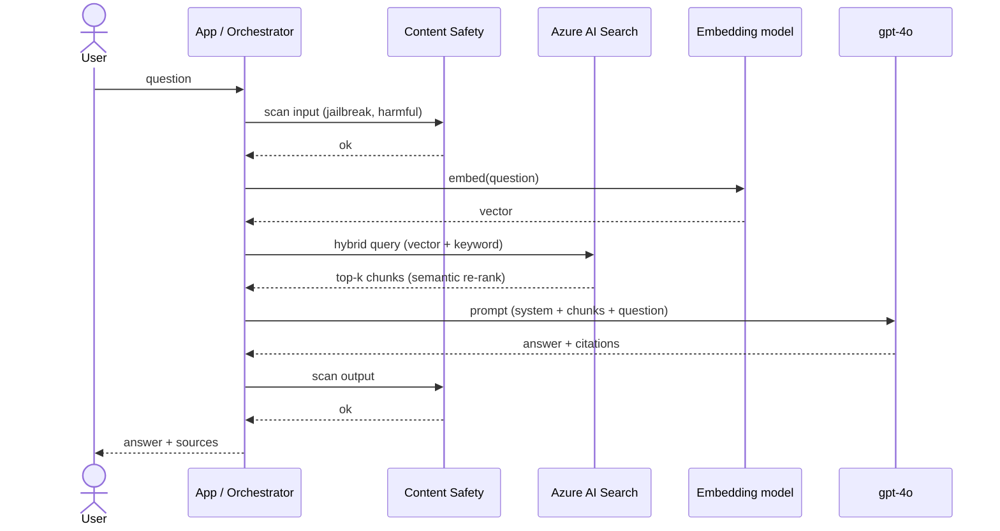

# AI and Azure OpenAI

> **One-liner**: **Azure OpenAI Service (AOAI)** runs OpenAI models (GPT-4o, GPT-5, o1, embeddings, DALL·E) in *your* Azure subscription with **Entra-ID auth, private endpoints, content filters, and SLA** — and **Azure AI Foundry** is the unified portal for building agentic apps on top, typically using **RAG** with Azure AI Search as the retrieval layer.

---

## Quick Reference

| Service | Purpose |
| ------- | ------- |
| **Azure OpenAI** | OpenAI models hosted in Azure (regional, EU/US data residency) |
| **Azure AI Foundry** | Portal + SDK for building/orchestrating GenAI apps and agents |
| **Azure AI Search** | Vector + keyword + hybrid retrieval (RAG backbone) |
| **Azure AI Content Safety** | Standalone moderation API (jailbreak, prompt injection, harmful) |
| **Azure AI Speech / Vision / Language** | Cognitive services (STT, TTS, OCR, NER) |
| **Document Intelligence** | Form/PDF extraction with prebuilt + custom models |

| Deployment type | Use |
| --------------- | --- |
| **Standard** | Per-token pricing, shared capacity |
| **Provisioned (PTU)** | Reserved throughput, predictable latency, ~$2k+/month |
| **Provisioned Global** | PTU pooled across regions |
| **Batch** | Async cheaper bulk inference |
| **Data Zone** | EU-only or US-only routing for compliance |

| Common GA models (2026) | Use |
| ----------------------- | --- |
| **gpt-4o / gpt-4o-mini** | Multimodal, fast |
| **gpt-5** | Highest reasoning quality |
| **o1 / o3** | Deep reasoning (longer latency) |
| **text-embedding-3-large** | 3072-dim embeddings for RAG |
| **dall-e-3** | Image generation |
| **whisper** | Speech-to-text |

| RAG components | Role |
| -------------- | ---- |
| **Loader** | Pull docs (Blob, SharePoint, web) |
| **Chunker** | Split into ~500-1000 token windows |
| **Embedder** | Vectorize (text-embedding-3-large) |
| **Index** | Azure AI Search (vector + keyword) |
| **Retriever** | Hybrid query (BM25 + vector + semantic re-rank) |
| **Generator** | LLM with retrieved context in the prompt |

---

## Core Concept

Building a real GenAI app on Azure is mostly *not* "call the LLM." It's **retrieval, grounding, evaluation, safety, and cost control** around the model call. The model is the easy part.

**RAG** (Retrieval-Augmented Generation) is the dominant pattern: you don't fine-tune the LLM on your data; you index your data in Azure AI Search, retrieve relevant chunks per question, and stuff them into the prompt as context. Cheaper, more current, easier to govern than fine-tuning.

**Azure AI Search** is the retrieval workhorse — vector search for semantic similarity, BM25 keyword for exact matches, **hybrid + semantic re-ranker** for the best of both. Without semantic re-rank, your RAG quality plateaus.

**Content Safety** runs on input *and* output: filter harmful user input, filter harmful model output, detect prompt-injection attempts in retrieved documents (a top attack vector for RAG systems).

**Provisioned Throughput Units (PTUs)** matter when latency is product-critical or pay-per-token costs become unpredictable. They reserve capacity at a flat rate; you trade flex for SLA.

**Evaluation, not vibes.** A real app has a held-out eval set, scored on retrieval (recall@k) + generation (groundedness, fluency, similarity to reference). Foundry has a built-in eval harness; ship eval scores with every release.

---

## Diagram



---

## Syntax & API

### Provision an Azure OpenAI account + deploy a model

```bash
RG=rg-ai-prod
LOC=eastus2
ACC=aoai-orders-prod

az cognitiveservices account create -g $RG -n $ACC -l $LOC \
  --kind OpenAI --sku S0 \
  --custom-domain $ACC \
  --network-acls "{\"defaultAction\":\"Deny\"}"

# Deploy gpt-4o on Standard
az cognitiveservices account deployment create \
  -g $RG -n $ACC --deployment-name gpt-4o \
  --model-name gpt-4o --model-version "2024-08-06" --model-format OpenAI \
  --sku-name Standard --sku-capacity 50

# Embeddings
az cognitiveservices account deployment create \
  -g $RG -n $ACC --deployment-name text-embedding-3-large \
  --model-name text-embedding-3-large --model-version "1" --model-format OpenAI \
  --sku-name Standard --sku-capacity 10
```

### Auth via Managed Identity (no API keys)

```bash
APP_MI=$(az webapp identity show -g $RG -n app-orders --query principalId -o tsv)
az role assignment create --assignee $APP_MI \
  --role "Cognitive Services OpenAI User" \
  --scope $(az cognitiveservices account show -g $RG -n $ACC --query id -o tsv)
```

```csharp
using Azure.Identity;
using Azure.AI.OpenAI;
using OpenAI.Chat;

var client = new AzureOpenAIClient(
    new Uri("https://aoai-orders-prod.openai.azure.com/"),
    new DefaultAzureCredential());

var chat = client.GetChatClient("gpt-4o");

ChatCompletion result = await chat.CompleteChatAsync(
    new SystemChatMessage("Answer in one sentence."),
    new UserChatMessage("What is RAG?"));

Console.WriteLine(result.Content[0].Text);
```

### Azure AI Search — index + hybrid retrieval

```csharp
var searchClient = new SearchClient(
    new Uri("https://srch-orders.search.windows.net"),
    "knowledge-index",
    new DefaultAzureCredential());

var results = await searchClient.SearchAsync<Doc>("how do I cancel an order?",
    new SearchOptions
    {
        Size = 5,
        QueryType = SearchQueryType.Semantic,
        SemanticSearch = new SemanticSearchOptions { SemanticConfigurationName = "default" },
        VectorSearch = new VectorSearchOptions
        {
            Queries = { new VectorizableTextQuery("how do I cancel an order?") { KNearestNeighborsCount = 50, Fields = { "contentVector" } } }
        }
    });
```

### RAG-style chat call with citations

```csharp
var docs = string.Join("\n---\n", results.Value.GetResults()
    .Select((r,i) => $"[doc{i+1} src={r.Document.Source}] {r.Document.Content}"));

var system = """
You are a customer-support assistant. Answer ONLY using the provided documents.
Cite them inline as [doc1], [doc2]. If the answer isn't in the docs, say "I don't know."
""";

var resp = await chat.CompleteChatAsync(
    new SystemChatMessage(system),
    new UserChatMessage($"DOCUMENTS:\n{docs}\n\nQUESTION: {userQuestion}"));
```

### Content Safety — pre/post moderation

```csharp
var safety = new ContentSafetyClient(
    new Uri("https://acs-orders.cognitiveservices.azure.com/"),
    new DefaultAzureCredential());

var analysis = await safety.AnalyzeTextAsync(new AnalyzeTextOptions(userInput));
if (analysis.Value.CategoriesAnalysis.Any(c => c.Severity >= 4))
    return BadRequest("blocked by safety filter");
```

### Bicep — AOAI account with PE + Entra-only auth

```bicep
resource aoai 'Microsoft.CognitiveServices/accounts@2024-10-01' = {
  name: 'aoai-orders-prod'
  location: 'eastus2'
  kind: 'OpenAI'
  sku: { name: 'S0' }
  properties: {
    customSubDomainName: 'aoai-orders-prod'
    publicNetworkAccess: 'Disabled'
    disableLocalAuth: true     // Entra-only
    networkAcls: { defaultAction: 'Deny' }
  }
}
```

---

## Common Patterns

- **RAG over fine-tuning** for >90% of enterprise use cases. Fine-tune only when you need a specific style/format the model can't follow with prompting.
- **Hybrid retrieval + semantic re-rank** in AI Search — vector alone misses keyword matches; keyword alone misses paraphrases.
- **Citations in the answer**: prompt the model to cite `[doc1]` etc., display sources in UI. Trust + auditability.
- **Pre-process documents once**: chunk + embed at ingest, not at query time. Use change feed / Event Grid to re-index on update.
- **Two-tier model strategy**: a cheap model (gpt-4o-mini) classifies intent / does first-pass; a premium model (gpt-5, o1) handles complex paths.
- **Caching at multiple layers**: prompt cache (AOAI built-in for repeated system prompts), embeddings cache (don't re-embed unchanged docs), semantic cache (Redis) for common questions.
- **Eval pipeline in CI**: run an eval set on every prompt/model change; block deploy on regression.
- **Per-tenant API key isolation** is wrong; use Entra MI + RBAC scoped to deployments. Logs show *which* identity called.

---

## Gotchas & Tips

- **Capacity (TPM/RPM) is per-region per-deployment**. Multi-region deployments + provisioned-global help with quota burst issues.
- **Token cost is the silent budget killer**. Monitor `prompt_tokens` + `completion_tokens` per-request; tag with `tenant.id` for chargeback.
- **Prompt injection from RAG docs is real.** Untrusted documents can contain instructions to ignore the system prompt. Use Content Safety's "prompt shields" + scope-tight system prompts.
- **Default content filters can over-block** legitimate medical / legal content. Configure category-level severity thresholds; document the policy.
- **Embedding dimension mismatch** breaks search silently — make sure index schema matches embedding model output dimension.
- **Response streaming improves perceived latency** by 5–10×. Always stream for chat UIs.
- **Function calling / tools spec evolves fast** — pin the API version and re-test on upgrades.
- **Provisioned Throughput is monthly minimum** ~$2k. Don't buy PTU until you've measured tokens/sec sustained.
- **AOAI ≠ OpenAI public API.** SDKs differ slightly; OpenAI features may lag in Azure by weeks.
- **Data is not used to train models** when you use AOAI (per Azure terms) — repeat this to security teams.
- **Long-context windows are seductive**. 128k tokens lets you skip RAG, but cost scales linearly. RAG is usually still cheaper + more accurate.
- **Use deployments-as-aliases**: keep `gpt-prod` deployment name stable; swap underlying model versions behind it. App code never changes.
- **Eval first, scale later.** Without an eval set, you have no way to know if a prompt change made things better or worse.

---

## See Also

- [[16 - Managed Identity]]
- [[15 - Key Vault]]
- [[12 - Private Endpoints and Zero Trust]]
- [[06 - Distributed Tracing with OpenTelemetry]]
