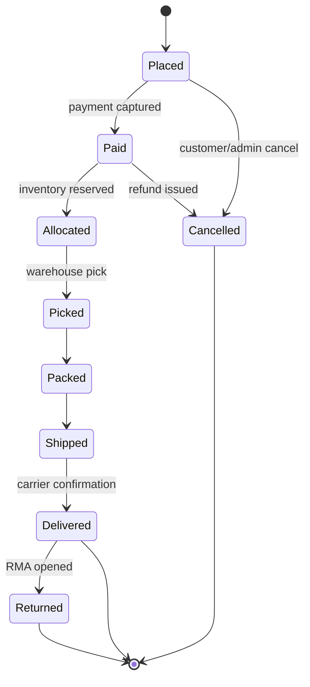

# Order Management Basics

> **One-liner**: Every order moves through a small, well-defined set of states — and most "order bugs" are illegal state transitions someone forgot to block.

---

## Quick Reference

| Item | Value / Syntax |
|------|----------------|
| Order | Header (customer, address, totals) + lines (SKU, qty, price) |
| Line item | One row per SKU; quantity, unit price, line total |
| States | Placed → Paid → Allocated → Picked → Packed → Shipped → Delivered |
| Cancel-safe states | Placed, Paid (refund needed); not after Shipped |
| Allocation | Reserving specific inventory units to a specific order |
| Partial ship | Multiple shipments for one order — separate tracking per shipment |
| Backorder | Line item the warehouse will ship later (out-of-stock at order time) |
| Return | Customer-initiated reverse flow — RMA, refund/credit |
| Idempotency-Key | Required on every order-mutating API call |
| Order id format | Prefer ULID/UUIDv7 (sortable) over auto-increment |
| Standard schema | order header + order_lines + shipments + refunds (four tables) |

---

## Core Concept

An order is conceptually simple: a header (who, where, totals), a set of lines (SKU, quantity, price), and a status. Of those three, status is the load-bearing field. Every business rule keys off it — can we still refund this order, can we cancel it, can we ship it, can we accept a return — and so the way you model status is the way you model the whole domain.

The standard pattern is to expose status as an enum on the aggregate and expose only explicit transition methods: `Pay()`, `Allocate()`, `Ship()`, `Cancel()`. Each method checks the current state, throws on illegal transitions, and assigns the new state in one place. Allowing arbitrary `order.Status = X` setters from any caller is exactly how production systems ship a cancelled order or refund a delivered one — the bug is the missing guard, not the field.

Partial shipments and returns are what make a real OMS interesting. A single order can split across multiple shipments, each with its own tracking number, dispatch time, and delivery confirmation. The order reaches `Delivered` only when *every* shipment is delivered. Returns are a parallel sub-state machine on the line item — an order can have a delivered status while individual lines are in `Returned` or `RefundIssued`. Model these as siblings of the order header, not extensions of it.

---

## Diagram



---

## Syntax & API

```csharp
public enum OrderStatus { Placed, Paid, Allocated, Picked, Packed, Shipped, Delivered, Cancelled }

public sealed class Order
{
    public string Id { get; init; } = default!;
    public OrderStatus Status { get; private set; }
    public List<OrderLine> Lines { get; } = new();

    public void Pay() => Transition(OrderStatus.Placed, OrderStatus.Paid);
    public void Allocate() => Transition(OrderStatus.Paid, OrderStatus.Allocated);
    // ...

    private void Transition(OrderStatus from, OrderStatus to)
    {
        if (Status != from) throw new InvalidOperationException($"{Status} -> {to}");
        Status = to;
    }
}
```

---

## Common Patterns

```csharp
public void Pay()
{
    Transition(OrderStatus.Placed, OrderStatus.Paid);
    _events.Add(new OrderPaid(Id, DateTimeOffset.UtcNow));
}
```

---

## Gotchas & Tips

- Cancelling a `Shipped` order is not a cancellation, it's a return — model them differently.
- Order total = sum of line totals + shipping + tax − discounts. Store *all four* components, not just the total.
- Allocations and shipments are 1:N — never assume one shipment per order.
- Idempotency on order-create is mandatory: customers double-click submit.

---

## See Also

- [[03 - Product Catalog and SKU Model]]
- [[01 - Inventory and Stock Reservations]]
- [[06 - Payments Card Processing and Gateways]]
- [[07 - Shipping and Delivery Basics]]
